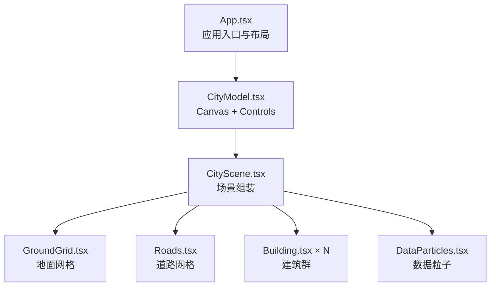
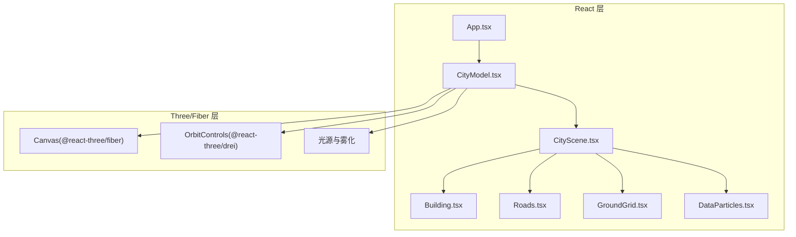
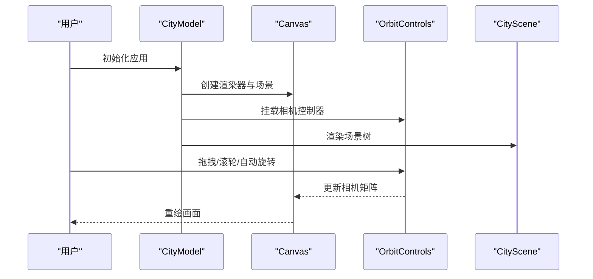
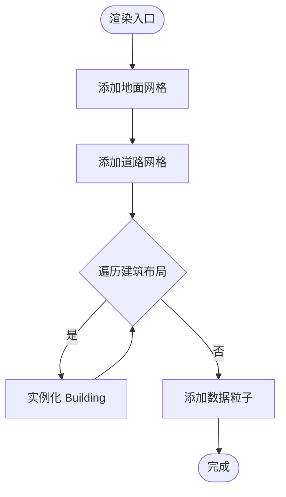
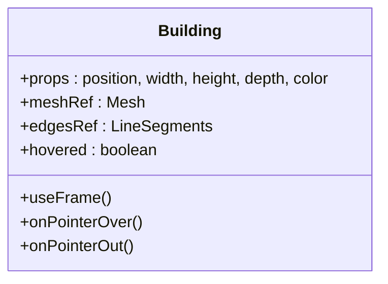
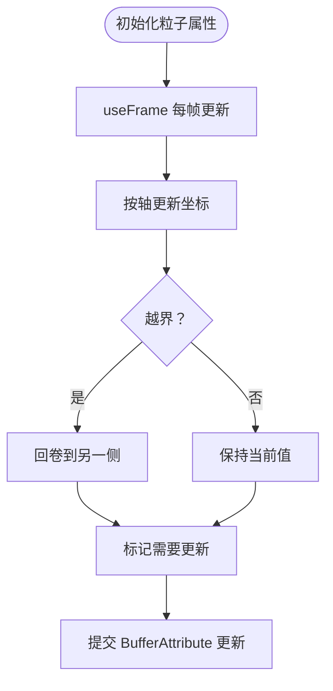
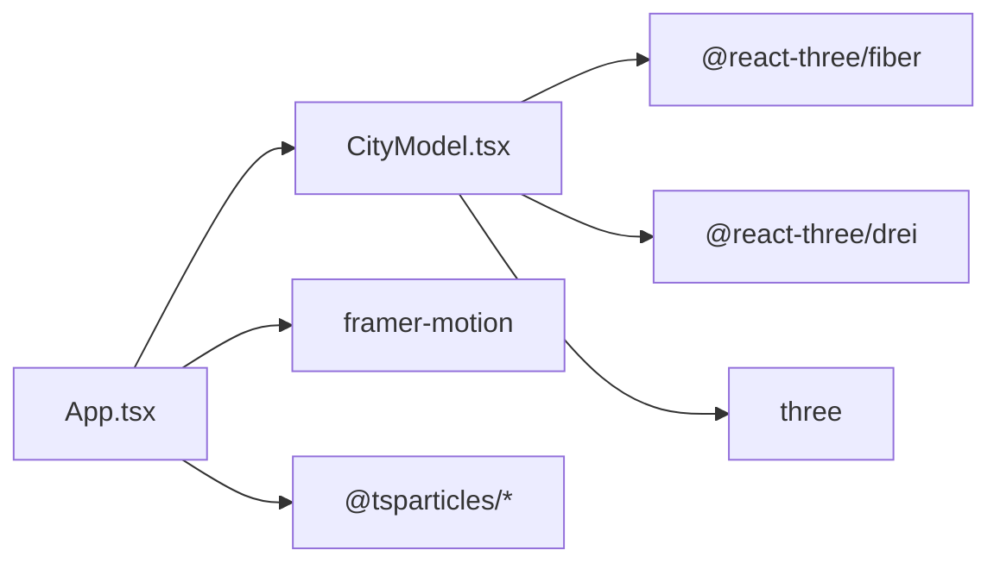

# 3D交互控制系统

<cite>
**本文档引用的文件**
- [README.md](file://README.md)
- [package.json](file://package.json)
- [src/App.tsx](file://src/App.tsx)
- [src/components/3d/CityModel.tsx](file://src/components/3d/CityModel.tsx)
- [src/components/3d/CityScene.tsx](file://src/components/3d/CityScene.tsx)
- [src/components/3d/Building.tsx](file://src/components/3d/Building.tsx)
- [src/components/3d/DataParticles.tsx](file://src/components/3d/DataParticles.tsx)
- [src/components/3d/GroundGrid.tsx](file://src/components/3d/GroundGrid.tsx)
- [src/components/3d/Roads.tsx](file://src/components/3d/Roads.tsx)
- [src/components/3d/index.ts](file://src/components/3d/index.ts)
</cite>

## 目录
1. [简介](#简介)
2. [项目结构](#项目结构)
3. [核心组件](#核心组件)
4. [架构总览](#架构总览)
5. [详细组件分析](#详细组件分析)
6. [依赖关系分析](#依赖关系分析)
7. [性能考虑](#性能考虑)
8. [故障排查指南](#故障排查指南)
9. [结论](#结论)
10. [附录](#附录)

## 简介
本项目是一个基于 React + Three.js 的智慧城市数据孪生可视化大屏，重点围绕 3D 场景控制、OrbitControls 相机控制与用户交互响应展开。系统通过 @react-three/fiber 和 @react-three/drei 提供高性能的 Three.js 渲染管线与交互控件，结合实时数据图表与粒子特效，构建出沉浸式的赛博朋克风格智慧城市交互界面。

## 项目结构
项目采用按功能域分层的组织方式，3D 场景相关组件集中在 src/components/3d 下，主应用在 src/App.tsx 中组合布局与 3D 模型。核心文件包括：
- 场景容器与相机控制：CityModel.tsx
- 城市场景组装：CityScene.tsx
- 建筑与道路、地面网格、数据粒子等子模块：Building.tsx、Roads.tsx、GroundGrid.tsx、DataParticles.tsx
- 依赖管理：package.json

**图表来源**
- [src/App.tsx:43-93](file://src/App.tsx#L43-L93)
- [src/components/3d/CityModel.tsx:6-31](file://src/components/3d/CityModel.tsx#L6-L31)
- [src/components/3d/CityScene.tsx:40-53](file://src/components/3d/CityScene.tsx#L40-L53)

**章节来源**
- [README.md:49-63](file://README.md#L49-L63)
- [src/App.tsx:43-93](file://src/App.tsx#L43-L93)
- [src/components/3d/index.ts:1-2](file://src/components/3d/index.ts#L1-L2)

## 核心组件
- CityModel：负责创建 Three.js Canvas、设置相机参数、光照与雾化效果，并挂载 OrbitControls 实现相机交互；同时渲染 CityScene 与装饰性 HUD 文案。
- CityScene：作为场景根 Group，组织 GroundGrid、Roads、多栋 Building 以及 DataParticles。
- Building：单体建筑几何体与材质，支持悬停高亮、发光边框与周期性闪烁效果。
- GroundGrid：地面平面、网格与同心环装饰，配合淡入淡出动画增强空间感。
- Roads：十字交叉主干道与次干道，使用半透明材质与中心线发光提升引导性。
- DataParticles：80 个粒子组成的流动数据可视化，沿 X/Z 轴循环移动，使用加法混合与去深度写以获得科技感。

**章节来源**
- [src/components/3d/CityModel.tsx:6-31](file://src/components/3d/CityModel.tsx#L6-L31)
- [src/components/3d/CityScene.tsx:40-53](file://src/components/3d/CityScene.tsx#L40-L53)
- [src/components/3d/Building.tsx:13-63](file://src/components/3d/Building.tsx#L13-L63)
- [src/components/3d/GroundGrid.tsx:5-43](file://src/components/3d/GroundGrid.tsx#L5-L43)
- [src/components/3d/Roads.tsx:3-44](file://src/components/3d/Roads.tsx#L3-L44)
- [src/components/3d/DataParticles.tsx:7-73](file://src/components/3d/DataParticles.tsx#L7-L73)

## 架构总览
系统采用“声明式 3D 组件 + Fiber 渲染管线”的模式，所有 Three.js 对象均以 React 组件形式声明，通过 useFrame 在每帧更新中驱动动画与交互逻辑。OrbitControls 提供相机的旋转、缩放与自动旋转能力，Camera 与 Controls 的参数在 CityModel 中集中配置。

**图表来源**
- [src/components/3d/CityModel.tsx:9-29](file://src/components/3d/CityModel.tsx#L9-L29)
- [src/components/3d/CityScene.tsx:40-53](file://src/components/3d/CityScene.tsx#L40-L53)
- [src/App.tsx:85-93](file://src/App.tsx#L85-L93)

## 详细组件分析

### CityModel：相机与交互控制
- Canvas 参数：相机初始位置、视野角度、抗锯齿与透明背景；全局 GL 设置。
- 光照体系：环境光、方向光、点光源与星空背景，营造深空氛围。
- OrbitControls：禁用平移、限制径向距离、启用自动旋转与最大极角，确保稳定的观察视角。
- 雾化：使用线性雾增强景深与层次感。
- HUD：在 Canvas 内叠加装饰性提示文案，不影响交互。

**图表来源**
- [src/components/3d/CityModel.tsx:9-29](file://src/components/3d/CityModel.tsx#L9-L29)

**章节来源**
- [src/components/3d/CityModel.tsx:6-31](file://src/components/3d/CityModel.tsx#L6-L31)

### CityScene：场景装配与数据驱动布局
- 建筑布局：通过预设数组 programmatic 生成不同密度与高度的城市肌理。
- 组织结构：在单一 Group 下聚合地面、道路、建筑与粒子，便于整体变换与性能管理。
- 数据粒子：在场景中动态流动，形成数据流可视化。

**图表来源**
- [src/components/3d/CityScene.tsx:40-53](file://src/components/3d/CityScene.tsx#L40-L53)

**章节来源**
- [src/components/3d/CityScene.tsx:8-38](file://src/components/3d/CityScene.tsx#L8-L38)
- [src/components/3d/CityScene.tsx:40-53](file://src/components/3d/CityScene.tsx#L40-L53)

### Building：建筑几何与交互反馈
- 几何与材质：立方体主体、边框线框、屋顶发光点与模拟窗户的水平条带。
- 交互反馈：悬停事件切换高亮材质与自发光强度；边框线框随时间周期性闪烁。
- 位置调整：建筑在 Y 方向上半高处定位，避免与地面贴合导致的 z-fighting。

**图表来源**
- [src/components/3d/Building.tsx:5-11](file://src/components/3d/Building.tsx#L5-L11)
- [src/components/3d/Building.tsx:13-63](file://src/components/3d/Building.tsx#L13-L63)

**章节来源**
- [src/components/3d/Building.tsx:13-63](file://src/components/3d/Building.tsx#L13-L63)

### DataParticles：动态数据可视化
- 粒子数量：固定 80 个，减少大规模实例化开销。
- 运动策略：随机分配沿 X/Z 轴运动，速度与偏置随机，超出边界后回卷。
- 材质特性：使用加法混合与关闭深度写，呈现发光流动效果。

**图表来源**
- [src/components/3d/DataParticles.tsx:10-36](file://src/components/3d/DataParticles.tsx#L10-L36)
- [src/components/3d/DataParticles.tsx:38-51](file://src/components/3d/DataParticles.tsx#L38-L51)

**章节来源**
- [src/components/3d/DataParticles.tsx:7-73](file://src/components/3d/DataParticles.tsx#L7-L73)

### GroundGrid：地面与空间引导
- 平面地面：深色半透明底色，提供稳定基底。
- 网格与环形装饰：多层同心环与网格线，配合微弱呼吸动画，强化空间层次。

**章节来源**
- [src/components/3d/GroundGrid.tsx:5-43](file://src/components/3d/GroundGrid.tsx#L5-L43)

### Roads：道路系统与引导光效
- 十字主干道与次干道：使用半透明材质与中心线发光，形成清晰的视觉引导。
- 旋转与定位：通过旋转与位移实现横向与纵向道路。

**章节来源**
- [src/components/3d/Roads.tsx:3-44](file://src/components/3d/Roads.tsx#L3-L44)

## 依赖关系分析
- 运行时依赖：@react-three/fiber、@react-three/drei、three、framer-motion、tsparticles 等。
- 开发依赖：Vite、TypeScript、ESLint 等。
- 3D 控制与渲染：通过 @react-three/fiber 将 Three.js 对象声明式地集成到 React 生命周期中；@react-three/drei 提供 OrbitControls、Stars 等常用扩展。

**图表来源**
- [package.json:12-26](file://package.json#L12-L26)
- [src/App.tsx:1-16](file://src/App.tsx#L1-L16)

**章节来源**
- [package.json:12-26](file://package.json#L12-L26)

## 性能考虑
- 渲染管线优化
  - 使用 useFrame 在每帧进行最小必要更新，避免不必要的重算。
  - DataParticles 仅在位置变化时标记 BufferAttribute 需要更新，降低 GPU-CPU 同步成本。
  - 关闭深度写与使用加法混合，减少片段阶段计算与混合开销。
- 相机与视锥
  - 通过 OrbitControls 的径向与极角限制，减少无效视角与过度缩放带来的计算负担。
  - 雾化参数与相机近远裁剪面配合，避免远距离不必要绘制。
- 几何与材质
  - 建筑使用基础几何体与标准材质，避免复杂着色器开销。
  - 边框线框与发光效果采用低复杂度几何与简单材质，维持流畅帧率。
- 交互与事件
  - 悬停高亮与闪烁等效果仅在可见范围内生效，避免全场景统一更新。
  - HUD 文案与粒子背景使用 CSS/非 3D DOM 层，减少 3D 渲染压力。

[本节为通用性能建议，无需特定文件引用]

## 故障排查指南
- 相机无法旋转或缩放
  - 检查 OrbitControls 的启用项与限制参数是否被意外修改。
  - 确认 Canvas 的事件捕获未被上层元素拦截。
- 建筑闪烁异常
  - 核对 useFrame 中的相位与频率参数，确保与场景时钟同步。
- 粒子不流动或卡顿
  - 检查 BufferAttribute 的 needsUpdate 是否正确设置。
  - 确认粒子数量与更新频率平衡，避免每帧大量计算。
- 雾化与光照异常
  - 核对 fog 的颜色与范围参数，确保与场景规模匹配。
  - 检查光源强度与材质属性，避免过曝或过暗。

**章节来源**
- [src/components/3d/CityModel.tsx:20-27](file://src/components/3d/CityModel.tsx#L20-L27)
- [src/components/3d/Building.tsx:18-23](file://src/components/3d/Building.tsx#L18-L23)
- [src/components/3d/DataParticles.tsx:38-51](file://src/components/3d/DataParticles.tsx#L38-L51)

## 结论
该智慧城市 3D 交互控制系统以声明式组件与 Fiber 渲染为核心，结合 OrbitControls 提供直观的相机操控与自动旋转体验。通过合理的几何与材质设计、每帧最小更新策略以及雾化与光照配置，系统在保证视觉表现的同时兼顾了性能稳定性。开发者可在现有基础上扩展自定义交互行为、优化渲染路径并适配移动端触摸控制，进一步提升 3D 交互体验。

[本节为总结性内容，无需特定文件引用]

## 附录

### 3D 对象旋转、缩放、平移操作说明
- 旋转：通过 OrbitControls 的拖拽实现相机绕场景中心的旋转。
- 缩放：通过滚轮实现相机径向缩放，受最小/最大距离限制。
- 平移：当前配置禁用平移，如需启用可在 Controls 中开启相应选项。
- 自动旋转：启用自动旋转并在合适的速度下运行，适合概览场景。

**章节来源**
- [src/components/3d/CityModel.tsx:20-27](file://src/components/3d/CityModel.tsx#L20-L27)

### 鼠标与键盘事件处理
- 悬停高亮：通过 onPointerOver/onPointerOut 事件切换建筑材质状态。
- 键盘辅助：系统未引入键盘快捷键绑定，交互主要依赖鼠标与滚轮。

**章节来源**
- [src/components/3d/Building.tsx:32-33](file://src/components/3d/Building.tsx#L32-L33)

### 交互性能优化实践
- 减少每帧更新量：仅在必要时更新 BufferAttribute 或材质属性。
- 合理使用 useFrame：避免在每帧执行昂贵计算，优先使用缓存与预计算。
- 材质与几何体选择：优先使用基础几何体与简单材质，减少着色器复杂度。
- 视锥剔除与遮挡：合理设置相机裁剪面与光源范围，减少不可见对象的绘制。

[本节为通用优化建议，无需特定文件引用]

### 碰撞检测与视锥剔除技术
- 碰撞检测：当前系统未实现射线拾取或碰撞检测，如需点击交互可引入 Raycaster 并在事件回调中处理命中对象。
- 视锥剔除：Three.js 默认支持视锥剔除，建议结合相机裁剪面与对象包围盒进行更精细的剔除策略。

[本节为通用技术建议，无需特定文件引用]

### 3D 场景扩展指南
- 新增对象：在 CityScene 中添加新的 Three.js 对象或组件，注意与现有材质与光照风格一致。
- 自定义交互：在目标对象上绑定事件处理器，结合状态管理实现点击、悬停等交互。
- 动画与过渡：使用 useFrame 或第三方动画库实现平滑过渡与循环动画。

[本节为通用扩展建议，无需特定文件引用]

### 自定义交互行为开发
- 事件绑定：在 3D 对象上绑定 onPointerDown、onPointerMove、onPointerUp 等事件，实现点击、拖拽等行为。
- 状态管理：结合 React 状态或全局状态库，维护交互状态与 UI 同步。
- 动画联动：将交互结果映射到动画或材质变化，增强反馈感。

[本节为通用开发建议，无需特定文件引用]

### 移动端触摸控制适配
- 触摸旋转与缩放：OrbitControls 支持触摸手势，可在移动端直接使用。
- 性能适配：降低粒子数量或简化材质，避免移动端性能瓶颈。
- 交互提示：在移动端显示触摸手势提示，提升可用性。

[本节为通用适配建议，无需特定文件引用]