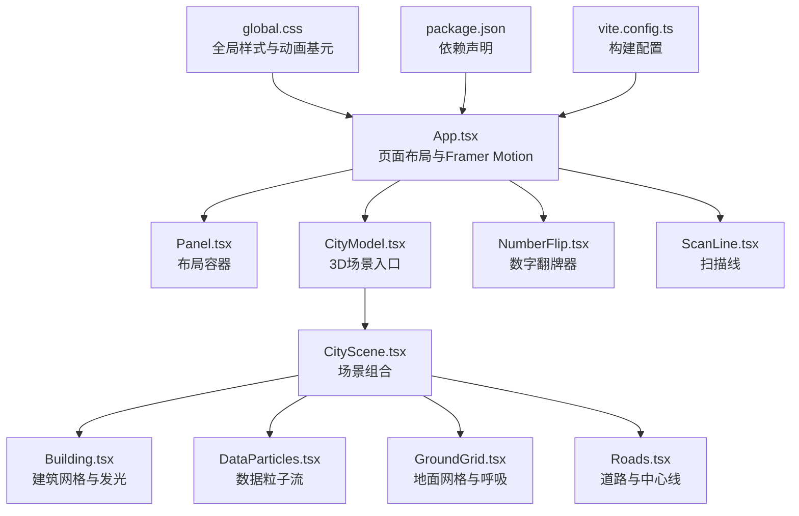
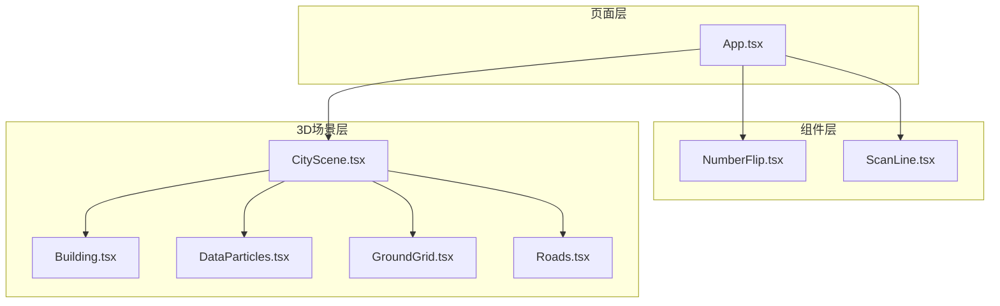
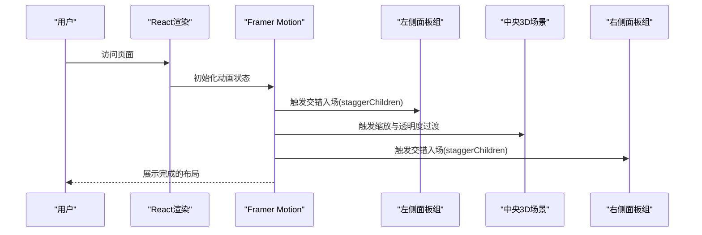
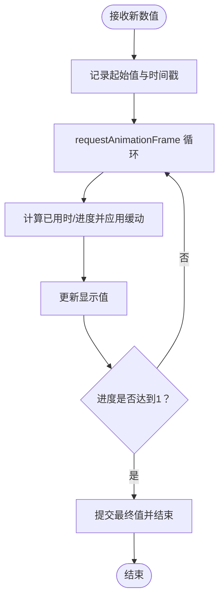
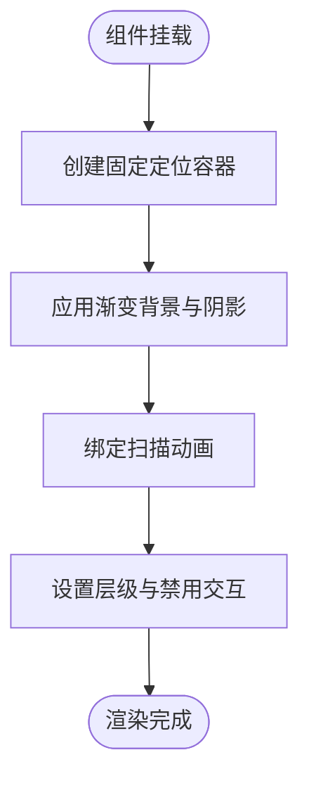
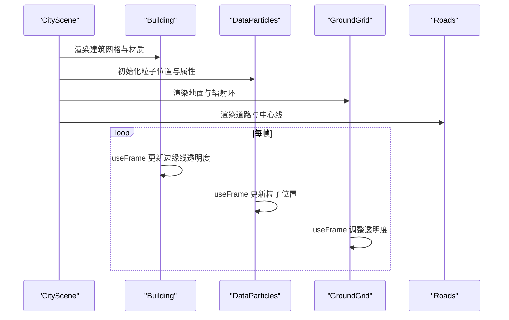
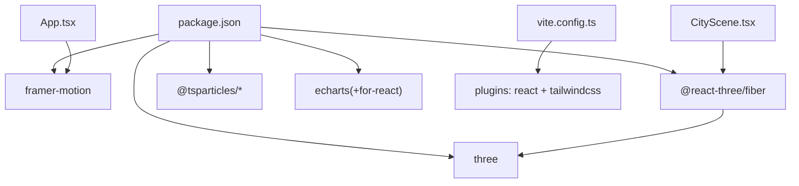

# 动画与交互系统

<cite>
**本文引用的文件**
- [src/App.tsx](file://src/App.tsx)
- [src/main.tsx](file://src/main.tsx)
- [src/styles/global.css](file://src/styles/global.css)
- [src/components/common/NumberFlip.tsx](file://src/components/common/NumberFlip.tsx)
- [src/components/common/NumberFlip.css](file://src/components/common/NumberFlip.css)
- [src/components/effects/ScanLine.tsx](file://src/components/effects/ScanLine.tsx)
- [src/components/effects/ScanLine.css](file://src/components/effects/ScanLine.css)
- [src/components/3d/CityScene.tsx](file://src/components/3d/CityScene.tsx)
- [src/components/3d/Building.tsx](file://src/components/3d/Building.tsx)
- [src/components/3d/DataParticles.tsx](file://src/components/3d/DataParticles.tsx)
- [src/components/3d/GroundGrid.tsx](file://src/components/3d/GroundGrid.tsx)
- [src/components/3d/Roads.tsx](file://src/components/3d/Roads.tsx)
- [package.json](file://package.json)
- [vite.config.ts](file://vite.config.ts)
</cite>

## 目录
1. [简介](#简介)
2. [项目结构](#项目结构)
3. [核心组件](#核心组件)
4. [架构总览](#架构总览)
5. [详细组件分析](#详细组件分析)
6. [依赖关系分析](#依赖关系分析)
7. [性能考量](#性能考量)
8. [故障排查指南](#故障排查指南)
9. [结论](#结论)
10. [附录](#附录)

## 简介
本文件面向智慧城市数据孪生大屏的“动画与交互系统”，系统性梳理并说明以下方面：
- Framer Motion 的集成与应用：页面过渡动画、面板入场动画、子项交错动画。
- CSS 动画技术：扫描线特效、脉冲与发光等基础动画。
- 3D 交互控制：基于 Three.js 与 @react-three/fiber 的城市场景构建、建筑发光与闪烁、数据粒子流动、地面网格呼吸等。
- 数字翻牌器：数值插值动画与尾数显示。
- 性能优化策略、用户体验设计原则、交互反馈机制与定制扩展建议。

## 项目结构
该系统采用 React + Vite 构建，动画与交互主要分布在以下模块：
- 布局与页面级动画：App.tsx 使用 Framer Motion 实现面板入场与中央 3D 场景缩放过渡。
- 数字翻牌器：common/NumberFlip 提供数值插值与尾数展示。
- 扫描线特效：effects/ScanLine 提供全屏扫描线动画。
- 3D 城市场景：3d/ 下的 CityScene、Building、DataParticles、GroundGrid、Roads 组合构成动态 3D 场景。
- 全局样式：global.css 定义赛博朋克风格与通用动画基元（脉冲、发光）。

图表来源
- [src/App.tsx:43-125](file://src/App.tsx#L43-L125)
- [src/components/3d/CityScene.tsx:40-53](file://src/components/3d/CityScene.tsx#L40-L53)
- [src/components/common/NumberFlip.tsx:12-58](file://src/components/common/NumberFlip.tsx#L12-L58)
- [src/components/effects/ScanLine.tsx:4-6](file://src/components/effects/ScanLine.tsx#L4-L6)
- [src/styles/global.css:50-92](file://src/styles/global.css#L50-L92)
- [package.json:12-26](file://package.json#L12-L26)
- [vite.config.ts:1-8](file://vite.config.ts#L1-L8)

章节来源
- [src/App.tsx:43-125](file://src/App.tsx#L43-L125)
- [src/styles/global.css:1-92](file://src/styles/global.css#L1-L92)
- [package.json:12-26](file://package.json#L12-L26)
- [vite.config.ts:1-8](file://vite.config.ts#L1-L8)

## 核心组件
- 页面级动画与布局
  - App.tsx 使用 Framer Motion 的 Variants 与 Stagger 实现左右面板的交错入场与中央 3D 场景缩放过渡，确保整体动效节奏统一。
- 数字翻牌器
  - NumberFlip.tsx 通过 requestAnimationFrame 插值计算实现平滑数值过渡，支持小数位数、后缀与颜色自定义。
- 扫描线特效
  - ScanLine.tsx 结合 ScanLine.css 的 keyframes 实现从上至下的扫描线动画，具备发光与阴影增强视觉层次。
- 3D 场景与交互
  - CityScene.tsx 组合地面、道路、建筑与数据粒子；Building.tsx 在悬停时改变材质属性并产生边缘线闪烁；DataParticles.tsx 以 BufferGeometry 与 useFrame 实现高性能粒子流；GroundGrid.tsx 通过 useFrame 控制网格透明度产生“呼吸”效果；Roads.tsx 提供静态道路与中心线发光。
- 全局样式与动画基元
  - global.css 定义了 dashboard 布局网格、滚动条样式以及脉冲与发光等基础动画，为组件提供一致的视觉语言。

章节来源
- [src/App.tsx:18-41](file://src/App.tsx#L18-L41)
- [src/components/common/NumberFlip.tsx:4-18](file://src/components/common/NumberFlip.tsx#L4-L18)
- [src/components/effects/ScanLine.tsx:4-6](file://src/components/effects/ScanLine.tsx#L4-L6)
- [src/components/3d/CityScene.tsx:40-53](file://src/components/3d/CityScene.tsx#L40-L53)
- [src/components/3d/Building.tsx:13-62](file://src/components/3d/Building.tsx#L13-L62)
- [src/components/3d/DataParticles.tsx:7-73](file://src/components/3d/DataParticles.tsx#L7-L73)
- [src/components/3d/GroundGrid.tsx:5-43](file://src/components/3d/GroundGrid.tsx#L5-L43)
- [src/components/3d/Roads.tsx:3-46](file://src/components/3d/Roads.tsx#L3-L46)
- [src/styles/global.css:31-47](file://src/styles/global.css#L31-L47)

## 架构总览
系统采用“页面级动画 + 组件级动画 + 3D 动态场景”的分层架构：
- 页面级：App.tsx 作为根组件，负责整体布局与 Framer Motion 动画编排。
- 组件级：NumberFlip、ScanLine 等独立组件通过 CSS 或自定义动画实现局部动效。
- 3D 场景：CityScene 作为容器，内部各对象在 useFrame 中按帧更新，形成连续动态。

图表来源
- [src/App.tsx:43-125](file://src/App.tsx#L43-L125)
- [src/components/3d/CityScene.tsx:40-53](file://src/components/3d/CityScene.tsx#L40-L53)
- [src/components/common/NumberFlip.tsx:12-58](file://src/components/common/NumberFlip.tsx#L12-L58)
- [src/components/effects/ScanLine.tsx:4-6](file://src/components/effects/ScanLine.tsx#L4-L6)

## 详细组件分析

### 页面过渡与面板入场动画（Framer Motion）
- 动画配置
  - panelVariants：定义面板从左侧或右侧淡入的位移与缓动曲线。
  - staggerContainer：通过 staggerChildren 对多个面板进行交错入场。
  - 中央 3D 场景：初始透明且缩小，随后渐显并放大到正常尺寸，配合延迟确保视觉焦点稳定。
- 控制流
  - App 渲染时，左右面板与中央 3D 区域分别设置 initial 与 animate，由 Framer Motion 驱动。
  - 子元素通过 variants 与 custom 参数传递方向，实现统一但多样化的入场方式。

图表来源
- [src/App.tsx:62-117](file://src/App.tsx#L62-L117)
- [src/App.tsx:18-41](file://src/App.tsx#L18-L41)

章节来源
- [src/App.tsx:18-41](file://src/App.tsx#L18-L41)
- [src/App.tsx:62-117](file://src/App.tsx#L62-L117)

### 数字翻牌效果（NumberFlip）
- 实现要点
  - 使用 requestAnimationFrame 与缓动函数（三次贝塞尔缓动）实现平滑插值。
  - 通过 useRef 记录起始值与动画句柄，避免重复动画叠加。
  - 支持小数位数、后缀与颜色注入，适配不同指标展示需求。
- 数据流
  - 输入数值变化触发 effect，计算当前帧数值并更新显示值。
  - 动画完成后更新起始值，保证后续变化的连续性。

图表来源
- [src/components/common/NumberFlip.tsx:23-48](file://src/components/common/NumberFlip.tsx#L23-L48)

章节来源
- [src/components/common/NumberFlip.tsx:4-18](file://src/components/common/NumberFlip.tsx#L4-L18)
- [src/components/common/NumberFlip.tsx:23-48](file://src/components/common/NumberFlip.tsx#L23-L48)
- [src/components/common/NumberFlip.css:1-14](file://src/components/common/NumberFlip.css#L1-L14)

### 扫描线特效（ScanLine）
- 实现要点
  - 使用固定定位与线性渐变背景，结合 keyframes 使扫描线从屏幕顶部以恒定速度移动到底部。
  - 通过 box-shadow 与透明度叠加营造光晕效果，z-index 确保覆盖在内容之上。
  - pointer-events 禁止拦截鼠标事件，避免影响交互。
- 与全局样式的协同
  - global.css 提供 scanline 关键帧定义，可被其他组件复用。

图表来源
- [src/components/effects/ScanLine.tsx:4-6](file://src/components/effects/ScanLine.tsx#L4-L6)
- [src/components/effects/ScanLine.css:1-20](file://src/components/effects/ScanLine.css#L1-L20)
- [src/styles/global.css:31-35](file://src/styles/global.css#L31-L35)

章节来源
- [src/components/effects/ScanLine.tsx:4-6](file://src/components/effects/ScanLine.tsx#L4-L6)
- [src/components/effects/ScanLine.css:1-20](file://src/components/effects/ScanLine.css#L1-L20)
- [src/styles/global.css:31-35](file://src/styles/global.css#L31-L35)

### 3D 场景交互（CityScene 与 Building）
- 场景组织
  - CityScene 聚合地面网格、道路、建筑与数据粒子，作为 3D 场景根节点。
- 建筑交互
  - Building 在 useFrame 中根据时钟调整边缘线段透明度，产生脉动感。
  - 鼠标悬停时切换材质颜色、透明度与自发光强度，提升交互反馈。
- 数据粒子
  - DataParticles 使用 BufferGeometry 与 Float32Array 存储位置，每帧更新坐标并标记 needsUpdate，实现高效粒子流。
- 地面网格
  - GroundGrid 通过 useFrame 调整材质透明度，形成“呼吸”效果，增强空间氛围。
- 道路
  - Roads 以平面几何体构建主干道与次干道，并在中心线处添加高亮发光材质。

图表来源
- [src/components/3d/CityScene.tsx:40-53](file://src/components/3d/CityScene.tsx#L40-L53)
- [src/components/3d/Building.tsx:18-23](file://src/components/3d/Building.tsx#L18-L23)
- [src/components/3d/DataParticles.tsx:38-51](file://src/components/3d/DataParticles.tsx#L38-L51)
- [src/components/3d/GroundGrid.tsx:8-13](file://src/components/3d/GroundGrid.tsx#L8-L13)
- [src/components/3d/Roads.tsx:3-46](file://src/components/3d/Roads.tsx#L3-L46)

章节来源
- [src/components/3d/CityScene.tsx:8-38](file://src/components/3d/CityScene.tsx#L8-L38)
- [src/components/3d/Building.tsx:13-62](file://src/components/3d/Building.tsx#L13-L62)
- [src/components/3d/DataParticles.tsx:7-73](file://src/components/3d/DataParticles.tsx#L7-L73)
- [src/components/3d/GroundGrid.tsx:5-43](file://src/components/3d/GroundGrid.tsx#L5-L43)
- [src/components/3d/Roads.tsx:3-46](file://src/components/3d/Roads.tsx#L3-L46)

## 依赖关系分析
- 动画与交互依赖
  - Framer Motion：用于页面级与面板级动画编排。
  - Three.js 与 @react-three/fiber：用于 3D 场景构建与帧循环。
  - CSS 动画：扫描线与基础脉冲/发光效果。
- 构建与工具
  - Vite + React + TailwindCSS：开发与打包工具链。
- 依赖清单与版本
  - package.json 明确列出 framer-motion、three、@react-three/fiber 等关键依赖。

图表来源
- [package.json:12-26](file://package.json#L12-L26)
- [vite.config.ts:1-8](file://vite.config.ts#L1-L8)
- [src/App.tsx:1-1](file://src/App.tsx#L1-L1)
- [src/components/3d/CityScene.tsx:1-1](file://src/components/3d/CityScene.tsx#L1-L1)

章节来源
- [package.json:12-26](file://package.json#L12-L26)
- [vite.config.ts:1-8](file://vite.config.ts#L1-L8)

## 性能考量
- 帧循环与内存管理
  - 3D 粒子使用 BufferGeometry 与 Float32Array，仅更新需要的属性数组，减少 GC 压力。
  - useFrame 中按需设置 needsUpdate，避免不必要的重绘。
- 动画性能
  - NumberFlip 使用 requestAnimationFrame 与缓动函数，避免高频 setState 导致的抖动。
  - Framer Motion 的 Stagger 与 Variants 将复杂动画交由底层渲染引擎处理，保持主线程流畅。
- 视觉与性能平衡
  - 3D 材质启用 additive blending 与 depthWrite=false 时需谨慎，避免过度混合导致性能下降。
  - 扫描线与发光效果通过 CSS 实现，避免引入额外 JS 开销。
- 优化建议
  - 限制同时动画数量：对大规模列表使用虚拟滚动或懒加载。
  - 合理设置动画时长与缓动：过长的动画会增加感知延迟。
  - 使用 transform 与 opacity 替代昂贵属性（如 width/height），减少布局抖动。
  - 在低端设备上降低粒子数量或帧更新频率。

## 故障排查指南
- 动画不生效
  - 检查 Framer Motion 的 variants 与 initial/animate 是否正确设置。
  - 确认父容器具备足够的尺寸与可见性。
- 数字翻牌卡顿
  - 确认未频繁触发大量数值更新；必要时节流输入源。
  - 检查缓动函数参数与动画时长，避免过短导致抖动。
- 3D 场景卡顿
  - 减少同时渲染的几何体数量与材质种类。
  - 检查 BufferAttribute 的 needsUpdate 是否被频繁调用。
  - 适当降低粒子数量或帧更新频率。
- 扫描线遮挡交互
  - 确认扫描线 z-index 设置合理，且 pointer-events 被禁用。
- 全局样式冲突
  - 检查 global.css 中的 keyframes 与组件内同名动画是否冲突。

章节来源
- [src/App.tsx:18-41](file://src/App.tsx#L18-L41)
- [src/components/common/NumberFlip.tsx:23-48](file://src/components/common/NumberFlip.tsx#L23-L48)
- [src/components/3d/DataParticles.tsx:38-51](file://src/components/3d/DataParticles.tsx#L38-L51)
- [src/components/effects/ScanLine.css:10-11](file://src/components/effects/ScanLine.css#L10-L11)

## 结论
该系统通过 Framer Motion、CSS 动画与 Three.js 的有机结合，实现了从页面级到组件级再到 3D 场景的多层次动画体验。数字翻牌器与扫描线提供了直观的数据反馈与沉浸式氛围，而 3D 城市场景则承载了智慧城市的数据可视化与交互表达。遵循本文的性能优化与故障排查建议，可进一步提升流畅度与稳定性。

## 附录
- 动画定制指南
  - 页面级：在 App.tsx 的 variants 与 staggerContainer 中调整时长、缓动与交错间隔。
  - 组件级：在 NumberFlip 中修改缓动函数与时长；在 ScanLine 中调整动画速度与渐变。
  - 3D 场景：在 Building 与 GroundGrid 的 useFrame 中调整振幅与频率；在 DataParticles 中调整粒子数量与速度。
- 交互扩展方法
  - 添加点击/悬停反馈：在 Building 上扩展事件处理器并联动材质属性。
  - 动态数据驱动：将 useRealtimeData 的输出映射到 3D 场景参数，实现数据到可视化的直接映射。
- 性能调优建议
  - 使用 requestAnimationFrame 与缓动函数替代定时器。
  - 合理拆分动画任务，避免在同一帧内执行过多计算。
  - 在低端设备上提供降级方案（如减少粒子、关闭部分发光）。