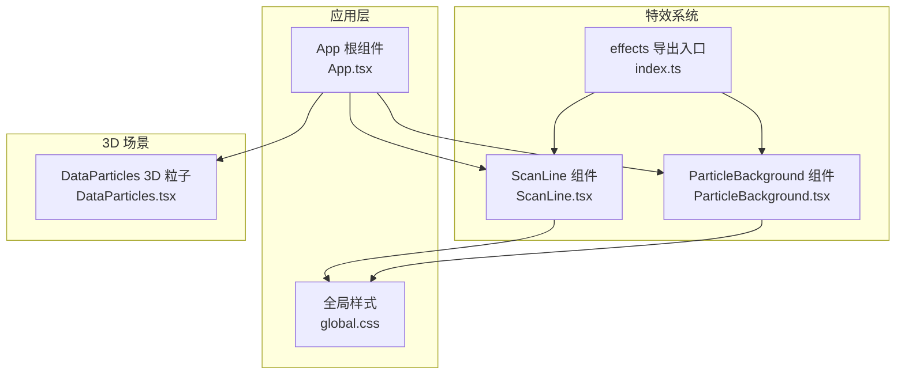
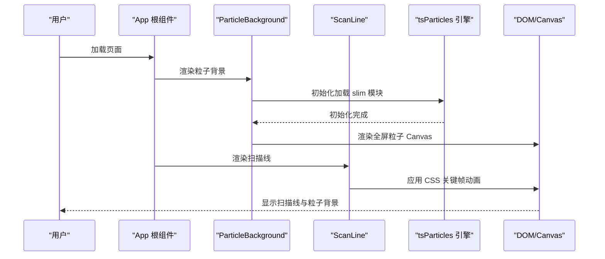
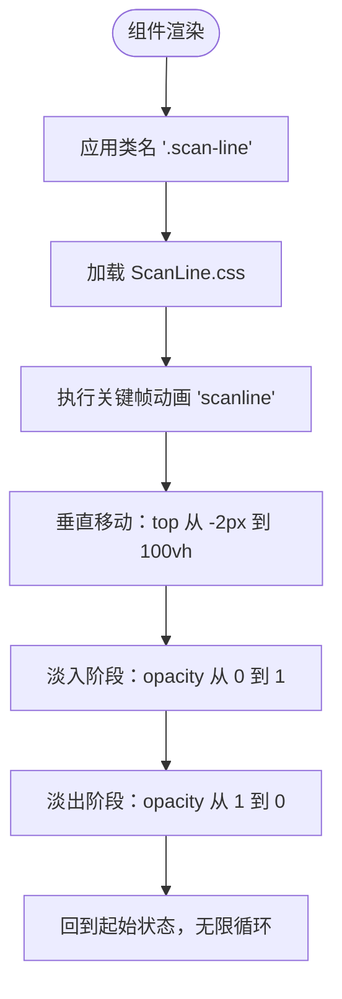
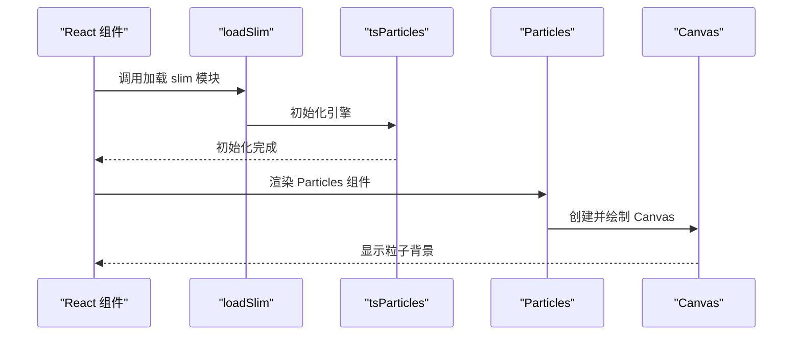
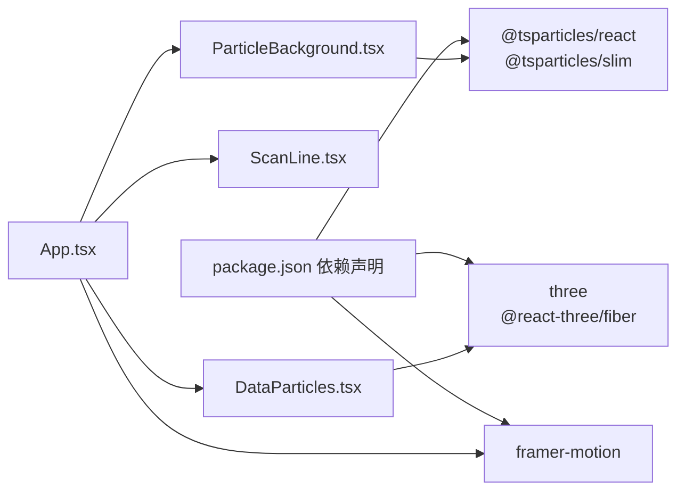

# 特效动画系统

<cite>
**本文档引用的文件**
- [src/components/effects/ScanLine.tsx](file://src/components/effects/ScanLine.tsx)
- [src/components/effects/ScanLine.css](file://src/components/effects/ScanLine.css)
- [src/components/effects/ParticleBackground.tsx](file://src/components/effects/ParticleBackground.tsx)
- [src/components/effects/index.ts](file://src/components/effects/index.ts)
- [src/App.tsx](file://src/App.tsx)
- [src/styles/global.css](file://src/styles/global.css)
- [src/components/3d/DataParticles.tsx](file://src/components/3d/DataParticles.tsx)
- [src/components/layout/Panel.tsx](file://src/components/layout/Panel.tsx)
- [src/components/layout/Panel.css](file://src/components/layout/Panel.css)
- [package.json](file://package.json)
</cite>

## 目录
1. [简介](#简介)
2. [项目结构](#项目结构)
3. [核心组件](#核心组件)
4. [架构总览](#架构总览)
5. [详细组件分析](#详细组件分析)
6. [依赖关系分析](#依赖关系分析)
7. [性能考量](#性能考量)
8. [故障排查指南](#故障排查指南)
9. [结论](#结论)
10. [附录](#附录)

## 简介
本文件面向智慧城市数据可视化大屏的特效动画系统，重点解析两类核心特效：
- 扫描线特效：基于纯 CSS 关键帧动画的动态扫描线，用于营造赛博朋克风格的屏幕扫描感。
- 粒子背景特效：基于 @tsparticles/react 的 Canvas 粒子系统，提供可配置的粒子运动、连接与视觉效果。

文档将从系统架构、组件关系、数据流、处理逻辑、集成点、错误处理与性能特性等维度进行深入剖析，并提供参数调节、性能监控与资源管理策略，以及扩展指南与组合使用方法，帮助开发者创建引人注目的视觉特效。

## 项目结构
特效系统位于 effects 目录，采用按功能分层的组织方式：
- effects 子目录：包含扫描线与粒子背景两个特效组件及其导出入口。
- App.tsx：在应用根组件中引入并渲染特效，确保其覆盖在内容之上。
- styles/global.css：提供全局样式与通用动画（如脉冲、发光），为特效提供基础样式支持。
- 3D 数据粒子：DataParticles.tsx 展示了基于 Three.js 的 3D 数据粒子系统，作为场景内动态元素的参考实现。

图表来源
- [src/App.tsx:43-125](file://src/App.tsx#L43-L125)
- [src/components/effects/ScanLine.tsx:1-9](file://src/components/effects/ScanLine.tsx#L1-L9)
- [src/components/effects/ParticleBackground.tsx:1-72](file://src/components/effects/ParticleBackground.tsx#L1-L72)
- [src/components/effects/index.ts:1-3](file://src/components/effects/index.ts#L1-L3)
- [src/styles/global.css:1-92](file://src/styles/global.css#L1-L92)
- [src/components/3d/DataParticles.tsx:1-75](file://src/components/3d/DataParticles.tsx#L1-L75)

章节来源
- [src/components/effects/ScanLine.tsx:1-9](file://src/components/effects/ScanLine.tsx#L1-L9)
- [src/components/effects/ParticleBackground.tsx:1-72](file://src/components/effects/ParticleBackground.tsx#L1-L72)
- [src/components/effects/index.ts:1-3](file://src/components/effects/index.ts#L1-L3)
- [src/App.tsx:43-125](file://src/App.tsx#L43-L125)
- [src/styles/global.css:1-92](file://src/styles/global.css#L1-L92)
- [src/components/3d/DataParticles.tsx:1-75](file://src/components/3d/DataParticles.tsx#L1-L75)

## 核心组件
- 扫描线特效组件：通过一个固定定位的容器元素承载 CSS 动画，实现从顶部到底部的扫描带移动与透明度渐变。
- 粒子背景特效组件：基于 @tsparticles/react 的粒子引擎，初始化后渲染全屏透明背景的粒子系统，支持颜色、速度、连接距离、透明度动画等配置。

章节来源
- [src/components/effects/ScanLine.tsx:4-6](file://src/components/effects/ScanLine.tsx#L4-L6)
- [src/components/effects/ScanLine.css:1-20](file://src/components/effects/ScanLine.css#L1-L20)
- [src/components/effects/ParticleBackground.tsx:6-69](file://src/components/effects/ParticleBackground.tsx#L6-L69)

## 架构总览
特效系统在应用中的位置与交互如下：
- App 根组件负责在布局中插入粒子背景与扫描线特效。
- 粒子背景组件在初始化完成后渲染粒子系统，设置全屏、透明背景、指针事件禁用等属性，确保不影响交互。
- 扫描线组件通过 CSS 关键帧动画实现垂直扫描效果，z-index 设置为较高值以覆盖内容区域。
- 全局样式提供通用动画与主题色，为特效提供一致的视觉语言。

图表来源
- [src/App.tsx:43-125](file://src/App.tsx#L43-L125)
- [src/components/effects/ParticleBackground.tsx:9-11](file://src/components/effects/ParticleBackground.tsx#L9-L11)
- [src/components/effects/ParticleBackground.tsx:15-68](file://src/components/effects/ParticleBackground.tsx#L15-L68)
- [src/components/effects/ScanLine.tsx:4-6](file://src/components/effects/ScanLine.tsx#L4-L6)
- [src/components/effects/ScanLine.css:14-19](file://src/components/effects/ScanLine.css#L14-L19)

## 详细组件分析

### 扫描线特效组件
- 结构与职责
  - 组件仅返回一个带有特定类名的空 div，样式由外部 CSS 文件定义。
  - 类名包含关键帧动画名称，控制扫描带的移动轨迹与透明度变化。
- CSS 关键帧动画
  - 使用线性渐变背景与阴影增强扫描带的视觉强度。
  - 关键帧定义从屏幕顶部开始，先淡入再保持高亮，最后淡出至底部，形成连续循环。
- 定位与层级
  - 固定定位，z-index 设为较高值，确保覆盖在内容之上。
  - 指针事件禁用，避免影响下方交互。

图表来源
- [src/components/effects/ScanLine.tsx:4-6](file://src/components/effects/ScanLine.tsx#L4-L6)
- [src/components/effects/ScanLine.css:14-19](file://src/components/effects/ScanLine.css#L14-L19)
- [src/components/effects/ScanLine.css:1-12](file://src/components/effects/ScanLine.css#L1-L12)

章节来源
- [src/components/effects/ScanLine.tsx:1-9](file://src/components/effects/ScanLine.tsx#L1-L9)
- [src/components/effects/ScanLine.css:1-20](file://src/components/effects/ScanLine.css#L1-L20)

### 粒子背景特效组件
- 初始化流程
  - 在组件挂载时异步加载 @tsparticles/slim 并初始化 tsParticles，完成后进入渲染阶段。
  - 未初始化完成前不渲染任何内容，避免空渲染。
- Canvas 渲染与配置
  - 使用 Particles 组件传入选项对象，设置全屏、透明背景、帧率限制、粒子数量与形状、颜色与透明度动画、连接距离与宽度等。
  - 检测高分辨率屏幕以提升清晰度；设置样式为绝对定位，覆盖整个视口，且禁用指针事件以保证交互不受影响。
- 性能与视觉
  - 帧率限制与高分辨率检测有助于在不同设备上保持稳定表现。
  - 粒子颜色、透明度与连接线的低透明度设计，营造科技感的同时避免遮挡内容。

图表来源
- [src/components/effects/ParticleBackground.tsx:9-11](file://src/components/effects/ParticleBackground.tsx#L9-L11)
- [src/components/effects/ParticleBackground.tsx:15-68](file://src/components/effects/ParticleBackground.tsx#L15-L68)

章节来源
- [src/components/effects/ParticleBackground.tsx:1-72](file://src/components/effects/ParticleBackground.tsx#L1-L72)

### 效果导出与集成
- effects/index.ts 提供统一导出，便于在其他模块中按需导入扫描线与粒子背景组件。
- App.tsx 将特效组件置于内容区域之前，确保其作为背景层存在。

章节来源
- [src/components/effects/index.ts:1-3](file://src/components/effects/index.ts#L1-L3)
- [src/App.tsx:43-125](file://src/App.tsx#L43-L125)

### 3D 数据粒子系统（参考实现）
- 数据驱动的粒子运动：通过 useMemo 生成初始位置、速度、轴向与偏移，useFrame 在每帧更新位置，超出边界则重置，形成循环运动。
- 材质与混合：使用 AdditiveBlending 实现叠加混合，增强发光与融合效果；禁用深度写入以避免遮挡。

章节来源
- [src/components/3d/DataParticles.tsx:1-75](file://src/components/3d/DataParticles.tsx#L1-L75)

## 依赖关系分析
- 外部库依赖
  - @tsparticles/react 与 @tsparticles/slim：提供粒子系统的 React 组件与轻量引擎。
  - framer-motion：用于面板入场动画，与特效系统协同工作。
  - three 与 @react-three/fiber：用于 3D 场景与数据粒子系统。
- 内部依赖
  - effects/index.ts 作为导出入口，集中管理特效组件的对外接口。
  - App.tsx 作为集成点，负责将特效组件与业务面板、3D 场景组合。

图表来源
- [package.json:12-26](file://package.json#L12-L26)
- [src/App.tsx:43-125](file://src/App.tsx#L43-L125)
- [src/components/effects/ParticleBackground.tsx:1-4](file://src/components/effects/ParticleBackground.tsx#L1-L4)
- [src/components/3d/DataParticles.tsx:1-3](file://src/components/3d/DataParticles.tsx#L1-L3)

章节来源
- [package.json:12-26](file://package.json#L12-L26)
- [src/App.tsx:43-125](file://src/App.tsx#L43-L125)

## 性能考量
- 帧率与分辨率
  - 粒子背景组件设置了帧率上限与高分辨率检测，有助于在低端设备上维持稳定帧率与清晰度。
- 交互与覆盖
  - 粒子背景禁用指针事件，避免影响面板与图表的交互；扫描线同样禁用指针事件，确保不影响内容点击。
- 视觉权重
  - 粒子透明度与连接线透明度较低，减少对主要内容的视觉干扰。
- 3D 粒子优化
  - 3D 数据粒子通过禁用深度写入与使用叠加混合，提升视觉融合度；同时通过边界重置实现循环运动，避免内存泄漏。

章节来源
- [src/components/effects/ParticleBackground.tsx:18-65](file://src/components/effects/ParticleBackground.tsx#L18-L65)
- [src/components/effects/ScanLine.css:10-11](file://src/components/effects/ScanLine.css#L10-L11)
- [src/components/3d/DataParticles.tsx:62-70](file://src/components/3d/DataParticles.tsx#L62-L70)

## 故障排查指南
- 粒子背景不显示
  - 检查初始化是否完成：组件在初始化完成前不会渲染，确认加载过程无报错。
  - 检查全屏与透明背景设置：确保背景色为透明且全屏启用。
  - 检查指针事件设置：确认已禁用指针事件，避免遮挡交互。
- 扫描线动画异常
  - 检查 CSS 关键帧名称与类名是否匹配。
  - 检查 z-index 是否足够高，确保覆盖在内容之上。
  - 检查动画时长与缓动函数，确保视觉流畅。
- 性能问题
  - 降低粒子数量或透明度，减少连接线距离。
  - 调整帧率上限与高分辨率检测开关。
  - 对于 3D 粒子，检查每帧更新的计算复杂度与数组更新频率。

章节来源
- [src/components/effects/ParticleBackground.tsx:9-11](file://src/components/effects/ParticleBackground.tsx#L9-L11)
- [src/components/effects/ParticleBackground.tsx:18-65](file://src/components/effects/ParticleBackground.tsx#L18-L65)
- [src/components/effects/ScanLine.css:14-19](file://src/components/effects/ScanLine.css#L14-L19)
- [src/components/3d/DataParticles.tsx:38-51](file://src/components/3d/DataParticles.tsx#L38-L51)

## 结论
本特效动画系统通过 CSS 关键帧与 Canvas 粒子技术，实现了低成本、高视觉冲击力的扫描线与粒子背景效果。系统在性能与交互之间取得平衡，具备良好的可扩展性与组合能力。开发者可在现有基础上调整参数、添加新动画或与其他特效组合，构建更丰富的智慧城市可视化体验。

## 附录

### CSS 关键帧动画编写要点
- 使用线性渐变背景与阴影增强扫描带的视觉层次。
- 控制透明度的淡入淡出阶段，使扫描带在进入与离开时有自然过渡。
- 选择合适的动画时长与缓动函数，确保视觉流畅且不拖累性能。

章节来源
- [src/components/effects/ScanLine.css:1-20](file://src/components/effects/ScanLine.css#L1-L20)

### Canvas 粒子系统配置与优化
- 参数调节
  - 粒子数量：根据屏幕尺寸与性能目标调整，避免过多导致卡顿。
  - 透明度与颜色：使用较低透明度与科技蓝/紫配色，提升科技感。
  - 连接距离与宽度：适度增加连接距离与宽度，增强粒子间的视觉联系。
- 性能优化
  - 帧率限制与高分辨率检测：在不同设备上保持稳定表现。
  - 禁用指针事件：确保不影响内容交互。
  - 合理的样式定位与层级：避免不必要的重绘与合成。

章节来源
- [src/components/effects/ParticleBackground.tsx:18-65](file://src/components/effects/ParticleBackground.tsx#L18-L65)

### 特效扩展指南
- 新增扫描线变体
  - 在 CSS 中新增关键帧动画，或复制现有类名并修改参数，实现不同速度与颜色的扫描线。
- 新增粒子效果
  - 在 Particles 组件的 options 中添加新的粒子类型、形状或行为，结合 @tsparticles/engine 的能力扩展。
- 组合使用
  - 将扫描线与粒子背景组合使用，注意层级与透明度的协调，避免视觉冲突。
  - 与面板入场动画配合，形成统一的入场节奏。

章节来源
- [src/components/effects/ScanLine.css:14-19](file://src/components/effects/ScanLine.css#L14-L19)
- [src/components/effects/ParticleBackground.tsx:15-68](file://src/components/effects/ParticleBackground.tsx#L15-L68)
- [src/App.tsx:18-41](file://src/App.tsx#L18-L41)

### 自定义动画效果开发
- 基于 CSS 的简单动画：适合扫描线、脉冲、发光等效果，优先考虑性能与兼容性。
- 基于 Canvas 的复杂动画：适合粒子系统、连接网络、动态纹理等，需关注帧率与内存管理。
- 3D 动画：结合 Three.js 与 @react-three/fiber，实现空间内的动态效果，注意深度写入与混合模式的选择。

章节来源
- [src/components/3d/DataParticles.tsx:1-75](file://src/components/3d/DataParticles.tsx#L1-L75)
- [src/styles/global.css:37-47](file://src/styles/global.css#L37-L47)

### 特效组合使用方法
- 背景层：粒子背景作为底层，提供动态氛围。
- 中间层：扫描线作为中层，强调屏幕扫描感。
- 内容层：面板与图表作为前景，确保可读性与交互性。
- 层级管理：通过 z-index 与定位控制，确保各层正确叠加。

章节来源
- [src/App.tsx:43-125](file://src/App.tsx#L43-L125)
- [src/components/effects/ScanLine.css:11](file://src/components/effects/ScanLine.css#L11)
- [src/components/effects/ParticleBackground.tsx:62-65](file://src/components/effects/ParticleBackground.tsx#L62-L65)