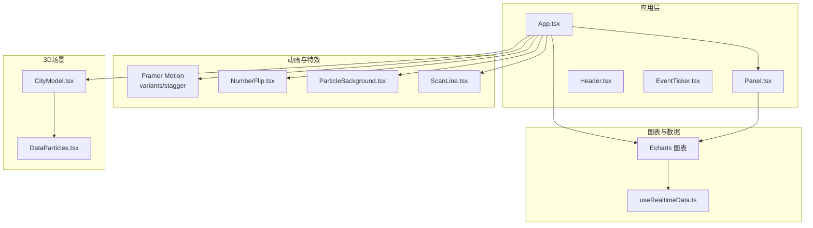
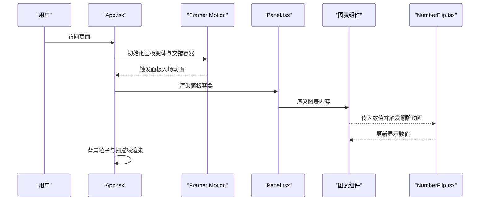
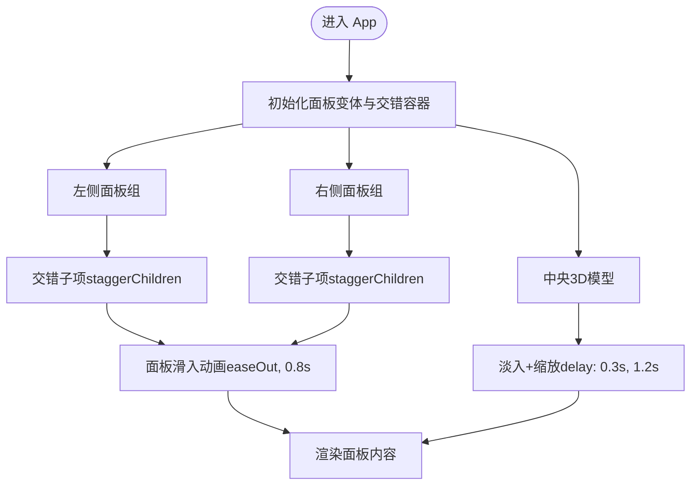
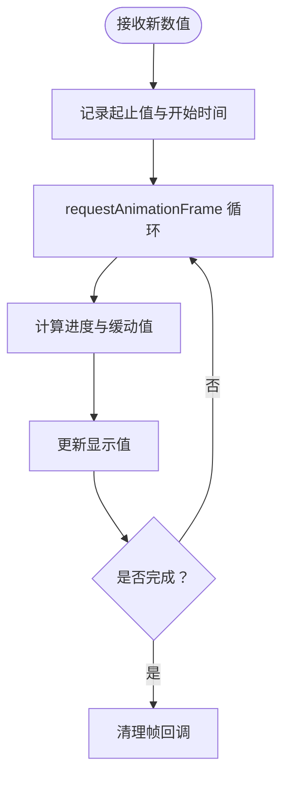
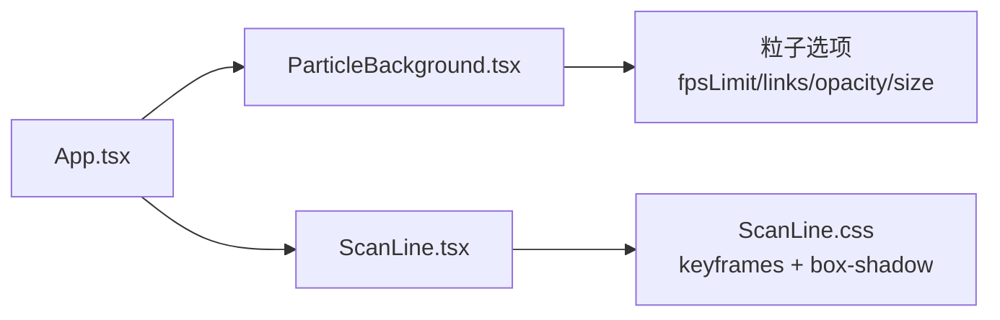
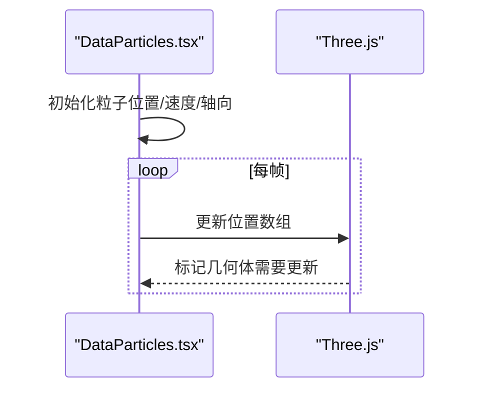
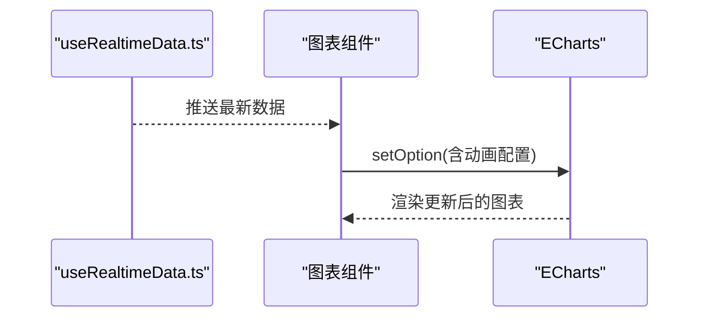
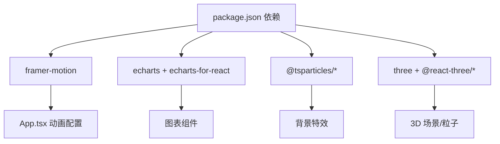

# 页面动画系统

<cite>
**本文引用的文件**
- [src/App.tsx](file://src/App.tsx)
- [src/components/common/NumberFlip.tsx](file://src/components/common/NumberFlip.tsx)
- [src/components/common/NumberFlip.css](file://src/components/common/NumberFlip.css)
- [src/components/layout/Panel.tsx](file://src/components/layout/Panel.tsx)
- [src/components/layout/Panel.css](file://src/components/layout/Panel.css)
- [src/components/effects/ParticleBackground.tsx](file://src/components/effects/ParticleBackground.tsx)
- [src/components/effects/ScanLine.tsx](file://src/components/effects/ScanLine.tsx)
- [src/components/effects/ScanLine.css](file://src/components/effects/ScanLine.css)
- [src/components/3d/DataParticles.tsx](file://src/components/3d/DataParticles.tsx)
- [src/components/charts/EnergyChart.tsx](file://src/components/charts/EnergyChart.tsx)
- [src/components/charts/PopulationChart.tsx](file://src/components/charts/PopulationChart.tsx)
- [src/hooks/useRealtimeData.ts](file://src/hooks/useRealtimeData.ts)
- [package.json](file://package.json)
</cite>

## 目录
1. [简介](#简介)
2. [项目结构](#项目结构)
3. [核心组件](#核心组件)
4. [架构总览](#架构总览)
5. [详细组件分析](#详细组件分析)
6. [依赖关系分析](#依赖关系分析)
7. [性能考量](#性能考量)
8. [故障排查指南](#故障排查指南)
9. [结论](#结论)
10. [附录](#附录)

## 简介
本文件系统化梳理智慧城市数据可视化大屏的页面动画体系，重点覆盖以下方面：
- Framer Motion 在面板入场与整体页面过渡中的集成与配置
- 数字翻牌效果的实现与定制
- 交错动画模式（staggerChildren）与自定义动画参数
- 动画性能优化策略、缓动函数选择与动画时序控制
- 动画定制指南、响应式适配与跨浏览器兼容性建议
- 与粒子背景、扫描线等视觉元素的协同方案

## 项目结构
本项目采用按功能域分层的组织方式：布局组件、图表组件、通用动画组件、特效组件与3D场景。动画系统主要集中在顶层应用容器中，通过 Framer Motion 实现面板入场与整体过渡；同时在通用组件中提供数字翻牌器，并结合粒子与扫描线等背景元素增强沉浸感。

**图示来源**
- [src/App.tsx:1-128](file://src/App.tsx#L1-L128)
- [src/components/layout/Panel.tsx:1-30](file://src/components/layout/Panel.tsx#L1-L30)
- [src/components/common/NumberFlip.tsx:1-61](file://src/components/common/NumberFlip.tsx#L1-L61)
- [src/components/effects/ParticleBackground.tsx:1-72](file://src/components/effects/ParticleBackground.tsx#L1-L72)
- [src/components/effects/ScanLine.tsx:1-9](file://src/components/effects/ScanLine.tsx#L1-L9)
- [src/components/3d/DataParticles.tsx:1-75](file://src/components/3d/DataParticles.tsx#L1-L75)
- [src/hooks/useRealtimeData.ts:1-73](file://src/hooks/useRealtimeData.ts#L1-L73)

**章节来源**
- [src/App.tsx:1-128](file://src/App.tsx#L1-L128)
- [package.json:1-42](file://package.json#L1-L42)

## 核心组件
- Framer Motion 面板入场与交错动画：通过 variants 定义面板从左侧或右侧滑入的变体，配合 staggerChildren 实现多面板依次入场。
- 数字翻牌器：基于 requestAnimationFrame 的自定义数值插值动画，支持小数位数、后缀与颜色配置。
- 背景粒子系统：基于 @tsparticles 的轻量粒子引擎，提供低开销的动态背景。
- 扫描线：纯 CSS 动画实现的扫描线效果，用于营造科技感。
- 3D 数据粒子：基于 Three.js 的点云粒子，循环平移形成流动感。

**章节来源**
- [src/App.tsx:18-41](file://src/App.tsx#L18-L41)
- [src/components/common/NumberFlip.tsx:1-61](file://src/components/common/NumberFlip.tsx#L1-L61)
- [src/components/effects/ParticleBackground.tsx:1-72](file://src/components/effects/ParticleBackground.tsx#L1-L72)
- [src/components/effects/ScanLine.css:1-19](file://src/components/effects/ScanLine.css#L1-L19)
- [src/components/3d/DataParticles.tsx:1-75](file://src/components/3d/DataParticles.tsx#L1-L75)

## 架构总览
下图展示动画系统在页面加载时的整体流程：应用容器负责整体过渡与面板交错入场；面板内部承载具体图表；数字翻牌器作为独立组件在图表数据更新时触发；背景粒子与扫描线以非阻塞方式渲染；3D 场景在中央区域淡入。

**图示来源**
- [src/App.tsx:43-125](file://src/App.tsx#L43-L125)
- [src/components/layout/Panel.tsx:10-27](file://src/components/layout/Panel.tsx#L10-L27)
- [src/components/common/NumberFlip.tsx:23-48](file://src/components/common/NumberFlip.tsx#L23-L48)

## 详细组件分析

### Framer Motion 面板入场与交错动画
- 面板变体（panelVariants）
  - 入场隐藏态：根据方向（左/右）设置横向偏移与透明度
  - 可见态：回弹式缓动（easeOut），在 0.8 秒内完成
- 交错容器（staggerContainer）
  - 通过 staggerChildren 控制子项入场时间差，营造层次感
- 使用位置
  - 左侧与右侧面板组分别包裹多个面板，统一应用 panelVariants 并传入方向参数
  - 中央 3D 城市模型使用内联过渡，带延迟与缩放

**图示来源**
- [src/App.tsx:18-41](file://src/App.tsx#L18-L41)
- [src/App.tsx:62-117](file://src/App.tsx#L62-L117)
- [src/App.tsx:86-93](file://src/App.tsx#L86-L93)

**章节来源**
- [src/App.tsx:18-41](file://src/App.tsx#L18-L41)
- [src/App.tsx:62-117](file://src/App.tsx#L62-L117)
- [src/App.tsx:86-93](file://src/App.tsx#L86-L93)

### 数字翻牌效果（NumberFlip）
- 动画原理
  - 基于 requestAnimationFrame 的插值动画，使用三次缓出（easeOutCubic）实现自然落感
  - 通过 useRef 记录起止值与帧回调，避免重复动画叠加
- 参数配置
  - 支持小数位数、后缀、颜色与字号，满足不同指标展示需求
- 适用场景
  - 能源图表、人口统计等实时数值更新的指标展示

**图示来源**
- [src/components/common/NumberFlip.tsx:23-48](file://src/components/common/NumberFlip.tsx#L23-L48)

**章节来源**
- [src/components/common/NumberFlip.tsx:1-61](file://src/components/common/NumberFlip.tsx#L1-L61)
- [src/components/common/NumberFlip.css:1-14](file://src/components/common/NumberFlip.css#L1-L14)

### 背景粒子与扫描线
- 背景粒子（ParticleBackground）
  - 使用 @tsparticles/slim 初始化，限制帧率、粒子数量与链接范围，保证性能
  - 透明背景与不可交互样式确保不遮挡内容
- 扫描线（ScanLine）
  - CSS 关键帧动画实现纵向扫描，带渐变与阴影，层级高于内容但不影响交互

**图示来源**
- [src/components/effects/ParticleBackground.tsx:15-67](file://src/components/effects/ParticleBackground.tsx#L15-L67)
- [src/components/effects/ScanLine.css:1-19](file://src/components/effects/ScanLine.css#L1-L19)
- [src/App.tsx:48-54](file://src/App.tsx#L48-L54)

**章节来源**
- [src/components/effects/ParticleBackground.tsx:1-72](file://src/components/effects/ParticleBackground.tsx#L1-L72)
- [src/components/effects/ScanLine.tsx:1-9](file://src/components/effects/ScanLine.tsx#L1-L9)
- [src/components/effects/ScanLine.css:1-19](file://src/components/effects/ScanLine.css#L1-L19)

### 3D 数据粒子（DataParticles）
- 基于 Three.js 的点云粒子，沿 X/Z 轴随机方向循环移动，形成数据流动感
- 使用 additive blending 与透明材质增强视觉层次
- 通过 useFrame 每帧更新顶点位置，保持循环边界

**图示来源**
- [src/components/3d/DataParticles.tsx:10-51](file://src/components/3d/DataParticles.tsx#L10-L51)

**章节来源**
- [src/components/3d/DataParticles.tsx:1-75](file://src/components/3d/DataParticles.tsx#L1-L75)

### 图表与实时数据联动
- useRealtimeData 提供周期性数据波动，驱动图表更新
- 能源图表启用 detail.valueAnimation，使仪表盘数值具备动画过渡
- 人口图表通过 ECharts 渲染柱状图与标签，上方展示总人口等聚合指标

**图示来源**
- [src/hooks/useRealtimeData.ts:15-71](file://src/hooks/useRealtimeData.ts#L15-L71)
- [src/components/charts/EnergyChart.tsx:86-96](file://src/components/charts/EnergyChart.tsx#L86-L96)
- [src/components/charts/PopulationChart.tsx:28-73](file://src/components/charts/PopulationChart.tsx#L28-L73)

**章节来源**
- [src/hooks/useRealtimeData.ts:1-73](file://src/hooks/useRealtimeData.ts#L1-L73)
- [src/components/charts/EnergyChart.tsx:1-103](file://src/components/charts/EnergyChart.tsx#L1-L103)
- [src/components/charts/PopulationChart.tsx:1-97](file://src/components/charts/PopulationChart.tsx#L1-L97)

## 依赖关系分析
- Framer Motion 版本：12.39.0，提供 motion 组件与 variants 能力
- ECharts：用于图表渲染与数值动画（如仪表盘 detail.valueAnimation）
- @tsparticles：轻量粒子系统，适合大屏背景
- Three.js：3D 场景与粒子系统基础

**图示来源**
- [package.json:12-26](file://package.json#L12-L26)
- [src/App.tsx:1-16](file://src/App.tsx#L1-L16)

**章节来源**
- [package.json:1-42](file://package.json#L1-L42)

## 性能考量
- 帧率与资源控制
  - 背景粒子限制帧率（fpsLimit），减少 GPU/CPU 占用
  - 控制粒子数量与链接距离，避免过度绘制
- 动画时序与缓动
  - 面板滑入使用 easeOut，时长 0.8s；中央模型淡入带 0.3s 延迟与 1.2s 时长，避免视觉拥挤
  - 数字翻牌使用三次缓出，兼顾自然感与性能
- DOM 与重绘
  - 数字翻牌器仅更新文本节点，避免大规模重排
  - 扫描线使用 transform 与 opacity，利用合成层提升性能
- 3D 性能
  - 使用 additive blending 与透明材质，降低深度写入成本
  - 循环边界更新位置，避免频繁创建对象

**章节来源**
- [src/components/effects/ParticleBackground.tsx:21-56](file://src/components/effects/ParticleBackground.tsx#L21-L56)
- [src/App.tsx:27-30](file://src/App.tsx#L27-L30)
- [src/App.tsx:88-90](file://src/App.tsx#L88-L90)
- [src/components/common/NumberFlip.tsx:32-33](file://src/components/common/NumberFlip.tsx#L32-L33)
- [src/components/3d/DataParticles.tsx:62-70](file://src/components/3d/DataParticles.tsx#L62-L70)

## 故障排查指南
- 面板未出现或动画异常
  - 检查面板容器是否正确包裹在 Framer Motion 容器中，确认 variants 与 initial/animate 属性
  - 确认 staggerChildren 是否导致子项渲染顺序异常
- 数字翻牌不生效
  - 确认传入数值已变化，effect 依赖数组包含目标值
  - 检查缓动函数与时长是否过短导致感知不明显
- 背景粒子闪烁或卡顿
  - 适当降低粒子数量或帧率，检查链接距离与透明度
  - 确保粒子容器样式无强制重绘属性
- 扫描线遮挡内容
  - 调整 z-index 或动画层级，确保不影响交互区域
- 3D 场景卡顿
  - 减少粒子数量或简化着色器，检查每帧更新的几何体大小

**章节来源**
- [src/App.tsx:62-117](file://src/App.tsx#L62-L117)
- [src/components/common/NumberFlip.tsx:23-48](file://src/components/common/NumberFlip.tsx#L23-L48)
- [src/components/effects/ParticleBackground.tsx:21-56](file://src/components/effects/ParticleBackground.tsx#L21-L56)
- [src/components/effects/ScanLine.css:1-19](file://src/components/effects/ScanLine.css#L1-L19)
- [src/components/3d/DataParticles.tsx:38-51](file://src/components/3d/DataParticles.tsx#L38-L51)

## 结论
本项目通过 Framer Motion 实现了层次清晰的面板入场与整体过渡，结合自定义数字翻牌器、粒子背景与扫描线等视觉元素，构建出兼具科技感与性能表现的大屏动画体系。建议在后续迭代中进一步细化动画参数、扩展响应式适配与跨浏览器兼容策略，以获得更稳定一致的用户体验。

## 附录
- 动画定制指南
  - 面板入场：调整 ease 与 duration，或引入自定义贝塞尔曲线
  - 交错动画：根据面板数量与布局调优 staggerChildren 间隔
  - 数字翻牌：根据指标重要性调整缓动与时长，必要时增加抖动抑制
- 响应式适配
  - 在小屏设备上缩短动画时长，减少复杂缓动
  - 对背景粒子与扫描线进行降级处理，优先保证内容可读性
- 跨浏览器兼容
  - Framer Motion 与 ECharts 均有良好兼容性；CSS 动画需注意前缀与回退方案
  - 3D 场景依赖 WebGL，需在低端设备上提供静态替代方案