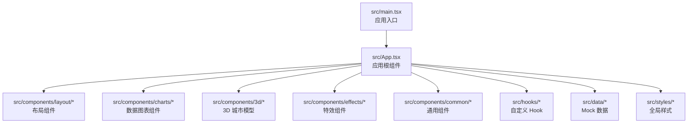
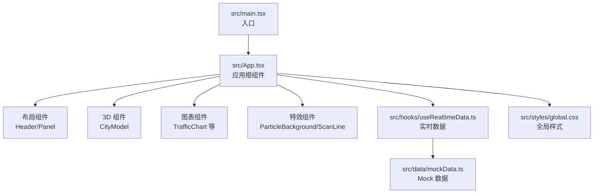
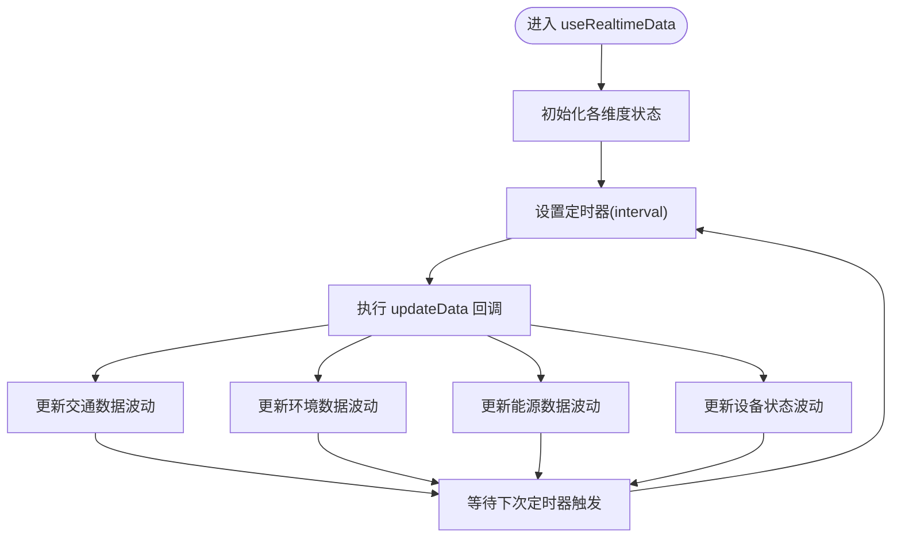
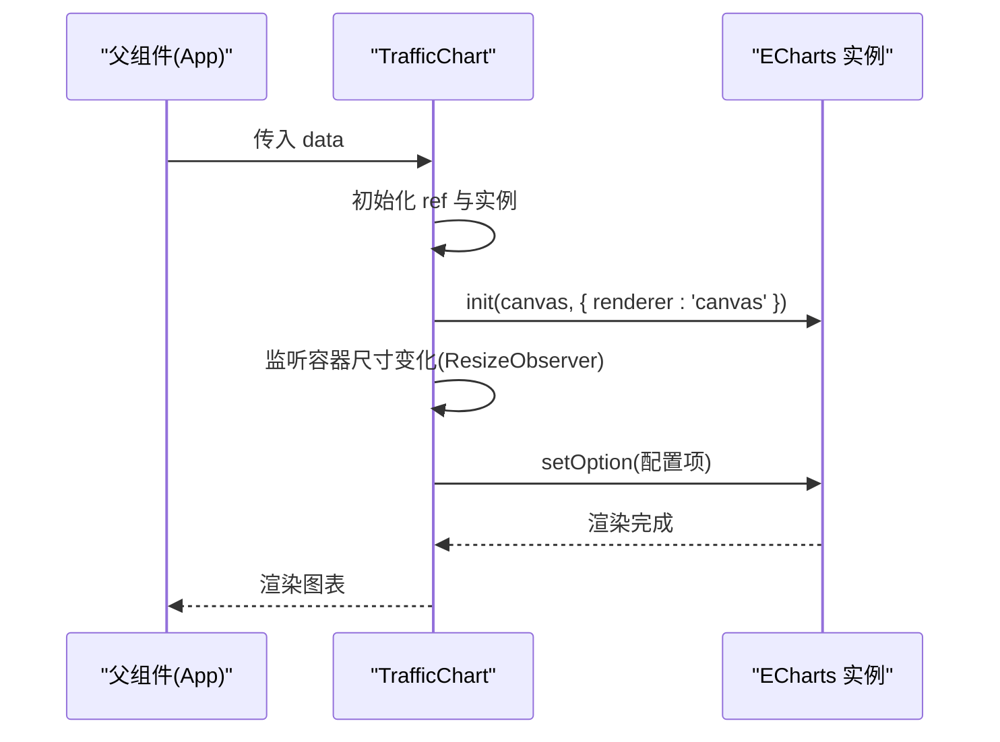
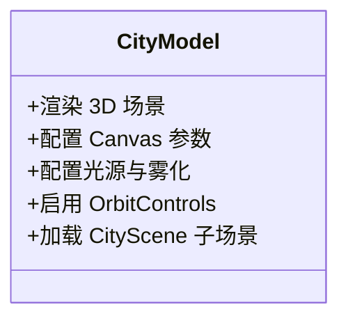
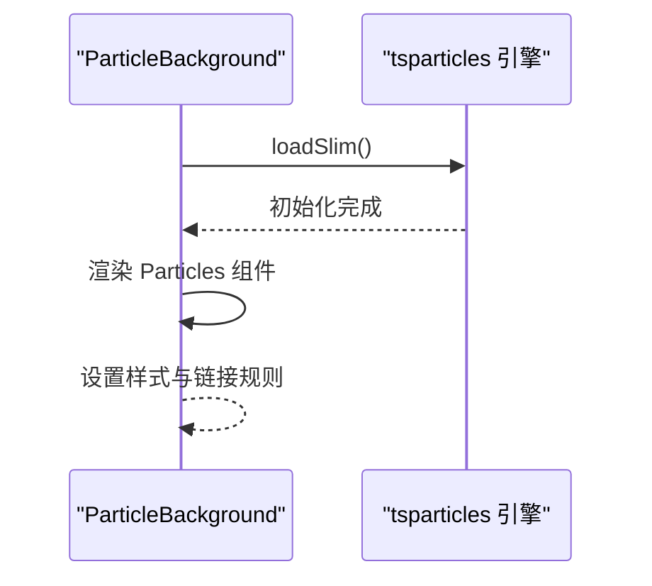
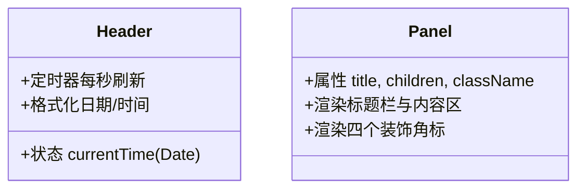
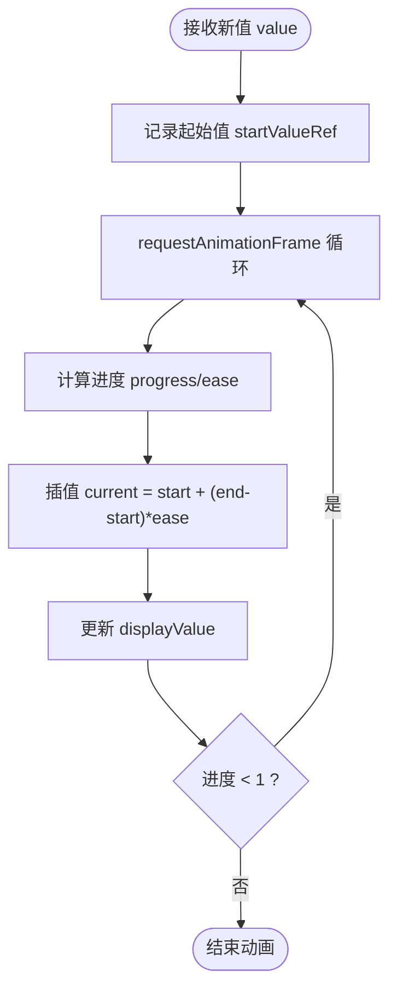
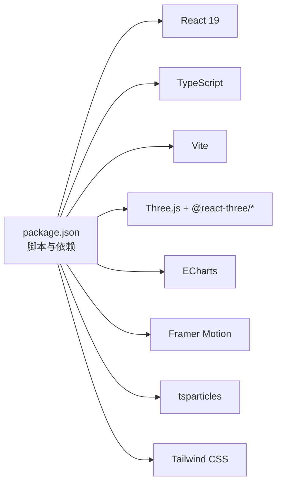

# 开发指南

<cite>
**本文引用的文件**
- [README.md](file://README.md)
- [package.json](file://package.json)
- [vite.config.ts](file://vite.config.ts)
- [eslint.config.js](file://eslint.config.js)
- [src/main.tsx](file://src/main.tsx)
- [src/App.tsx](file://src/App.tsx)
- [src/styles/global.css](file://src/styles/global.css)
- [src/hooks/useRealtimeData.ts](file://src/hooks/useRealtimeData.ts)
- [src/data/mockData.ts](file://src/data/mockData.ts)
- [src/components/layout/Header.tsx](file://src/components/layout/Header.tsx)
- [src/components/layout/Panel.tsx](file://src/components/layout/Panel.tsx)
- [src/components/3d/CityModel.tsx](file://src/components/3d/CityModel.tsx)
- [src/components/charts/TrafficChart.tsx](file://src/components/charts/TrafficChart.tsx)
- [src/components/effects/ParticleBackground.tsx](file://src/components/effects/ParticleBackground.tsx)
- [src/components/common/NumberFlip.tsx](file://src/components/common/NumberFlip.tsx)
</cite>

## 目录
1. [简介](#简介)
2. [项目结构](#项目结构)
3. [核心组件](#核心组件)
4. [架构总览](#架构总览)
5. [详细组件分析](#详细组件分析)
6. [依赖分析](#依赖分析)
7. [性能考虑](#性能考虑)
8. [故障排查指南](#故障排查指南)
9. [结论](#结论)
10. [附录](#附录)

## 简介
本指南面向智慧城市数据孪生大屏项目的开发者，目标是帮助团队建立统一的开发规范、高效的组件开发与扩展流程、完善的测试与代码审查标准，以及可持续的版本控制与文档规范。项目采用 React 18 + TypeScript + Vite 技术栈，结合 Three.js、ECharts、Framer Motion、tsparticles 等技术实现 3D 城市模型、实时数据图表、粒子特效与赛博朋克风格界面。

## 项目结构
项目采用按功能域分层的目录组织方式：components（布局、图表、3D、特效、通用）、data（Mock 数据）、hooks（自定义 Hook）、styles（全局样式）、utils（工具函数），以及入口文件 main.tsx 和应用根组件 App.tsx。

**图表来源**
- [src/main.tsx:1-11](file://src/main.tsx#L1-L11)
- [src/App.tsx:1-128](file://src/App.tsx#L1-L128)

**章节来源**
- [README.md:49-71](file://README.md#L49-L71)
- [src/main.tsx:1-11](file://src/main.tsx#L1-L11)
- [src/App.tsx:1-128](file://src/App.tsx#L1-L128)

## 核心组件
- 应用入口与根组件
  - 入口文件负责渲染严格模式下的根组件。
  - 根组件负责组织布局网格、挂载粒子背景、扫描线、标题栏、左右侧面板、3D 城市模型与底部事件滚动条，并通过自定义 Hook 提供实时数据。
- 实时数据 Hook
  - 提供交通、人口、环境、能源、设备、告警等多维数据的定时更新逻辑，支持波动模拟与区间取整。
- Mock 数据
  - 提供完整的静态数据集，包括时间序列、指标、分类统计与事件流，便于开发与演示。
- 布局与通用组件
  - Header：显示日期、星期、时间与天气；使用定时器每秒刷新。
  - Panel：统一的面板容器，带装饰角标与标题栏。
- 图表组件
  - TrafficChart：基于 ECharts 的折线图，支持响应式尺寸监听与平滑曲线绘制。
- 3D 组件
  - CityModel：基于 @react-three/fiber + @react-three/drei 的 3D 场景，启用自动旋转、光照与星穹背景。
- 特效与通用
  - ParticleBackground：基于 tsparticles 的粒子背景与连线效果。
  - NumberFlip：数值翻牌动画组件，支持缓动与后缀展示。

**章节来源**
- [src/main.tsx:1-11](file://src/main.tsx#L1-L11)
- [src/App.tsx:1-128](file://src/App.tsx#L1-L128)
- [src/hooks/useRealtimeData.ts:1-73](file://src/hooks/useRealtimeData.ts#L1-L73)
- [src/data/mockData.ts:1-96](file://src/data/mockData.ts#L1-L96)
- [src/components/layout/Header.tsx:1-45](file://src/components/layout/Header.tsx#L1-L45)
- [src/components/layout/Panel.tsx:1-30](file://src/components/layout/Panel.tsx#L1-L30)
- [src/components/charts/TrafficChart.tsx:1-117](file://src/components/charts/TrafficChart.tsx#L1-L117)
- [src/components/3d/CityModel.tsx:1-50](file://src/components/3d/CityModel.tsx#L1-L50)
- [src/components/effects/ParticleBackground.tsx:1-72](file://src/components/effects/ParticleBackground.tsx#L1-L72)
- [src/components/common/NumberFlip.tsx:1-61](file://src/components/common/NumberFlip.tsx#L1-L61)

## 架构总览
下图展示了从入口到各子系统的调用关系与数据流向，体现“布局-组件-数据”的分层架构。

**图表来源**
- [src/main.tsx:1-11](file://src/main.tsx#L1-L11)
- [src/App.tsx:1-128](file://src/App.tsx#L1-L128)
- [src/hooks/useRealtimeData.ts:1-73](file://src/hooks/useRealtimeData.ts#L1-L73)
- [src/data/mockData.ts:1-96](file://src/data/mockData.ts#L1-L96)
- [src/styles/global.css:1-92](file://src/styles/global.css#L1-L92)

## 详细组件分析

### 实时数据 Hook 分析
该 Hook 负责周期性更新多类业务数据，采用随机波动函数对指标进行小幅扰动，确保界面展示动态变化。

**图表来源**
- [src/hooks/useRealtimeData.ts:15-73](file://src/hooks/useRealtimeData.ts#L15-L73)

**章节来源**
- [src/hooks/useRealtimeData.ts:1-73](file://src/hooks/useRealtimeData.ts#L1-L73)

### TrafficChart 组件分析
该组件封装了 ECharts 实例的初始化、选项配置与响应式尺寸处理，支持多路由折线叠加与面积填充。

**图表来源**
- [src/components/charts/TrafficChart.tsx:14-117](file://src/components/charts/TrafficChart.tsx#L14-L117)

**章节来源**
- [src/components/charts/TrafficChart.tsx:1-117](file://src/components/charts/TrafficChart.tsx#L1-L117)

### CityModel 组件分析
该组件负责 3D 场景的画布配置、光照、控件与雾化效果，提供自动旋转与交互缩放能力。

**图表来源**
- [src/components/3d/CityModel.tsx:6-50](file://src/components/3d/CityModel.tsx#L6-L50)

**章节来源**
- [src/components/3d/CityModel.tsx:1-50](file://src/components/3d/CityModel.tsx#L1-L50)

### ParticleBackground 组件分析
该组件在首次挂载时异步加载粒子引擎并配置粒子参数，实现全屏透明背景与粒子连线。

**图表来源**
- [src/components/effects/ParticleBackground.tsx:6-72](file://src/components/effects/ParticleBackground.tsx#L6-L72)

**章节来源**
- [src/components/effects/ParticleBackground.tsx:1-72](file://src/components/effects/ParticleBackground.tsx#L1-L72)

### Header 与 Panel 组件分析
Header 展示当前日期、星期、时间与天气，使用定时器每秒更新；Panel 提供统一的面板容器与装饰角标。

**图表来源**
- [src/components/layout/Header.tsx:4-45](file://src/components/layout/Header.tsx#L4-L45)
- [src/components/layout/Panel.tsx:10-30](file://src/components/layout/Panel.tsx#L10-L30)

**章节来源**
- [src/components/layout/Header.tsx:1-45](file://src/components/layout/Header.tsx#L1-L45)
- [src/components/layout/Panel.tsx:1-30](file://src/components/layout/Panel.tsx#L1-L30)

### NumberFlip 组件分析
该组件通过 requestAnimationFrame 实现数值翻牌动画，支持缓动与后缀展示。

**图表来源**
- [src/components/common/NumberFlip.tsx:23-48](file://src/components/common/NumberFlip.tsx#L23-L48)

**章节来源**
- [src/components/common/NumberFlip.tsx:1-61](file://src/components/common/NumberFlip.tsx#L1-L61)

## 依赖分析
项目依赖以 React 18 + TypeScript + Vite 为基础，集成 Three.js 生态用于 3D、ECharts 用于图表、Framer Motion 用于动画、tsparticles 用于粒子效果，Tailwind CSS 作为样式基础。

**图表来源**
- [package.json:1-42](file://package.json#L1-L42)

**章节来源**
- [package.json:1-42](file://package.json#L1-L42)
- [vite.config.ts:1-8](file://vite.config.ts#L1-L8)
- [eslint.config.js:1-23](file://eslint.config.js#L1-L23)

## 性能考虑
- 3D 场景
  - 使用 Canvas 渲染器与抗锯齿配置，合理设置相机位置与视野，避免过度复杂的几何体与材质。
  - 控制 OrbitControls 的 Pan 与极角范围，限制最大距离与自动旋转速度，减少不必要的重绘。
- 图表渲染
  - TrafficChart 使用 ResizeObserver 监听容器尺寸变化，避免频繁强制重排；仅在数据变更时更新 setOption。
  - 合理设置动画时长与缓动，避免过多同时动画导致掉帧。
- 粒子系统
  - 限制粒子数量与链接距离，降低连线绘制开销；启用 Retina 检测以适配高分屏。
- 数据更新
  - useRealtimeData 的定时器间隔应根据实际需求权衡，避免过于频繁导致主线程阻塞。
- 样式与布局
  - 使用 CSS Grid 布局减少复杂定位计算；全局样式中避免过度使用阴影与模糊，以免影响合成性能。

[本节为通用指导，无需列出章节来源]

## 故障排查指南
- 开发服务器无法启动
  - 检查 Node.js 与 npm 版本是否满足依赖要求；确认端口未被占用；重新安装依赖后再次尝试。
- 3D 场景不显示或黑屏
  - 确认 Canvas 初始化参数与背景透明度设置；检查光源与相机位置；验证 Suspense 回退是否正确。
- 图表不渲染或尺寸异常
  - 确保容器存在且可见；检查 ResizeObserver 是否正确绑定；确认 setOption 在实例初始化后再调用。
- 粒子效果不生效
  - 确认引擎已成功加载；检查全屏与样式 z-index；验证链接颜色与距离参数。
- 实时数据不更新
  - 检查定时器是否正常执行；确认 updateData 的回调引用稳定；核对数据波动函数是否产生有效变化。
- ESLint 报错
  - 运行 lint 脚本修复推荐问题；检查配置文件中的语言选项与插件扩展是否正确。

**章节来源**
- [vite.config.ts:1-8](file://vite.config.ts#L1-L8)
- [eslint.config.js:1-23](file://eslint.config.js#L1-L23)
- [src/components/3d/CityModel.tsx:9-30](file://src/components/3d/CityModel.tsx#L9-L30)
- [src/components/charts/TrafficChart.tsx:18-30](file://src/components/charts/TrafficChart.tsx#L18-L30)
- [src/components/effects/ParticleBackground.tsx:9-11](file://src/components/effects/ParticleBackground.tsx#L9-L11)
- [src/hooks/useRealtimeData.ts:66-70](file://src/hooks/useRealtimeData.ts#L66-L70)

## 结论
本指南提供了从环境搭建、代码规范、组件开发到性能优化与故障排查的完整路径。建议团队在日常开发中遵循统一的组件命名与导出规范、严格的代码审查流程与测试策略，确保项目在功能迭代与性能表现上持续稳定。

[本节为总结性内容，无需列出章节来源]

## 附录

### 开发环境设置
- 安装依赖
  - 使用包管理器安装项目依赖。
- 启动开发服务器
  - 启动本地开发服务，自动热更新。
- 构建生产版本
  - 编译 TypeScript 并打包构建产物。
- 预览构建结果
  - 本地预览生产构建。

**章节来源**
- [README.md:31-47](file://README.md#L31-L47)
- [package.json:6-11](file://package.json#L6-L11)

### 代码规范与质量保障
- ESLint 配置
  - 使用 TypeScript 推荐规则与 React Hooks、React Refresh 插件；限定语言环境为浏览器。
- Vite 插件
  - 启用 React 与 Tailwind CSS 插件，保证开发体验与样式解析。
- 全局样式
  - 统一深色主题与赛博朋克风格；定义布局网格与动画基元。

**章节来源**
- [eslint.config.js:1-23](file://eslint.config.js#L1-L23)
- [vite.config.ts:1-8](file://vite.config.ts#L1-L8)
- [src/styles/global.css:1-92](file://src/styles/global.css#L1-L92)

### 新功能开发流程
- 需求评审与设计
  - 明确功能边界与交互预期；评估性能影响与资源消耗。
- 组件设计与拆分
  - 将功能拆分为可复用的子组件；定义清晰的 props 与状态。
- 实现与测试
  - 编写组件与必要的 Hook；补充单元测试与端到端测试。
- 代码审查
  - 关注可读性、性能与可维护性；确保样式与动画符合整体风格。
- 集成与发布
  - 在开发分支合并前完成审查；通过 CI/CD 流程发布。

[本节为流程性内容，无需列出章节来源]

### 组件扩展方法
- 新增图表组件
  - 参考 TrafficChart 的初始化、选项配置与尺寸监听模式；确保响应式与动画性能。
- 新增 3D 场景元素
  - 在 CityScene 中添加几何体与材质；调整光照与控件参数。
- 新增特效
  - 在 ParticleBackground 中调整粒子数量、颜色与链接参数；注意性能阈值。
- 新增通用组件
  - 如需动画数值展示，参考 NumberFlip 的缓动与插值逻辑。

**章节来源**
- [src/components/charts/TrafficChart.tsx:14-117](file://src/components/charts/TrafficChart.tsx#L14-L117)
- [src/components/3d/CityModel.tsx:6-50](file://src/components/3d/CityModel.tsx#L6-L50)
- [src/components/effects/ParticleBackground.tsx:15-72](file://src/components/effects/ParticleBackground.tsx#L15-L72)
- [src/components/common/NumberFlip.tsx:12-61](file://src/components/common/NumberFlip.tsx#L12-L61)

### 代码审查标准
- 可读性
  - 命名清晰、注释必要；避免过深嵌套与重复逻辑。
- 性能
  - 避免在渲染阶段进行昂贵计算；合理使用 memo 与回调引用。
- 兼容性
  - 确保第三方库版本兼容；关注浏览器与设备差异。
- 安全
  - 输入校验与边界处理；避免直接操作 DOM。

[本节为通用规范，无需列出章节来源]

### 测试策略
- 单元测试
  - 对纯函数与 Hook 进行断言；模拟外部依赖与副作用。
- 集成测试
  - 验证组件组合与数据流；覆盖关键交互路径。
- 端到端测试
  - 在真实浏览器中验证布局与动画；关注跨分辨率适配。

[本节为通用策略，无需列出章节来源]

### 团队协作与版本控制
- 分支策略
  - 主分支保护；功能开发在特性分支；通过 Pull Request 合并。
- 提交规范
  - 使用清晰的提交信息描述变更类型与影响范围。
- 文档同步
  - 更新 README 与组件注释；保持设计与实现一致。

[本节为通用协作规范，无需列出章节来源]