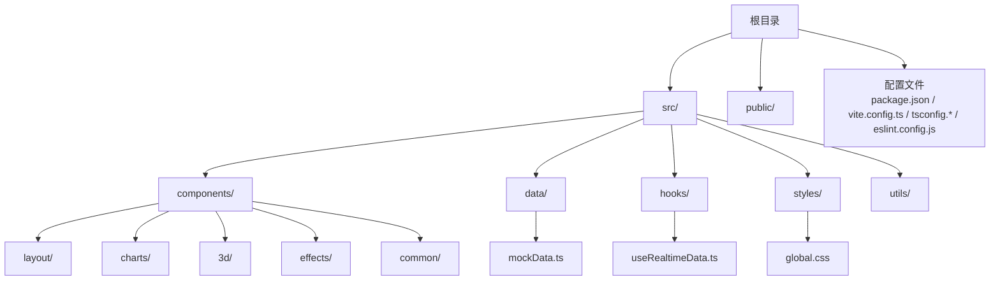
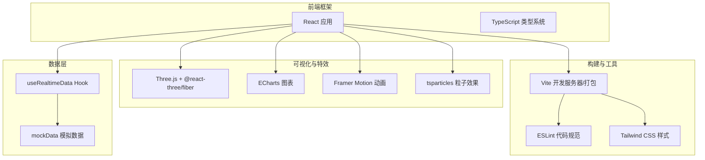
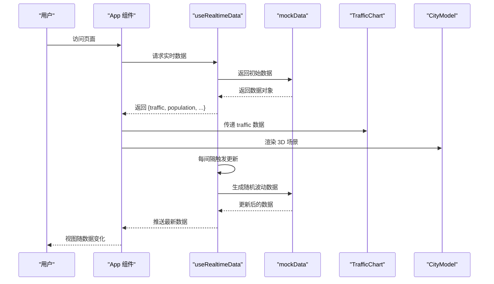
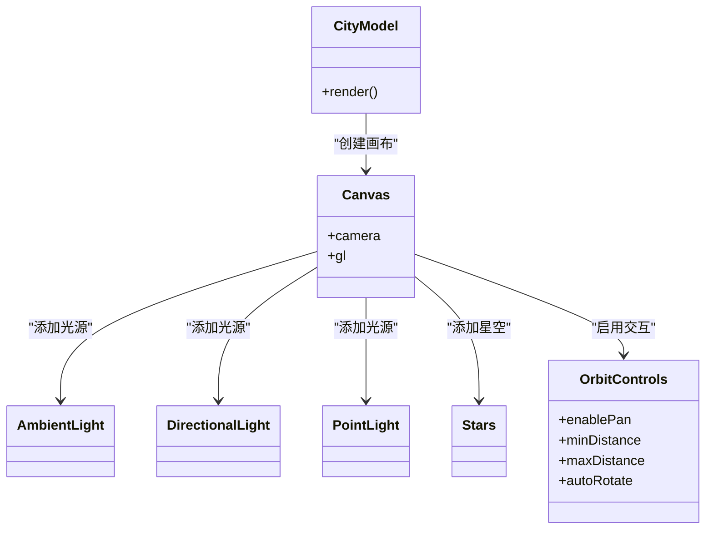
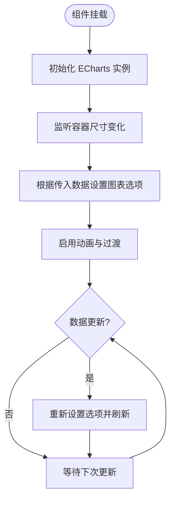
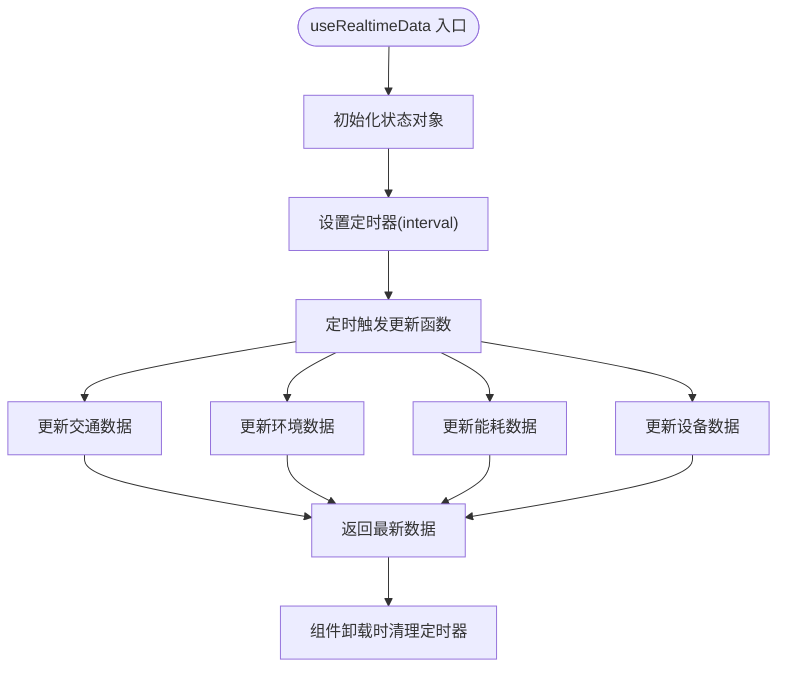
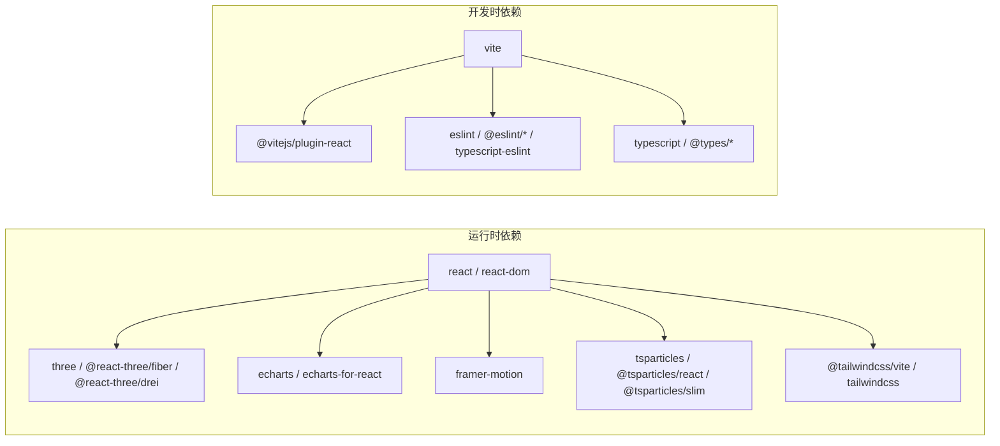

# 快速开始

<cite>
**本文引用的文件**
- [package.json](file://package.json)
- [README.md](file://README.md)
- [vite.config.ts](file://vite.config.ts)
- [tsconfig.json](file://tsconfig.json)
- [tsconfig.app.json](file://tsconfig.app.json)
- [tsconfig.node.json](file://tsconfig.node.json)
- [eslint.config.js](file://eslint.config.js)
- [index.html](file://index.html)
- [src/main.tsx](file://src/main.tsx)
- [src/App.tsx](file://src/App.tsx)
- [src/styles/global.css](file://src/styles/global.css)
- [src/hooks/useRealtimeData.ts](file://src/hooks/useRealtimeData.ts)
- [src/data/mockData.ts](file://src/data/mockData.ts)
- [src/components/3d/CityModel.tsx](file://src/components/3d/CityModel.tsx)
- [src/components/charts/TrafficChart.tsx](file://src/components/charts/TrafficChart.tsx)
- [src/components/layout/Header.tsx](file://src/components/layout/Header.tsx)
</cite>

## 目录
1. [简介](#简介)
2. [项目结构](#项目结构)
3. [核心组件](#核心组件)
4. [架构总览](#架构总览)
5. [详细组件分析](#详细组件分析)
6. [依赖分析](#依赖分析)
7. [性能考虑](#性能考虑)
8. [故障排除指南](#故障排除指南)
9. [结论](#结论)
10. [附录](#附录)

## 简介
本指南面向希望在30分钟内快速搭建并运行“智慧城市数据孪生大屏”项目的开发者。项目采用 React + TypeScript + Vite 技术栈，结合 Three.js、ECharts、Framer Motion、Tailwind CSS 等技术，实现 3D 城市模型、实时数据图表、粒子特效与赛博朋克风格界面的综合展示。文档涵盖环境要求、依赖安装、开发服务器启动、生产构建以及常见问题排查，帮助新手快速上手并理解基本开发流程。

## 项目结构
项目采用按功能分层的组织方式：
- 根目录包含构建配置、脚本与依赖声明
- src 目录下按功能域划分：components（布局、图表、3D、特效、通用组件）、data（Mock 数据）、hooks（自定义 Hook）、styles（全局样式）、utils（工具函数）
- public 目录存放静态资源（如 favicon）

**章节来源**
- [README.md: 49-71:49-71](file://README.md#L49-L71)
- [package.json: 1-42:1-42](file://package.json#L1-L42)

## 核心组件
- 应用入口与渲染：通过入口脚本挂载 React 根节点，渲染应用组件
- 应用主组件：负责布局网格划分、引入 3D 场景、图表面板、特效与事件流
- 实时数据钩子：提供定时更新的模拟数据，驱动图表与状态面板
- Mock 数据：包含交通、人口、环境、能源、设备、告警、事件流等数据集
- 3D 城市模型：基于 Three.js 的交互式场景，支持拖拽旋转、缩放与自动旋转
- 图表组件：基于 ECharts 的折线图、雷达图、仪表盘等可视化组件
- 全局样式：赛博朋克风格的深色主题与布局网格

**章节来源**
- [src/main.tsx: 1-11:1-11](file://src/main.tsx#L1-L11)
- [src/App.tsx: 1-128:1-128](file://src/App.tsx#L1-L128)
- [src/hooks/useRealtimeData.ts: 1-73:1-73](file://src/hooks/useRealtimeData.ts#L1-L73)
- [src/data/mockData.ts: 1-96:1-96](file://src/data/mockData.ts#L1-L96)
- [src/components/3d/CityModel.tsx: 1-50:1-50](file://src/components/3d/CityModel.tsx#L1-L50)
- [src/components/charts/TrafficChart.tsx: 1-117:1-117](file://src/components/charts/TrafficChart.tsx#L1-L117)
- [src/styles/global.css: 1-92:1-92](file://src/styles/global.css#L1-L92)

## 架构总览
整体架构由前端框架、构建工具、可视化库与数据层组成，形成从数据到视图的完整链路。

**图表来源**
- [src/App.tsx: 1-128:1-128](file://src/App.tsx#L1-L128)
- [src/main.tsx: 1-11:1-11](file://src/main.tsx#L1-L11)
- [vite.config.ts: 1-8:1-8](file://vite.config.ts#L1-L8)
- [eslint.config.js: 1-23:1-23](file://eslint.config.js#L1-L23)
- [src/hooks/useRealtimeData.ts: 1-73:1-73](file://src/hooks/useRealtimeData.ts#L1-L73)
- [src/data/mockData.ts: 1-96:1-96](file://src/data/mockData.ts#L1-L96)

## 详细组件分析

### 组件关系与数据流
应用组件负责组织布局与调度各子组件；实时数据钩子提供周期性更新的数据；Mock 数据为图表与状态面板提供输入；3D 场景作为中央焦点展示城市模型。

**图表来源**
- [src/App.tsx: 43-125:43-125](file://src/App.tsx#L43-L125)
- [src/hooks/useRealtimeData.ts: 15-72:15-72](file://src/hooks/useRealtimeData.ts#L15-L72)
- [src/data/mockData.ts: 1-96:1-96](file://src/data/mockData.ts#L1-L96)
- [src/components/charts/TrafficChart.tsx: 14-117:14-117](file://src/components/charts/TrafficChart.tsx#L14-L117)
- [src/components/3d/CityModel.tsx: 6-49:6-49](file://src/components/3d/CityModel.tsx#L6-L49)

**章节来源**
- [src/App.tsx: 43-125:43-125](file://src/App.tsx#L43-L125)
- [src/hooks/useRealtimeData.ts: 15-72:15-72](file://src/hooks/useRealtimeData.ts#L15-L72)
- [src/data/mockData.ts: 1-96:1-96](file://src/data/mockData.ts#L1-L96)

### 3D 城市模型组件
该组件使用 Three.js 与 @react-three/fiber 创建交互式 3D 场景，包含光源、星空中景、轨道控制器与自动旋转，支持鼠标拖拽旋转与滚轮缩放。

**图表来源**
- [src/components/3d/CityModel.tsx: 6-49:6-49](file://src/components/3d/CityModel.tsx#L6-L49)

**章节来源**
- [src/components/3d/CityModel.tsx: 1-50:1-50](file://src/components/3d/CityModel.tsx#L1-L50)

### 图表组件（以交通流量为例）
图表组件基于 ECharts 初始化实例，监听容器尺寸变化并动态设置选项，实现折线图与区域填充、图例与提示框等配置。

**图表来源**
- [src/components/charts/TrafficChart.tsx: 18-87:18-87](file://src/components/charts/TrafficChart.tsx#L18-L87)

**章节来源**
- [src/components/charts/TrafficChart.tsx: 1-117:1-117](file://src/components/charts/TrafficChart.tsx#L1-L117)

### 实时数据钩子
该 Hook 使用定时器周期性更新多类指标，包括交通拥堵指数、车辆总数、平均车速、环境指标、能耗与设备在线状态等，保证界面数据的动态变化。

**图表来源**
- [src/hooks/useRealtimeData.ts: 23-64:23-64](file://src/hooks/useRealtimeData.ts#L23-L64)

**章节来源**
- [src/hooks/useRealtimeData.ts: 1-73:1-73](file://src/hooks/useRealtimeData.ts#L1-L73)

## 依赖分析
项目依赖分为运行时依赖与开发时依赖，分别用于应用运行、构建与开发体验。

**图表来源**
- [package.json: 12-40:12-40](file://package.json#L12-L40)

**章节来源**
- [package.json: 1-42:1-42](file://package.json#L1-L42)

## 性能考虑
- 3D 场景优化：合理设置相机位置、光源数量与抗锯齿参数，避免过度绘制；在移动设备上可降低渲染质量或禁用部分特效。
- 图表性能：ECharts 在大数据量时建议使用 canvas 渲染器并开启采样；对频繁更新的图表，尽量减少不必要的重绘与全量更新。
- 动画与粒子：控制动画帧率与粒子数量，避免在低端设备上造成卡顿；必要时在低性能设备上降级或关闭特效。
- 构建优化：利用 Vite 的预构建与按需加载策略；生产构建时启用压缩与 Tree Shaking，减少包体积。

## 故障排除指南
- 无法启动开发服务器
  - 确认 Node.js 版本满足项目要求（建议使用 LTS 版本），并使用 npm 作为包管理器
  - 清理缓存后重新安装依赖：删除 node_modules 与 package-lock.json，执行安装命令
  - 检查端口占用情况，修改 Vite 配置中的端口或释放被占用端口
- 构建失败
  - 确保 TypeScript 编译通过后再进行打包；检查 tsconfig 配置是否正确
  - 若出现类型错误，优先修复类型相关问题，再尝试构建
- 3D 场景不显示或报错
  - 检查浏览器对 WebGL 的支持；在受限环境中可降级为 2D 可视化
  - 确认 Three.js 与 @react-three/fiber 版本兼容性
- 图表渲染异常
  - 确保容器尺寸正确且可观察到尺寸变化；检查 ECharts 初始化时机
  - 避免在短时间内多次销毁与重建实例
- 样式未生效
  - 确认 Tailwind CSS 插件已正确配置；检查全局样式文件是否被正确引入
  - 清除浏览器缓存或重启开发服务器

**章节来源**
- [README.md: 29-47:29-47](file://README.md#L29-L47)
- [vite.config.ts: 1-8:1-8](file://vite.config.ts#L1-L8)
- [eslint.config.js: 1-23:1-23](file://eslint.config.js#L1-L23)

## 结论
通过本指南，您可以在30分钟内完成环境准备、依赖安装、开发服务器启动与生产构建，并理解项目的核心架构与关键组件。建议在本地开发时关注性能与兼容性问题，逐步替换 Mock 数据为真实接口，完善错误处理与监控体系，最终交付高质量的智慧城市数据孪生大屏应用。

## 附录

### 环境要求
- Node.js：建议使用 LTS 版本（如 18.x 或 20.x）
- 包管理器：npm（推荐）
- 浏览器：现代浏览器（支持 WebGL 与 ES6+）

**章节来源**
- [README.md: 29-47:29-47](file://README.md#L29-L47)

### 依赖安装步骤
- 在项目根目录执行安装命令，安装所有依赖
- 安装完成后，可直接进入开发模式

**章节来源**
- [README.md: 31-35:31-35](file://README.md#L31-L35)
- [package.json: 6-11:6-11](file://package.json#L6-L11)

### 开发服务器启动
- 执行开发命令，启动 Vite 开发服务器
- 在浏览器中访问默认地址查看页面

**章节来源**
- [README.md: 37-41:37-41](file://README.md#L37-L41)
- [package.json: 7](file://package.json#L7)

### 生产构建流程
- 执行构建命令，先进行 TypeScript 编译，再进行打包
- 生成的静态资源位于构建输出目录，可通过预览命令本地验证

**章节来源**
- [README.md: 43-47:43-47](file://README.md#L43-L47)
- [package.json: 8](file://package.json#L8)

### TypeScript 配置
- 项目采用复合项目配置，包含应用与 Node 工具链两套 tsconfig
- ESLint 集成 TypeScript 规则，确保类型安全与代码规范

**章节来源**
- [tsconfig.json: 1-8:1-8](file://tsconfig.json#L1-L8)
- [tsconfig.app.json](file://tsconfig.app.json)
- [tsconfig.node.json](file://tsconfig.node.json)
- [eslint.config.js: 1-23:1-23](file://eslint.config.js#L1-L23)

### 入口与模板
- HTML 模板包含根容器与模块入口脚本
- React 入口脚本挂载应用根组件

**章节来源**
- [index.html: 1-14:1-14](file://index.html#L1-L14)
- [src/main.tsx: 1-11:1-11](file://src/main.tsx#L1-L11)