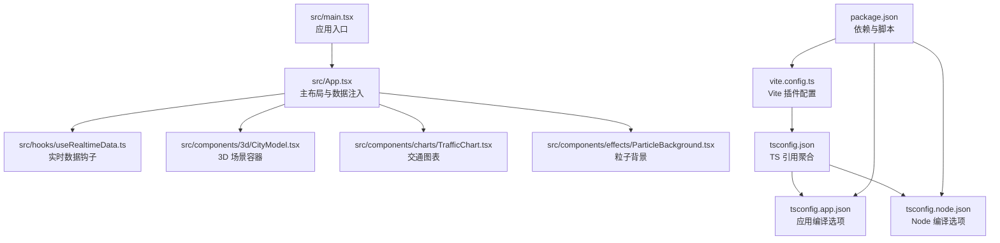
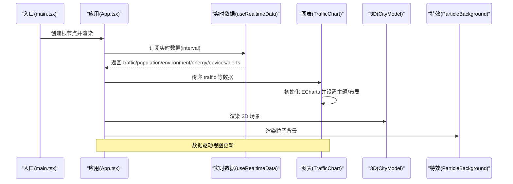

# 故障排除

<cite>
**本文引用的文件**
- [package.json](file://package.json)
- [vite.config.ts](file://vite.config.ts)
- [tsconfig.json](file://tsconfig.json)
- [tsconfig.app.json](file://tsconfig.app.json)
- [tsconfig.node.json](file://tsconfig.node.json)
- [README.md](file://README.md)
- [src/main.tsx](file://src/main.tsx)
- [src/App.tsx](file://src/App.tsx)
- [src/hooks/useRealtimeData.ts](file://src/hooks/useRealtimeData.ts)
- [src/data/mockData.ts](file://src/data/mockData.ts)
- [src/components/3d/CityModel.tsx](file://src/components/3d/CityModel.tsx)
- [src/components/charts/TrafficChart.tsx](file://src/components/charts/TrafficChart.tsx)
- [src/components/effects/ParticleBackground.tsx](file://src/components/effects/ParticleBackground.tsx)
- [eslint.config.js](file://eslint.config.js)
</cite>

## 目录
1. [简介](#简介)
2. [项目结构](#项目结构)
3. [核心组件](#核心组件)
4. [架构总览](#架构总览)
5. [详细组件分析](#详细组件分析)
6. [依赖与构建问题排查](#依赖与构建问题排查)
7. [运行时异常与性能瓶颈](#运行时异常与性能瓶颈)
8. [兼容性与浏览器支持](#兼容性与浏览器支持)
9. [调试工具与日志分析](#调试工具与日志分析)
10. [性能监控与优化建议](#性能监控与优化建议)
11. [用户反馈与问题预防](#用户反馈与问题预防)
12. [结论](#结论)

## 简介
本指南面向智慧城市数据孪生大屏项目的开发者与运维人员，聚焦开发与生产环境中的常见问题与排障路径，覆盖依赖安装、编译构建、运行时异常、性能瓶颈、兼容性问题、调试与日志分析、性能监控以及用户反馈处理与问题预防策略。文档以项目实际代码为依据，提供可操作的诊断步骤与修复建议。

## 项目结构
项目采用 React + TypeScript + Vite 的前端工程化方案，结合 Three.js、@react-three/fiber、ECharts、Framer Motion、Tailwind CSS 与 tsparticles 等技术栈，实现 3D 城市模型、实时数据图表与粒子特效等可视化功能。

**图示来源**
- [src/main.tsx:1-11](file://src/main.tsx#L1-L11)
- [src/App.tsx:1-128](file://src/App.tsx#L1-L128)
- [src/hooks/useRealtimeData.ts:1-73](file://src/hooks/useRealtimeData.ts#L1-L73)
- [src/components/3d/CityModel.tsx:1-50](file://src/components/3d/CityModel.tsx#L1-L50)
- [src/components/charts/TrafficChart.tsx:1-117](file://src/components/charts/TrafficChart.tsx#L1-L117)
- [src/components/effects/ParticleBackground.tsx:1-72](file://src/components/effects/ParticleBackground.tsx#L1-L72)
- [vite.config.ts:1-8](file://vite.config.ts#L1-L8)
- [tsconfig.json:1-8](file://tsconfig.json#L1-L8)
- [tsconfig.app.json:1-26](file://tsconfig.app.json#L1-L26)
- [tsconfig.node.json:1-25](file://tsconfig.node.json#L1-L25)
- [package.json:1-42](file://package.json#L1-L42)

**章节来源**
- [README.md:1-71](file://README.md#L1-L71)
- [package.json:1-42](file://package.json#L1-L42)
- [vite.config.ts:1-8](file://vite.config.ts#L1-L8)
- [tsconfig.json:1-8](file://tsconfig.json#L1-L8)

## 核心组件
- 应用入口与渲染：通过入口文件挂载 React 根节点，渲染顶层 App 组件。
- 主布局与动画：App 组织头部、左右侧面板、中央 3D 场景、底部事件流，并使用 Framer Motion 实现面板入场动画。
- 实时数据：useRealtimeData 提供定时更新的 mock 数据，驱动图表与状态面板。
- 3D 场景：CityModel 使用 Canvas 容器承载 Three.js 场景，内置光照、控件与雾化效果。
- 图表组件：TrafficChart 基于 ECharts 初始化与响应式布局，支持主题色与渐变填充。
- 粒子特效：ParticleBackground 使用 tsparticles 加载 slim 并配置粒子链接与透明背景。

**章节来源**
- [src/main.tsx:1-11](file://src/main.tsx#L1-L11)
- [src/App.tsx:1-128](file://src/App.tsx#L1-L128)
- [src/hooks/useRealtimeData.ts:1-73](file://src/hooks/useRealtimeData.ts#L1-L73)
- [src/components/3d/CityModel.tsx:1-50](file://src/components/3d/CityModel.tsx#L1-L50)
- [src/components/charts/TrafficChart.tsx:1-117](file://src/components/charts/TrafficChart.tsx#L1-L117)
- [src/components/effects/ParticleBackground.tsx:1-72](file://src/components/effects/ParticleBackground.tsx#L1-L72)

## 架构总览
下图展示从入口到各功能模块的数据与控制流关系：

**图示来源**
- [src/main.tsx:1-11](file://src/main.tsx#L1-L11)
- [src/App.tsx:1-128](file://src/App.tsx#L1-L128)
- [src/hooks/useRealtimeData.ts:1-73](file://src/hooks/useRealtimeData.ts#L1-L73)
- [src/components/charts/TrafficChart.tsx:1-117](file://src/components/charts/TrafficChart.tsx#L1-L117)
- [src/components/3d/CityModel.tsx:1-50](file://src/components/3d/CityModel.tsx#L1-L50)
- [src/components/effects/ParticleBackground.tsx:1-72](file://src/components/effects/ParticleBackground.tsx#L1-L72)

## 详细组件分析

### 3D 场景组件（CityModel）
- 关键点：Canvas 设置相机位置、抗锯齿与透明背景；Suspense 包裹异步加载场景；OrbitControls 控制视角与自动旋转；光源与雾化增强视觉层次。
- 常见问题：初始化失败、控件冲突、自动旋转卡顿、资源加载超时。
- 排障要点：检查 Canvas 容器尺寸、Suspense 回退逻辑、控件参数范围、光照与雾化对性能的影响。

**章节来源**
- [src/components/3d/CityModel.tsx:1-50](file://src/components/3d/CityModel.tsx#L1-L50)

### 图表组件（TrafficChart）
- 关键点：首次挂载初始化 ECharts，ResizeObserver 监听容器尺寸变化并触发 resize；按路由动态生成系列与渐变填充；主题色与透明度配置。
- 常见问题：图表不显示、尺寸错乱、内存泄漏、渲染卡顿。
- 排障要点：确认容器存在、实例 dispose 生命周期、避免重复初始化、合理设置动画时长。

**章节来源**
- [src/components/charts/TrafficChart.tsx:1-117](file://src/components/charts/TrafficChart.tsx#L1-L117)

### 粒子特效（ParticleBackground）
- 关键点：懒加载 tsparticles slim，初始化后渲染全屏粒子，启用链接与透明背景，限制帧率与密度。
- 常见问题：粒子不显示、闪烁、CPU 占用高、z-index 层级冲突。
- 排障要点：确保初始化完成后再渲染、调整链接距离与透明度、降低粒子数量或帧率。

**章节来源**
- [src/components/effects/ParticleBackground.tsx:1-72](file://src/components/effects/ParticleBackground.tsx#L1-L72)

### 实时数据钩子（useRealtimeData）
- 关键点：定时器周期性更新多类指标，随机波动模拟真实数据；返回对象包含交通、环境、能耗、设备与告警数据。
- 常见问题：定时器泄漏、数据类型不匹配、抖动过大导致 UI 卡顿。
- 排障要点：清理定时器、校验数据结构、控制更新频率与波动幅度。

**章节来源**
- [src/hooks/useRealtimeData.ts:1-73](file://src/hooks/useRealtimeData.ts#L1-L73)
- [src/data/mockData.ts:1-96](file://src/data/mockData.ts#L1-L96)

## 依赖与构建问题排查
- 依赖安装失败
  - 症状：npm install 报错、包解析失败、版本冲突。
  - 排查：核对 Node 版本与 npm/yarn/pnpm 兼容性；删除 lock 文件与 node_modules 后重装；检查网络代理与 registry。
  - 参考配置：依赖声明与脚本位于 [package.json:1-42](file://package.json#L1-L42)。
- 构建失败
  - 症状：tsc 或 vite build 报错、找不到模块、类型检查失败。
  - 排查：确认 tsconfig 引用正确（app 与 node 分离）；检查 bundler 模式与 moduleResolution；逐项禁用插件定位问题。
  - 参考配置：[tsconfig.json:1-8](file://tsconfig.json#L1-L8)、[tsconfig.app.json:1-26](file://tsconfig.app.json#L1-L26)、[tsconfig.node.json:1-25](file://tsconfig.node.json#L1-L25)、[vite.config.ts:1-8](file://vite.config.ts#L1-L8)。
- 开发服务器无法启动
  - 症状：端口被占用、热更新失效、插件报错。
  - 排查：更换端口、关闭占用进程、检查插件顺序与版本兼容性；查看 Vite 日志输出。
  - 参考配置：[vite.config.ts:1-8](file://vite.config.ts#L1-L8)、[package.json:6-11](file://package.json#L6-L11)。

**章节来源**
- [package.json:1-42](file://package.json#L1-L42)
- [vite.config.ts:1-8](file://vite.config.ts#L1-L8)
- [tsconfig.json:1-8](file://tsconfig.json#L1-L8)
- [tsconfig.app.json:1-26](file://tsconfig.app.json#L1-L26)
- [tsconfig.node.json:1-25](file://tsconfig.node.json#L1-L25)

## 运行时异常与性能瓶颈
- 3D 场景卡顿
  - 症状：自动旋转迟滞、控件响应慢、帧率骤降。
  - 排障：减少几何复杂度、关闭不必要的光源与阴影、降低 antialias 或 alpha；检查 Suspense 回退是否频繁触发。
  - 参考实现：[CityModel:1-50](file://src/components/3d/CityModel.tsx#L1-L50)。
- 图表渲染缓慢
  - 症状：初始化耗时、resize 多次触发、动画卡顿。
  - 排障：避免在每次渲染中重复初始化；仅在容器尺寸变化时调用 resize；缩短动画时长或禁用部分动画。
  - 参考实现：[TrafficChart:1-117](file://src/components/charts/TrafficChart.tsx#L1-L117)。
- 粒子特效占用过高
  - 症状：CPU 占用飙升、风扇转速升高。
  - 排障：降低粒子数量、帧率上限、链接距离与透明度；在低端设备上按需禁用。
  - 参考实现：[ParticleBackground:1-72](file://src/components/effects/ParticleBackground.tsx#L1-L72)。
- 内存泄漏
  - 症状：页面长时间停留后内存持续增长。
  - 排障：确保图表实例在卸载时 dispose；清理定时器与 ResizeObserver；避免闭包持有 DOM 引用。
  - 参考实现：[TrafficChart:26-29](file://src/components/charts/TrafficChart.tsx#L26-L29)、[useRealtimeData:66-69](file://src/hooks/useRealtimeData.ts#L66-L69)。

**章节来源**
- [src/components/3d/CityModel.tsx:1-50](file://src/components/3d/CityModel.tsx#L1-L50)
- [src/components/charts/TrafficChart.tsx:1-117](file://src/components/charts/TrafficChart.tsx#L1-L117)
- [src/components/effects/ParticleBackground.tsx:1-72](file://src/components/effects/ParticleBackground.tsx#L1-L72)
- [src/hooks/useRealtimeData.ts:1-73](file://src/hooks/useRealtimeData.ts#L1-L73)

## 兼容性与浏览器支持
- 浏览器要求
  - 症状：某些浏览器不支持新特性、Three.js 或 ECharts 行为异常。
  - 排障：确认目标浏览器版本；为关键 API 提供 polyfill；在低版本设备上降级粒子与 3D 效果。
- 移动端体验
  - 症状：触摸控件不灵敏、布局错位、电量消耗快。
  - 排障：优化触控事件处理、简化粒子与 3D 计算、启用节电模式与懒加载。
- CSS 与样式
  - 症状：Tailwind 类名冲突、动画闪烁。
  - 排障：检查自定义样式优先级与 z-index；避免全局重置破坏第三方库样式。

**章节来源**
- [README.md:65-71](file://README.md#L65-L71)
- [vite.config.ts:1-8](file://vite.config.ts#L1-L8)

## 调试工具与日志分析
- 浏览器开发者工具
  - 使用 Elements/Console/Performance/Timeline 定位渲染卡顿、JS 异常与内存泄漏。
- React DevTools
  - 检查组件树、渲染次数与 props/state 变更，识别不必要的重渲染。
- Vite/TypeScript
  - 查看构建日志与类型错误；开启严格模式与未使用变量检查。
- 日志与错误上报
  - 在关键路径添加结构化日志；捕获图表初始化、3D 场景加载与粒子引擎的异常并上报。
- 参考配置
  - ESLint 规则与推荐扩展位于 [eslint.config.js:1-23](file://eslint.config.js#L1-L23)。

**章节来源**
- [eslint.config.js:1-23](file://eslint.config.js#L1-L23)

## 性能监控与优化建议
- 监控指标
  - FPS、帧时间、内存占用、CPU 占用、网络请求耗时、首屏时间。
- 优化策略
  - 3D：延迟加载场景、LOD、剔除不可见对象、减少材质与贴图数量。
  - 图表：按需渲染、禁用动画、合并更新、限制数据点数量。
  - 粒子：动态启停、按设备能力分级、降低链接与透明度。
  - 资源：CDN、缓存策略、压缩与分包。
- 参考实现
  - [CityModel:1-50](file://src/components/3d/CityModel.tsx#L1-L50)、[TrafficChart:1-117](file://src/components/charts/TrafficChart.tsx#L1-L117)、[ParticleBackground:1-72](file://src/components/effects/ParticleBackground.tsx#L1-L72)。

**章节来源**
- [src/components/3d/CityModel.tsx:1-50](file://src/components/3d/CityModel.tsx#L1-L50)
- [src/components/charts/TrafficChart.tsx:1-117](file://src/components/charts/TrafficChart.tsx#L1-L117)
- [src/components/effects/ParticleBackground.tsx:1-72](file://src/components/effects/ParticleBackground.tsx#L1-L72)

## 用户反馈与问题预防
- 错误收集
  - 在关键组件初始化与数据更新处捕获异常，记录上下文与堆栈；区分开发与生产环境上报策略。
- 用户反馈处理
  - 提供“反馈”入口，收集屏幕截图、设备信息、复现步骤与日志片段。
- 预防策略
  - 代码规范与静态检查：ESLint + TypeScript 严格模式；单元/集成测试覆盖高频路径。
  - 灰度发布：新功能先小范围上线，监控关键指标与错误率。
  - 回滚预案：版本化构建产物，保留最近一次稳定版本镜像。
- 参考配置
  - [eslint.config.js:1-23](file://eslint.config.js#L1-L23)、[package.json:6-11](file://package.json#L6-L11)。

**章节来源**
- [eslint.config.js:1-23](file://eslint.config.js#L1-L23)
- [package.json:6-11](file://package.json#L6-L11)

## 结论
本指南围绕智慧城市数据孪生大屏项目的关键技术栈与组件，提供了从依赖安装、构建配置、运行时异常到性能优化与用户反馈的全流程排障方法。建议在开发与生产环境中建立统一的日志与监控体系，配合严格的代码规范与灰度发布流程，持续降低故障率并提升用户体验。