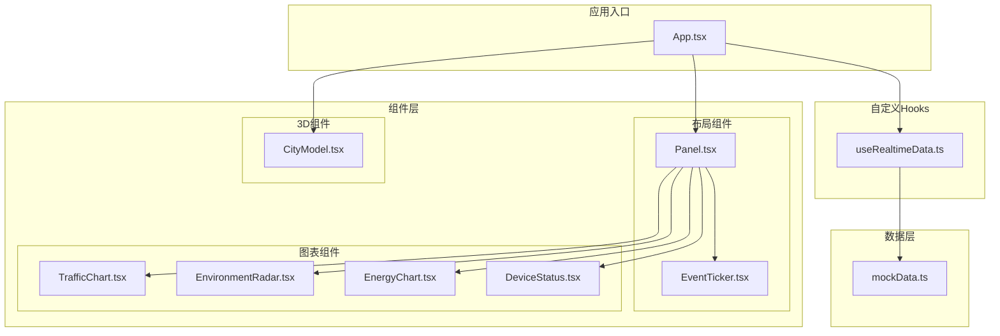
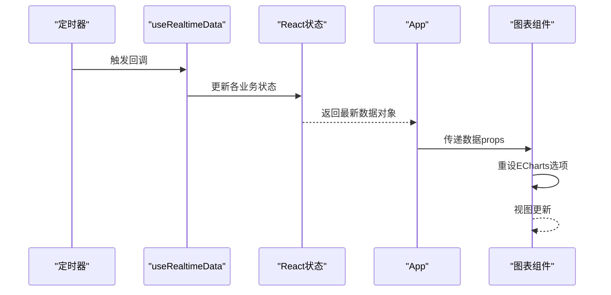
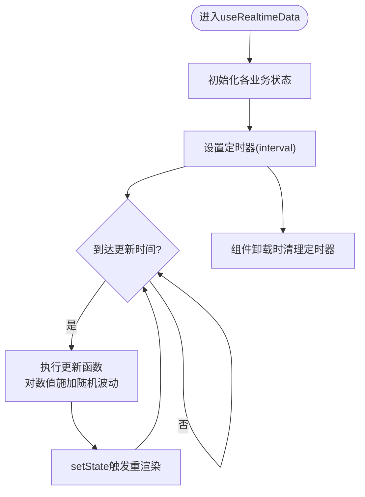
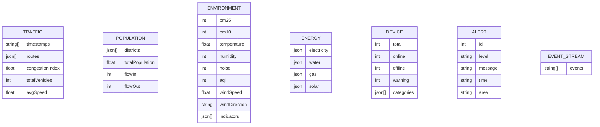
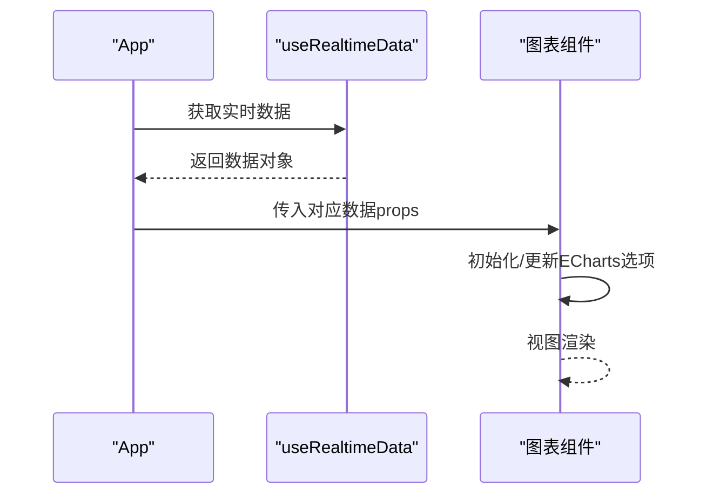
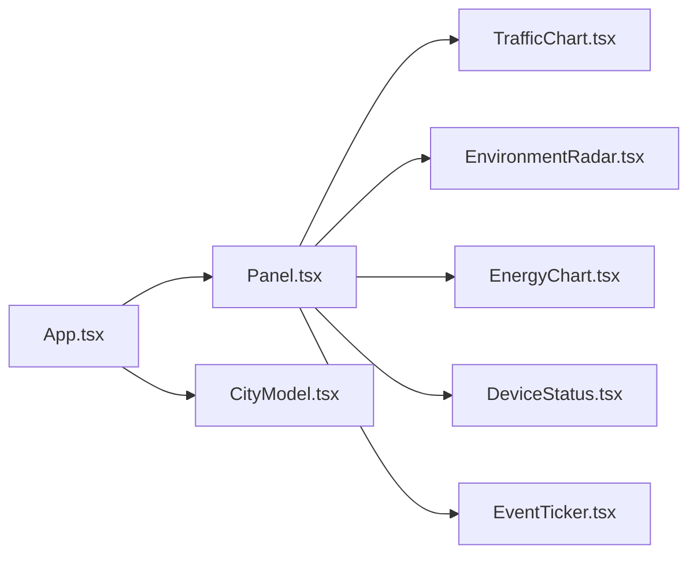
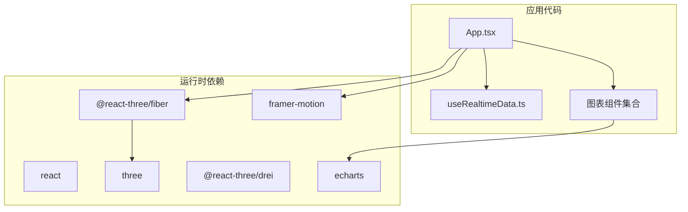

# 数据管理系统

<cite>
**本文引用的文件**
- [useRealtimeData.ts](file://src/hooks/useRealtimeData.ts)
- [mockData.ts](file://src/data/mockData.ts)
- [App.tsx](file://src/App.tsx)
- [EventTicker.tsx](file://src/components/layout/EventTicker.tsx)
- [Panel.tsx](file://src/components/layout/Panel.tsx)
- [CityModel.tsx](file://src/components/3d/CityModel.tsx)
- [TrafficChart.tsx](file://src/components/charts/TrafficChart.tsx)
- [EnvironmentRadar.tsx](file://src/components/charts/EnvironmentRadar.tsx)
- [EnergyChart.tsx](file://src/components/charts/EnergyChart.tsx)
- [DeviceStatus.tsx](file://src/components/charts/DeviceStatus.tsx)
- [EventTicker.css](file://src/components/layout/EventTicker.css)
- [global.css](file://src/styles/global.css)
- [package.json](file://package.json)
- [README.md](file://README.md)
</cite>

## 目录
1. [简介](#简介)
2. [项目结构](#项目结构)
3. [核心组件](#核心组件)
4. [架构总览](#架构总览)
5. [详细组件分析](#详细组件分析)
6. [依赖关系分析](#依赖关系分析)
7. [性能考虑](#性能考虑)
8. [故障排查指南](#故障排查指南)
9. [结论](#结论)
10. [附录](#附录)

## 简介
本文件面向智慧城市数据孪生大屏的数据管理系统，围绕实时数据钩子 useRealtimeData 的实现原理、数据更新机制与状态管理策略进行深入解析；同时阐述模拟数据源 mockData 的结构设计、数据类型定义与测试数据准备方法。文档还涵盖数据流架构、缓存策略、性能优化与错误处理机制，并提供数据集成指南、API 接口说明与数据扩展方法，帮助开发者理解并扩展数据管理功能。

## 项目结构
项目采用按功能域分层的组织方式：组件层（布局、图表、3D、特效）、数据层（模拟数据）、自定义 Hook 层（useRealtimeData），以及入口应用层（App）。

**图表来源**
- [App.tsx:43-125](file://src/App.tsx#L43-L125)
- [useRealtimeData.ts:15-72](file://src/hooks/useRealtimeData.ts#L15-L72)
- [mockData.ts:1-96](file://src/data/mockData.ts#L1-L96)
- [Panel.tsx:10-26](file://src/components/layout/Panel.tsx#L10-L26)
- [EventTicker.tsx:5-22](file://src/components/layout/EventTicker.tsx#L5-L22)
- [TrafficChart.tsx:14-114](file://src/components/charts/TrafficChart.tsx#L14-L114)
- [EnvironmentRadar.tsx:14-104](file://src/components/charts/EnvironmentRadar.tsx#L14-L104)
- [EnergyChart.tsx:20-99](file://src/components/charts/EnergyChart.tsx#L20-L99)
- [DeviceStatus.tsx:14-58](file://src/components/charts/DeviceStatus.tsx#L14-L58)
- [CityModel.tsx:6-46](file://src/components/3d/CityModel.tsx#L6-L46)

**章节来源**
- [README.md:49-71](file://README.md#L49-L71)
- [package.json:12-26](file://package.json#L12-L26)

## 核心组件
- useRealtimeData：提供统一的实时数据状态与更新逻辑，负责定时刷新交通、环境、能耗、设备等数据，并返回给上层组件消费。
- mockData：集中定义所有模拟数据的初始结构与取值范围，包括交通、人口、环境、能耗、设备、告警事件与事件流数据。
- 图表组件：通过 props 接收 useRealtimeData 返回的数据，渲染 ECharts 图表或状态面板。
- 布局与3D组件：承载图表与3D场景，提供整体布局与视觉效果。

**章节来源**
- [useRealtimeData.ts:15-72](file://src/hooks/useRealtimeData.ts#L15-L72)
- [mockData.ts:1-96](file://src/data/mockData.ts#L1-L96)
- [App.tsx:43-125](file://src/App.tsx#L43-L125)

## 架构总览
系统采用“Hook 提供数据 + 组件消费”的单向数据流架构。useRealtimeData 使用 React 状态与定时器驱动数据更新，图表组件在接收到新数据后重新设置 ECharts 选项，实现数据到视图的映射。

**图表来源**
- [useRealtimeData.ts:66-69](file://src/hooks/useRealtimeData.ts#L66-L69)
- [useRealtimeData.ts:23-64](file://src/hooks/useRealtimeData.ts#L23-L64)
- [App.tsx:44-44](file://src/App.tsx#L44-L44)
- [TrafficChart.tsx:32-87](file://src/components/charts/TrafficChart.tsx#L32-L87)

## 详细组件分析

### 实时数据钩子 useRealtimeData
- 状态管理
  - 使用 useState 初始化交通、环境、能耗、设备、人口、告警等状态。
  - 通过 useCallback 缓存更新函数，避免每次渲染生成新的函数实例，降低下游组件重渲染风险。
- 数据更新机制
  - 使用 useEffect 在挂载时启动定时器，周期性调用更新函数。
  - 更新函数对数值型字段施加随机波动，对整数型字段进行四舍五入取整，确保数据变化符合现实趋势。
  - 对嵌套对象（如能耗中的电/水/气）与数组（如环境指标、交通路线）分别进行深拷贝与映射更新。
- 性能与内存
  - 仅在依赖项（更新函数、间隔）变化时重建定时器，避免重复注册。
  - 回收清理：组件卸载时清除定时器，防止内存泄漏。
- 错误处理
  - 当前实现未显式捕获异常；建议在更新函数中包裹 try/catch 并记录错误日志，保证定时器不中断。

**图表来源**
- [useRealtimeData.ts:15-72](file://src/hooks/useRealtimeData.ts#L15-L72)

**章节来源**
- [useRealtimeData.ts:15-72](file://src/hooks/useRealtimeData.ts#L15-L72)

### 模拟数据源 mockData
- 数据结构设计
  - 交通数据：包含小时级时间序列、多条道路的流量曲线、拥堵指数、总车流量与平均速度。
  - 人口数据：按行政区划分的人口总量、密度与增长趋势，以及流入/流出数据。
  - 环境数据：PM2.5/PM10/AQI、温湿度、噪声、风速风向，以及一组指标（名称、当前值、最大阈值）。
  - 能源数据：电力/水/气/太阳能的当前用量、累计总量、单位与趋势数组。
  - 设备数据：设备总数、在线数、离线数、告警数与分类统计（名称、总量、在线量、图标）。
  - 告警事件：事件列表，包含级别、消息、时间与区域。
  - 事件流数据：用于底部滚动条展示的实时动态文本集合。
- 数据类型定义
  - 使用 TypeScript 接口约束图表组件的 props 类型，确保数据一致性与可维护性。
- 测试数据准备
  - 初始值覆盖正常范围与边界条件，便于验证图表显示与阈值告警逻辑。
  - 随机波动参数（如范围、小数位）可在 useRealtimeData 中统一调整，以模拟不同强度的波动。

**图表来源**
- [mockData.ts:2-12](file://src/data/mockData.ts#L2-L12)
- [mockData.ts:15-27](file://src/data/mockData.ts#L15-L27)
- [mockData.ts:30-47](file://src/data/mockData.ts#L30-L47)
- [mockData.ts:50-55](file://src/data/mockData.ts#L50-L55)
- [mockData.ts:58-69](file://src/data/mockData.ts#L58-L69)
- [mockData.ts:72-83](file://src/data/mockData.ts#L72-L83)
- [mockData.ts:86-95](file://src/data/mockData.ts#L86-L95)

**章节来源**
- [mockData.ts:1-96](file://src/data/mockData.ts#L1-L96)

### 图表组件与数据绑定
- TrafficChart：接收交通数据，初始化 ECharts 折线图，根据时间序列与多条路线绘制曲线，并展示拥堵指数、总车流量与平均速度。
- EnvironmentRadar：接收环境指标与 AQI、温湿度、风向等，初始化雷达图，按指标最大值设定刻度，展示当前各项指标。
- EnergyChart：接收能耗数据，使用仪表盘（gauge）展示电力、水、气、太阳能的当前用量与占比。
- DeviceStatus：接收设备状态数据，计算在线率并按类别展示在线数量与进度条颜色分级。

**图表来源**
- [App.tsx:69-116](file://src/App.tsx#L69-L116)
- [TrafficChart.tsx:14-114](file://src/components/charts/TrafficChart.tsx#L14-L114)
- [EnvironmentRadar.tsx:14-104](file://src/components/charts/EnvironmentRadar.tsx#L14-L104)
- [EnergyChart.tsx:20-99](file://src/components/charts/EnergyChart.tsx#L20-L99)
- [DeviceStatus.tsx:14-58](file://src/components/charts/DeviceStatus.tsx#L14-L58)

**章节来源**
- [App.tsx:69-116](file://src/App.tsx#L69-L116)
- [TrafficChart.tsx:14-114](file://src/components/charts/TrafficChart.tsx#L14-L114)
- [EnvironmentRadar.tsx:14-104](file://src/components/charts/EnvironmentRadar.tsx#L14-L104)
- [EnergyChart.tsx:20-99](file://src/components/charts/EnergyChart.tsx#L20-L99)
- [DeviceStatus.tsx:14-58](file://src/components/charts/DeviceStatus.tsx#L14-L58)

### 布局与3D场景
- Panel：统一的面板容器，支持标题与内容区域，配合全局样式实现赛博朋克风格。
- EventTicker：底部事件滚动条，复制事件列表以实现无缝循环滚动。
- CityModel：3D城市场景，使用 Canvas 渲染，内置光源、星空背景与自动旋转控制。

**图表来源**
- [Panel.tsx:10-26](file://src/components/layout/Panel.tsx#L10-L26)
- [EventTicker.tsx:5-22](file://src/components/layout/EventTicker.tsx#L5-L22)
- [CityModel.tsx:6-46](file://src/components/3d/CityModel.tsx#L6-L46)
- [App.tsx:68-117](file://src/App.tsx#L68-L117)

**章节来源**
- [Panel.tsx:10-26](file://src/components/layout/Panel.tsx#L10-L26)
- [EventTicker.tsx:5-22](file://src/components/layout/EventTicker.tsx#L5-L22)
- [CityModel.tsx:6-46](file://src/components/3d/CityModel.tsx#L6-L46)
- [App.tsx:68-117](file://src/App.tsx#L68-L117)

## 依赖关系分析
- 运行时依赖：React、ECharts、Three.js、@react-three/fiber、@react-three/drei、Framer Motion、TailwindCSS 等。
- 开发依赖：TypeScript、ESLint、Vite、插件等。
- 组件间耦合：图表组件与 App 通过 props 单向传递数据；useRealtimeData 与图表组件通过状态解耦，降低耦合度。

**图表来源**
- [package.json:12-26](file://package.json#L12-L26)
- [App.tsx:43-125](file://src/App.tsx#L43-L125)
- [TrafficChart.tsx:1-3](file://src/components/charts/TrafficChart.tsx#L1-L3)

**章节来源**
- [package.json:12-26](file://package.json#L12-L26)

## 性能考虑
- 状态粒度与更新频率
  - 将不同业务数据拆分为独立状态，避免单一状态过大导致全量重渲染。
  - 通过 interval 控制更新频率，建议在低延迟网络与高刷新率场景下适当增大间隔，减少主线程压力。
- 渲染优化
  - 图表组件使用 ECharts 的 setOption 替代完全重绘，仅在数据变化时更新必要部分。
  - 使用 ResizeObserver 监听容器尺寸变化，避免强制布局抖动。
- 内存与资源
  - 定时器在组件卸载时清理，防止内存泄漏。
  - 3D 场景启用抗锯齿与透明背景，合理设置雾化参数，平衡视觉与性能。
- 缓存策略
  - 当前未实现本地缓存；可在 useRealtimeData 外层引入内存缓存（如 LRU）以减少重复计算与网络请求开销（若接入真实数据源）。
- 错误处理
  - 建议在更新函数中增加 try/catch，记录错误并降级处理，保证定时器持续运行。

[本节为通用性能指导，无需特定文件引用]

## 故障排查指南
- 图表不更新
  - 检查 useRealtimeData 是否正确返回数据对象，确认 App 是否将数据传入图表组件。
  - 确认图表组件的 useEffect 依赖是否包含数据对象，避免因依赖缺失导致不更新。
- 数据异常波动过大
  - 调整 useRealtimeData 中 randomFluctuation 的波动范围参数，确保符合业务预期。
- 3D 场景卡顿
  - 检查自动旋转速度与相机距离限制，适当降低自动旋转速度或提高最小/最大距离。
- 事件滚动条不滚动
  - 检查 EventTicker 的样式动画与事件列表长度，确保复制事件列表后动画生效。
- 内存泄漏
  - 确保定时器在组件卸载时被清理，避免多次注册定时器。

**章节来源**
- [useRealtimeData.ts:66-69](file://src/hooks/useRealtimeData.ts#L66-L69)
- [TrafficChart.tsx:32-87](file://src/components/charts/TrafficChart.tsx#L32-L87)
- [CityModel.tsx:20-27](file://src/components/3d/CityModel.tsx#L20-L27)
- [EventTicker.css:34-35](file://src/components/layout/EventTicker.css#L34-L35)

## 结论
本数据管理系统以 useRealtimeData 为核心，结合 mockData 与图表组件，构建了完整的实时数据可视化闭环。通过合理的状态拆分、定时器管理与 ECharts 更新策略，实现了流畅的实时数据展示。建议后续在错误处理、缓存与真实数据源对接方面进一步增强，以满足生产环境的稳定性与可扩展性需求。

[本节为总结性内容，无需特定文件引用]

## 附录

### 数据集成指南
- 接入真实数据源
  - 在 useRealtimeData 中替换 mockData 的初始值为真实 API 返回值。
  - 引入 fetch 或 WebSocket 订阅，将数据转换为现有结构后 setState。
  - 增加 loading/error 状态，避免首次加载空白。
- 数据格式校验
  - 在 setState 前对字段进行类型与范围校验，确保图表组件不会接收到异常数据。
- 分批更新
  - 若数据量较大，可将一次更新拆分为多个 setState，降低单次渲染成本。

[本节为通用集成指导，无需特定文件引用]

### API 接口说明（模拟）
- GET /api/realtime
  - 功能：获取实时数据对象（交通、环境、能耗、设备、人口、告警）。
  - 返回：JSON 对象，字段与 mockData 中的键一致。
  - 示例：见 [mockData.ts:2-83](file://src/data/mockData.ts#L2-L83)

**章节来源**
- [mockData.ts:2-83](file://src/data/mockData.ts#L2-L83)

### 数据扩展方法
- 新增业务数据
  - 在 mockData 中添加新的数据对象与默认值。
  - 在 useRealtimeData 中新增状态与更新逻辑，并在返回对象中暴露该状态。
  - 在 App 中将新数据传入对应的图表组件。
- 调整波动模型
  - 在 useRealtimeData 中为新字段定义合适的 randomFluctuation 参数，确保变化自然。
- 图表适配
  - 在对应图表组件中新增 props 接口与渲染逻辑，保持与现有组件一致的风格与交互。

**章节来源**
- [useRealtimeData.ts:15-72](file://src/hooks/useRealtimeData.ts#L15-L72)
- [mockData.ts:1-96](file://src/data/mockData.ts#L1-L96)
- [App.tsx:43-125](file://src/App.tsx#L43-L125)