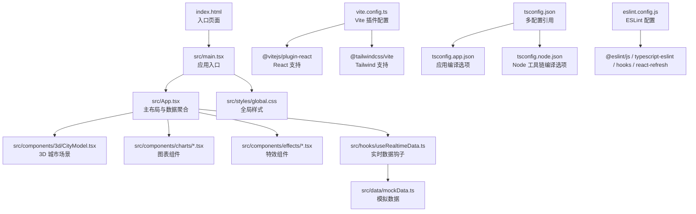
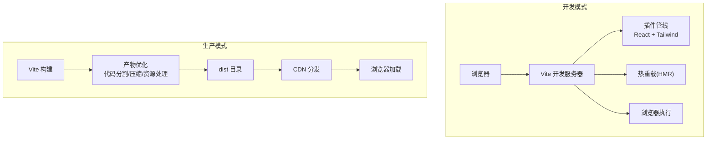
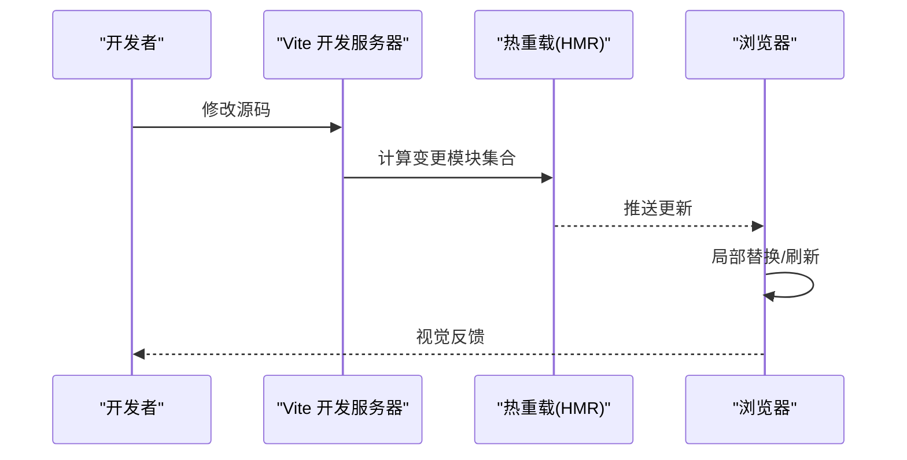
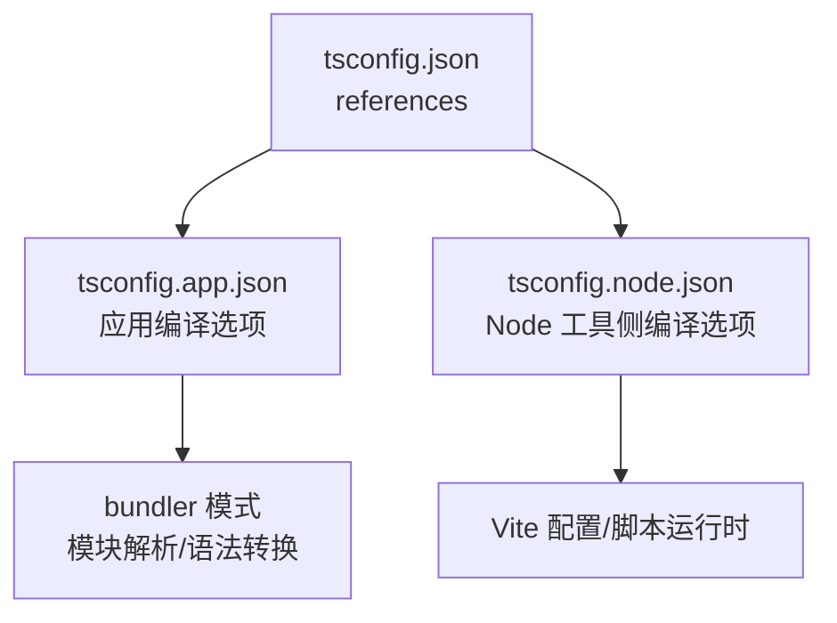
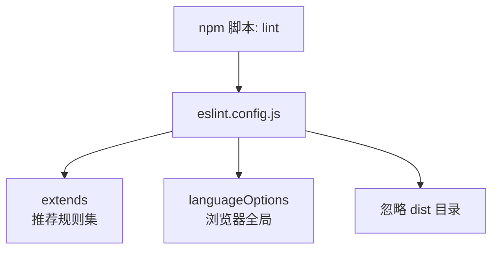
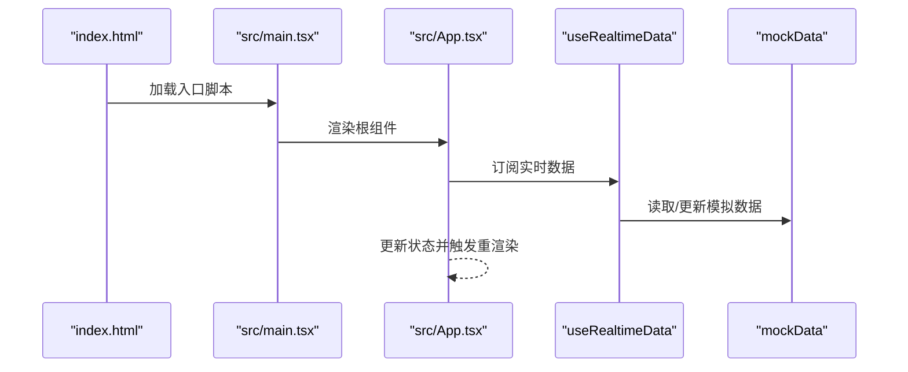
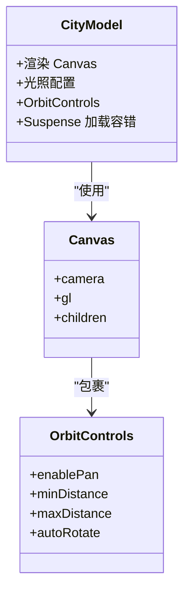
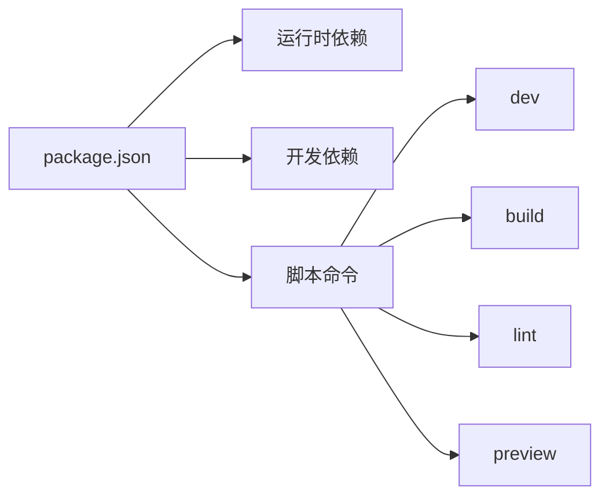

# 构建与部署

<cite>
**本文引用的文件**
- [vite.config.ts](file://vite.config.ts)
- [package.json](file://package.json)
- [eslint.config.js](file://eslint.config.js)
- [tsconfig.json](file://tsconfig.json)
- [tsconfig.app.json](file://tsconfig.app.json)
- [tsconfig.node.json](file://tsconfig.node.json)
- [index.html](file://index.html)
- [src/main.tsx](file://src/main.tsx)
- [src/App.tsx](file://src/App.tsx)
- [src/components/3d/CityModel.tsx](file://src/components/3d/CityModel.tsx)
- [src/hooks/useRealtimeData.ts](file://src/hooks/useRealtimeData.ts)
- [src/data/mockData.ts](file://src/data/mockData.ts)
- [src/styles/global.css](file://src/styles/global.css)
</cite>

## 目录
1. [简介](#简介)
2. [项目结构](#项目结构)
3. [核心组件](#核心组件)
4. [架构总览](#架构总览)
5. [详细组件分析](#详细组件分析)
6. [依赖分析](#依赖分析)
7. [性能考虑](#性能考虑)
8. [故障排查指南](#故障排查指南)
9. [结论](#结论)
10. [附录](#附录)

## 简介
本指南面向智慧城市数据孪生大屏项目，聚焦于 Vite 构建配置、TypeScript 编译选项、ESLint 代码质量检查以及生产环境优化策略。内容涵盖开发服务器与热重载、代码分割与静态资源处理、生产构建流程、部署最佳实践、CDN 配置建议与性能监控设置，并提供常见构建问题的诊断与解决方案，帮助开发者高效完成项目部署与运维。

## 项目结构
该项目采用 Vite + React + TypeScript 技术栈，结合 TailwindCSS 进行样式管理；3D 场景基于 @react-three/fiber 与 three.js 实现；图表使用 ECharts 与 ECharts for React；动画与交互由 Framer Motion 提供；粒子背景与扫描线等特效通过 TSParticles 与自定义 CSS 动画实现。

**图示来源**
- [index.html:1-14](file://index.html#L1-L14)
- [src/main.tsx:1-11](file://src/main.tsx#L1-L11)
- [src/App.tsx:1-128](file://src/App.tsx#L1-L128)
- [src/components/3d/CityModel.tsx:1-50](file://src/components/3d/CityModel.tsx#L1-L50)
- [src/hooks/useRealtimeData.ts:1-73](file://src/hooks/useRealtimeData.ts#L1-L73)
- [src/data/mockData.ts:1-96](file://src/data/mockData.ts#L1-L96)
- [src/styles/global.css:1-92](file://src/styles/global.css#L1-L92)
- [vite.config.ts:1-8](file://vite.config.ts#L1-L8)
- [tsconfig.json:1-8](file://tsconfig.json#L1-L8)
- [tsconfig.app.json:1-26](file://tsconfig.app.json#L1-L26)
- [tsconfig.node.json:1-25](file://tsconfig.node.json#L1-L25)
- [eslint.config.js:1-23](file://eslint.config.js#L1-L23)

**章节来源**
- [vite.config.ts:1-8](file://vite.config.ts#L1-L8)
- [package.json:1-42](file://package.json#L1-L42)
- [tsconfig.json:1-8](file://tsconfig.json#L1-L8)
- [tsconfig.app.json:1-26](file://tsconfig.app.json#L1-L26)
- [tsconfig.node.json:1-25](file://tsconfig.node.json#L1-L25)
- [eslint.config.js:1-23](file://eslint.config.js#L1-L23)
- [index.html:1-14](file://index.html#L1-L14)
- [src/main.tsx:1-11](file://src/main.tsx#L1-L11)
- [src/App.tsx:1-128](file://src/App.tsx#L1-L128)
- [src/components/3d/CityModel.tsx:1-50](file://src/components/3d/CityModel.tsx#L1-L50)
- [src/hooks/useRealtimeData.ts:1-73](file://src/hooks/useRealtimeData.ts#L1-L73)
- [src/data/mockData.ts:1-96](file://src/data/mockData.ts#L1-L96)
- [src/styles/global.css:1-92](file://src/styles/global.css#L1-L92)

## 核心组件
- Vite 构建与开发服务器：通过插件启用 React JSX 与 TailwindCSS 支持，默认开发端口与热重载由 Vite 管理。
- TypeScript 多配置体系：应用侧与 Node 工具侧分别配置，确保 bundler 模式与类型安全。
- ESLint：基于 flat 配置，集成推荐规则、React Hooks、React Refresh 与 TypeScript ESLint。
- React 应用入口：挂载根节点、引入全局样式与应用组件。
- 3D 城市场景：基于 Canvas 渲染、光照与 OrbitControls 控制，配合 Suspense 加载容错。
- 实时数据钩子：周期性更新多维指标，驱动图表与面板刷新。
- 全局样式：赛博朋克风格深色主题、网格布局与动画基元。

**章节来源**
- [vite.config.ts:1-8](file://vite.config.ts#L1-L8)
- [tsconfig.app.json:1-26](file://tsconfig.app.json#L1-L26)
- [tsconfig.node.json:1-25](file://tsconfig.node.json#L1-L25)
- [eslint.config.js:1-23](file://eslint.config.js#L1-L23)
- [src/main.tsx:1-11](file://src/main.tsx#L1-L11)
- [src/App.tsx:1-128](file://src/App.tsx#L1-L128)
- [src/components/3d/CityModel.tsx:1-50](file://src/components/3d/CityModel.tsx#L1-L50)
- [src/hooks/useRealtimeData.ts:1-73](file://src/hooks/useRealtimeData.ts#L1-L73)
- [src/styles/global.css:1-92](file://src/styles/global.css#L1-L92)

## 架构总览
下图展示从浏览器到构建工具与运行时的关键路径，包括开发与生产两种模式下的差异点（如 CDN、产物目录、资源哈希等）。

**图示来源**
- [vite.config.ts:1-8](file://vite.config.ts#L1-L8)
- [package.json:6-11](file://package.json#L6-L11)

## 详细组件分析

### Vite 构建配置与开发服务器
- 插件启用：React JSX 转换与 TailwindCSS 支持，满足现代前端开发需求。
- 开发服务器：默认通过脚本启动，支持热重载与快速模块替换。
- 热重载机制：基于 Vite HMR 协议，修改源码后自动刷新相关模块，减少全量刷新。
- 代码分割：Vite 默认按需打包与动态导入，有利于首屏性能与懒加载。
- 静态资源处理：自动识别与优化图片、字体、媒体等资源，生成稳定缓存键。

**图示来源**
- [vite.config.ts:1-8](file://vite.config.ts#L1-L8)
- [package.json:6-11](file://package.json#L6-L11)

**章节来源**
- [vite.config.ts:1-8](file://vite.config.ts#L1-L8)
- [package.json:6-11](file://package.json#L6-L11)

### TypeScript 编译选项与多配置体系
- 应用编译配置（tsconfig.app.json）
  - 目标与库：ES2023 + DOM，适配现代浏览器特性。
  - 模块解析：bundler 模式，允许 Vite 等打包器接管模块解析。
  - JSX：使用 React JSX 转换，配合 React 18+ 严格模式。
  - 类型：包含 Vite 客户端类型，避免环境变量与模块声明缺失。
  - 严格性：启用未使用局部变量/参数、switch 穿透检测等，提升代码质量。
- Node 工具编译配置（tsconfig.node.json）
  - 目标与库：ES2023，适配 Vite 配置文件与脚本运行时。
  - 模块解析：bundler 模式，强制模块检测，避免隐式 any。
  - 严格性：与应用侧一致，保持一致性与可维护性。
- 顶层引用（tsconfig.json）
  - 通过 references 将应用与 Node 配置组合，支持增量编译与类型检查分离。

**图示来源**
- [tsconfig.json:1-8](file://tsconfig.json#L1-L8)
- [tsconfig.app.json:1-26](file://tsconfig.app.json#L1-L26)
- [tsconfig.node.json:1-25](file://tsconfig.node.json#L1-L25)

**章节来源**
- [tsconfig.json:1-8](file://tsconfig.json#L1-L8)
- [tsconfig.app.json:1-26](file://tsconfig.app.json#L1-L26)
- [tsconfig.node.json:1-25](file://tsconfig.node.json#L1-L25)

### ESLint 代码质量检查
- 配置结构：flat 配置数组，排除 dist 输出目录，针对 ts/tsx 文件启用推荐规则。
- 规则集：包含 @eslint/js 推荐、TypeScript ESLint 推荐、React Hooks 推荐、React Refresh Vite 适配。
- 语言选项：浏览器全局变量可用，便于 React/Vite 环境开发。
- 使用方式：通过 npm 脚本执行 lint，可在 CI 中作为质量门禁。

**图示来源**
- [eslint.config.js:1-23](file://eslint.config.js#L1-L23)
- [package.json:6-11](file://package.json#L6-L11)

**章节来源**
- [eslint.config.js:1-23](file://eslint.config.js#L1-L23)
- [package.json:6-11](file://package.json#L6-L11)

### 应用入口与主布局
- 入口文件：创建根节点并渲染 App 组件，引入全局样式。
- 主布局：采用 CSS Grid 布局划分头部、左右侧面板、中央 3D 区域与底部滚动事件条。
- 动画：使用 Framer Motion 实现面板入场动画与交错延迟，增强视觉层次。
- 数据流：通过实时钩子提供多维指标，驱动各面板与图表更新。

**图示来源**
- [index.html:1-14](file://index.html#L1-L14)
- [src/main.tsx:1-11](file://src/main.tsx#L1-L11)
- [src/App.tsx:1-128](file://src/App.tsx#L1-L128)
- [src/hooks/useRealtimeData.ts:1-73](file://src/hooks/useRealtimeData.ts#L1-L73)
- [src/data/mockData.ts:1-96](file://src/data/mockData.ts#L1-L96)

**章节来源**
- [index.html:1-14](file://index.html#L1-L14)
- [src/main.tsx:1-11](file://src/main.tsx#L1-L11)
- [src/App.tsx:1-128](file://src/App.tsx#L1-L128)
- [src/hooks/useRealtimeData.ts:1-73](file://src/hooks/useRealtimeData.ts#L1-L73)
- [src/data/mockData.ts:1-96](file://src/data/mockData.ts#L1-L96)

### 3D 城市场景与特效
- 3D 渲染：Canvas 提供透明背景与抗锯齿，光照与星空背景营造沉浸感。
- 控制与视角：OrbitControls 提供鼠标拖拽旋转与滚轮缩放，限制距离与角度。
- 加载容错：Suspense 在子树加载期间显示空占位，避免白屏。
- 特效：粒子背景与扫描线通过独立组件实现，不阻塞主渲染流程。

**图示来源**
- [src/components/3d/CityModel.tsx:1-50](file://src/components/3d/CityModel.tsx#L1-L50)

**章节来源**
- [src/components/3d/CityModel.tsx:1-50](file://src/components/3d/CityModel.tsx#L1-L50)

### 全局样式与主题
- 主题：深蓝背景、青蓝色高亮、赛博朋克风格，适合大屏可视化。
- 布局：CSS Grid 划分区域，响应式适配全屏。
- 动画：扫描线、脉冲、发光等基础动画，统一视觉语言。
- 滚动条：自定义样式，降低视觉干扰。

**章节来源**
- [src/styles/global.css:1-92](file://src/styles/global.css#L1-L92)

## 依赖分析
- 运行时依赖：React、React DOM、@react-three/fiber、three、@react-three/drei、ECharts、ECharts for React、Framer Motion、TSParticles 生态。
- 开发依赖：Vite、@vitejs/plugin-react、@tailwindcss/vite、TypeScript、ESLint、typescript-eslint、globals、@types/*。
- 脚本命令：dev、build、lint、preview，覆盖开发、构建、质量检查与预览。

**图示来源**
- [package.json:1-42](file://package.json#L1-L42)

**章节来源**
- [package.json:1-42](file://package.json#L1-L42)

## 性能考虑
- 代码分割
  - 动态导入第三方库与重型图表组件，按需加载以缩短首屏时间。
  - 将 3D 子树拆分为独立模块，仅在需要时加载 Canvas 与相关依赖。
- 资源优化
  - 图片与字体交由 Vite 处理，自动压缩与生成稳定缓存键。
  - 合理使用 CSS 动画与 GPU 加速属性，减少主线程压力。
- 构建优化
  - 生产构建开启压缩与 Tree Shaking，移除未使用代码。
  - 产物输出目录 dist，配合 CDN 与缓存头策略。
- 运行时优化
  - 实时数据更新频率可控，避免过度重渲染。
  - 使用 Suspense 与骨架屏策略，改善感知性能。

[本节为通用性能指导，无需特定文件引用]

## 故障排查指南
- 构建失败（TypeScript）
  - 症状：构建时报类型错误或找不到模块。
  - 排查：确认 tsconfig.app.json 的 bundler 模式与 JSX 设置是否正确；检查类型声明与模块解析配置。
  - 参考文件：[tsconfig.app.json:1-26](file://tsconfig.app.json#L1-L26)
- ESLint 报错
  - 症状：脚本执行时报 ESLint 错误。
  - 排查：检查 flat 配置中的 extends 与语言选项；确认忽略目录与文件匹配规则。
  - 参考文件：[eslint.config.js:1-23](file://eslint.config.js#L1-L23)
- 开发热重载无效
  - 症状：修改代码后页面无变化。
  - 排查：确认 Vite 插件已启用；检查浏览器控制台网络与 HMR 日志；验证文件保存与模块边界。
  - 参考文件：[vite.config.ts:1-8](file://vite.config.ts#L1-L8)
- 3D 场景渲染异常
  - 症状：Canvas 无法渲染或报错。
  - 排查：检查 Canvas 参数与子树依赖；确认 Suspense 是否正确包裹；验证光照与相机设置。
  - 参考文件：[src/components/3d/CityModel.tsx:1-50](file://src/components/3d/CityModel.tsx#L1-L50)
- 实时数据不更新
  - 症状：面板数据静止不动。
  - 排查：确认定时器是否正常；检查数据更新逻辑与状态合并；验证钩子依赖项。
  - 参考文件：[src/hooks/useRealtimeData.ts:1-73](file://src/hooks/useRealtimeData.ts#L1-L73)

**章节来源**
- [tsconfig.app.json:1-26](file://tsconfig.app.json#L1-L26)
- [eslint.config.js:1-23](file://eslint.config.js#L1-L23)
- [vite.config.ts:1-8](file://vite.config.ts#L1-L8)
- [src/components/3d/CityModel.tsx:1-50](file://src/components/3d/CityModel.tsx#L1-L50)
- [src/hooks/useRealtimeData.ts:1-73](file://src/hooks/useRealtimeData.ts#L1-L73)

## 结论
本指南围绕 Vite + React + TypeScript 技术栈，系统梳理了构建配置、类型系统、代码质量与生产优化策略。结合项目实际（3D 场景、实时数据与大屏布局），建议在生产环境中启用代码分割、资源压缩与 CDN 分发，并通过缓存策略与监控体系保障稳定性与性能。遇到问题时，可依据本指南的排查清单逐项定位，快速恢复服务。

[本节为总结性内容，无需特定文件引用]

## 附录

### 生产构建流程与部署最佳实践
- 构建命令
  - 先执行 TypeScript 项目引用构建，再进行 Vite 生产打包，确保类型检查与打包顺序一致。
  - 参考脚本：[package.json:6-11](file://package.json#L6-L11)
- 产物与发布
  - 产物目录：dist；CDN 分发前校验缓存键与版本号。
  - 预览：可通过本地预览命令验证构建结果。
  - 参考脚本：[package.json:6-11](file://package.json#L6-L11)
- CDN 配置建议
  - 静态资源：开启长期缓存与压缩；对 HTML 设置较短缓存。
  - 版本化：资源名带哈希，HTML 不缓存或短缓存。
  - 回滚：保留最近 N 个版本，便于快速回滚。
- 性能监控
  - 关键指标：首屏时间、TTFB、资源体积、错误率。
  - 工具：浏览器性能面板、Web Vitals、APM 平台。
  - 建议：对大屏场景关注 Canvas 与图表渲染帧率，避免主线程阻塞。

**章节来源**
- [package.json:6-11](file://package.json#L6-L11)