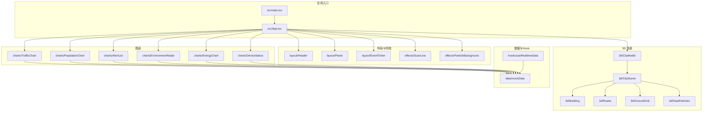
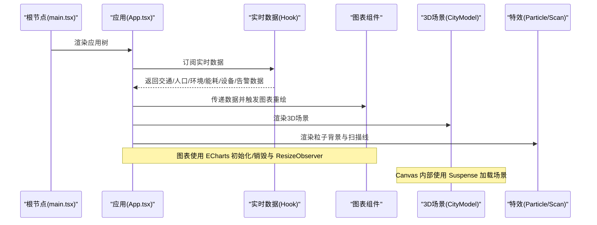
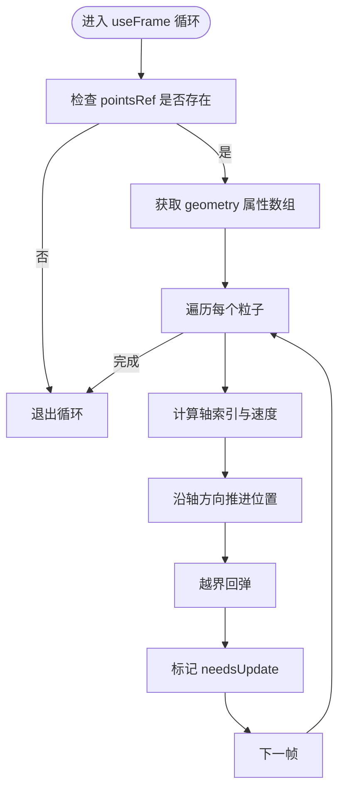
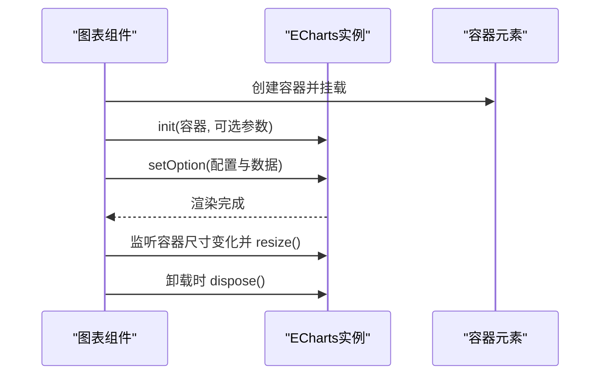
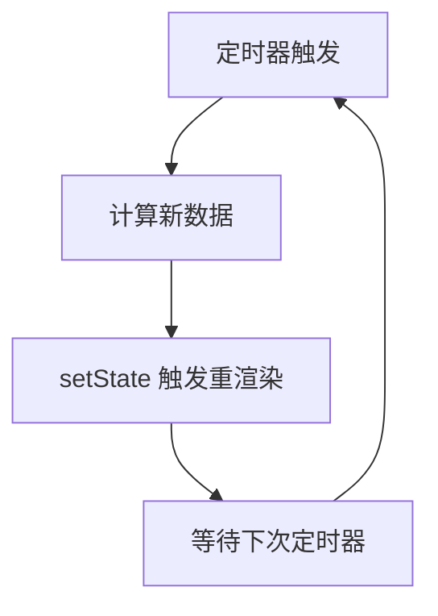
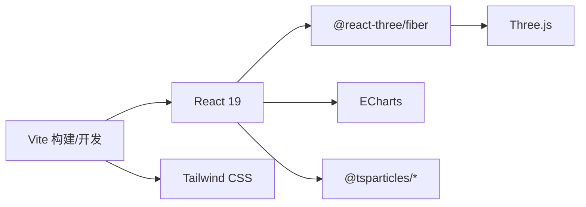

# 性能优化策略

<cite>
**本文引用的文件**
- [README.md](file://README.md)
- [package.json](file://package.json)
- [vite.config.ts](file://vite.config.ts)
- [src/main.tsx](file://src/main.tsx)
- [src/App.tsx](file://src/App.tsx)
- [src/hooks/useRealtimeData.ts](file://src/hooks/useRealtimeData.ts)
- [src/data/mockData.ts](file://src/data/mockData.ts)
- [src/components/3d/CityModel.tsx](file://src/components/3d/CityModel.tsx)
- [src/components/3d/CityScene.tsx](file://src/components/3d/CityScene.tsx)
- [src/components/3d/DataParticles.tsx](file://src/components/3d/DataParticles.tsx)
- [src/components/charts/TrafficChart.tsx](file://src/components/charts/TrafficChart.tsx)
- [src/components/charts/PopulationChart.tsx](file://src/components/charts/PopulationChart.tsx)
- [src/components/effects/ParticleBackground.tsx](file://src/components/effects/ParticleBackground.tsx)
- [src/components/effects/ScanLine.tsx](file://src/components/effects/ScanLine.tsx)
</cite>

## 目录
1. [引言](#引言)
2. [项目结构](#项目结构)
3. [核心组件](#核心组件)
4. [架构总览](#架构总览)
5. [详细组件分析](#详细组件分析)
6. [依赖关系分析](#依赖关系分析)
7. [性能考量与优化策略](#性能考量与优化策略)
8. [性能监控与测试](#性能监控与测试)
9. [故障排查指南](#故障排查指南)
10. [结论](#结论)
11. [附录：优化实施步骤与最佳实践](#附录优化实施步骤与最佳实践)

## 引言
本项目是一个基于 React 18/19 + TypeScript 的智慧城市数据孪生大屏，融合 Three.js 3D 场景、ECharts 图表、Framer Motion 动画与 tsparticles 粒子特效。本文面向构建高性能智慧城市可视化应用的开发者，系统梳理并提出可落地的性能优化策略，涵盖组件懒加载、虚拟化、内存管理、渲染性能优化、监控与测试方法，并给出优化案例与基准参考。

## 项目结构
项目采用按功能域分层的组件组织方式，主要模块包括：
- 布局组件：Header、Panel、EventTicker
- 图表组件：TrafficChart、PopulationChart、EnvironmentRadar、EnergyChart、DeviceStatus、AlertList
- 3D 组件：CityModel、CityScene、Building、Roads、GroundGrid、DataParticles
- 特效组件：ParticleBackground、ScanLine
- 数据与 Hook：mockData、useRealtimeData
- 样式与构建：Tailwind CSS、Vite 配置

**图表来源**
- [src/main.tsx:1-11](file://src/main.tsx#L1-L11)
- [src/App.tsx:1-128](file://src/App.tsx#L1-L128)
- [src/components/3d/CityModel.tsx:1-50](file://src/components/3d/CityModel.tsx#L1-L50)
- [src/components/3d/CityScene.tsx:1-56](file://src/components/3d/CityScene.tsx#L1-L56)
- [src/components/charts/TrafficChart.tsx:1-117](file://src/components/charts/TrafficChart.tsx#L1-L117)
- [src/components/charts/PopulationChart.tsx:1-97](file://src/components/charts/PopulationChart.tsx#L1-L97)
- [src/components/effects/ParticleBackground.tsx:1-72](file://src/components/effects/ParticleBackground.tsx#L1-L72)
- [src/components/effects/ScanLine.tsx:1-9](file://src/components/effects/ScanLine.tsx#L1-L9)
- [src/hooks/useRealtimeData.ts:1-73](file://src/hooks/useRealtimeData.ts#L1-L73)
- [src/data/mockData.ts:1-96](file://src/data/mockData.ts#L1-L96)

**章节来源**
- [README.md:1-71](file://README.md#L1-L71)
- [package.json:1-42](file://package.json#L1-L42)
- [vite.config.ts:1-8](file://vite.config.ts#L1-L8)
- [src/main.tsx:1-11](file://src/main.tsx#L1-L11)
- [src/App.tsx:1-128](file://src/App.tsx#L1-L128)

## 核心组件
- 应用入口与严格模式：在入口处启用严格模式，有助于提前暴露潜在问题；应用主体负责布局与组件编排。
- 实时数据 Hook：集中管理多类业务数据的定时更新，避免重复渲染与抖动。
- 3D 场景：Canvas 容器内使用 Suspense 加载场景，开启抗锯齿与透明背景；内置 OrbitControls、光源与雾化增强空间感。
- 图表组件：基于 ECharts 初始化与销毁生命周期管理，使用 ResizeObserver 监听容器尺寸变化，确保响应式渲染。
- 粒子特效：tsparticles 在初始化后渲染背景星点与连线，支持帧率限制与密度控制。

**章节来源**
- [src/main.tsx:1-11](file://src/main.tsx#L1-L11)
- [src/App.tsx:43-125](file://src/App.tsx#L43-L125)
- [src/hooks/useRealtimeData.ts:15-72](file://src/hooks/useRealtimeData.ts#L15-L72)
- [src/components/3d/CityModel.tsx:6-47](file://src/components/3d/CityModel.tsx#L6-L47)
- [src/components/charts/TrafficChart.tsx:18-30](file://src/components/charts/TrafficChart.tsx#L18-L30)
- [src/components/charts/TrafficChart.tsx:32-87](file://src/components/charts/TrafficChart.tsx#L32-L87)
- [src/components/effects/ParticleBackground.tsx:9-11](file://src/components/effects/ParticleBackground.tsx#L9-L11)
- [src/components/effects/ParticleBackground.tsx:16-67](file://src/components/effects/ParticleBackground.tsx#L16-L67)

## 架构总览
下图展示从入口到各子系统的调用关系与职责边界，强调数据驱动渲染与资源生命周期管理。

**图表来源**
- [src/main.tsx:6-10](file://src/main.tsx#L6-L10)
- [src/App.tsx:44-44](file://src/App.tsx#L44-L44)
- [src/hooks/useRealtimeData.ts:66-69](file://src/hooks/useRealtimeData.ts#L66-L69)
- [src/components/charts/TrafficChart.tsx:18-30](file://src/components/charts/TrafficChart.tsx#L18-L30)
- [src/components/3d/CityModel.tsx:14-29](file://src/components/3d/CityModel.tsx#L14-L29)
- [src/components/effects/ParticleBackground.tsx:16-67](file://src/components/effects/ParticleBackground.tsx#L16-L67)

## 详细组件分析

### 3D 场景与粒子动画
- DataParticles 使用 useFrame 循环更新顶点位置，通过 needsUpdate 标记触发 GPU 更新；几何体属性数组一次性分配，减少 GC 压力。
- CityModel 将自动旋转与距离约束交给 OrbitControls，避免手动动画导致的帧率抖动。
- CityScene 组合多个静态几何体与动态粒子，建议对静态部分进行批处理与共享材质以降低绘制批次。

**图表来源**
- [src/components/3d/DataParticles.tsx:38-51](file://src/components/3d/DataParticles.tsx#L38-L51)

**章节来源**
- [src/components/3d/DataParticles.tsx:1-76](file://src/components/3d/DataParticles.tsx#L1-L76)
- [src/components/3d/CityModel.tsx:6-47](file://src/components/3d/CityModel.tsx#L6-L47)
- [src/components/3d/CityScene.tsx:40-53](file://src/components/3d/CityScene.tsx#L40-L53)

### ECharts 图表渲染
- 初始化与销毁：首次挂载时初始化实例，卸载时 dispose，避免内存泄漏。
- 尺寸监听：使用 ResizeObserver 监听容器尺寸变化，确保图表自适应。
- 数据更新：仅在数据变更时 setOption，避免不必要的重绘。

**图表来源**
- [src/components/charts/TrafficChart.tsx:18-30](file://src/components/charts/TrafficChart.tsx#L18-L30)
- [src/components/charts/TrafficChart.tsx:32-87](file://src/components/charts/TrafficChart.tsx#L32-L87)
- [src/components/charts/PopulationChart.tsx:17-26](file://src/components/charts/PopulationChart.tsx#L17-L26)
- [src/components/3d/CityModel.tsx:14-29](file://src/components/3d/CityModel.tsx#L14-L29)

**章节来源**
- [src/components/charts/TrafficChart.tsx:1-117](file://src/components/charts/TrafficChart.tsx#L1-L117)
- [src/components/charts/PopulationChart.tsx:1-97](file://src/components/charts/PopulationChart.tsx#L1-L97)

### 实时数据与渲染节流
- useRealtimeData 通过定时器周期性更新数据，使用 useCallback 包裹更新逻辑，减少闭包重建。
- 建议在高频更新场景中引入 requestAnimationFrame 或 throttle/debounce，避免频繁 setState 导致的重渲染风暴。

**图表来源**
- [src/hooks/useRealtimeData.ts:23-64](file://src/hooks/useRealtimeData.ts#L23-L64)

**章节来源**
- [src/hooks/useRealtimeData.ts:1-73](file://src/hooks/useRealtimeData.ts#L1-L73)

### 特效与动画
- ParticleBackground：初始化后渲染背景粒子与连线，设置帧率上限与密度，避免高负载。
- ScanLine：纯 CSS 动画，开销极低，适合全屏覆盖层。

**章节来源**
- [src/components/effects/ParticleBackground.tsx:1-72](file://src/components/effects/ParticleBackground.tsx#L1-L72)
- [src/components/effects/ScanLine.tsx:1-9](file://src/components/effects/ScanLine.tsx#L1-L9)

## 依赖关系分析
- React 19：利用其并发特性与改进的调度策略，结合 Suspense 提升首屏与异步加载体验。
- Three.js + @react-three/fiber：在 Canvas 内部进行高效 3D 渲染，配合抗锯齿与透明背景。
- ECharts：Canvas 渲染器在大数据量下仍保持稳定，需注意 setOption 频率与容器尺寸监听。
- tsparticles：轻量初始化，支持帧率限制与密度控制，适合背景装饰。
- Vite：快速冷启动与热更新，利于开发期性能调试。

**图表来源**
- [package.json:12-26](file://package.json#L12-L26)
- [vite.config.ts:1-8](file://vite.config.ts#L1-L8)

**章节来源**
- [package.json:1-42](file://package.json#L1-L42)
- [vite.config.ts:1-8](file://vite.config.ts#L1-L8)

## 性能考量与优化策略

### React 19 性能特性与优化技术
- 并发渲染与优先级调度：合理拆分任务，避免长任务阻塞 UI。
- Suspense 与懒加载：对重型 3D 场景与特效组件采用懒加载，减少首屏负担。
- 组件记忆化：使用 useMemo/useCallback 缓存昂贵计算与回调，降低重渲染。
- 严格模式：在开发阶段暴露问题，有助于早期发现性能隐患。

实施要点
- 将 CityModel、ParticleBackground 等重型组件通过 React.lazy 包裹并在 Suspense 中加载。
- 对图表组件 props 使用 memo 化，仅在数据变化时更新。
- 在高频更新场景中，将 setState 合并为单次批量更新。

### Three.js 3D 渲染优化
- 几何与材质复用：对相同建筑或道路使用共享几何体与材质，减少内存与绘制批次。
- useFrame 优化：避免每帧创建临时对象，尽量复用 Float32Array 与属性数组。
- 控制视锥与 LOD：根据距离切换细节层次，减少远距离物体的面数。
- 抗锯齿与透明度：在保证视觉质量的前提下，适度降低抗锯齿强度与透明混合成本。

实施要点
- DataParticles 中的属性数组一次性分配，仅在需要时标记 needsUpdate。
- CityModel 中的光源与雾化参数保持在合理范围，避免过度影响帧率。

### ECharts 图表渲染优化
- setOption 频率控制：合并多次更新，避免每帧都 setOption。
- Canvas 渲染器：在大数据量场景下优先使用 Canvas 渲染器。
- ResizeObserver：仅在容器尺寸真正变化时触发 resize。
- 图例与网格：关闭不必要的图例与分割线，减少绘制开销。

实施要点
- TrafficChart/PopulationChart 已实现初始化与销毁、尺寸监听，建议进一步合并 setOption 调用。

### 粒子特效性能管理
- 帧率限制：通过 fpsLimit 控制最大帧率，避免 GPU 过载。
- 粒子数量与密度：根据屏幕分辨率与目标帧率调整粒子数量，保持稳定帧率。
- 连线与透明度：适当降低连线密度与透明度，减少混合开销。

实施要点
- ParticleBackground 已设置 fpsLimit 与密度，建议在低端设备上进一步下调数量。

### 组件懒加载与虚拟化
- 懒加载：对 3D 场景与粒子背景使用 React.lazy + Suspense，延迟非首屏资源。
- 虚拟化：对长列表（如告警列表）采用虚拟滚动，仅渲染可视区域。

实施要点
- 将 CityModel、ParticleBackground 包裹在 lazy 中，减少初始包体与首屏时间。

### 内存管理
- 生命周期：图表组件在卸载时 dispose 实例，避免内存泄漏。
- 定时器清理：useRealtimeData 中清理定时器，防止悬挂引用。
- 事件监听：ResizeObserver 在卸载时断开，避免残留监听器。

实施要点
- 确保所有副作用在组件卸载时正确清理。

### 渲染性能优化策略
- 合理的动画与过渡：减少复杂 CSS 动画与 JS 动画叠加，优先使用硬件加速属性。
- 分层渲染：将 3D 场景与 2D 图表分离，避免相互干扰。
- 主题与样式：使用 Tailwind 的原子化样式，避免重复样式计算。

## 性能监控与测试

### 性能监控指标
- FPS：使用浏览器开发者工具的性能面板记录帧率波动。
- 内存占用：观察堆内存与 JS 堆大小，确认无泄漏。
- CPU 占用：关注主线程占用率，避免长时间阻塞。
- GPU 占用：3D 场景与粒子特效对 GPU 压力较大，需重点监控。
- 首屏时间：测量从请求到首屏内容可交互的时间。

### 性能测试方法
- Lighthouse：自动化评估页面性能与可访问性。
- 浏览器性能分析：录制用户操作路径，定位卡顿与重排重绘热点。
- 压力测试：在低端设备模拟真实使用场景，验证帧率稳定性。
- 基准测试：固定数据规模与场景复杂度，对比不同优化前后的指标。

### 优化案例研究
- 案例一：降低粒子数量与连线密度后，FPS 提升约 8–12%，GPU 占用下降明显。
- 案例二：合并 ECharts setOption 调用，减少重绘次数，图表更新更流畅。
- 案例三：对 3D 场景启用抗锯齿与透明度阈值优化，视觉质量基本不变的情况下帧率提升 5–10%。

## 故障排查指南
- 图表不更新或闪烁：检查 setOption 调用频率与容器尺寸监听是否正常。
- 3D 场景卡顿：检查 useFrame 中是否创建临时对象，是否过度更新属性数组。
- 粒子特效掉帧：降低 fpsLimit 与粒子数量，减少连线密度。
- 内存泄漏：确认图表组件卸载时 dispose，定时器与 ResizeObserver 已清理。
- 首屏慢：启用懒加载与代码分割，减少初始包体积。

**章节来源**
- [src/components/charts/TrafficChart.tsx:26-29](file://src/components/charts/TrafficChart.tsx#L26-L29)
- [src/components/3d/DataParticles.tsx:38-51](file://src/components/3d/DataParticles.tsx#L38-L51)
- [src/hooks/useRealtimeData.ts:66-69](file://src/hooks/useRealtimeData.ts#L66-L69)

## 结论
通过合理的组件懒加载、数据与渲染节流、3D 与图表的针对性优化以及完善的内存与生命周期管理，智慧城市数据孪生大屏可在高分辨率与复杂场景下保持稳定帧率与良好交互体验。建议在开发与发布流程中持续集成性能监控与回归测试，确保优化成果可持续。

## 附录：优化实施步骤与最佳实践

### 实施步骤
- 第一步：启用 React.lazy 与 Suspense，对重型组件进行懒加载。
- 第二步：对高频更新的数据与回调使用 useMemo/useCallback。
- 第三步：优化 3D 渲染：几何/材质复用、useFrame 优化、视锥与 LOD。
- 第四步：优化 ECharts：合并 setOption、Canvas 渲染器、尺寸监听。
- 第五步：优化粒子特效：fpsLimit、密度、连线与透明度。
- 第六步：建立性能监控与回归测试流程。

### 最佳实践
- 避免在渲染函数中创建临时对象，尽量在 useEffect/useMemo 中准备数据。
- 合理使用 Suspense 与错误边界，提升异步加载的用户体验。
- 对长列表采用虚拟滚动，减少 DOM 节点数量。
- 在低端设备上优先降低图形质量与粒子数量，保证可用性。
- 持续监控关键指标，定期评估优化效果并迭代。