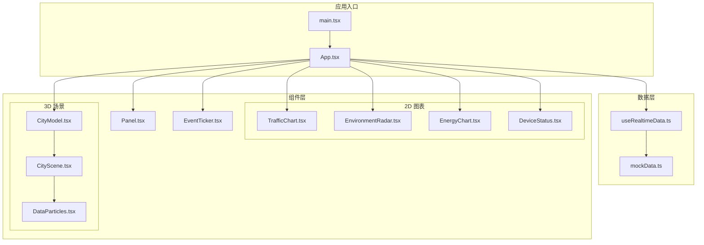
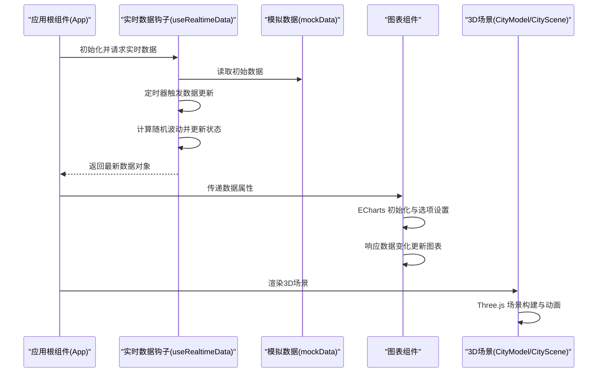
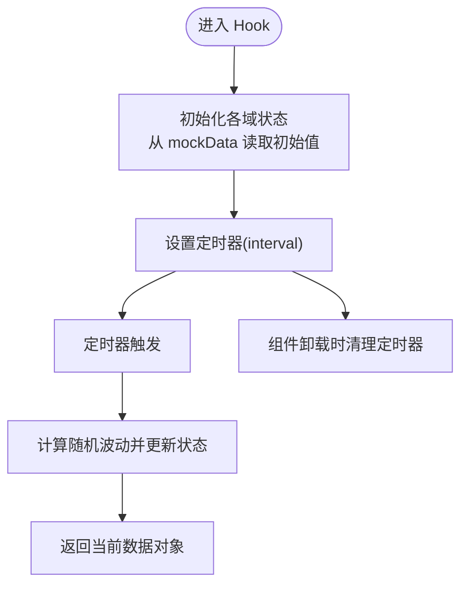
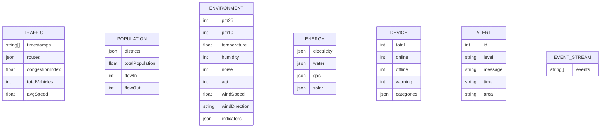
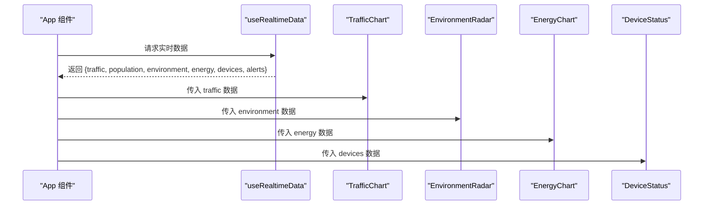
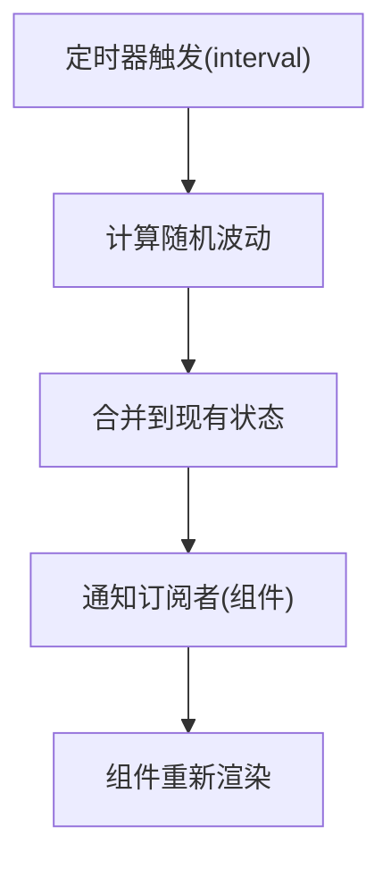
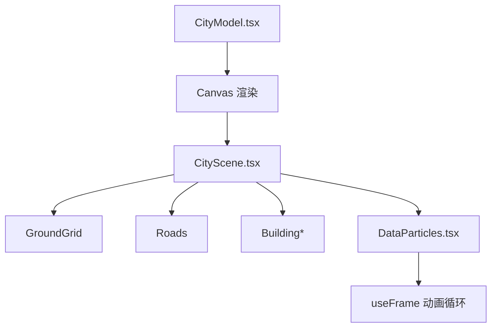
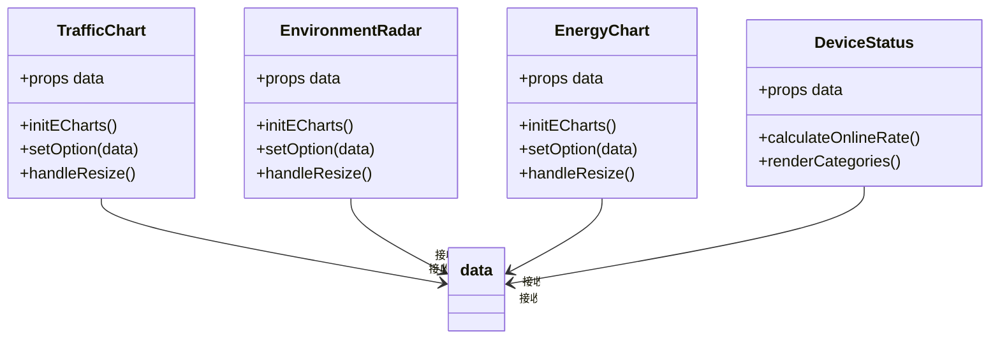
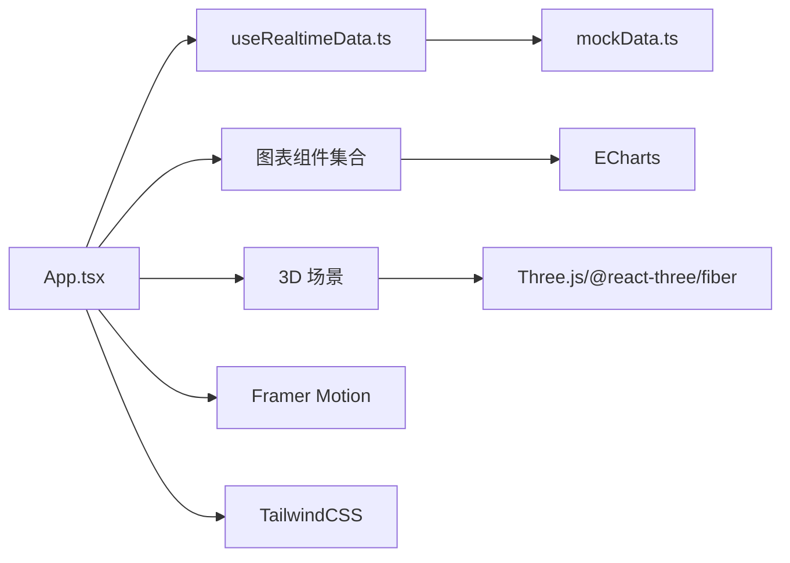

# 数据流设计

<cite>
**本文档引用的文件**
- [mockData.ts](file://src/data/mockData.ts)
- [useRealtimeData.ts](file://src/hooks/useRealtimeData.ts)
- [App.tsx](file://src/App.tsx)
- [main.tsx](file://src/main.tsx)
- [TrafficChart.tsx](file://src/components/charts/TrafficChart.tsx)
- [EnvironmentRadar.tsx](file://src/components/charts/EnvironmentRadar.tsx)
- [EnergyChart.tsx](file://src/components/charts/EnergyChart.tsx)
- [DeviceStatus.tsx](file://src/components/charts/DeviceStatus.tsx)
- [CityModel.tsx](file://src/components/3d/CityModel.tsx)
- [CityScene.tsx](file://src/components/3d/CityScene.tsx)
- [DataParticles.tsx](file://src/components/3d/DataParticles.tsx)
- [EventTicker.tsx](file://src/components/layout/EventTicker.tsx)
- [Panel.tsx](file://src/components/layout/Panel.tsx)
- [package.json](file://package.json)
</cite>

## 目录
1. [简介](#简介)
2. [项目结构](#项目结构)
3. [核心组件](#核心组件)
4. [架构总览](#架构总览)
5. [详细组件分析](#详细组件分析)
6. [依赖关系分析](#依赖关系分析)
7. [性能考虑](#性能考虑)
8. [故障排除指南](#故障排除指南)
9. [结论](#结论)
10. [附录](#附录)

## 简介
本文件为智慧城市数据孪生大屏项目的全面数据流设计文档，聚焦于数据获取、处理、传输与展示的完整流程。文档详细解释了 useRealtimeData Hook 的设计原理、mockData 数据结构以及实时数据更新机制；分析了数据在组件间的传递方式、状态提升策略与数据缓存机制；并提供了数据流图、状态管理架构与性能优化策略，帮助开发者理解如何扩展与优化数据流设计。

## 项目结构
项目采用按功能分层的组织方式：
- 数据层：提供 mock 数据与实时数据更新逻辑
- 组件层：包含 2D 图表组件、3D 场景组件与布局组件
- 应用入口：负责应用初始化与根组件渲染
- 依赖管理：通过包管理器引入可视化与 3D 渲染库

**图表来源**
- [main.tsx:1-11](file://src/main.tsx#L1-L11)
- [App.tsx:1-128](file://src/App.tsx#L1-L128)
- [mockData.ts:1-96](file://src/data/mockData.ts#L1-L96)
- [useRealtimeData.ts:1-73](file://src/hooks/useRealtimeData.ts#L1-L73)
- [TrafficChart.tsx:1-117](file://src/components/charts/TrafficChart.tsx#L1-L117)
- [EnvironmentRadar.tsx:1-108](file://src/components/charts/EnvironmentRadar.tsx#L1-L108)
- [EnergyChart.tsx:1-103](file://src/components/charts/EnergyChart.tsx#L1-L103)
- [DeviceStatus.tsx:1-63](file://src/components/charts/DeviceStatus.tsx#L1-L63)
- [CityModel.tsx:1-50](file://src/components/3d/CityModel.tsx#L1-L50)
- [CityScene.tsx:1-56](file://src/components/3d/CityScene.tsx#L1-L56)
- [DataParticles.tsx:1-76](file://src/components/3d/DataParticles.tsx#L1-L76)
- [Panel.tsx:1-30](file://src/components/layout/Panel.tsx#L1-L30)
- [EventTicker.tsx:1-26](file://src/components/layout/EventTicker.tsx#L1-L26)

**章节来源**
- [main.tsx:1-11](file://src/main.tsx#L1-L11)
- [App.tsx:1-128](file://src/App.tsx#L1-L128)
- [package.json:1-42](file://package.json#L1-L42)

## 核心组件
本节深入分析数据流中的关键组件及其职责：
- 数据提供者：mockData.ts 提供各类智慧城市指标的初始数据
- 实时数据钩子：useRealtimeData.ts 负责周期性更新数据并暴露给上层组件
- 展示组件：各图表组件接收数据并进行可视化渲染
- 3D 场景：CityModel.tsx 与 CityScene.tsx 构建城市三维模型，DataParticles.tsx 添加数据粒子效果
- 布局与事件：Panel.tsx 提供面板容器，EventTicker.tsx 展示实时事件流

**章节来源**
- [mockData.ts:1-96](file://src/data/mockData.ts#L1-L96)
- [useRealtimeData.ts:1-73](file://src/hooks/useRealtimeData.ts#L1-L73)
- [TrafficChart.tsx:1-117](file://src/components/charts/TrafficChart.tsx#L1-L117)
- [EnvironmentRadar.tsx:1-108](file://src/components/charts/EnvironmentRadar.tsx#L1-L108)
- [EnergyChart.tsx:1-103](file://src/components/charts/EnergyChart.tsx#L1-L103)
- [DeviceStatus.tsx:1-63](file://src/components/charts/DeviceStatus.tsx#L1-L63)
- [CityModel.tsx:1-50](file://src/components/3d/CityModel.tsx#L1-L50)
- [CityScene.tsx:1-56](file://src/components/3d/CityScene.tsx#L1-L56)
- [DataParticles.tsx:1-76](file://src/components/3d/DataParticles.tsx#L1-L76)
- [Panel.tsx:1-30](file://src/components/layout/Panel.tsx#L1-L30)
- [EventTicker.tsx:1-26](file://src/components/layout/EventTicker.tsx#L1-L26)

## 架构总览
下图展示了从数据提供到组件渲染的端到端数据流路径，包括实时更新与可视化渲染的关键节点。

**图表来源**
- [App.tsx:43-125](file://src/App.tsx#L43-L125)
- [useRealtimeData.ts:15-72](file://src/hooks/useRealtimeData.ts#L15-L72)
- [mockData.ts:1-96](file://src/data/mockData.ts#L1-L96)
- [TrafficChart.tsx:18-87](file://src/components/charts/TrafficChart.tsx#L18-L87)
- [EnvironmentRadar.tsx:18-78](file://src/components/charts/EnvironmentRadar.tsx#L18-L78)
- [EnergyChart.tsx:24-97](file://src/components/charts/EnergyChart.tsx#L24-L97)
- [DeviceStatus.tsx:14-59](file://src/components/charts/DeviceStatus.tsx#L14-L59)
- [CityModel.tsx:6-47](file://src/components/3d/CityModel.tsx#L6-L47)
- [CityScene.tsx:40-53](file://src/components/3d/CityScene.tsx#L40-L53)

## 详细组件分析

### useRealtimeData Hook 设计原理
- 状态管理：Hook 内部维护多个独立状态（交通、人口、环境、能源、设备、告警），每个状态对应一个数据域
- 更新机制：通过定时器周期性触发数据更新函数，计算随机波动后合并到现有状态
- 性能优化：使用回调缓存避免不必要的重渲染，定时器清理确保内存安全
- 数据范围控制：对数值型指标施加合理的波动范围，保证可视化稳定性

**图表来源**
- [useRealtimeData.ts:15-72](file://src/hooks/useRealtimeData.ts#L15-L72)

**章节来源**
- [useRealtimeData.ts:1-73](file://src/hooks/useRealtimeData.ts#L1-L73)

### mockData 数据结构
- 交通数据：包含时间序列、多路线流量、拥堵指数、总车流量与平均速度
- 人口数据：包含行政区人口、密度与趋势，以及总人口与流入流出
- 环境数据：包含 PM2.5、PM10、温度、湿度、噪音、AQI、风速与风向，以及指标列表
- 能源数据：包含电力、水、气、太阳能的当前值、总量、单位与趋势
- 设备数据：包含设备总数、在线数、离线数、告警数与分类统计
- 告警数据：包含告警事件列表（级别、消息、时间、区域）
- 事件流数据：包含实时动态事件文本数组

**图表来源**
- [mockData.ts:1-96](file://src/data/mockData.ts#L1-L96)

**章节来源**
- [mockData.ts:1-96](file://src/data/mockData.ts#L1-L96)

### 数据在组件间的传递方式与状态提升策略
- 状态提升：App 组件作为根容器，调用 useRealtimeData 获取所有域数据，并将其作为 props 传递给各个子组件
- 单向数据流：数据自上而下流动，子组件不直接修改父组件状态，保持数据一致性
- 组件解耦：图表组件仅关注自身数据格式，通过统一接口接收数据，便于替换与扩展

**图表来源**
- [App.tsx:43-125](file://src/App.tsx#L43-L125)
- [TrafficChart.tsx:14-12](file://src/components/charts/TrafficChart.tsx#L14-L12)
- [EnvironmentRadar.tsx:14-12](file://src/components/charts/EnvironmentRadar.tsx#L14-L12)
- [EnergyChart.tsx:20-18](file://src/components/charts/EnergyChart.tsx#L20-L18)
- [DeviceStatus.tsx:14-12](file://src/components/charts/DeviceStatus.tsx#L14-L12)

**章节来源**
- [App.tsx:43-125](file://src/App.tsx#L43-L125)

### 实时数据更新机制
- 定时更新：Hook 使用定时器按固定间隔触发数据更新
- 随机波动：对关键指标施加随机波动，模拟真实世界的变化
- 状态合并：使用不可变更新策略合并新旧状态，确保组件响应式渲染

**图表来源**
- [useRealtimeData.ts:66-69](file://src/hooks/useRealtimeData.ts#L66-L69)
- [useRealtimeData.ts:23-64](file://src/hooks/useRealtimeData.ts#L23-L64)

**章节来源**
- [useRealtimeData.ts:1-73](file://src/hooks/useRealtimeData.ts#L1-L73)

### 3D 场景与数据可视化融合
- 3D 场景构建：CityModel.tsx 通过 Canvas 渲染场景，CityScene.tsx 组织地面网格、道路与建筑
- 数据粒子：DataParticles.tsx 在场景中添加粒子动画，体现数据流动感
- 动画驱动：useFrame 驱动粒子位置更新，形成动态视觉效果

**图表来源**
- [CityModel.tsx:6-47](file://src/components/3d/CityModel.tsx#L6-L47)
- [CityScene.tsx:40-53](file://src/components/3d/CityScene.tsx#L40-L53)
- [DataParticles.tsx:38-51](file://src/components/3d/DataParticles.tsx#L38-L51)

**章节来源**
- [CityModel.tsx:1-50](file://src/components/3d/CityModel.tsx#L1-L50)
- [CityScene.tsx:1-56](file://src/components/3d/CityScene.tsx#L1-L56)
- [DataParticles.tsx:1-76](file://src/components/3d/DataParticles.tsx#L1-L76)

### 图表组件的数据处理与渲染
- TrafficChart：基于 ECharts 的折线图，展示多路线流量与关键指标
- EnvironmentRadar：基于 ECharts 的雷达图，展示环境指标综合情况
- EnergyChart：基于 ECharts 的仪表盘，展示多种能源使用情况
- DeviceStatus：基于样式与进度条，展示设备状态与分类统计

**图表来源**
- [TrafficChart.tsx:14-117](file://src/components/charts/TrafficChart.tsx#L14-L117)
- [EnvironmentRadar.tsx:14-108](file://src/components/charts/EnvironmentRadar.tsx#L14-L108)
- [EnergyChart.tsx:20-103](file://src/components/charts/EnergyChart.tsx#L20-L103)
- [DeviceStatus.tsx:14-63](file://src/components/charts/DeviceStatus.tsx#L14-L63)

**章节来源**
- [TrafficChart.tsx:1-117](file://src/components/charts/TrafficChart.tsx#L1-L117)
- [EnvironmentRadar.tsx:1-108](file://src/components/charts/EnvironmentRadar.tsx#L1-L108)
- [EnergyChart.tsx:1-103](file://src/components/charts/EnergyChart.tsx#L1-L103)
- [DeviceStatus.tsx:1-63](file://src/components/charts/DeviceStatus.tsx#L1-L63)

## 依赖关系分析
项目依赖主要集中在可视化与 3D 渲染领域：
- ECharts：用于 2D 图表渲染（折线图、雷达图、仪表盘）
- Three.js 与 @react-three/fiber：用于 3D 场景构建与动画
- Framer Motion：用于页面级动画与过渡
- TailwindCSS：用于样式组织与主题

**图表来源**
- [App.tsx:1-128](file://src/App.tsx#L1-L128)
- [useRealtimeData.ts:1-73](file://src/hooks/useRealtimeData.ts#L1-L73)
- [mockData.ts:1-96](file://src/data/mockData.ts#L1-L96)
- [package.json:12-26](file://package.json#L12-L26)

**章节来源**
- [package.json:12-26](file://package.json#L12-L26)

## 性能考虑
- 数据更新频率：通过 Hook 的 interval 参数控制更新频率，默认 3 秒一次，可根据设备性能调整
- 图表渲染优化：图表组件使用 ECharts 的 setOption 与 ResizeObserver，避免重复初始化与内存泄漏
- 3D 动画优化：DataParticles 使用 BufferGeometry 与批量更新，减少每帧开销
- 组件渲染：使用 React.memo 或不可变更新策略，降低不必要的重渲染
- 资源释放：组件卸载时清理定时器、销毁 ECharts 实例与断开 ResizeObserver

[本节为通用性能建议，无需特定文件来源]

## 故障排除指南
- 图表不显示或空白：检查图表容器尺寸是否正确，确认 ECharts 初始化与 ResizeObserver 是否生效
- 3D 场景卡顿：检查粒子数量与动画频率，适当减少粒子数量或降低动画速度
- 数据不更新：确认定时器是否正常运行，检查随机波动计算是否导致数值异常
- 内存泄漏：确保组件卸载时清理定时器与销毁实例

**章节来源**
- [TrafficChart.tsx:18-30](file://src/components/charts/TrafficChart.tsx#L18-L30)
- [EnvironmentRadar.tsx:18-27](file://src/components/charts/EnvironmentRadar.tsx#L18-L27)
- [EnergyChart.tsx:24-33](file://src/components/charts/EnergyChart.tsx#L24-L33)
- [DataParticles.tsx:38-51](file://src/components/3d/DataParticles.tsx#L38-L51)
- [useRealtimeData.ts:66-69](file://src/hooks/useRealtimeData.ts#L66-L69)

## 结论
本项目通过清晰的数据层、可复用的实时数据钩子与模块化的组件体系，实现了智慧城市数据的高效采集、处理、传输与可视化展示。useRealtimeData Hook 提供了稳定的实时数据更新机制，mockData 则为开发与演示提供了完整的数据骨架。图表组件与 3D 场景的结合，进一步增强了数据的直观表达与沉浸式体验。建议在生产环境中将 mockData 替换为真实 API 接口，并根据实际业务需求扩展数据域与可视化维度。

## 附录
- 数据流示例：交通流量监控面板接收 traffic 数据，实时更新拥堵指数、车流量与平均速度
- 最佳实践：将数据更新频率与图表渲染频率解耦，优先使用不可变更新策略，确保资源释放与内存安全

[本节为概念性总结，无需特定文件来源]