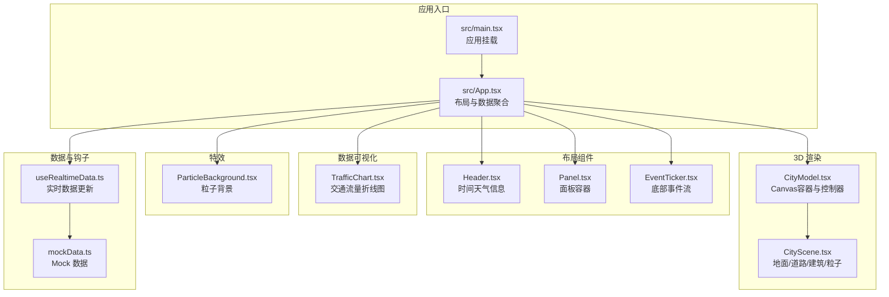
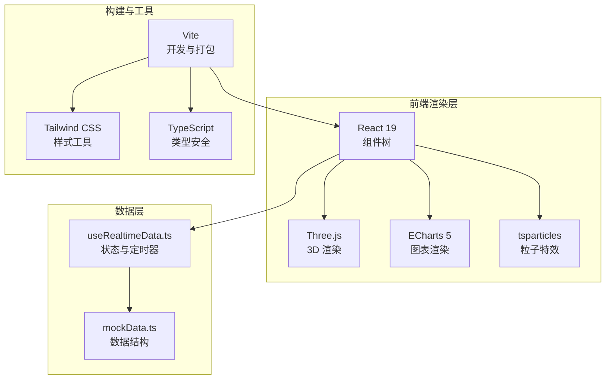
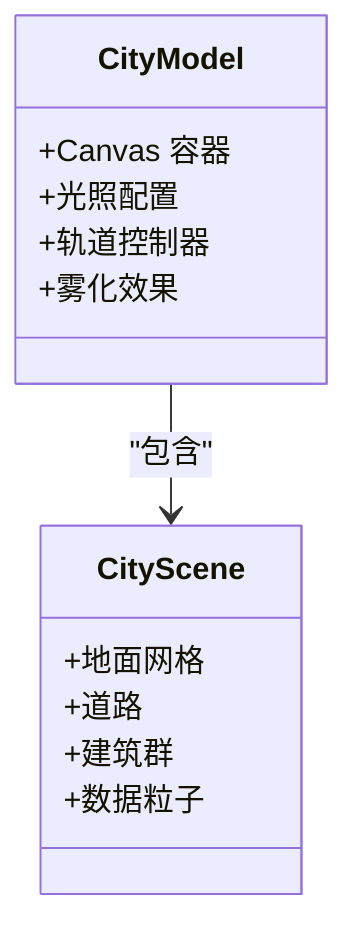
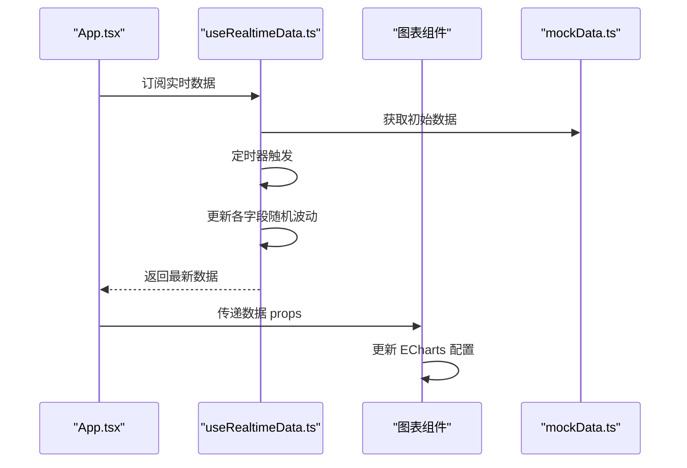
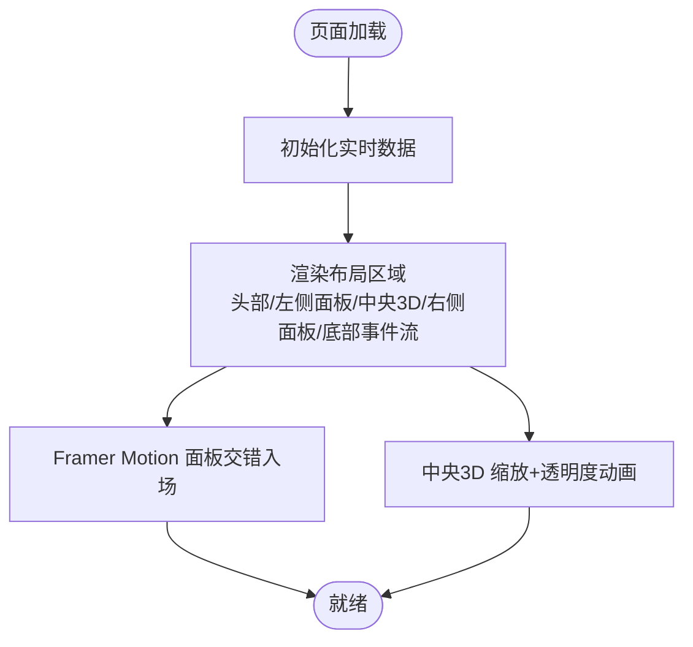
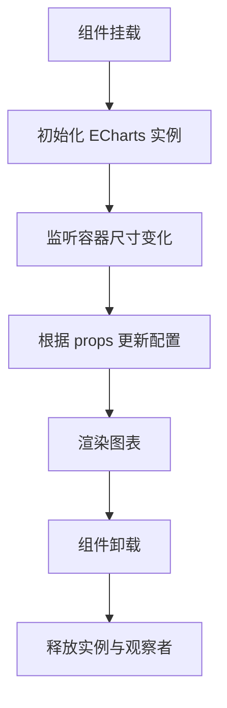
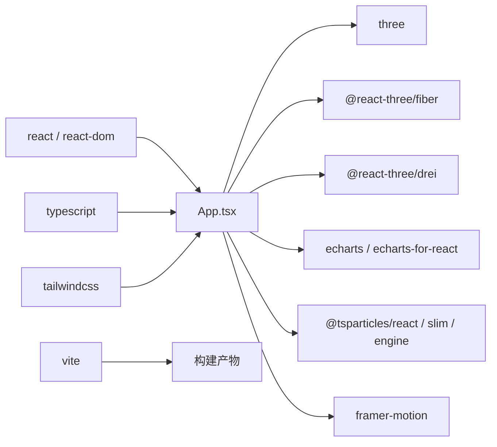

# 整体架构设计

<cite>
**本文档引用的文件**
- [README.md](file://README.md)
- [package.json](file://package.json)
- [vite.config.ts](file://vite.config.ts)
- [src/main.tsx](file://src/main.tsx)
- [src/App.tsx](file://src/App.tsx)
- [src/components/3d/CityModel.tsx](file://src/components/3d/CityModel.tsx)
- [src/components/3d/CityScene.tsx](file://src/components/3d/CityScene.tsx)
- [src/components/layout/Panel.tsx](file://src/components/layout/Panel.tsx)
- [src/components/layout/Header.tsx](file://src/components/layout/Header.tsx)
- [src/components/layout/EventTicker.tsx](file://src/components/layout/EventTicker.tsx)
- [src/components/charts/TrafficChart.tsx](file://src/components/charts/TrafficChart.tsx)
- [src/components/effects/ParticleBackground.tsx](file://src/components/effects/ParticleBackground.tsx)
- [src/hooks/useRealtimeData.ts](file://src/hooks/useRealtimeData.ts)
- [src/data/mockData.ts](file://src/data/mockData.ts)
</cite>

## 目录
1. [引言](#引言)
2. [项目结构](#项目结构)
3. [核心组件](#核心组件)
4. [架构总览](#架构总览)
5. [详细组件分析](#详细组件分析)
6. [依赖分析](#依赖分析)
7. [性能考虑](#性能考虑)
8. [故障排除指南](#故障排除指南)
9. [结论](#结论)
10. [附录](#附录)

## 引言
本项目是一个面向智慧城市数据孪生的大屏可视化系统，采用 React 19 + TypeScript + Vite 的现代前端技术栈，结合 Three.js 3D 场景渲染、ECharts 数据可视化与粒子特效，构建出沉浸式的赛博朋克风格控制中心界面。系统通过组件化架构、数据驱动设计与响应式布局策略，实现 3D 城市模型、实时交通/环境/能源/设备状态图表以及背景粒子与扫描线等视觉特效的统一呈现。

## 项目结构
项目采用按功能域划分的组件化目录结构，清晰分离布局、3D 场景、图表、特效与通用组件，便于维护与扩展。入口文件负责挂载根组件，根组件协调布局、3D 场景与数据可视化模块，形成“头部信息 + 两侧面板 + 中央3D场景 + 底部事件流”的全屏布局。

**图表来源**
- [src/main.tsx:1-11](file://src/main.tsx#L1-L11)
- [src/App.tsx:43-125](file://src/App.tsx#L43-L125)
- [src/components/3d/CityModel.tsx:6-49](file://src/components/3d/CityModel.tsx#L6-L49)
- [src/components/3d/CityScene.tsx:40-55](file://src/components/3d/CityScene.tsx#L40-L55)
- [src/components/layout/Panel.tsx:10-29](file://src/components/layout/Panel.tsx#L10-L29)
- [src/components/layout/Header.tsx:4-44](file://src/components/layout/Header.tsx#L4-L44)
- [src/components/layout/EventTicker.tsx:5-25](file://src/components/layout/EventTicker.tsx#L5-L25)
- [src/components/charts/TrafficChart.tsx:14-116](file://src/components/charts/TrafficChart.tsx#L14-L116)
- [src/components/effects/ParticleBackground.tsx:6-71](file://src/components/effects/ParticleBackground.tsx#L6-L71)
- [src/hooks/useRealtimeData.ts:15-72](file://src/hooks/useRealtimeData.ts#L15-L72)
- [src/data/mockData.ts:1-96](file://src/data/mockData.ts#L1-L96)

**章节来源**
- [README.md:49-71](file://README.md#L49-L71)
- [vite.config.ts:1-8](file://vite.config.ts#L1-L8)

## 核心组件
- 应用根组件：负责组织布局区域、引入背景特效与3D场景，并通过自定义 Hook 提供实时数据。
- 布局组件：Header 提供日期/时间/天气信息；Panel 提供统一的面板容器与装饰；EventTicker 展示底部滚动事件流。
- 3D 场景：CityModel 作为 Three.js Canvas 容器，集成光照、控制器与雾化效果；CityScene 组织地面网格、道路、建筑与数据粒子。
- 数据可视化：TrafficChart 使用 ECharts 初始化画布、监听尺寸变化并根据数据更新配置。
- 特效组件：ParticleBackground 基于 tsparticles 提供粒子背景与连线效果。
- 数据与钩子：useRealtimeData 提供定时更新的模拟数据；mockData 提供完整的数据结构。

**章节来源**
- [src/App.tsx:43-125](file://src/App.tsx#L43-L125)
- [src/components/layout/Header.tsx:4-44](file://src/components/layout/Header.tsx#L4-L44)
- [src/components/layout/Panel.tsx:10-29](file://src/components/layout/Panel.tsx#L10-L29)
- [src/components/layout/EventTicker.tsx:5-25](file://src/components/layout/EventTicker.tsx#L5-L25)
- [src/components/3d/CityModel.tsx:6-49](file://src/components/3d/CityModel.tsx#L6-L49)
- [src/components/3d/CityScene.tsx:40-55](file://src/components/3d/CityScene.tsx#L40-L55)
- [src/components/charts/TrafficChart.tsx:14-116](file://src/components/charts/TrafficChart.tsx#L14-L116)
- [src/components/effects/ParticleBackground.tsx:6-71](file://src/components/effects/ParticleBackground.tsx#L6-L71)
- [src/hooks/useRealtimeData.ts:15-72](file://src/hooks/useRealtimeData.ts#L15-L72)
- [src/data/mockData.ts:1-96](file://src/data/mockData.ts#L1-L96)

## 架构总览
系统采用“布局协调 + 数据驱动 + 多渲染引擎协同”的架构设计。React 负责视图与状态管理，Three.js 负责 3D 场景渲染，ECharts 负责二维图表渲染，tsparticles 负责背景粒子特效。数据通过自定义 Hook 在组件间共享，实现统一的数据流与更新节奏。

**图表来源**
- [package.json:12-26](file://package.json#L12-L26)
- [vite.config.ts:5-7](file://vite.config.ts#L5-L7)
- [src/hooks/useRealtimeData.ts:15-72](file://src/hooks/useRealtimeData.ts#L15-L72)
- [src/data/mockData.ts:1-96](file://src/data/mockData.ts#L1-L96)

## 详细组件分析

### 3D 城市模型架构
CityModel 作为 Three.js 的 Canvas 容器，配置相机、光照、雾化与自动旋转的轨道控制器；CityScene 组织地面网格、道路、建筑与数据粒子，形成城市骨架。该设计将场景构建与交互控制解耦，便于后续扩展更多几何体与材质。

**图表来源**
- [src/components/3d/CityModel.tsx:6-49](file://src/components/3d/CityModel.tsx#L6-L49)
- [src/components/3d/CityScene.tsx:40-55](file://src/components/3d/CityScene.tsx#L40-L55)

**章节来源**
- [src/components/3d/CityModel.tsx:6-49](file://src/components/3d/CityModel.tsx#L6-L49)
- [src/components/3d/CityScene.tsx:40-55](file://src/components/3d/CityScene.tsx#L40-L55)

### 数据驱动的实时更新流程
useRealtimeData 通过定时器周期性更新交通、环境、能源与设备状态数据，App 将这些数据注入到对应的图表与面板组件中，形成闭环的数据驱动展示。

**图表来源**
- [src/App.tsx:44](file://src/App.tsx#L44)
- [src/hooks/useRealtimeData.ts:15-72](file://src/hooks/useRealtimeData.ts#L15-L72)
- [src/data/mockData.ts:1-96](file://src/data/mockData.ts#L1-L96)

**章节来源**
- [src/App.tsx:44](file://src/App.tsx#L44)
- [src/hooks/useRealtimeData.ts:15-72](file://src/hooks/useRealtimeData.ts#L15-L72)
- [src/data/mockData.ts:1-96](file://src/data/mockData.ts#L1-L96)

### 响应式布局与动画编排
App 通过 Framer Motion 对左右侧面板进行交错入场动画，对中央3D场景进行缩放与透明度动画，配合 Panel 组件的统一装饰，形成层次分明的视觉节奏。Header 与 EventTicker 分别承担顶部信息与底部动态提示，整体布局适配 1920x1080 及以上分辨率。

**图表来源**
- [src/App.tsx:43-125](file://src/App.tsx#L43-L125)
- [src/components/layout/Panel.tsx:10-29](file://src/components/layout/Panel.tsx#L10-L29)
- [src/components/layout/Header.tsx:4-44](file://src/components/layout/Header.tsx#L4-L44)
- [src/components/layout/EventTicker.tsx:5-25](file://src/components/layout/EventTicker.tsx#L5-L25)

**章节来源**
- [src/App.tsx:43-125](file://src/App.tsx#L43-L125)
- [src/components/layout/Panel.tsx:10-29](file://src/components/layout/Panel.tsx#L10-L29)
- [src/components/layout/Header.tsx:4-44](file://src/components/layout/Header.tsx#L4-L44)
- [src/components/layout/EventTicker.tsx:5-25](file://src/components/layout/EventTicker.tsx#L5-L25)

### 数据可视化组件（以交通流量为例）
TrafficChart 使用 ECharts 初始化画布并在组件卸载时清理实例，同时监听容器尺寸变化以保证图表自适应。它根据传入的交通数据动态设置图例、坐标轴、系列与渐变填充，实现流畅的动画更新。

**图表来源**
- [src/components/charts/TrafficChart.tsx:14-116](file://src/components/charts/TrafficChart.tsx#L14-L116)

**章节来源**
- [src/components/charts/TrafficChart.tsx:14-116](file://src/components/charts/TrafficChart.tsx#L14-L116)

### 特效组件（粒子背景）
ParticleBackground 延迟初始化 tsparticles，在 Canvas 上绘制彩色粒子并启用连接线效果，通过样式属性控制层级与指针事件，确保不影响交互。

**章节来源**
- [src/components/effects/ParticleBackground.tsx:6-71](file://src/components/effects/ParticleBackground.tsx#L6-L71)

## 依赖分析
系统依赖围绕 React 生态与三大渲染引擎展开：@react-three/fiber 与 @react-three/drei 提供 Three.js 的 React 包装；echarts 与 echarts-for-react 提供图表能力；tsparticles 提供粒子特效；Vite + Tailwind CSS 提供构建与样式工具链。

**图表来源**
- [package.json:12-26](file://package.json#L12-L26)
- [vite.config.ts:5-7](file://vite.config.ts#L5-L7)

**章节来源**
- [package.json:12-26](file://package.json#L12-L26)
- [vite.config.ts:5-7](file://vite.config.ts#L5-L7)

## 性能考虑
- 3D 场景优化：合理设置相机参数与控制器范围，避免过度缩放；使用抗锯齿与透明背景减少视觉噪点；在移动端可降低粒子数量与连接距离。
- 图表性能：ECharts 使用 canvas 渲染器，适合大数据量；通过 ResizeObserver 控制重绘频率，避免频繁 resize 导致的抖动。
- 实时数据更新：useRealtimeData 的定时器间隔需平衡流畅度与资源占用；建议在后台标签页或低性能设备上降低更新频率。
- 资源懒加载：粒子库按需加载，仅在需要时初始化，减少首屏开销。
- 构建优化：Vite 默认开启预构建与按需打包，Tailwind CSS 通过 purge 优化样式体积。

## 故障排除指南
- 3D 场景不显示：检查 Canvas 容器尺寸是否正确设置，确认 Suspense 回退逻辑与光照配置。
- 图表空白或不更新：确认 ECharts 实例已初始化且容器存在；检查 props 是否变化；确保卸载时正确 dispose。
- 粒子特效无响应：确认 tsparticles 已完成初始化后再渲染组件；检查样式 z-index 与 pointer-events 设置。
- 实时数据不刷新：检查定时器是否被清理；确认数据更新函数未被 useCallback 依赖污染。
- 构建错误：确认 Vite 插件顺序与 Tailwind 配置一致；检查 TypeScript 类型声明与路径映射。

**章节来源**
- [src/components/3d/CityModel.tsx:6-49](file://src/components/3d/CityModel.tsx#L6-L49)
- [src/components/charts/TrafficChart.tsx:14-116](file://src/components/charts/TrafficChart.tsx#L14-L116)
- [src/components/effects/ParticleBackground.tsx:6-71](file://src/components/effects/ParticleBackground.tsx#L6-L71)
- [src/hooks/useRealtimeData.ts:15-72](file://src/hooks/useRealtimeData.ts#L15-L72)
- [vite.config.ts:5-7](file://vite.config.ts#L5-L7)

## 结论
本项目通过 React 组件化架构与 Three.js/ECharts/tsparticles 的多渲染引擎协同，实现了智慧城市数据孪生大屏的高保真可视化方案。系统以数据驱动为核心，结合响应式布局与动画编排，既满足了控制中心的沉浸式体验需求，又具备良好的扩展性与可维护性。后续可在 3D 材质优化、图表交互增强与数据源对接等方面进一步深化。

## 附录
- 技术栈选择理由：React 19 提供稳定的生态与并发特性；Three.js 与 @react-three/* 降低 3D 开发门槛；ECharts 5 兼容性强、社区完善；tsparticles 提供轻量级粒子效果；Vite/Tailwind 提升开发与构建效率。
- 系统边界：前端应用边界内包含所有渲染逻辑与数据处理；外部数据源通过 Hook 注入；3D/图表渲染引擎独立于业务逻辑，便于替换与升级。
- 扩展性设计：组件按功能域拆分，接口稳定；数据层通过 Hook 解耦；3D/图表/特效均可独立扩展；支持接入真实后端数据与 WebSocket 实时推送。