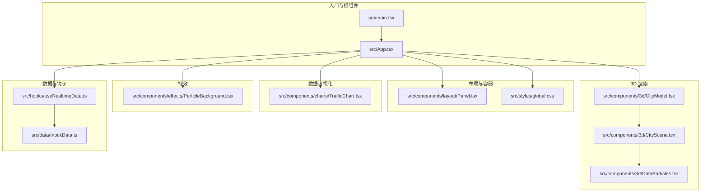
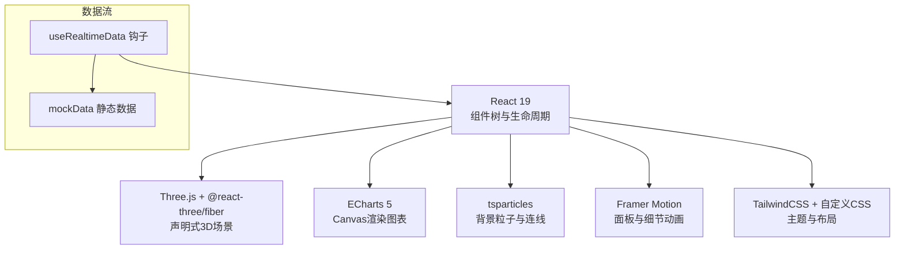
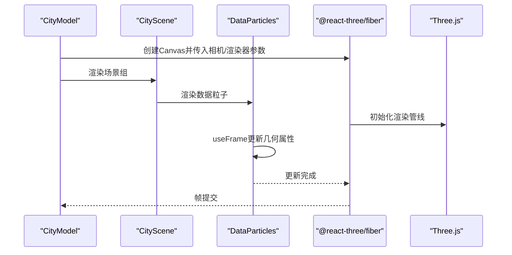
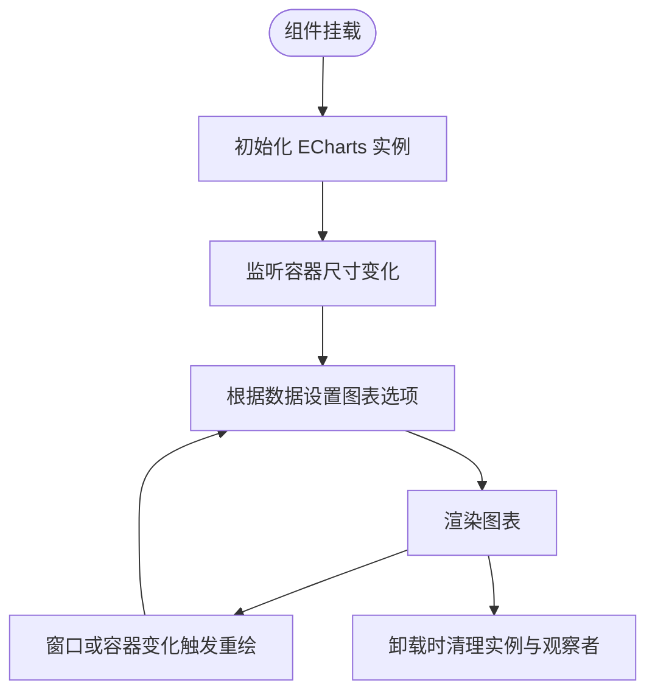
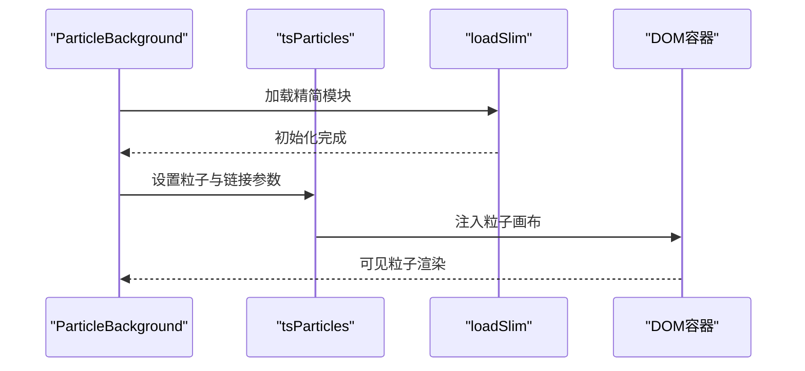
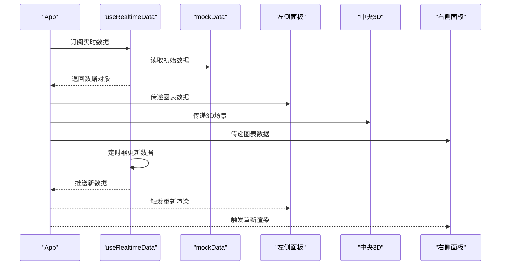
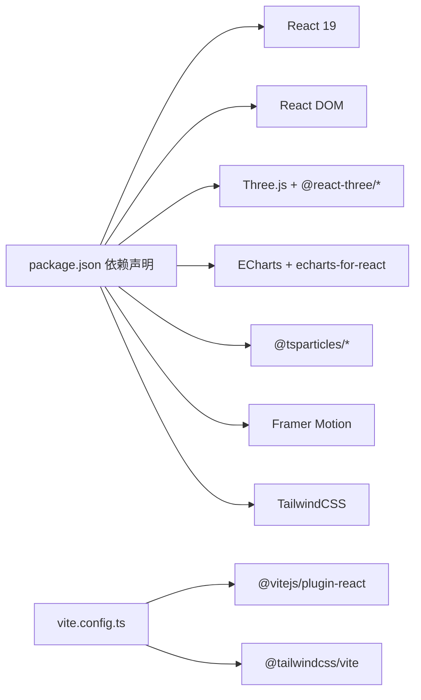

# 架构设计

<cite>
**本文引用的文件**
- [README.md](file://README.md)
- [package.json](file://package.json)
- [src/main.tsx](file://src/main.tsx)
- [src/App.tsx](file://src/App.tsx)
- [src/styles/global.css](file://src/styles/global.css)
- [src/hooks/useRealtimeData.ts](file://src/hooks/useRealtimeData.ts)
- [src/data/mockData.ts](file://src/data/mockData.ts)
- [src/components/3d/CityModel.tsx](file://src/components/3d/CityModel.tsx)
- [src/components/3d/CityScene.tsx](file://src/components/3d/CityScene.tsx)
- [src/components/3d/DataParticles.tsx](file://src/components/3d/DataParticles.tsx)
- [src/components/charts/TrafficChart.tsx](file://src/components/charts/TrafficChart.tsx)
- [src/components/effects/ParticleBackground.tsx](file://src/components/effects/ParticleBackground.tsx)
- [src/components/layout/Panel.tsx](file://src/components/layout/Panel.tsx)
- [src/components/common/NumberFlip.tsx](file://src/components/common/NumberFlip.tsx)
- [vite.config.ts](file://vite.config.ts)
</cite>

## 目录
1. [引言](#引言)
2. [项目结构](#项目结构)
3. [核心组件](#核心组件)
4. [架构总览](#架构总览)
5. [详细组件分析](#详细组件分析)
6. [依赖关系分析](#依赖关系分析)
7. [性能考虑](#性能考虑)
8. [故障排查指南](#故障排查指南)
9. [结论](#结论)
10. [附录](#附录)

## 引言
本项目是一个智慧城市数据孪生大屏，采用 React 19 + TypeScript + Vite 技术栈，结合 Three.js 3D 场景、ECharts 数据可视化与 tsparticles 粒子特效，构建出沉浸式、高动态感的城市运行态势展示界面。系统通过统一的布局网格划分区域，左侧与右侧放置各类数据面板，中央为 3D 城市模型，底部为事件滚动条，顶部为标题栏；同时配合背景粒子、扫描线等视觉特效，营造赛博朋克风格的科技视觉体验。

## 项目结构
项目采用按功能域分层的目录组织方式：
- 组件层：layout（布局）、charts（图表）、3d（3D场景）、effects（特效）、common（通用组件）
- 数据层：mockData 提供静态演示数据
- 钩子层：useRealtimeData 提供实时数据更新逻辑
- 样式层：global.css 定义全局网格布局与主题样式
- 构建层：Vite 插件集成 React 与 TailwindCSS

**图表来源**
- [src/main.tsx:1-11](file://src/main.tsx#L1-L11)
- [src/App.tsx:1-128](file://src/App.tsx#L1-L128)
- [src/styles/global.css:1-92](file://src/styles/global.css#L1-L92)
- [src/hooks/useRealtimeData.ts:1-73](file://src/hooks/useRealtimeData.ts#L1-L73)
- [src/data/mockData.ts:1-96](file://src/data/mockData.ts#L1-L96)
- [src/components/3d/CityModel.tsx:1-50](file://src/components/3d/CityModel.tsx#L1-L50)
- [src/components/3d/CityScene.tsx:1-56](file://src/components/3d/CityScene.tsx#L1-L56)
- [src/components/3d/DataParticles.tsx:1-76](file://src/components/3d/DataParticles.tsx#L1-L76)
- [src/components/charts/TrafficChart.tsx:1-117](file://src/components/charts/TrafficChart.tsx#L1-L117)
- [src/components/effects/ParticleBackground.tsx:1-72](file://src/components/effects/ParticleBackground.tsx#L1-L72)

**章节来源**
- [README.md:49-71](file://README.md#L49-L71)
- [vite.config.ts:1-8](file://vite.config.ts#L1-L8)

## 核心组件
- 应用根组件 App：负责布局装配、动画编排、实时数据注入与组件组合
- 布局容器 Panel：提供统一的面板头部装饰与内容区域，支持自定义类名扩展
- 3D 城市模型 CityModel：承载 Three.js Canvas，配置光源、控制器与雾化效果
- 3D 场景 CityScene：组织地面网格、道路、建筑与数据粒子
- 数据粒子 DataParticles：基于 BufferGeometry 的高性能点阵动画
- ECharts 图表 TrafficChart：折线图与指标展示，支持响应式与主题样式
- 粒子背景 ParticleBackground：tsparticles 背景粒子与连线效果
- 实时数据钩子 useRealtimeData：定时更新多维业务指标，模拟实时数据流
- 全局样式 global.css：网格布局与赛博朋克主题样式

**章节来源**
- [src/App.tsx:43-125](file://src/App.tsx#L43-L125)
- [src/components/layout/Panel.tsx:10-27](file://src/components/layout/Panel.tsx#L10-L27)
- [src/components/3d/CityModel.tsx:6-47](file://src/components/3d/CityModel.tsx#L6-L47)
- [src/components/3d/CityScene.tsx:40-53](file://src/components/3d/CityScene.tsx#L40-L53)
- [src/components/3d/DataParticles.tsx:7-73](file://src/components/3d/DataParticles.tsx#L7-L73)
- [src/components/charts/TrafficChart.tsx:14-114](file://src/components/charts/TrafficChart.tsx#L14-L114)
- [src/components/effects/ParticleBackground.tsx:6-69](file://src/components/effects/ParticleBackground.tsx#L6-L69)
- [src/hooks/useRealtimeData.ts:15-72](file://src/hooks/useRealtimeData.ts#L15-L72)
- [src/styles/global.css:49-92](file://src/styles/global.css#L49-L92)

## 架构总览
系统采用“布局装配 + 组件组合 + 数据驱动”的前端架构模式。React 19 提供稳定的渲染与并发能力，Three.js 通过 @react-three/fiber 将 3D 场景声明式地嵌入到 React 生命周期中；ECharts 以 Canvas 渲染器实现高性能图表；tsparticles 提供轻量级粒子系统；Framer Motion 负责面板入场与细节动画；TailwindCSS 与自定义 CSS 共同实现主题化与响应式布局。

**图表来源**
- [package.json:12-26](file://package.json#L12-L26)
- [src/App.tsx:1-128](file://src/App.tsx#L1-L128)
- [src/hooks/useRealtimeData.ts:15-72](file://src/hooks/useRealtimeData.ts#L15-L72)
- [src/data/mockData.ts:1-96](file://src/data/mockData.ts#L1-L96)

## 详细组件分析

### 3D 渲染架构（Three.js + @react-three/fiber）
- 场景装配：CityModel 作为 Canvas 容器，配置相机、抗锯齿与透明背景，并挂载光源、星空背景、OrbitControls 与 Fog。CityScene 组织地面网格、道路、建筑与数据粒子，形成城市骨架。
- 数据驱动动画：DataParticles 使用 BufferGeometry 与 useFrame 在每帧更新顶点位置，实现沿 X/Z 轴循环移动的粒子流，配合 AdditiveBlending 实现发光叠加效果。
- 性能要点：批量分配 Float32Array，避免逐帧重建几何属性；通过 useFrame 控制渲染循环，仅在需要时更新几何属性。

**图表来源**
- [src/components/3d/CityModel.tsx:9-29](file://src/components/3d/CityModel.tsx#L9-L29)
- [src/components/3d/CityScene.tsx:40-53](file://src/components/3d/CityScene.tsx#L40-L53)
- [src/components/3d/DataParticles.tsx:38-51](file://src/components/3d/DataParticles.tsx#L38-L51)

**章节来源**
- [src/components/3d/CityModel.tsx:6-47](file://src/components/3d/CityModel.tsx#L6-L47)
- [src/components/3d/CityScene.tsx:40-53](file://src/components/3d/CityScene.tsx#L40-L53)
- [src/components/3d/DataParticles.tsx:7-73](file://src/components/3d/DataParticles.tsx#L7-L73)

### ECharts 数据可视化架构
- 组件职责：TrafficChart 接收时间序列数据，初始化 ECharts 实例，注册 ResizeObserver 监听容器尺寸变化，动态设置主题与选项。
- 主题与样式：采用深色背景与科技蓝主色调，透明半透提示框与渐变填充，确保在暗色背景下突出数据趋势。
- 动画与交互：启用平滑曲线与区域填充动画，支持坐标轴与图例的细粒度样式控制。

**图表来源**
- [src/components/charts/TrafficChart.tsx:18-30](file://src/components/charts/TrafficChart.tsx#L18-L30)
- [src/components/charts/TrafficChart.tsx:32-87](file://src/components/charts/TrafficChart.tsx#L32-L87)

**章节来源**
- [src/components/charts/TrafficChart.tsx:14-114](file://src/components/charts/TrafficChart.tsx#L14-L114)

### 粒子特效系统（tsparticles）
- 背景粒子：ParticleBackground 使用 loadSlim 按需加载引擎，配置颜色、链接、运动、密度与透明度，实现星云般的粒子背景与近邻连线。
- 性能策略：限制帧率、使用 Retina 检测与不可交互的指针事件，降低对主渲染的干扰。

**图表来源**
- [src/components/effects/ParticleBackground.tsx:9-11](file://src/components/effects/ParticleBackground.tsx#L9-L11)
- [src/components/effects/ParticleBackground.tsx:16-67](file://src/components/effects/ParticleBackground.tsx#L16-L67)

**章节来源**
- [src/components/effects/ParticleBackground.tsx:6-69](file://src/components/effects/ParticleBackground.tsx#L6-L69)

### 布局与状态管理
- 布局装配：App 通过 Framer Motion 的 variants 与 staggerChildren 实现面板级入场动画与交错显示；全局 CSS 使用 CSS Grid 划分头部、左右侧、中央与底部区域。
- 状态管理：useRealtimeData 提供集中式定时更新逻辑，返回交通、环境、能耗、设备与告警等数据对象，由各子组件按需消费。
- 数据来源：mockData 提供完整的历史与当前值，便于演示与调试。

**图表来源**
- [src/App.tsx:43-125](file://src/App.tsx#L43-L125)
- [src/hooks/useRealtimeData.ts:15-72](file://src/hooks/useRealtimeData.ts#L15-L72)
- [src/data/mockData.ts:1-96](file://src/data/mockData.ts#L1-96)

**章节来源**
- [src/App.tsx:43-125](file://src/App.tsx#L43-L125)
- [src/hooks/useRealtimeData.ts:15-72](file://src/hooks/useRealtimeData.ts#L15-L72)
- [src/styles/global.css:49-92](file://src/styles/global.css#L49-L92)

### React 19 新特性在项目中的应用
- 并发渲染与优先级：项目采用 React 19，利用其并发渲染能力提升复杂场景下的首屏与更新性能，尤其在 3D 场景与大量图表同时渲染时受益明显。
- 严格模式与根渲染：main.tsx 使用 StrictMode 包裹根节点，有助于在开发阶段发现副作用问题；fiber 根据 React 19 的更新策略进行更高效的调度。
- 动画与布局：Framer Motion 的 variants 与 staggerChildren 在 React 19 下表现稳定，确保面板入场与交错动画流畅。

**章节来源**
- [src/main.tsx:1-11](file://src/main.tsx#L1-L11)
- [package.json:22-23](file://package.json#L22-L23)

## 依赖关系分析
- 运行时依赖：React 19、React DOM、Three.js、@react-three/fiber、@react-three/drei、ECharts、echarts-for-react、tsparticles、framer-motion、tailwindcss。
- 开发依赖：Vite、@vitejs/plugin-react、@tailwindcss/vite、TypeScript、ESLint 及相关插件。
- 构建配置：Vite 集成 React 与 TailwindCSS 插件，保证开发与生产构建的一致性。

**图表来源**
- [package.json:12-26](file://package.json#L12-L26)
- [package.json:27-40](file://package.json#L27-L40)
- [vite.config.ts:1-8](file://vite.config.ts#L1-L8)

**章节来源**
- [package.json:12-40](file://package.json#L12-L40)
- [vite.config.ts:1-8](file://vite.config.ts#L1-L8)

## 性能考虑
- 3D 渲染优化
  - 使用 BufferGeometry 与 Float32Array 批量分配顶点数据，减少 GC 压力
  - useFrame 仅在必要时更新几何属性，避免每帧重建
  - 合理设置相机参数与雾化范围，控制可见面数量
- 图表渲染优化
  - ECharts 使用 Canvas 渲染器，适合大数据量折线图
  - ResizeObserver 监听容器尺寸变化，避免强制重排
- 粒子系统优化
  - 限制帧率与粒子数量，关闭不可见区域的渲染
  - 使用透明混合与深度写禁用，减少深度缓冲开销
- 动画与布局
  - Framer Motion 的 staggerChildren 与 variants 减少不必要的重排
  - CSS Grid 布局避免复杂定位计算，提升渲染性能

[本节为通用性能建议，无需特定文件引用]

## 故障排查指南
- 3D 场景不显示
  - 检查 Canvas 容器尺寸是否正确，确保父元素具有明确的高度与宽度
  - 确认光源与相机位置合理，避免全黑或全白场景
- 图表渲染异常
  - 确保容器存在且可测量，检查 ResizeObserver 是否被正确清理
  - 核对 ECharts 初始化参数与主题配置
- 粒子系统卡顿
  - 降低粒子数量与帧率上限，检查链接距离与透明度设置
  - 确认指针事件被禁用，避免与用户交互产生额外开销
- 实时数据不更新
  - 检查定时器是否正常启动与清理
  - 确认数据更新逻辑未被条件分支阻断

**章节来源**
- [src/components/3d/CityModel.tsx:9-29](file://src/components/3d/CityModel.tsx#L9-L29)
- [src/components/charts/TrafficChart.tsx:18-30](file://src/components/charts/TrafficChart.tsx#L18-L30)
- [src/components/effects/ParticleBackground.tsx:16-67](file://src/components/effects/ParticleBackground.tsx#L16-L67)
- [src/hooks/useRealtimeData.ts:66-69](file://src/hooks/useRealtimeData.ts#L66-L69)

## 结论
本项目通过 React 19 的并发渲染能力与 Three.js、ECharts、tsparticles 等生态工具，构建了高动态、高沉浸感的智慧城市数据孪生大屏。整体架构清晰、组件职责明确、数据流自上而下，具备良好的可维护性与扩展性。后续可在真实数据接入、性能监控与跨端适配方面进一步完善。

[本节为总结性内容，无需特定文件引用]

## 附录
- 技术栈与功能特性概览可参考项目说明与快速开始章节
- 项目结构与设计风格详见 README 与全局样式

**章节来源**
- [README.md:1-71](file://README.md#L1-L71)
- [src/styles/global.css:1-92](file://src/styles/global.css#L1-L92)