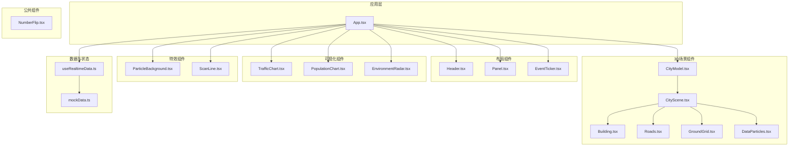
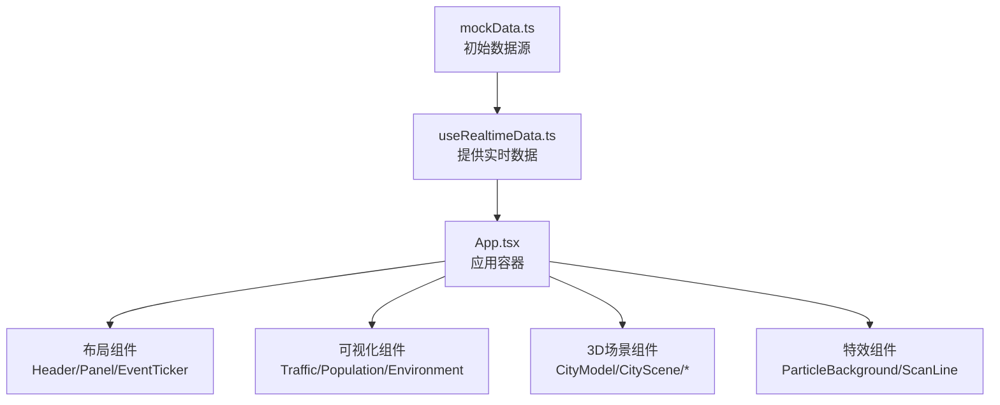
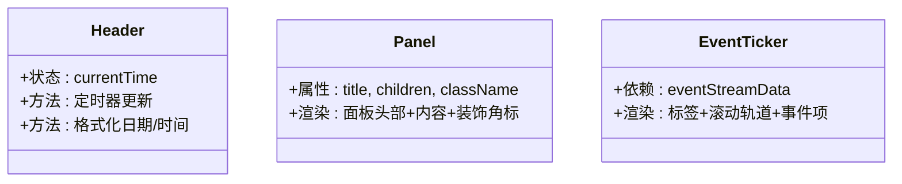
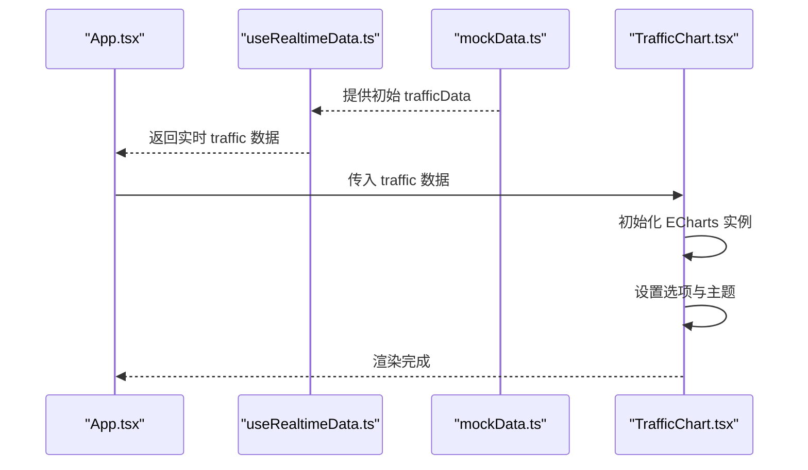
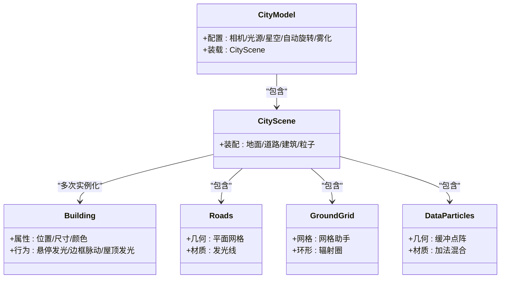
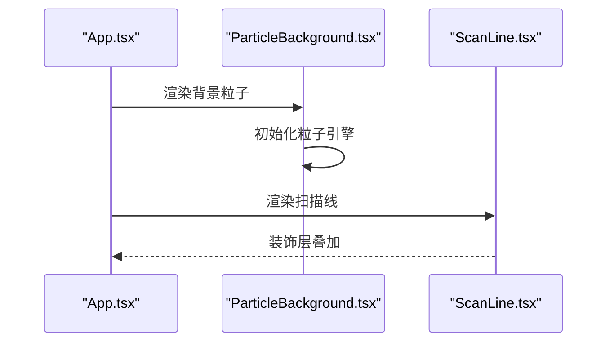
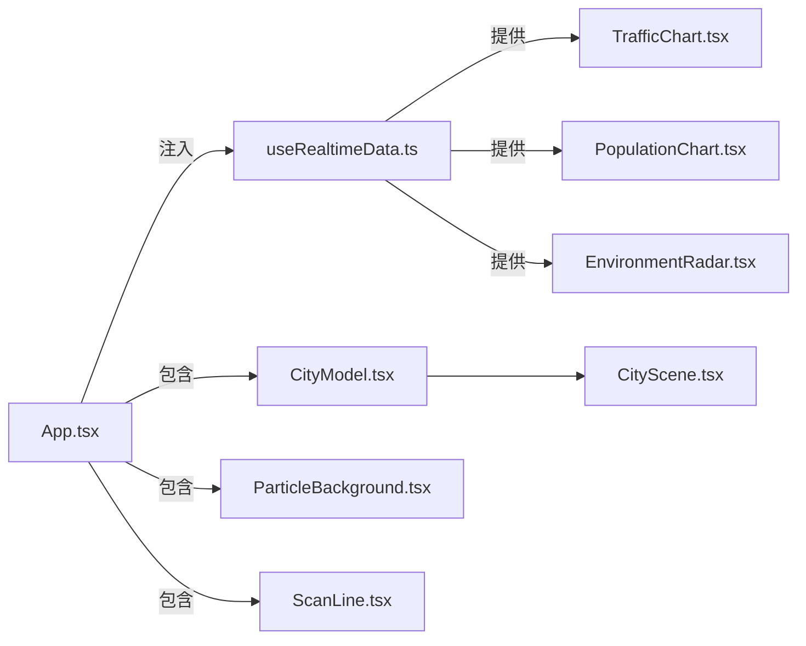

# 组件架构设计

<cite>
**本文引用的文件**
- [src/App.tsx](file://src/App.tsx)
- [src/hooks/useRealtimeData.ts](file://src/hooks/useRealtimeData.ts)
- [src/data/mockData.ts](file://src/data/mockData.ts)
- [src/components/layout/Header.tsx](file://src/components/layout/Header.tsx)
- [src/components/layout/Panel.tsx](file://src/components/layout/Panel.tsx)
- [src/components/layout/EventTicker.tsx](file://src/components/layout/EventTicker.tsx)
- [src/components/charts/TrafficChart.tsx](file://src/components/charts/TrafficChart.tsx)
- [src/components/charts/PopulationChart.tsx](file://src/components/charts/PopulationChart.tsx)
- [src/components/charts/EnvironmentRadar.tsx](file://src/components/charts/EnvironmentRadar.tsx)
- [src/components/3d/CityModel.tsx](file://src/components/3d/CityModel.tsx)
- [src/components/3d/CityScene.tsx](file://src/components/3d/CityScene.tsx)
- [src/components/3d/Building.tsx](file://src/components/3d/Building.tsx)
- [src/components/3d/Roads.tsx](file://src/components/3d/Roads.tsx)
- [src/components/3d/GroundGrid.tsx](file://src/components/3d/GroundGrid.tsx)
- [src/components/3d/DataParticles.tsx](file://src/components/3d/DataParticles.tsx)
- [src/components/effects/ParticleBackground.tsx](file://src/components/effects/ParticleBackground.tsx)
- [src/components/effects/ScanLine.tsx](file://src/components/effects/ScanLine.tsx)
- [src/components/common/NumberFlip.tsx](file://src/components/common/NumberFlip.tsx)
</cite>

## 目录
1. [引言](#引言)
2. [项目结构](#项目结构)
3. [核心组件](#核心组件)
4. [架构总览](#架构总览)
5. [详细组件分析](#详细组件分析)
6. [依赖分析](#依赖分析)
7. [性能考虑](#性能考虑)
8. [故障排查指南](#故障排查指南)
9. [结论](#结论)
10. [附录](#附录)

## 引言
本设计文档面向智慧城市数据孪生大屏项目，系统梳理组件层次结构、组件间通信机制与数据流向，重点解析以下模块：
- 布局组件系统：Header、Panel、EventTicker
- 数据可视化组件：TrafficChart、PopulationChart、EnvironmentRadar
- 3D场景组件：CityModel、CityScene、Building、Roads、GroundGrid、DataParticles
- 特效组件：ParticleBackground、ScanLine
- 公共组件：NumberFlip
- 数据与状态：useRealtimeData 与 mockData

目标是帮助开发者快速理解组件职责分离、接口设计与复用策略，并通过架构图与交互流程图把握组件协作关系与数据传递机制。

## 项目结构
项目采用按功能域分层的组织方式：
- 组件层：layout、charts、3d、effects、common
- 数据与状态：hooks、data
- 应用入口：App、main、index.css

图表来源
- [src/App.tsx:1-128](file://src/App.tsx#L1-L128)
- [src/components/3d/CityModel.tsx:1-50](file://src/components/3d/CityModel.tsx#L1-L50)
- [src/components/3d/CityScene.tsx:1-56](file://src/components/3d/CityScene.tsx#L1-L56)
- [src/hooks/useRealtimeData.ts:1-73](file://src/hooks/useRealtimeData.ts#L1-L73)
- [src/data/mockData.ts:1-96](file://src/data/mockData.ts#L1-L96)

章节来源
- [src/App.tsx:1-128](file://src/App.tsx#L1-L128)

## 核心组件
本节从职责、接口与复用策略三个维度，对关键组件进行概览式分析。

- 布局组件
  - Header：负责显示当前日期、时间、天气等信息，内部维护时钟定时器，提供简洁的只读展示能力。
  - Panel：通用面板容器，支持自定义标题与内容区域，提供统一的装饰元素与边角样式，便于在左右两侧快速拼装业务面板。
  - EventTicker：底部滚动事件流展示，基于静态 mock 数据实现无限循环滚动。

- 数据可视化组件
  - TrafficChart：基于 ECharts 的折线图，展示多路线的时序流量与拥堵指标；具备响应式尺寸与主题配色。
  - PopulationChart：基于 ECharts 的横向柱状图，展示各区域人口与流入/流出趋势；具备标签与渐变填充。
  - EnvironmentRadar：基于 ECharts 的雷达图，展示空气质量与气象指标；具备透明渐变与多维指标对比。

- 3D场景组件
  - CityModel：3D画布容器，集成相机、光源、星空背景、自动旋转控制与雾化效果；作为根容器承载整个场景。
  - CityScene：城市场景组合体，包含网格地面、道路、建筑群与数据粒子；负责场景装配与布局。
  - Building：单体建筑构件，支持悬停发光、边框脉动与屋顶发光点；可复用于不同位置与尺寸。
  - Roads：道路网格，使用平面几何与材质实现主干道与次干道及中心线发光。
  - GroundGrid：地面网格与中心环形光圈，配合淡入淡出动画增强空间感。
  - DataParticles：数据粒子系统，使用 BufferGeometry 与 AdditiveBlending 实现漂移动画。

- 特效组件
  - ParticleBackground：基于 @tsparticles 的背景粒子系统，支持链接、密度与透明度动画。
  - ScanLine：屏幕扫描线装饰层，提供 CRT 风格扫描效果。

- 公共组件
  - NumberFlip：数值翻转动画组件，支持缓动与后缀，适用于实时指标展示。

章节来源
- [src/components/layout/Header.tsx:1-45](file://src/components/layout/Header.tsx#L1-L45)
- [src/components/layout/Panel.tsx:1-30](file://src/components/layout/Panel.tsx#L1-L30)
- [src/components/layout/EventTicker.tsx:1-26](file://src/components/layout/EventTicker.tsx#L1-L26)
- [src/components/charts/TrafficChart.tsx:1-117](file://src/components/charts/TrafficChart.tsx#L1-L117)
- [src/components/charts/PopulationChart.tsx:1-97](file://src/components/charts/PopulationChart.tsx#L1-L97)
- [src/components/charts/EnvironmentRadar.tsx:1-108](file://src/components/charts/EnvironmentRadar.tsx#L1-L108)
- [src/components/3d/CityModel.tsx:1-50](file://src/components/3d/CityModel.tsx#L1-L50)
- [src/components/3d/CityScene.tsx:1-56](file://src/components/3d/CityScene.tsx#L1-L56)
- [src/components/3d/Building.tsx:1-66](file://src/components/3d/Building.tsx#L1-L66)
- [src/components/3d/Roads.tsx:1-47](file://src/components/3d/Roads.tsx#L1-L47)
- [src/components/3d/GroundGrid.tsx:1-46](file://src/components/3d/GroundGrid.tsx#L1-L46)
- [src/components/3d/DataParticles.tsx:1-76](file://src/components/3d/DataParticles.tsx#L1-L76)
- [src/components/effects/ParticleBackground.tsx:1-72](file://src/components/effects/ParticleBackground.tsx#L1-L72)
- [src/components/effects/ScanLine.tsx:1-9](file://src/components/effects/ScanLine.tsx#L1-L9)
- [src/components/common/NumberFlip.tsx:1-61](file://src/components/common/NumberFlip.tsx#L1-L61)

## 架构总览
下图展示了应用级组件的装配关系与数据流向，体现“状态驱动视图”的单向数据流。

图表来源
- [src/hooks/useRealtimeData.ts:1-73](file://src/hooks/useRealtimeData.ts#L1-L73)
- [src/data/mockData.ts:1-96](file://src/data/mockData.ts#L1-L96)
- [src/App.tsx:1-128](file://src/App.tsx#L1-L128)

章节来源
- [src/App.tsx:1-128](file://src/App.tsx#L1-L128)
- [src/hooks/useRealtimeData.ts:1-73](file://src/hooks/useRealtimeData.ts#L1-L73)

## 详细组件分析

### 布局组件系统
- Header
  - 职责：显示当前日期、星期、时间与天气；每秒更新一次。
  - 接口：无外部参数，内部管理本地状态与定时器。
  - 复用策略：纯展示组件，可直接复用到任何需要顶部信息栏的页面。
- Panel
  - 职责：提供统一的面板容器，支持自定义标题与内容区域；内置装饰元素与边角。
  - 接口：接收 title、children、className；通过 CSS 类名扩展样式。
  - 复用策略：作为业务面板的通用容器，适合在左右两侧快速拼装。
- EventTicker
  - 职责：底部滚动事件流展示，复制事件列表实现无缝循环。
  - 接口：无外部参数，依赖全局 mock 数据。
  - 复用策略：可替换事件源或调整滚动速度以适配不同场景。

图表来源
- [src/components/layout/Header.tsx:1-45](file://src/components/layout/Header.tsx#L1-L45)
- [src/components/layout/Panel.tsx:1-30](file://src/components/layout/Panel.tsx#L1-L30)
- [src/components/layout/EventTicker.tsx:1-26](file://src/components/layout/EventTicker.tsx#L1-L26)

章节来源
- [src/components/layout/Header.tsx:1-45](file://src/components/layout/Header.tsx#L1-L45)
- [src/components/layout/Panel.tsx:1-30](file://src/components/layout/Panel.tsx#L1-L30)
- [src/components/layout/EventTicker.tsx:1-26](file://src/components/layout/EventTicker.tsx#L1-L26)

### 数据可视化组件
- TrafficChart
  - 职责：展示多路线时序流量与拥堵指数、车流总数、平均速度；具备响应式与动画。
  - 接口：接收 data（包含 timestamps、routes、拥堵指数、总数、平均速度）。
  - 复用策略：可独立使用于任意容器，需确保容器具备明确宽高。
- PopulationChart
  - 职责：展示各区域人口数量与流入/流出趋势；具备标签格式化与渐变填充。
  - 接口：接收 data（包含 districts、总人口、流入、流出）。
  - 复用策略：适合横向柱状图场景，可调整颜色与标签格式。
- EnvironmentRadar
  - 职责：展示空气质量与气象指标的雷达图；具备透明渐变与多维指标对比。
  - 接口：接收 data（包含 indicators、AQI、温度、湿度、风向）。
  - 复用策略：可替换指标集以适配不同监测维度。

图表来源
- [src/App.tsx:1-128](file://src/App.tsx#L1-L128)
- [src/hooks/useRealtimeData.ts:1-73](file://src/hooks/useRealtimeData.ts#L1-L73)
- [src/data/mockData.ts:1-96](file://src/data/mockData.ts#L1-L96)
- [src/components/charts/TrafficChart.tsx:1-117](file://src/components/charts/TrafficChart.tsx#L1-L117)

章节来源
- [src/components/charts/TrafficChart.tsx:1-117](file://src/components/charts/TrafficChart.tsx#L1-L117)
- [src/components/charts/PopulationChart.tsx:1-97](file://src/components/charts/PopulationChart.tsx#L1-L97)
- [src/components/charts/EnvironmentRadar.tsx:1-108](file://src/components/charts/EnvironmentRadar.tsx#L1-L108)

### 3D场景组件
- CityModel
  - 职责：3D 画布容器，设置相机、光源、星空背景、自动旋转与雾化；作为根容器承载场景。
  - 接口：无外部参数，内部装配 CityScene。
  - 复用策略：可调整相机参数与光照强度以适配不同场景。
- CityScene
  - 职责：装配地面网格、道路、建筑群与数据粒子；集中管理场景布局。
  - 接口：无外部参数，内部组合多个子组件。
  - 复用策略：可替换建筑布局或粒子数量以优化性能。
- Building
  - 职责：单体建筑构件，支持悬停发光、边框脉动与屋顶发光点。
  - 接口：接收 position、width、height、depth、color。
  - 复用策略：可复用于不同位置与尺寸，适合程序化生成城市。
- Roads
  - 职责：主干道与次干道网格，配合中心线发光。
  - 接口：无外部参数。
  - 复用策略：可调整材质透明度与尺寸以适配不同尺度。
- GroundGrid
  - 职责：地面网格与中心环形光圈，配合淡入淡出动画。
  - 接口：无外部参数。
  - 复用策略：可调整颜色与透明度以匹配主题。
- DataParticles
  - 职责：数据粒子系统，使用 BufferGeometry 与 AdditiveBlending 实现漂移动画。
  - 接口：无外部参数。
  - 复用策略：可调整粒子数量与速度以平衡性能与视觉效果。

图表来源
- [src/components/3d/CityModel.tsx:1-50](file://src/components/3d/CityModel.tsx#L1-L50)
- [src/components/3d/CityScene.tsx:1-56](file://src/components/3d/CityScene.tsx#L1-L56)
- [src/components/3d/Building.tsx:1-66](file://src/components/3d/Building.tsx#L1-L66)
- [src/components/3d/Roads.tsx:1-47](file://src/components/3d/Roads.tsx#L1-L47)
- [src/components/3d/GroundGrid.tsx:1-46](file://src/components/3d/GroundGrid.tsx#L1-L46)
- [src/components/3d/DataParticles.tsx:1-76](file://src/components/3d/DataParticles.tsx#L1-L76)

章节来源
- [src/components/3d/CityModel.tsx:1-50](file://src/components/3d/CityModel.tsx#L1-L50)
- [src/components/3d/CityScene.tsx:1-56](file://src/components/3d/CityScene.tsx#L1-L56)
- [src/components/3d/Building.tsx:1-66](file://src/components/3d/Building.tsx#L1-L66)
- [src/components/3d/Roads.tsx:1-47](file://src/components/3d/Roads.tsx#L1-L47)
- [src/components/3d/GroundGrid.tsx:1-46](file://src/components/3d/GroundGrid.tsx#L1-L46)
- [src/components/3d/DataParticles.tsx:1-76](file://src/components/3d/DataParticles.tsx#L1-L76)

### 特效组件与公共组件
- ParticleBackground
  - 职责：背景粒子系统，支持链接、密度与透明度动画；初始化后全屏覆盖。
  - 接口：无外部参数。
  - 复用策略：可调整颜色、密度与链接距离以适配主题。
- ScanLine
  - 职责：屏幕扫描线装饰层，提供 CRT 风格扫描效果。
  - 接口：无外部参数。
  - 复用策略：可调整动画速度与透明度。
- NumberFlip
  - 职责：数值翻转动画组件，支持缓动与后缀；适用于实时指标展示。
  - 接口：接收 value、decimals、suffix、color、fontSize。
  - 复用策略：可复用到任意需要数值过渡的场景。

图表来源
- [src/App.tsx:1-128](file://src/App.tsx#L1-L128)
- [src/components/effects/ParticleBackground.tsx:1-72](file://src/components/effects/ParticleBackground.tsx#L1-L72)
- [src/components/effects/ScanLine.tsx:1-9](file://src/components/effects/ScanLine.tsx#L1-L9)

章节来源
- [src/components/effects/ParticleBackground.tsx:1-72](file://src/components/effects/ParticleBackground.tsx#L1-L72)
- [src/components/effects/ScanLine.tsx:1-9](file://src/components/effects/ScanLine.tsx#L1-L9)
- [src/components/common/NumberFlip.tsx:1-61](file://src/components/common/NumberFlip.tsx#L1-L61)

## 依赖分析
- 组件耦合
  - App 作为顶层容器，聚合布局、可视化、3D 与特效组件，形成清晰的职责边界。
  - CityModel 与 CityScene 存在强依赖关系，CityModel 负责画布配置，CityScene 负责场景装配。
  - 可视化组件均依赖 ECharts，且通过 props 接收数据，保持低耦合与高内聚。
- 数据流
  - useRealtimeData 提供实时数据，App 注入到各子组件；数据单向流动，避免状态回流。
  - mockData 作为初始数据源，支撑首次渲染与演示。
- 外部依赖
  - @react-three/fiber、@react-three/drei：3D 渲染与控制
  - three：3D 几何与材质
  - @tsparticles/react、@tsparticles/slim：粒子系统
  - framer-motion：布局动画
  - echarts：图表渲染

图表来源
- [src/App.tsx:1-128](file://src/App.tsx#L1-L128)
- [src/hooks/useRealtimeData.ts:1-73](file://src/hooks/useRealtimeData.ts#L1-L73)
- [src/components/3d/CityModel.tsx:1-50](file://src/components/3d/CityModel.tsx#L1-L50)
- [src/components/3d/CityScene.tsx:1-56](file://src/components/3d/CityScene.tsx#L1-L56)
- [src/components/effects/ParticleBackground.tsx:1-72](file://src/components/effects/ParticleBackground.tsx#L1-L72)
- [src/components/effects/ScanLine.tsx:1-9](file://src/components/effects/ScanLine.tsx#L1-L9)

章节来源
- [src/App.tsx:1-128](file://src/App.tsx#L1-L128)
- [src/hooks/useRealtimeData.ts:1-73](file://src/hooks/useRealtimeData.ts#L1-L73)

## 性能考虑
- 3D 场景
  - 使用 Suspense 与延迟加载减少首帧阻塞；合理设置相机距离与自动旋转速度。
  - DataParticles 使用缓冲几何与加法混合，注意在低端设备上降低粒子数量。
- 图表组件
  - ECharts 初始化与 ResizeObserver 监听需在卸载时清理，避免内存泄漏。
  - 动画时长与缓动函数应与刷新率匹配，避免掉帧。
- 背景特效
  - ParticleBackground 在全屏模式下可能影响性能，建议根据设备能力调整粒子密度与链接距离。
- 数据更新
  - useRealtimeData 的定时器频率需权衡实时性与性能；可在后台标签页降低更新频率。

## 故障排查指南
- 3D 场景不渲染
  - 检查 Canvas 容器是否具备明确宽高；确认 Suspense 回退逻辑。
  - 确认 Three.js 与 @react-three/fiber 版本兼容。
- 图表空白或尺寸异常
  - 确保容器具备固定宽高；检查 ResizeObserver 是否正确清理。
  - 确认 ECharts 实例在卸载时被 dispose。
- 实时数据不更新
  - 检查 useRealtimeData 的定时器是否正常执行；确认 interval 参数合理。
  - 确认 mockData 导出的数据结构与组件期望一致。
- 背景粒子不显示
  - 确认 ParticleBackground 初始化完成后再渲染；检查全屏与层级设置。

章节来源
- [src/components/3d/CityModel.tsx:1-50](file://src/components/3d/CityModel.tsx#L1-L50)
- [src/components/charts/TrafficChart.tsx:1-117](file://src/components/charts/TrafficChart.tsx#L1-L117)
- [src/hooks/useRealtimeData.ts:1-73](file://src/hooks/useRealtimeData.ts#L1-L73)
- [src/components/effects/ParticleBackground.tsx:1-72](file://src/components/effects/ParticleBackground.tsx#L1-L72)

## 结论
本项目通过清晰的组件分层与职责划分，实现了布局、可视化、3D 场景与特效的解耦组合。数据由 useRealtimeData 单向驱动，配合 mockData 提供初始值，确保了开发与演示的便利性。3D 场景与特效组件在保证视觉效果的同时，预留了性能优化空间。建议在实际部署中根据设备能力调整粒子数量、动画时长与图表渲染策略，以获得最佳体验。

## 附录
- 数据结构参考
  - 交通数据：包含时间戳数组、多路线数据、拥堵指数、车流总数、平均速度。
  - 人口数据：包含区域列表、总人口、流入与流出人数。
  - 环境数据：包含 PM2.5、PM10、温度、湿度、噪音、AQI、风速与风向、指标集合。
  - 能源数据：包含电力、水、燃气与太阳能的当前值、总量与趋势。
  - 设备数据：包含设备总数、在线数、离线数、告警数与分类统计。
  - 告警事件：包含告警级别、消息、时间与区域。
  - 实时事件流：字符串数组，用于底部滚动展示。

章节来源
- [src/data/mockData.ts:1-96](file://src/data/mockData.ts#L1-L96)