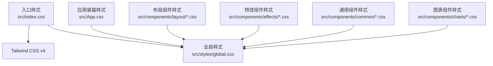
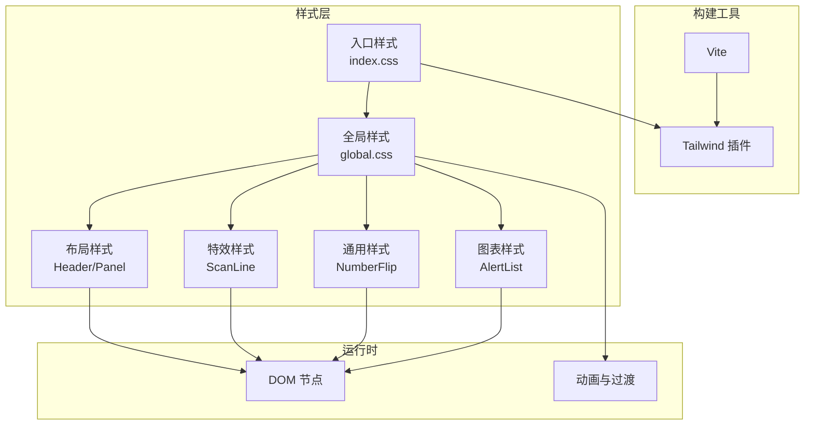
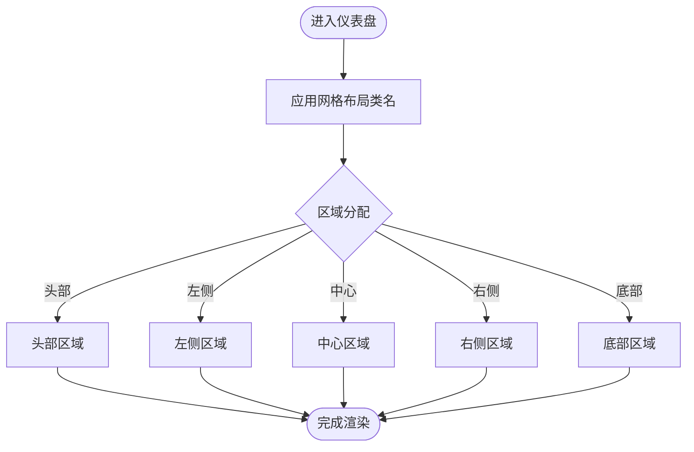
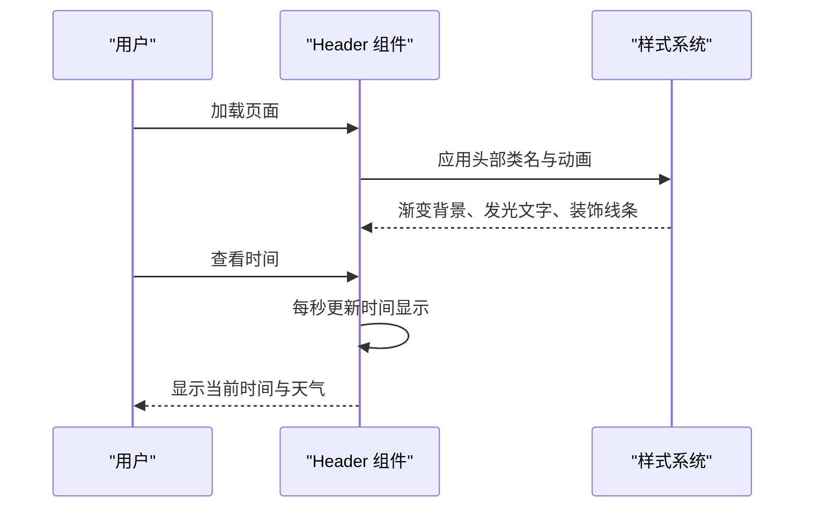
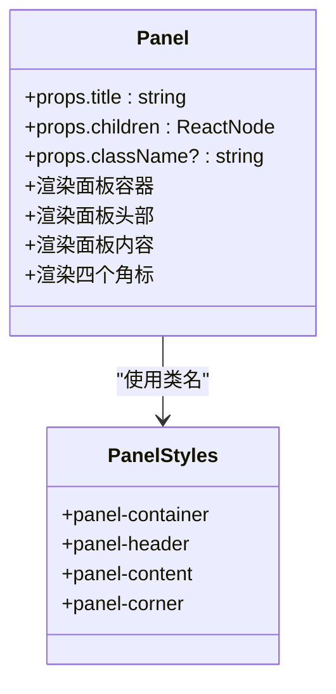
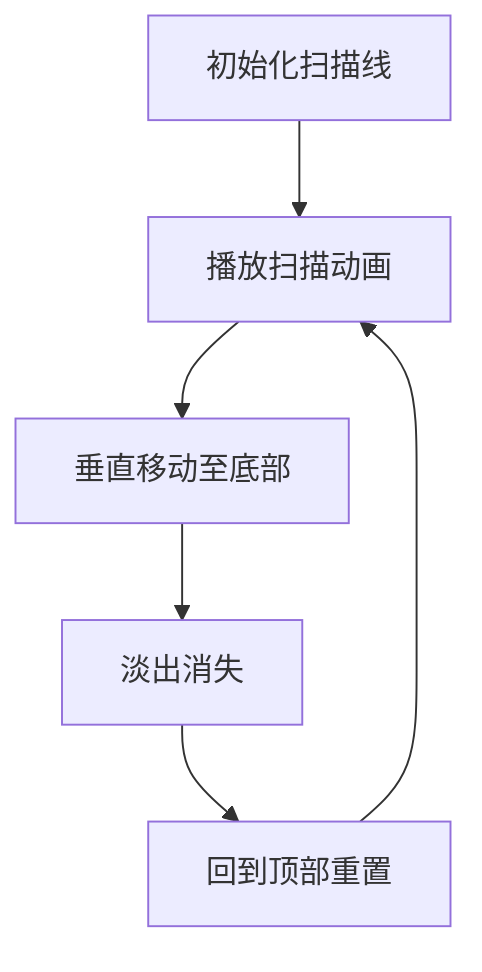
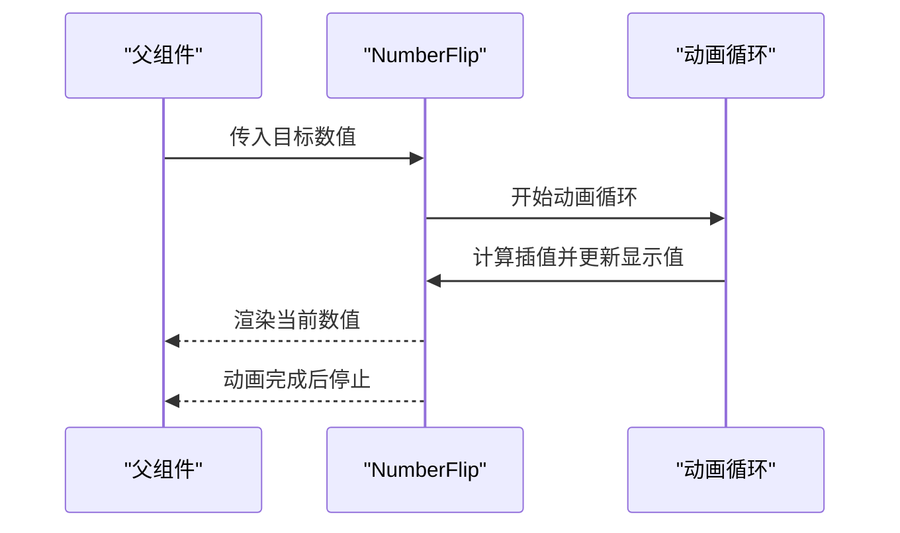
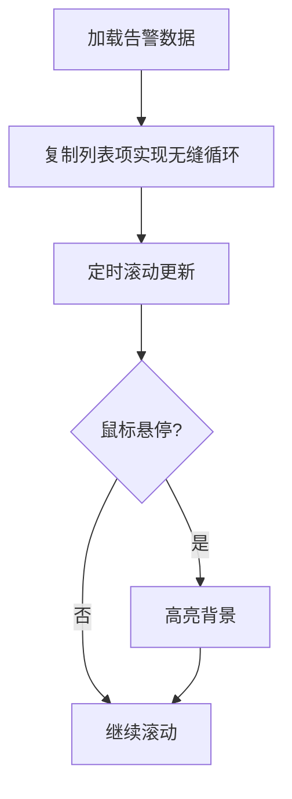
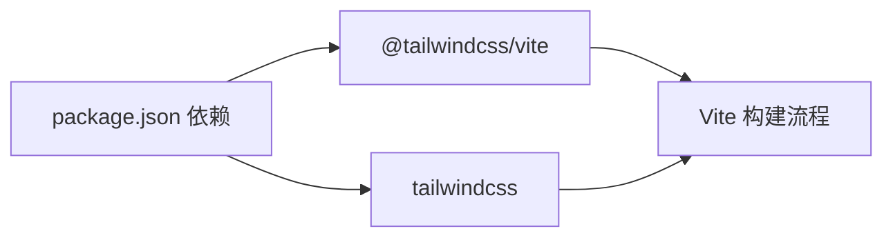

# 样式与主题系统

<cite>
**本文档引用的文件**
- [package.json](file://package.json)
- [vite.config.ts](file://vite.config.ts)
- [src/index.css](file://src/index.css)
- [src/styles/global.css](file://src/styles/global.css)
- [src/App.css](file://src/App.css)
- [src/components/layout/Header.css](file://src/components/layout/Header.css)
- [src/components/layout/Panel.css](file://src/components/layout/Panel.css)
- [src/components/effects/ScanLine.css](file://src/components/effects/ScanLine.css)
- [src/components/common/NumberFlip.css](file://src/components/common/NumberFlip.css)
- [src/components/charts/AlertList.css](file://src/components/charts/AlertList.css)
- [src/components/layout/Header.tsx](file://src/components/layout/Header.tsx)
- [src/components/layout/Panel.tsx](file://src/components/layout/Panel.tsx)
- [src/components/effects/ScanLine.tsx](file://src/components/effects/ScanLine.tsx)
- [src/components/common/NumberFlip.tsx](file://src/components/common/NumberFlip.tsx)
- [src/components/charts/AlertList.tsx](file://src/components/charts/AlertList.tsx)
</cite>

## 目录
1. [简介](#简介)
2. [项目结构](#项目结构)
3. [核心组件](#核心组件)
4. [架构总览](#架构总览)
5. [详细组件分析](#详细组件分析)
6. [依赖分析](#依赖分析)
7. [性能考虑](#性能考虑)
8. [故障排查指南](#故障排查指南)
9. [结论](#结论)
10. [附录](#附录)

## 简介
本项目为智慧城市数据孪生大屏的前端样式与主题系统，采用 Tailwind CSS v4 作为原子化样式框架，结合自定义 CSS 变量与赛博朋克风格主题，构建统一的视觉语言。样式组织遵循“全局样式 + 组件级样式”的分层结构，通过 Vite 插件集成 Tailwind，确保开发与构建流程顺畅。主题以深蓝紫调为主，强调霓虹光效、渐变与毛玻璃背景，配合扫描线、脉冲等动态效果，营造未来科技感。

## 项目结构
样式系统由三层组成：
- 全局入口：在入口 CSS 中引入 Tailwind 与全局样式，保证样式加载顺序与作用域边界清晰。
- 全局样式：集中定义基础排版、滚动条、动画与网格布局骨架。
- 组件样式：按功能模块拆分，如布局、特效、通用组件与图表，确保样式职责单一、可复用性强。

**图示来源**
- [src/index.css:1-3](file://src/index.css#L1-L3)
- [src/styles/global.css:1-92](file://src/styles/global.css#L1-L92)
- [src/App.css:1-40](file://src/App.css#L1-L40)

**章节来源**
- [src/index.css:1-3](file://src/index.css#L1-L3)
- [src/styles/global.css:1-92](file://src/styles/global.css#L1-L92)
- [src/App.css:1-40](file://src/App.css#L1-L40)

## 核心组件
- Tailwind CSS v4：通过 Vite 插件启用，提供原子化类名与响应式断点，减少手写 CSS 的体量。
- 全局样式（赛博朋克主题）：定义深色背景、渐变边框、发光文字、扫描线与脉冲动画等核心视觉元素。
- 组件样式：以模块化方式组织，覆盖头部、面板、扫描线、数字翻牌器、告警列表等，确保一致的视觉与交互体验。

**章节来源**
- [package.json:12-26](file://package.json#L12-L26)
- [vite.config.ts:1-8](file://vite.config.ts#L1-L8)
- [src/styles/global.css:1-92](file://src/styles/global.css#L1-L92)

## 架构总览
样式系统采用“插件驱动 + 分层样式”的架构：
- 构建阶段：Vite 启动 Tailwind 插件，解析原子化类名并生成优化后的 CSS。
- 运行时：全局样式定义基础骨架与主题变量；组件样式通过类名组合实现功能与外观。
- 动画与特效：通过全局动画与组件内动画协同，形成统一的动态视觉语言。

**图示来源**
- [vite.config.ts:1-8](file://vite.config.ts#L1-L8)
- [src/index.css:1-3](file://src/index.css#L1-L3)
- [src/styles/global.css:1-92](file://src/styles/global.css#L1-L92)
- [src/components/layout/Header.css:1-80](file://src/components/layout/Header.css#L1-L80)
- [src/components/layout/Panel.css:1-85](file://src/components/layout/Panel.css#L1-L85)
- [src/components/effects/ScanLine.css:1-20](file://src/components/effects/ScanLine.css#L1-L20)
- [src/components/common/NumberFlip.css:1-14](file://src/components/common/NumberFlip.css#L1-L14)
- [src/components/charts/AlertList.css:1-48](file://src/components/charts/AlertList.css#L1-L48)

## 详细组件分析

### 布局与网格骨架
- 全局网格布局：通过类名定义三列三行的仪表盘骨架，支持左右侧栏、中心内容区与底部信息区的定位与间距控制。
- 响应式断点：利用 Tailwind 断点在不同尺寸下调整布局密度与间距，确保在大屏设备上的可读性与信息密度平衡。

**图示来源**
- [src/styles/global.css:49-92](file://src/styles/global.css#L49-L92)

**章节来源**
- [src/styles/global.css:49-92](file://src/styles/global.css#L49-L92)

### 头部组件（Header）
- 视觉特征：渐变底色、发光时间、霓虹色标题与装饰线条，营造科技感与层次感。
- 动画与交互：标题文字渐变动画、时间显示的发光阴影、鼠标悬停时的背景过渡。
- 结构组织：左中右三段布局，中间标题使用渐变文本与动画位移，两侧展示日期、星期与天气信息。

**图示来源**
- [src/components/layout/Header.tsx:1-45](file://src/components/layout/Header.tsx#L1-L45)
- [src/components/layout/Header.css:1-80](file://src/components/layout/Header.css#L1-L80)

**章节来源**
- [src/components/layout/Header.tsx:1-45](file://src/components/layout/Header.tsx#L1-L45)
- [src/components/layout/Header.css:1-80](file://src/components/layout/Header.css#L1-L80)

### 面板组件（Panel）
- 毛玻璃背景：通过背景渐变与模糊滤镜实现半透明视觉，提升内容可读性。
- 边框与角标：使用细边框与发光角标强化面板边界，增强空间层次。
- 内容区自适应：内容区使用弹性布局与溢出隐藏，确保在不同尺寸下保持一致的阅读体验。

**图示来源**
- [src/components/layout/Panel.tsx:1-30](file://src/components/layout/Panel.tsx#L1-L30)
- [src/components/layout/Panel.css:1-85](file://src/components/layout/Panel.css#L1-L85)

**章节来源**
- [src/components/layout/Panel.tsx:1-30](file://src/components/layout/Panel.tsx#L1-L30)
- [src/components/layout/Panel.css:1-85](file://src/components/layout/Panel.css#L1-L85)

### 扫描线特效（ScanLine）
- 动画机制：固定定位的水平条带，使用线性渐变与阴影模拟扫描线的亮度变化，配合定时器实现从顶部到底部的循环移动。
- 层级与性能：设置较高 z-index 并禁用交互，避免影响内容操作；动画使用 CSS 关键帧，保证流畅度。

**图示来源**
- [src/components/effects/ScanLine.tsx:1-9](file://src/components/effects/ScanLine.tsx#L1-L9)
- [src/components/effects/ScanLine.css:1-20](file://src/components/effects/ScanLine.css#L1-L20)

**章节来源**
- [src/components/effects/ScanLine.tsx:1-9](file://src/components/effects/ScanLine.tsx#L1-L9)
- [src/components/effects/ScanLine.css:1-20](file://src/components/effects/ScanLine.css#L1-L20)

### 数字翻牌器（NumberFlip）
- 数值动画：通过 requestAnimationFrame 实现平滑的数值插值动画，支持小数位数与后缀配置。
- 视觉效果：使用发光阴影与等宽字体，确保在高亮背景下具备良好的可读性与节奏感。

**图示来源**
- [src/components/common/NumberFlip.tsx:1-61](file://src/components/common/NumberFlip.tsx#L1-L61)
- [src/components/common/NumberFlip.css:1-14](file://src/components/common/NumberFlip.css#L1-L14)

**章节来源**
- [src/components/common/NumberFlip.tsx:1-61](file://src/components/common/NumberFlip.tsx#L1-L61)
- [src/components/common/NumberFlip.css:1-14](file://src/components/common/NumberFlip.css#L1-L14)

### 告警列表（AlertList）
- 滚动机制：双倍列表项实现无缝循环滚动，提升信息密度与连续性。
- 状态配色：根据告警级别动态计算徽章颜色与边框，确保视觉层级清晰。
- 交互细节：悬停时的背景过渡与滚动行为，增强可读性与反馈。

**图示来源**
- [src/components/charts/AlertList.tsx:1-65](file://src/components/charts/AlertList.tsx#L1-L65)
- [src/components/charts/AlertList.css:1-48](file://src/components/charts/AlertList.css#L1-L48)

**章节来源**
- [src/components/charts/AlertList.tsx:1-65](file://src/components/charts/AlertList.tsx#L1-L65)
- [src/components/charts/AlertList.css:1-48](file://src/components/charts/AlertList.css#L1-L48)

## 依赖分析
- Tailwind CSS v4：提供原子化类名与响应式断点，减少重复样式编写。
- @tailwindcss/vite：在 Vite 中启用 Tailwind，确保开发与生产环境的一致性。
- 浏览器兼容性：通过 CSS 渐变、伪元素与关键帧动画实现基础兼容；对现代浏览器进行优化。

**图示来源**
- [package.json:12-26](file://package.json#L12-L26)
- [vite.config.ts:1-8](file://vite.config.ts#L1-L8)

**章节来源**
- [package.json:12-26](file://package.json#L12-L26)
- [vite.config.ts:1-8](file://vite.config.ts#L1-L8)

## 性能考虑
- 动画性能：扫描线与标题渐变使用 CSS 关键帧，避免 JavaScript 动画带来的卡顿；数字翻牌器使用硬件加速的 transform 与 filter。
- 模糊与透明：面板的 backdrop-filter 与半透明背景需注意在低端设备上的性能影响，建议在低性能设备上降级或禁用。
- 滚动优化：告警列表的滚动通过定时器实现，建议在大数据量场景下增加节流或虚拟滚动策略。

## 故障排查指南
- 样式未生效
  - 检查入口样式是否正确引入 Tailwind 与全局样式。
  - 确认组件是否正确导入对应 CSS 文件。
- 动画异常
  - 检查关键帧名称是否冲突，确认动画时长与缓动函数设置合理。
- 毛玻璃效果不显示
  - 确认浏览器对 backdrop-filter 的支持情况，必要时提供降级方案。
- 滚动条样式无效
  - 确认浏览器内核对 ::-webkit-scrollbar 的支持，或使用第三方滚动条库。

**章节来源**
- [src/index.css:1-3](file://src/index.css#L1-L3)
- [src/styles/global.css:17-29](file://src/styles/global.css#L17-L29)

## 结论
本样式与主题系统以 Tailwind CSS v4 为基础，结合全局赛博朋克主题与组件级样式模块化设计，实现了统一、可扩展且高性能的视觉体系。通过网格骨架、渐变边框、发光文字与扫描线等元素，构建了未来科技感十足的大屏界面。建议在后续迭代中进一步完善主题变量抽象、动画性能监控与跨浏览器兼容策略，以提升系统的可维护性与稳定性。

## 附录
- 主题色彩与视觉规范
  - 主色调：深蓝背景与霓虹蓝边框，强调科技感与层次感。
  - 文字与图标：使用高对比度浅灰文字，确保在深色背景下清晰可读。
  - 动画与过渡：统一使用缓动曲线与持续时间，保证交互一致性。
- 主题定制指南
  - 使用 CSS 变量抽象颜色与尺寸，便于快速切换主题。
  - 将常用样式封装为可复用的类名或组件，降低重复工作。
- 样式扩展方法
  - 新增组件样式时，优先复用现有类名与动画，避免新增复杂逻辑。
  - 对于复杂交互，建议通过状态管理与事件绑定实现，而非硬编码样式。
- 跨浏览器兼容性
  - 对关键动画与滤镜效果进行特性检测，提供降级方案。
  - 在低端设备上适当减少动画数量与复杂度，确保流畅度。