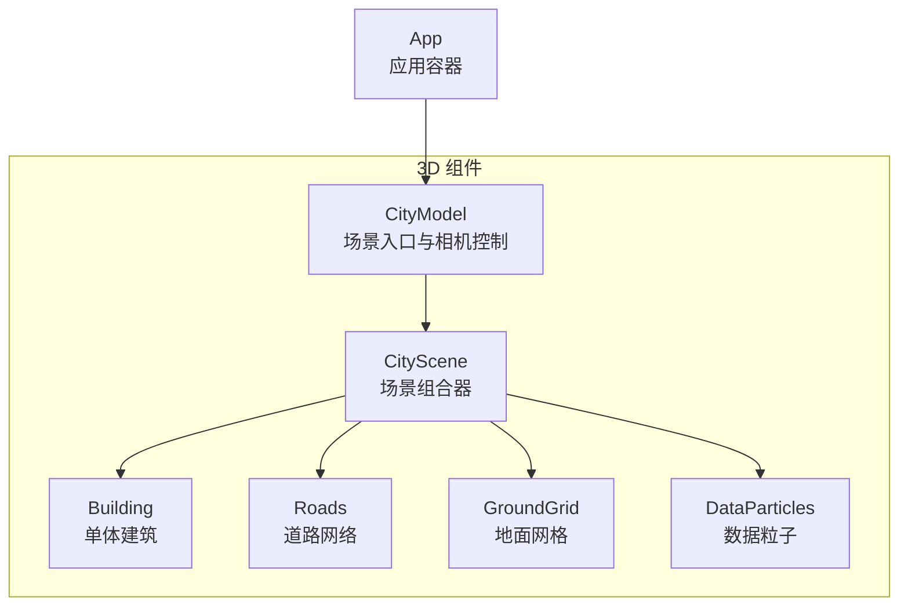
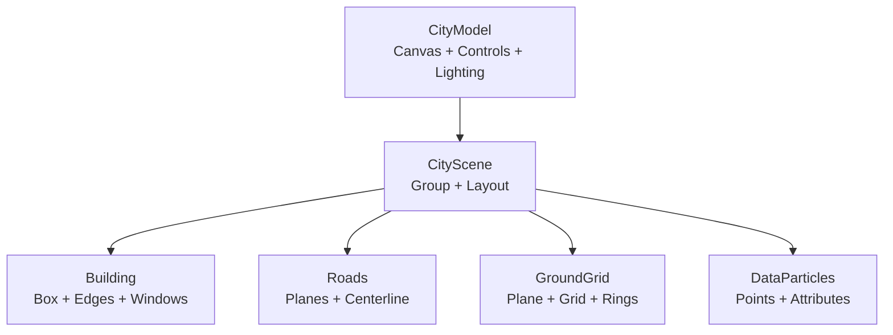
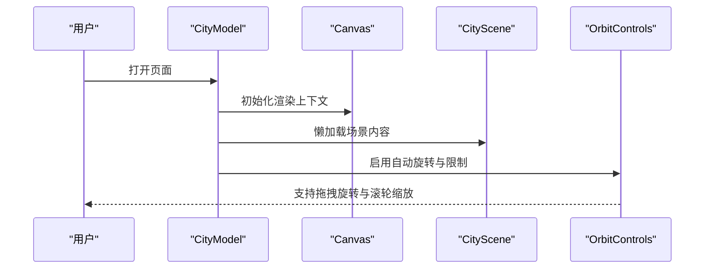
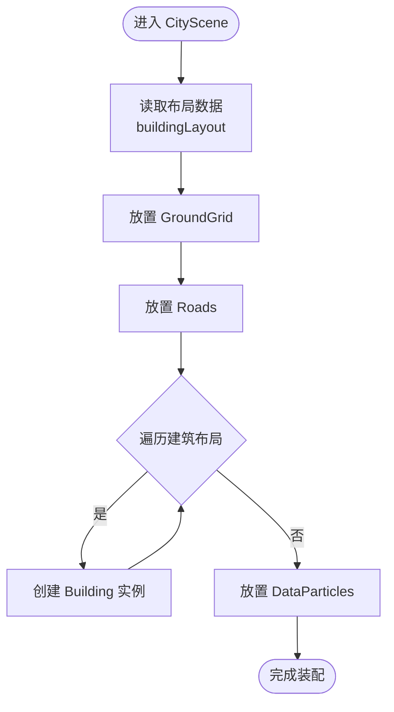
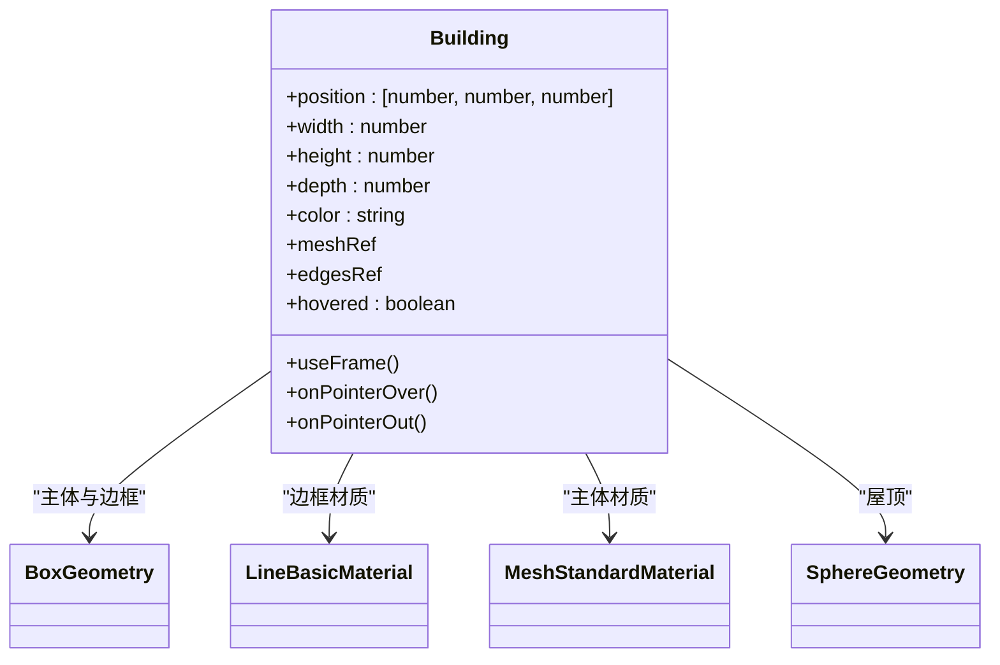
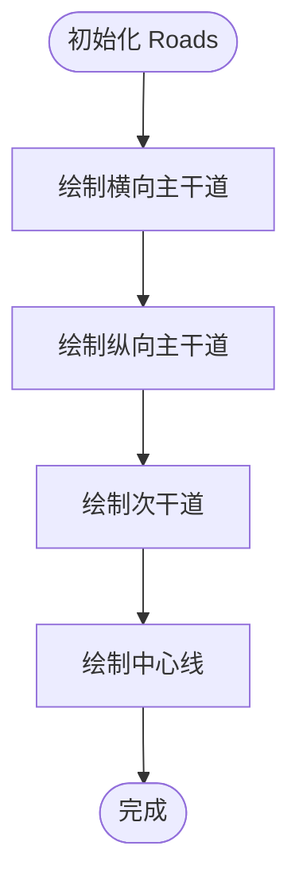
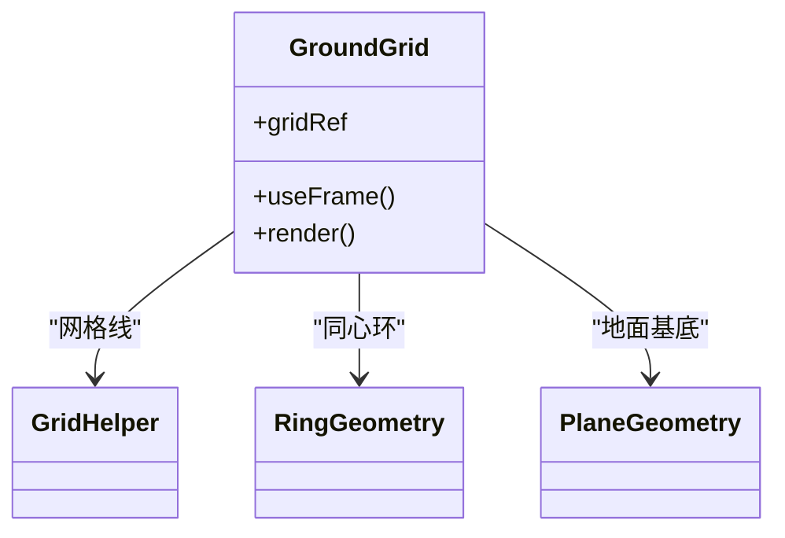
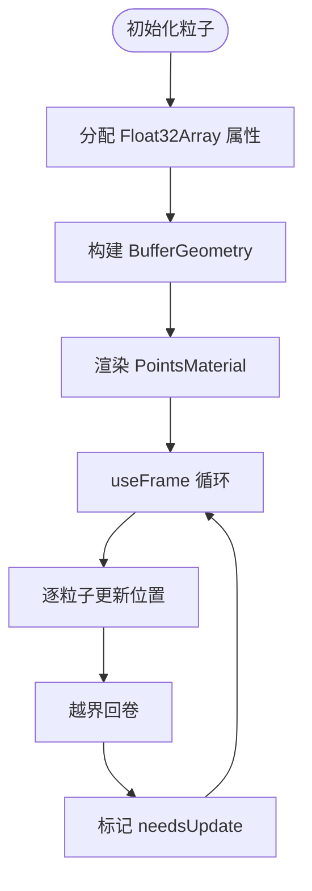
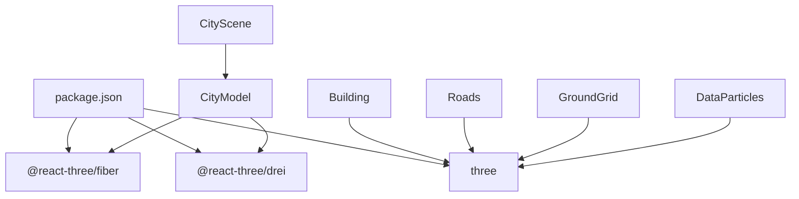

# 3D场景系统

<cite>
**本文档引用的文件**
- [CityModel.tsx](file://src/components/3d/CityModel.tsx)
- [CityScene.tsx](file://src/components/3d/CityScene.tsx)
- [Building.tsx](file://src/components/3d/Building.tsx)
- [Roads.tsx](file://src/components/3d/Roads.tsx)
- [GroundGrid.tsx](file://src/components/3d/GroundGrid.tsx)
- [DataParticles.tsx](file://src/components/3d/DataParticles.tsx)
- [index.ts](file://src/components/3d/index.ts)
- [App.tsx](file://src/App.tsx)
- [package.json](file://package.json)
- [README.md](file://README.md)
- [useRealtimeData.ts](file://src/hooks/useRealtimeData.ts)
- [mockData.ts](file://src/data/mockData.ts)
- [main.tsx](file://src/main.tsx)
- [vite.config.ts](file://vite.config.ts)
- [tsconfig.json](file://tsconfig.json)
</cite>

## 目录
1. [简介](#简介)
2. [项目结构](#项目结构)
3. [核心组件](#核心组件)
4. [架构总览](#架构总览)
5. [详细组件分析](#详细组件分析)
6. [依赖关系分析](#依赖关系分析)
7. [性能考虑](#性能考虑)
8. [故障排除指南](#故障排除指南)
9. [结论](#结论)
10. [附录](#附录)

## 简介
本项目是一个基于 React + TypeScript 的智慧城市数据孪生可视化大屏，采用 Three.js + @react-three/fiber + @react-three/drei 构建 3D 场景系统。系统包含城市模型、实时数据图表、粒子特效等丰富的交互与视觉效果。本文档聚焦于 3D 场景系统的架构设计与实现细节，涵盖 CityModel 城市模型组件的整体架构与场景管理、CityScene 场景生成的几何体构建与材质系统、Building 建筑物组件的 LOD 技术与纹理映射、Roads 道路网络的几何生成与路径算法、GroundGrid 地面网格的坐标系统与光照计算、DataParticles 数据粒子系统的实时渲染与性能优化，并提供 Three.js 集成方案、@react-three/fiber 使用指南与交互控制实现。

## 项目结构
3D 场景系统位于 src/components/3d 目录下，采用按功能模块划分的组织方式：
- CityModel：3D 场景入口与相机控制
- CityScene：场景组合器，负责建筑物、道路、地面网格与数据粒子的装配
- Building：单体建筑几何体与材质，支持悬停发光与周期性闪烁
- Roads：道路网络几何体，包括主干道、次干道与中心线
- GroundGrid：地面网格与中心辐射环，支持透明度周期性波动
- DataParticles：数据驱动的粒子系统，支持 X/Z 轴方向运动与混合渲染
- index：3D 组件导出入口

**图表来源**
- [CityModel.tsx:1-50](file://src/components/3d/CityModel.tsx#L1-L50)
- [CityScene.tsx:1-56](file://src/components/3d/CityScene.tsx#L1-L56)
- [Building.tsx:1-66](file://src/components/3d/Building.tsx#L1-L66)
- [Roads.tsx:1-47](file://src/components/3d/Roads.tsx#L1-L47)
- [GroundGrid.tsx:1-46](file://src/components/3d/GroundGrid.tsx#L1-L46)
- [DataParticles.tsx:1-76](file://src/components/3d/DataParticles.tsx#L1-L76)
- [App.tsx:1-128](file://src/App.tsx#L1-L128)

**章节来源**
- [README.md:49-63](file://README.md#L49-L63)
- [package.json:12-26](file://package.json#L12-L26)

## 核心组件
本节对 3D 场景系统的核心组件进行深入分析，重点说明其职责、数据结构与处理逻辑。

- CityModel：作为 3D 场景的根组件，负责初始化 Canvas、光源、星空背景、OrbitControls 与雾效，并通过 Suspense 提供加载兜底。该组件还提供交互提示层，增强用户体验。
- CityScene：场景装配器，集中管理建筑物布局、道路网络、地面网格与数据粒子。通过静态布局数组生成建筑实例，统一挂载到 Group 下，便于后续场景管理与动画更新。
- Building：单体建筑组件，使用 BoxGeometry 生成立方体主体，配合 LineSegments 显示发光边框，顶部添加发光球体，墙体以细条模拟窗户效果。支持悬停高亮与周期性闪烁，体现动态视觉反馈。
- Roads：道路网络由多个平面几何体构成，横向与纵向主干道以及周边次干道，均通过 meshBasicMaterial 实现半透明蓝色材质与中心线发光效果。
- GroundGrid：地面由平面几何体与 GridHelper 组成，支持透明度周期性波动；中心辐射环使用环形几何体叠加多层不同透明度的环，营造空间引导感。
- DataParticles：基于 Points 几何体的粒子系统，预分配位置、速度、轴向与相位偏移，每帧更新位置并循环回卷，使用 AdditiveBlending 实现粒子叠加效果，提高视觉密度。

**章节来源**
- [CityModel.tsx:6-47](file://src/components/3d/CityModel.tsx#L6-L47)
- [CityScene.tsx:40-53](file://src/components/3d/CityScene.tsx#L40-L53)
- [Building.tsx:13-63](file://src/components/3d/Building.tsx#L13-L63)
- [Roads.tsx:3-43](file://src/components/3d/Roads.tsx#L3-L43)
- [GroundGrid.tsx:5-42](file://src/components/3d/GroundGrid.tsx#L5-L42)
- [DataParticles.tsx:7-73](file://src/components/3d/DataParticles.tsx#L7-L73)

## 架构总览
3D 场景系统采用“组件化装配 + 渲染管线”的架构模式。CityModel 作为渲染根节点，承载相机、光源与全局控制；CityScene 负责场景对象的组织与生命周期管理；各子组件独立负责几何体与材质，通过 React Three Fiber 的声明式语法在渲染循环中更新。

**图表来源**
- [CityModel.tsx:9-29](file://src/components/3d/CityModel.tsx#L9-L29)
- [CityScene.tsx:40-52](file://src/components/3d/CityScene.tsx#L40-L52)
- [Building.tsx:27-62](file://src/components/3d/Building.tsx#L27-L62)
- [Roads.tsx:5-42](file://src/components/3d/Roads.tsx#L5-L42)
- [GroundGrid.tsx:15-41](file://src/components/3d/GroundGrid.tsx#L15-L41)
- [DataParticles.tsx:53-72](file://src/components/3d/DataParticles.tsx#L53-L72)

## 详细组件分析

### CityModel：场景入口与交互控制
- 渲染根节点：Canvas 设置相机初始位置与视野，开启抗锯齿与透明背景，gl 参数启用 alpha。
- 光源体系：环境光、方向光与点光源共同作用，营造科技蓝与紫色的冷色系氛围；星空背景通过 Stars 实现。
- 控制器：OrbitControls 开启自动旋转，限制最大/最小距离与极角，关闭平移，确保场景始终聚焦中心。
- 雾效：fog 附加到场景，使用深色背景色，提升空间层次感。
- 加载兜底：Suspense 包裹 CityScene，避免资源加载导致的闪烁。

**图表来源**
- [CityModel.tsx:9-29](file://src/components/3d/CityModel.tsx#L9-L29)
- [CityModel.tsx:14-28](file://src/components/3d/CityModel.tsx#L14-L28)

**章节来源**
- [CityModel.tsx:6-47](file://src/components/3d/CityModel.tsx#L6-L47)

### CityScene：场景装配与布局管理
- 布局数据：buildingLayout 是程序化生成的城市布局，包含中心商业区、外围中等建筑与远郊矮建筑三组数据，每项包含位置、尺寸与颜色。
- 组织结构：CityScene 将 GroundGrid、Roads、Building 列表与 DataParticles 统一挂载到 Group 下，便于整体变换与动画更新。
- 动态性：通过数组映射生成建筑实例，支持后续从外部数据源注入布局。

**图表来源**
- [CityScene.tsx:8-38](file://src/components/3d/CityScene.tsx#L8-L38)
- [CityScene.tsx:40-52](file://src/components/3d/CityScene.tsx#L40-L52)

**章节来源**
- [CityScene.tsx:40-53](file://src/components/3d/CityScene.tsx#L40-L53)

### Building：几何体、材质与动态效果
- 几何体：主体使用 BoxGeometry，边框使用 EdgesGeometry 包装同一几何体生成 LineSegments，屋顶使用 SphereGeometry，窗户以细条 Mesh 模拟。
- 材质系统：主体使用 meshStandardMaterial，支持 Emissive 与透明度；边框使用 LineBasicMaterial；窗户使用低透明度 Basic 材质。
- 动画：useFrame 每帧更新边框材质透明度，形成呼吸感；悬停时切换高亮材质参数，增强交互反馈。
- 位置修正：建筑在 Y 轴向上偏移高度的一半，确保底部贴合地面。

**图表来源**
- [Building.tsx:13-63](file://src/components/3d/Building.tsx#L13-L63)

**章节来源**
- [Building.tsx:13-63](file://src/components/3d/Building.tsx#L13-L63)

### Roads：道路网络几何生成与路径算法
- 平面几何：主干道与次干道均使用 PlaneGeometry，通过旋转与平移实现横向与纵向布置。
- 材质：meshBasicMaterial 半透明蓝色，强调道路的科技感与通透性。
- 中心线：在主干道与次干道交叠处叠加更细的中心线，增强路径引导。
- 路径算法：当前实现为硬编码的几何体拼接，未见复杂路径规划算法；若需扩展，可在 CityScene 中引入路径数据结构与生成函数。

**图表来源**
- [Roads.tsx:6-41](file://src/components/3d/Roads.tsx#L6-L41)

**章节来源**
- [Roads.tsx:3-43](file://src/components/3d/Roads.tsx#L3-L43)

### GroundGrid：坐标系统与光照计算
- 地面：使用 PlaneGeometry 与 meshBasicMaterial 实现深色半透明平面，作为场景基底。
- 网格：GridHelper 在 XY 平面上绘制网格线，支持透明度周期性波动，增强空间层次。
- 辐射环：RingGeometry 生成同心圆环，多层叠加不同透明度，形成视觉焦点。
- 坐标系统：所有对象均以世界坐标原点为中心，Y 轴向上，符合 Three.js 默认约定；网格与环在 Y=0.01 与 0.015 处微偏，避免深度冲突。

**图表来源**
- [GroundGrid.tsx:5-42](file://src/components/3d/GroundGrid.tsx#L5-L42)

**章节来源**
- [GroundGrid.tsx:5-42](file://src/components/3d/GroundGrid.tsx#L5-L42)

### DataParticles：实时渲染与性能优化
- 粒子数量：固定 80 个粒子，平衡视觉密度与性能。
- 数据结构：positions、speeds、axes、offsets 四类属性，使用 Float32Array 存储，减少内存碎片。
- 更新策略：每帧仅更新 BufferAttribute 的位置数组，标记 needsUpdate，避免重建几何体。
- 运动轨迹：随机选择 X 或 Z 轴作为运动轴，超出边界后回卷至负边界，形成连续流动效果。
- 渲染特性：PointsMaterial 使用 AdditiveBlending 与 sizeAttenuation，提高远近一致性与叠加观感；禁用深度写入以保证混合顺序正确。

**图表来源**
- [DataParticles.tsx:10-36](file://src/components/3d/DataParticles.tsx#L10-L36)
- [DataParticles.tsx:38-51](file://src/components/3d/DataParticles.tsx#L38-L51)
- [DataParticles.tsx:53-72](file://src/components/3d/DataParticles.tsx#L53-L72)

**章节来源**
- [DataParticles.tsx:7-73](file://src/components/3d/DataParticles.tsx#L7-L73)

### Three.js 集成方案与 @react-three/fiber 使用指南
- 渲染器初始化：Canvas 作为渲染根节点，设置相机、抗锯齿与透明背景；gl 参数启用 alpha 以支持透明合成。
- 组件声明式：每个 Three.js 对象以 React 组件形式声明，自动纳入渲染循环；useFrame 用于每帧更新。
- 控制器与光源：OrbitControls 提供交互；AmbientLight、DirectionalLight、PointLight 与 Stars 构建多层次光照。
- 加载与错误处理：Suspense 提供加载兜底，避免资源未就绪导致的闪烁或空白。

**章节来源**
- [CityModel.tsx:9-29](file://src/components/3d/CityModel.tsx#L9-L29)
- [CityModel.tsx:14-28](file://src/components/3d/CityModel.tsx#L14-L28)

### 交互控制实现
- 相机控制：OrbitControls 启用自动旋转，限制最大/最小距离与极角，关闭平移，确保场景始终聚焦中心。
- 用户交互：鼠标拖拽旋转、滚轮缩放；悬停建筑高亮与闪烁，提供直观反馈。
- HUD 提示：底部装饰性提示层，显示交互说明，增强可用性。

**章节来源**
- [CityModel.tsx:20-27](file://src/components/3d/CityModel.tsx#L20-L27)
- [Building.tsx:18-23](file://src/components/3d/Building.tsx#L18-L23)

## 依赖关系分析
3D 场景系统依赖 Three.js 与 React Three 生态，核心依赖如下：
- three：3D 引擎与几何体、材质、渲染器基础能力
- @react-three/fiber：React 渲染器，将 Three.js 对象声明式化
- @react-three/drei：辅助控制器与工具（如 OrbitControls、Stars）

**图表来源**
- [package.json:12-26](file://package.json#L12-L26)
- [CityModel.tsx:1-3](file://src/components/3d/CityModel.tsx#L1-L3)

**章节来源**
- [package.json:12-26](file://package.json#L12-L26)

## 性能考虑
- 粒子系统：固定数量与 Float32Array 属性，每帧仅更新必要属性，避免重建几何体；使用 AdditiveBlending 与 sizeAttenuation 提升视觉质量。
- 几何体复用：边框线框通过 EdgesGeometry 包装同一几何体，减少重复顶点与索引。
- 材质透明度：半透明材质会增加混合成本，建议在不影响视觉的前提下降低透明度或减少数量。
- 动画更新：useFrame 仅更新必要属性并标记 needsUpdate，避免全量重算。
- 相机与控制：限制相机移动范围与自动旋转，减少不必要的渲染更新。

[本节为通用性能指导，不直接分析具体文件]

## 故障排除指南
- 场景空白或闪烁：检查 Canvas 初始化参数与 Suspense 加载兜底是否生效。
- 建筑不发光或闪烁异常：确认 useFrame 中材质透明度更新逻辑与时间参数。
- 粒子不移动：检查 useFrame 中位置更新与越界回卷逻辑，确保 needsUpdate 被正确设置。
- 光照异常：核对光源类型与强度，确保材质支持 Emissive 与透明度。
- 控制器无效：检查 OrbitControls 的启用状态与限制参数，确认未被其他组件覆盖。

**章节来源**
- [CityModel.tsx:14-28](file://src/components/3d/CityModel.tsx#L14-L28)
- [Building.tsx:18-23](file://src/components/3d/Building.tsx#L18-L23)
- [DataParticles.tsx:38-51](file://src/components/3d/DataParticles.tsx#L38-L51)

## 结论
本 3D 场景系统通过清晰的组件分层与声明式渲染，实现了城市模型的高效装配与动态表现。CityModel 提供稳定的渲染根节点与交互控制，CityScene 负责场景组织与布局管理，Building、Roads、GroundGrid 与 DataParticles 各司其职，共同构建出具有科技感与沉浸感的城市视图。系统在性能上注重轻量更新与属性复用，在交互上提供直观的反馈与引导。未来可进一步扩展为基于真实数据的动态布局与路径算法，以满足更复杂的智慧城市可视化需求。

[本节为总结性内容，不直接分析具体文件]

## 附录
- 应用入口：main.tsx 创建根节点并挂载 App。
- 应用容器：App 将 3D 城市模型嵌入仪表盘布局，结合实时数据钩子与图表组件。
- 构建配置：Vite 配置启用 React 与 Tailwind 插件，TypeScript 配置拆分为应用与 Node 环境两套。

**章节来源**
- [main.tsx:1-11](file://src/main.tsx#L1-L11)
- [App.tsx:43-93](file://src/App.tsx#L43-L93)
- [vite.config.ts:1-8](file://vite.config.ts#L1-L8)
- [tsconfig.json:1-8](file://tsconfig.json#L1-L8)