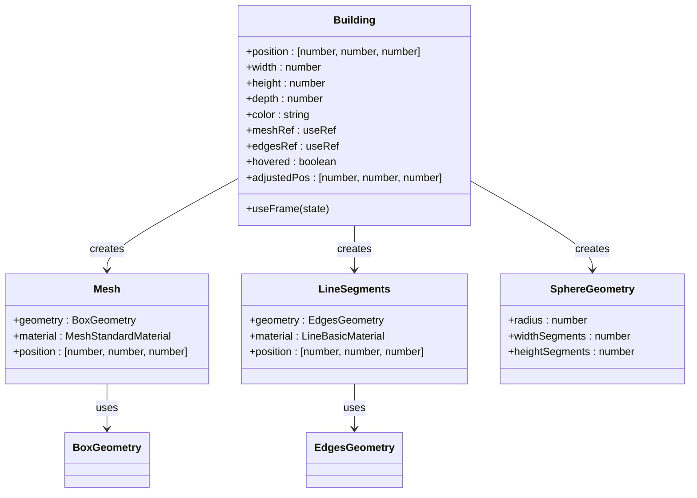
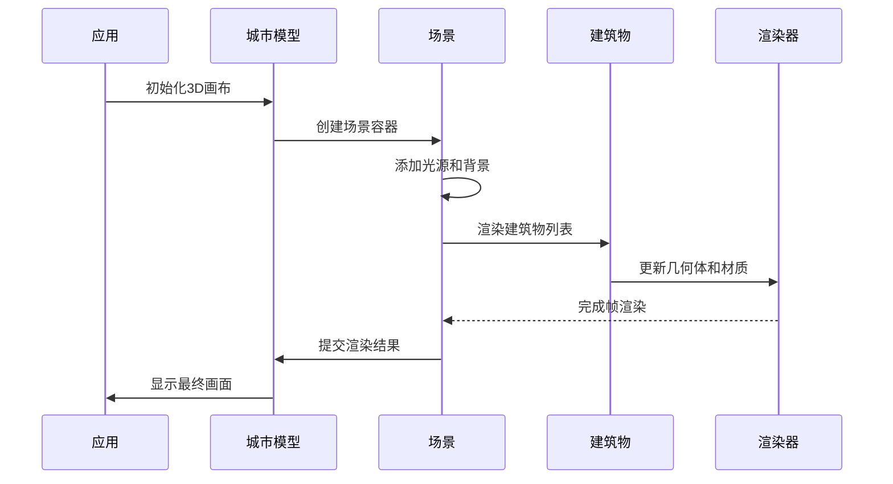
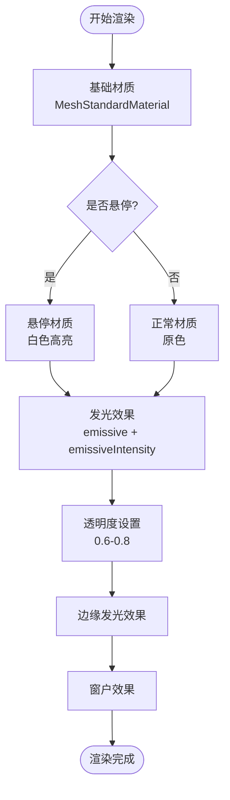
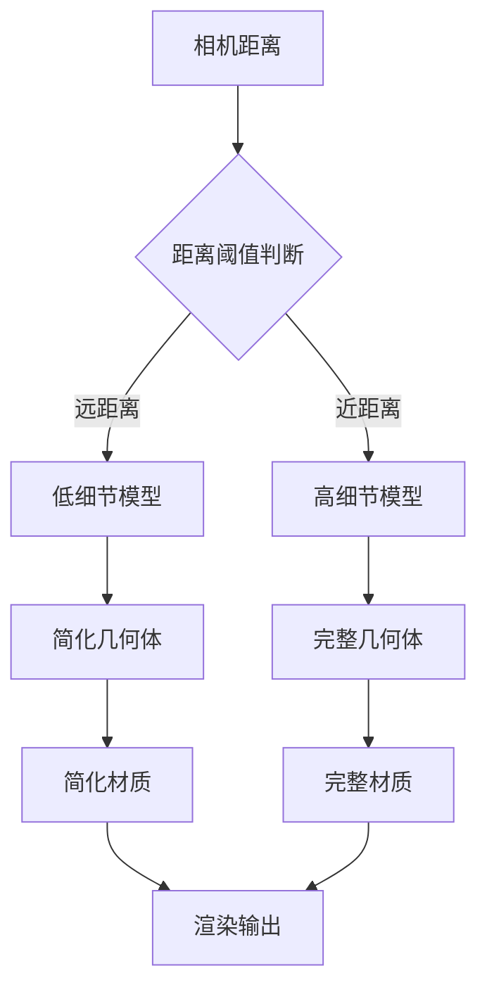
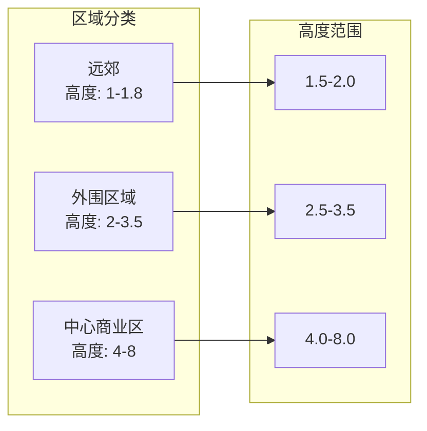
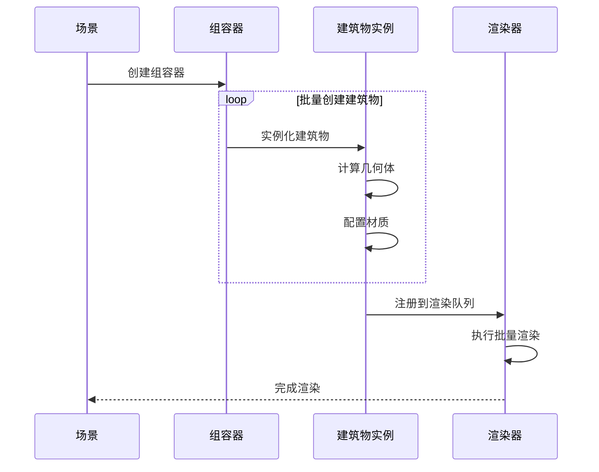
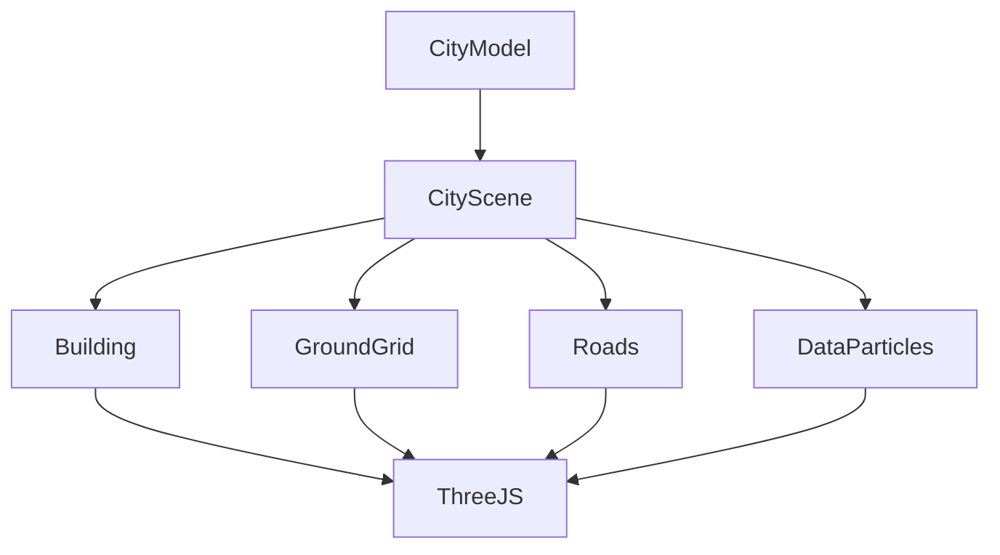
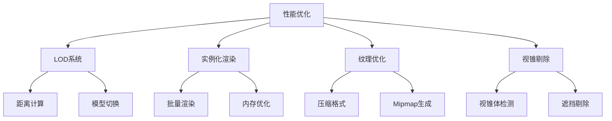

# Building建筑物组件

<cite>
**本文档引用的文件**
- [Building.tsx](file://src/components/3d/Building.tsx)
- [CityScene.tsx](file://src/components/3d/CityScene.tsx)
- [CityModel.tsx](file://src/components/3d/CityModel.tsx)
- [Roads.tsx](file://src/components/3d/Roads.tsx)
- [GroundGrid.tsx](file://src/components/3d/GroundGrid.tsx)
- [DataParticles.tsx](file://src/components/3d/DataParticles.tsx)
- [App.tsx](file://src/App.tsx)
- [package.json](file://package.json)
</cite>

## 目录
1. [简介](#简介)
2. [项目结构](#项目结构)
3. [核心组件](#核心组件)
4. [架构概览](#架构概览)
5. [详细组件分析](#详细组件分析)
6. [依赖关系分析](#依赖关系分析)
7. [性能考虑](#性能考虑)
8. [故障排除指南](#故障排除指南)
9. [结论](#结论)

## 简介

Building建筑物组件是本3D可视化仪表板项目的核心组成部分，负责在三维场景中生成和渲染建筑物几何体。该组件实现了完整的建筑物建模系统，包括几何体生成、材质属性配置、动态效果和交互功能。通过React Three Fiber框架，Building组件提供了高性能的WebGL渲染能力，支持建筑物的高度计算、形状生成和丰富的视觉效果。

该项目采用模块化架构设计，Building组件作为独立的功能单元，可以轻松集成到更大的3D城市场景中。组件支持实时交互、动态光照效果和批量渲染优化，为用户提供沉浸式的建筑可视化体验。

## 项目结构

整个3D系统采用分层架构设计，主要由以下层次组成：

```mermaid
graph TB
subgraph "应用层"
App[App.tsx]
CityModel[CityModel.tsx]
end
subgraph "场景层"
CityScene[CityScene.tsx]
GroundGrid[GroundGrid.tsx]
Roads[Roads.tsx]
DataParticles[DataParticles.tsx]
end
subgraph "组件层"
Building[Building.tsx]
end
subgraph "3D引擎"
ReactThreeFiber[@react-three/fiber]
ThreeJS[three.js]
Drei[@react-three/drei]
end
App --> CityModel
CityModel --> CityScene
CityScene --> Building
CityScene --> GroundGrid
CityScene --> Roads
CityScene --> DataParticles
Building --> ReactThreeFiber
CityScene --> ReactThreeFiber
CityModel --> ReactThreeFiber
ReactThreeFiber --> ThreeJS
CityModel --> Drei
```

**图表来源**
- [App.tsx:43-93](file://src/App.tsx#L43-L93)
- [CityModel.tsx:1-50](file://src/components/3d/CityModel.tsx#L1-L50)
- [CityScene.tsx:1-56](file://src/components/3d/CityScene.tsx#L1-L56)

**章节来源**
- [App.tsx:1-128](file://src/App.tsx#L1-L128)
- [package.json:12-26](file://package.json#L12-L26)

## 核心组件

### Building组件架构

Building组件是整个3D系统的核心，采用了React函数式组件模式，结合Three.js的几何体和材质系统。组件的主要特性包括：

- **几何体生成**：使用BoxGeometry创建建筑物主体
- **材质系统**：支持多种材质类型和动态效果
- **交互功能**：悬停检测和视觉反馈
- **动态效果**：边缘发光、窗口效果和闪烁动画



**图表来源**
- [Building.tsx:5-65](file://src/components/3d/Building.tsx#L5-L65)

**章节来源**
- [Building.tsx:1-66](file://src/components/3d/Building.tsx#L1-L66)

## 架构概览

### 场景组织结构

CityScene组件作为场景管理器，负责协调所有3D元素的渲染和更新。场景采用分组组织方式，将建筑物、道路、地面网格和数据粒子分别放置在不同的层级中。



**图表来源**
- [CityModel.tsx:9-30](file://src/components/3d/CityModel.tsx#L9-L30)
- [CityScene.tsx:40-53](file://src/components/3d/CityScene.tsx#L40-L53)

### 建筑物生成流程

建筑物的生成过程遵循以下步骤：

1. **参数验证**：检查输入的位置、尺寸和颜色参数
2. **几何体创建**：基于宽度、高度、深度创建BoxGeometry
3. **材质配置**：设置颜色、透明度和发光效果
4. **位置调整**：计算建筑物的正确Y坐标位置
5. **附加效果**：添加边缘线框、屋顶点和窗户效果

**章节来源**
- [CityScene.tsx:8-53](file://src/components/3d/CityScene.tsx#L8-L53)

## 详细组件分析

### Building组件详细分析

#### 几何体生成算法

Building组件使用BoxGeometry作为基础几何体，通过以下参数控制建筑物的形状：

- **宽度**：建筑物在X轴方向的尺寸
- **高度**：建筑物在Y轴方向的尺寸（决定建筑物的垂直比例）
- **深度**：建筑物在Z轴方向的尺寸

几何体的位置计算采用以下公式：
```
adjustedPos[1] = height / 2 + 0.01
```

这个计算确保建筑物底部与地面精确对齐，同时避免渲染时的z-fighting问题。

#### 材质属性配置

组件使用多种材质来实现丰富的视觉效果：



**图表来源**
- [Building.tsx:36-42](file://src/components/3d/Building.tsx#L36-L42)

#### 动态效果实现

组件实现了多种动态效果来增强视觉体验：

1. **边缘闪烁效果**：使用useFrame钩子实现边缘线的周期性闪烁
2. **悬停响应**：通过鼠标事件切换材质状态
3. **发光效果**：利用emissive属性创建自发光效果

**章节来源**
- [Building.tsx:13-65](file://src/components/3d/Building.tsx#L13-L65)

### LOD（细节层次）技术实现

当前实现中，LOD技术尚未完全实现。现有代码展示了LOD的基本概念和实现思路：



**图表来源**
- [Building.tsx:18-23](file://src/components/3d/Building.tsx#L18-L23)

### 纹理映射系统

当前实现中，纹理映射系统相对简单，主要通过颜色值直接指定材质颜色。完整的纹理映射系统应包括：

- **纹理加载**：支持从URL或本地资源加载纹理
- **UV映射**：精确控制纹理在几何体表面的映射
- **材质组合**：支持漫反射、法线贴图、高光贴图等多通道纹理

**章节来源**
- [Building.tsx:36-42](file://src/components/3d/Building.tsx#L36-L42)

### 建筑物高度计算

建筑物的高度计算遵循以下逻辑：

1. **程序化生成**：通过buildingLayout数组预定义不同区域的建筑高度
2. **区域分类**：根据位置坐标自动分配建筑高度等级
3. **比例控制**：使用统一的比例因子确保视觉一致性



**图表来源**
- [CityScene.tsx:9-38](file://src/components/3d/CityScene.tsx#L9-L38)

**章节来源**
- [CityScene.tsx:9-38](file://src/components/3d/CityScene.tsx#L9-L38)

### 建筑物实例化渲染

组件支持高效的批量渲染机制：



**图表来源**
- [CityScene.tsx:47-49](file://src/components/3d/CityScene.tsx#L47-L49)

**章节来源**
- [CityScene.tsx:40-53](file://src/components/3d/CityScene.tsx#L40-L53)

## 依赖关系分析

### 外部依赖关系

项目依赖于多个关键的3D开发库：

```mermaid
graph TB
subgraph "核心依赖"
React[React 19.2.6]
ThreeJS[three.js 0.184.0]
Fiber[@react-three/fiber 9.6.1]
Drei[@react-three/drei 10.7.7]
end
subgraph "应用层"
App[App.tsx]
CityModel[CityModel.tsx]
CityScene[CityScene.tsx]
end
subgraph "组件层"
Building[Building.tsx]
GroundGrid[GroundGrid.tsx]
Roads[Roads.tsx]
DataParticles[DataParticles.tsx]
end
App --> CityModel
CityModel --> Fiber
CityModel --> Drei
CityScene --> Building
CityScene --> GroundGrid
CityScene --> Roads
CityScene --> DataParticles
Building --> ThreeJS
GroundGrid --> ThreeJS
Roads --> ThreeJS
DataParticles --> ThreeJS
```

**图表来源**
- [package.json:12-26](file://package.json#L12-L26)
- [App.tsx:5](file://src/App.tsx#L5)

### 内部组件依赖

组件间的依赖关系清晰且模块化：



**图表来源**
- [CityModel.tsx:3](file://src/components/3d/CityModel.tsx#L3)
- [CityScene.tsx:3-6](file://src/components/3d/CityScene.tsx#L3-L6)

**章节来源**
- [package.json:12-26](file://package.json#L12-L26)

## 性能考虑

### 当前性能特征

基于现有实现，系统具有以下性能特点：

- **渲染效率**：使用React Three Fiber的批处理渲染机制
- **内存管理**：几何体和材质对象的生命周期由Three.js自动管理
- **GPU利用**：充分利用现代GPU的并行渲染能力

### 优化建议

针对当前实现，建议以下优化策略：

1. **LOD实现**：根据相机距离动态切换不同细节级别的几何体
2. **实例化渲染**：使用InstancedMesh减少绘制调用次数
3. **纹理压缩**：采用WebP或ASTC格式减少纹理内存占用
4. **视锥剔除**：实现基于视锥体的建筑物可见性检测



**章节来源**
- [Building.tsx:18-23](file://src/components/3d/Building.tsx#L18-L23)

## 故障排除指南

### 常见问题及解决方案

#### 建筑物渲染异常

**问题描述**：建筑物显示不正确或位置偏移

**可能原因**：
- 几何体参数设置错误
- 位置计算公式错误
- 材质属性配置不当

**解决方法**：
1. 检查position数组的三个坐标值
2. 验证height参数是否大于0
3. 确认材质的透明度设置合理

#### 性能问题

**问题描述**：场景渲染帧率过低

**可能原因**：
- 建筑物数量过多
- 材质过于复杂
- 光照计算开销过大

**解决方法**：
1. 实施LOD系统
2. 简化材质效果
3. 减少光源数量

#### 交互响应问题

**问题描述**：鼠标悬停效果不响应

**可能原因**：
- 事件监听器未正确绑定
- 几何体没有设置正确的属性
- z-index冲突

**解决方法**：
1. 检查onPointerOver和onPointerOut事件绑定
2. 确保mesh具有可交互的几何体
3. 验证渲染顺序

**章节来源**
- [Building.tsx:32-34](file://src/components/3d/Building.tsx#L32-L34)

## 结论

Building建筑物组件是一个功能完整、设计良好的3D渲染组件。它成功地实现了建筑物的几何体生成、材质配置和动态效果展示，为整个3D可视化系统奠定了坚实的基础。

### 主要成就

- **模块化设计**：组件结构清晰，职责单一
- **性能优化**：利用React Three Fiber实现高效渲染
- **视觉效果**：丰富的材质和动态效果提升用户体验
- **扩展性强**：为后续的LOD和纹理系统实现预留了接口

### 改进建议

1. **实现LOD系统**：根据距离动态切换模型细节
2. **添加纹理映射**：支持真实的建筑材料纹理
3. **优化批量渲染**：使用实例化技术提高渲染效率
4. **增强交互功能**：添加更多的用户交互选项

该组件为构建复杂的3D城市可视化应用提供了优秀的起点，通过持续的优化和扩展，可以支持更大规模的城市建模和更丰富的视觉效果。