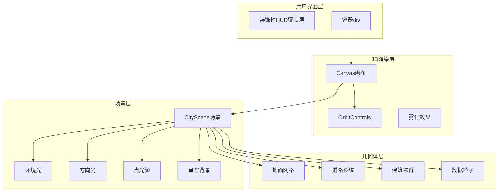
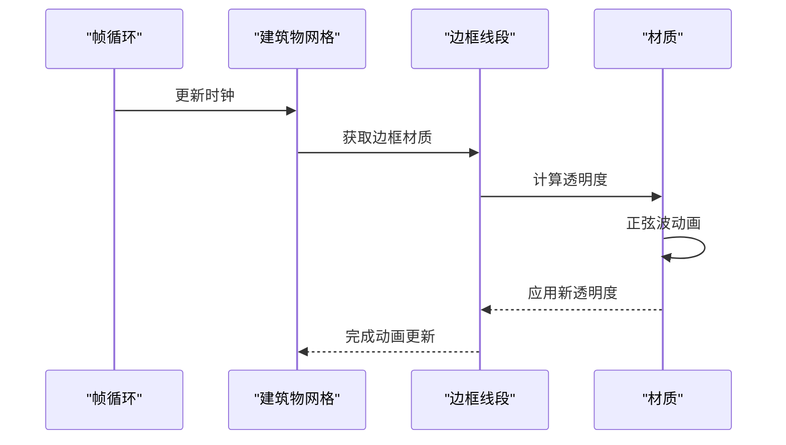
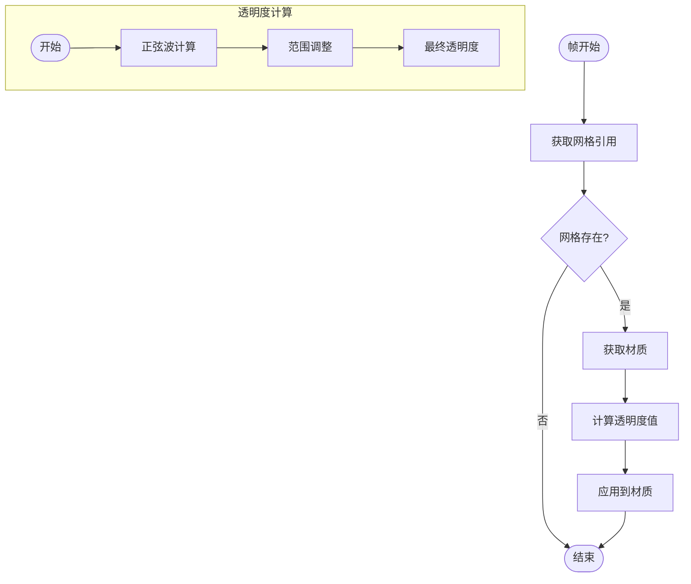
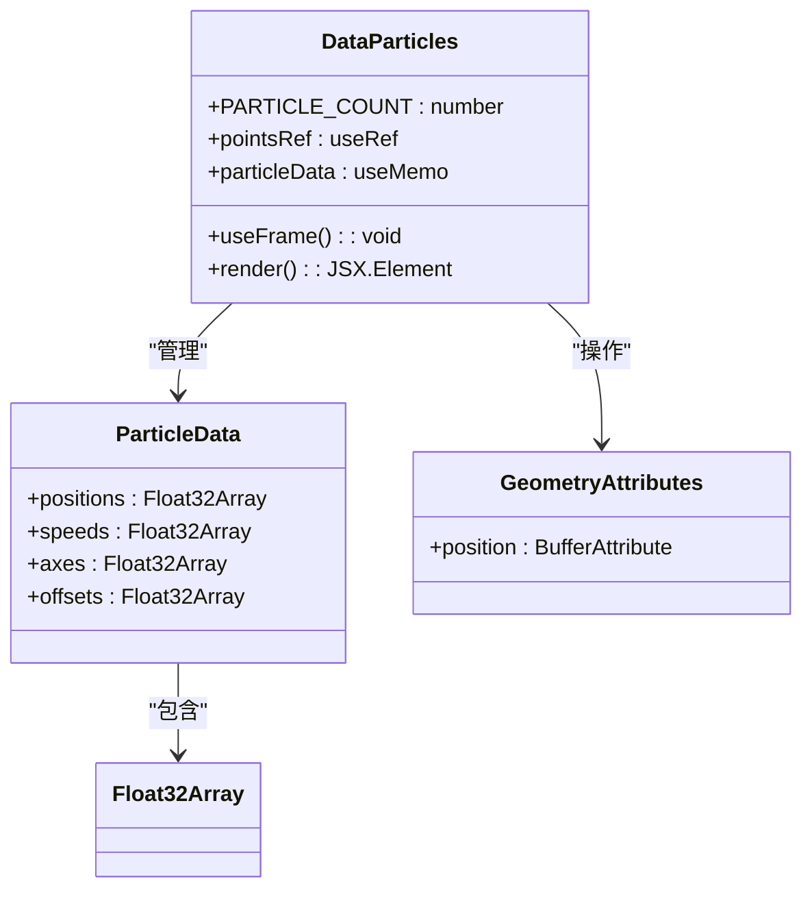
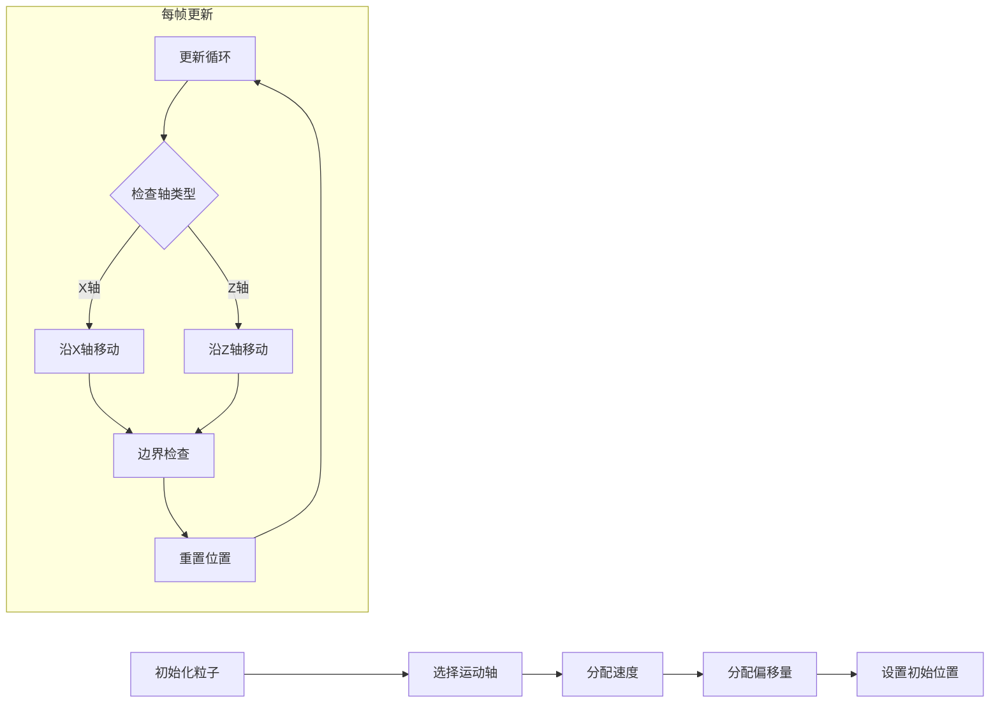
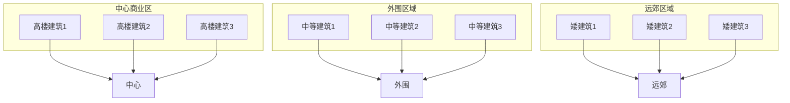
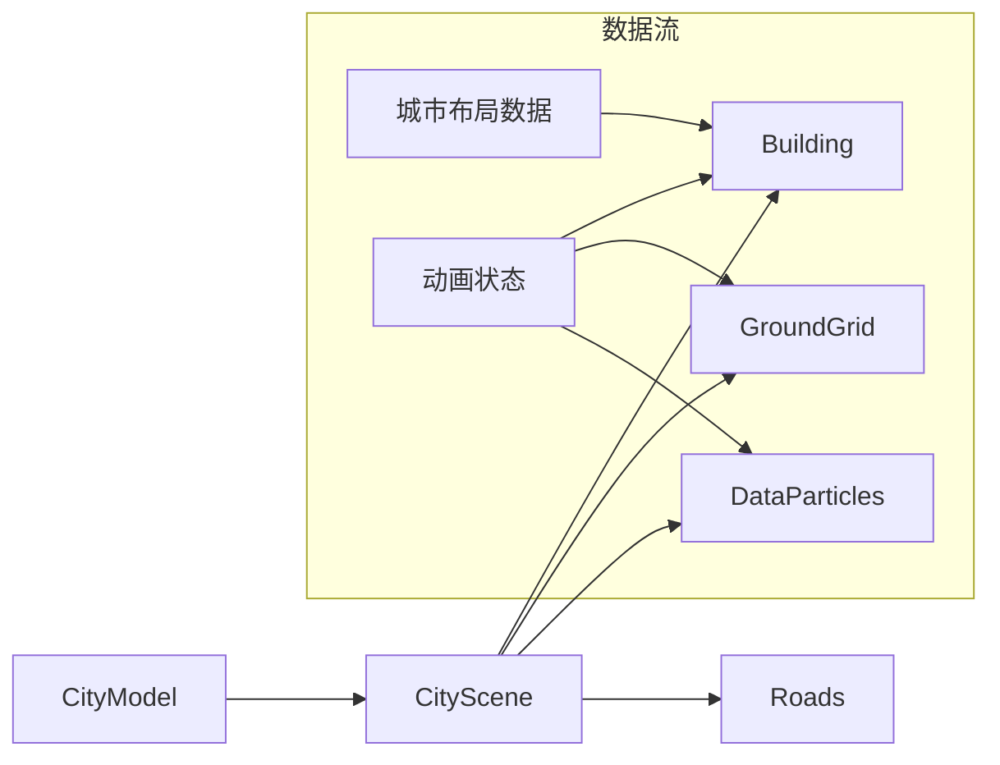
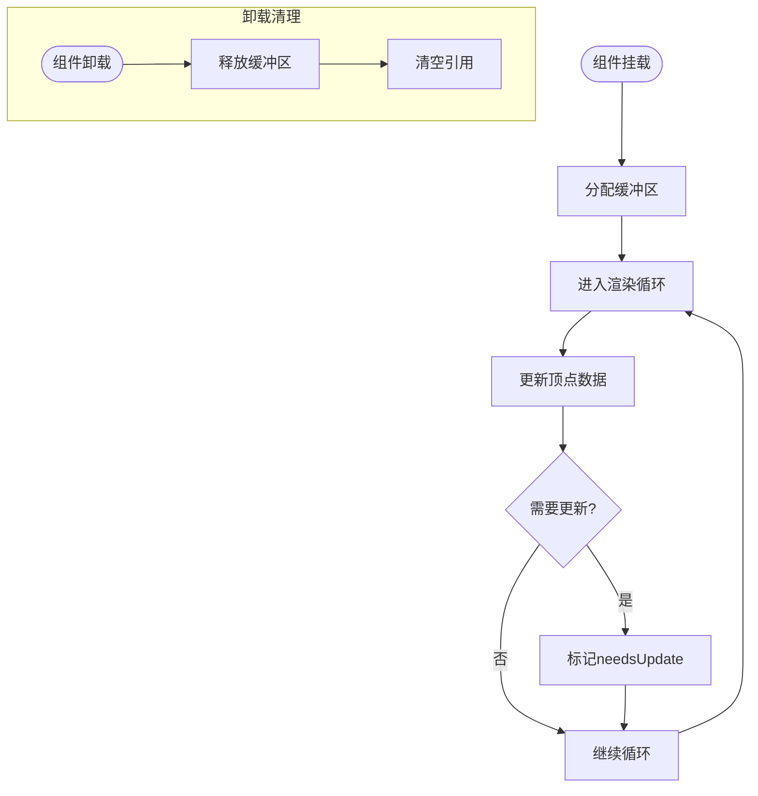

# CityModel城市模型组件

<cite>
**本文档引用的文件**
- [CityModel.tsx](file://src/components/3d/CityModel.tsx)
- [CityScene.tsx](file://src/components/3d/CityScene.tsx)
- [Building.tsx](file://src/components/3d/Building.tsx)
- [Roads.tsx](file://src/components/3d/Roads.tsx)
- [GroundGrid.tsx](file://src/components/3d/GroundGrid.tsx)
- [DataParticles.tsx](file://src/components/3d/DataParticles.tsx)
- [index.ts](file://src/components/3d/index.ts)
- [App.tsx](file://src/App.tsx)
- [package.json](file://package.json)
</cite>

## 目录
1. [简介](#简介)
2. [项目结构](#项目结构)
3. [核心组件](#核心组件)
4. [架构概览](#架构概览)
5. [详细组件分析](#详细组件分析)
6. [依赖关系分析](#依赖关系分析)
7. [性能考虑](#性能考虑)
8. [故障排除指南](#故障排除指南)
9. [结论](#结论)

## 简介

CityModel城市模型组件是一个基于React Three Fiber的3D可视化组件，用于展示一个程序化的城市景观。该组件集成了Three.js渲染器、@react-three/fiber框架、@react-three/drei工具库，以及多种3D场景元素，包括建筑物、道路、地面网格、数据粒子效果和星空背景。

该组件采用现代化的3D渲染技术，提供了沉浸式的城市景观体验，同时保持了良好的性能表现和可维护性。

## 项目结构

CityModel组件位于项目的3D组件目录中，采用模块化设计，每个3D元素都被封装为独立的React组件：

```mermaid
graph TB
subgraph "3D组件目录"
CM[CityModel.tsx<br/>主容器组件]
CS[CityScene.tsx<br/>场景容器]
BLD[Building.tsx<br/>建筑物组件]
RD[Roads.tsx<br/>道路组件]
GG[GroundGrid.tsx<br/>地面网格组件]
DP[DataParticles.tsx<br/>数据粒子组件]
end
subgraph "外部依赖"
RTF[@react-three/fiber<br/>React Three渲染器]
R3D[@react-three/drei<br/>3D工具库]
THREE[three.js<br/>3D引擎]
end
CM --> CS
CS --> BLD
CS --> RD
CS --> GG
CS --> DP
CM --> RTF
CM --> R3D
CM --> THREE
```

**图表来源**
- [CityModel.tsx:1-50](file://src/components/3d/CityModel.tsx#L1-L50)
- [CityScene.tsx:1-56](file://src/components/3d/CityScene.tsx#L1-L56)

**章节来源**
- [CityModel.tsx:1-50](file://src/components/3d/CityModel.tsx#L1-L50)
- [CityScene.tsx:1-56](file://src/components/3d/CityScene.tsx#L1-L56)

## 核心组件

### Canvas画布配置

CityModel组件使用@react-three/fiber的Canvas组件作为3D渲染容器，配置了以下关键参数：

- **相机设置**：位置[15, 15, 15]，视野角度50度
- **渲染器设置**：启用抗锯齿和透明背景
- **尺寸控制**：占满父容器的100%宽度和高度

### 渲染器设置

渲染器配置采用了高性能的参数组合：
- `antialias: true` - 启用抗锯齿，提升边缘质量
- `alpha: true` - 支持透明背景，便于与UI层叠加
- `background: 'transparent'` - 设置透明背景色

### 光源系统配置

组件实现了多层次的光照系统：

#### 环境光 (Ambient Light)
- 强度：0.3
- 作用：提供基础的整体照明，避免场景过暗

#### 方向光 (Directional Light)
- 位置：[10, 20, 10]
- 强度：0.5
- 颜色：#00d4ff (青蓝色)
- 特性：模拟太阳光，产生明显的阴影效果

#### 点光源 (Point Light)
- 位置：[-10, 15, -10]
- 强度：0.3
- 颜色：#7b2ff7 (紫色)
- 特性：提供局部照明，增强场景层次感

### 星空背景效果

使用@react-three/drei的Stars组件实现：
- 半径：100
- 深度：50
- 数量：2000个星星
- 因子：4
- 饱和度：0 (黑白效果)
- 淡入淡出速度：1

### OrbitControls相机控制系统

实现了自动旋转和手动控制的混合模式：
- `enablePan: false` - 禁用平移功能
- `minDistance: 8` - 最小距离限制
- `maxDistance: 35` - 最大距离限制
- `autoRotate: true` - 启用自动旋转
- `autoRotateSpeed: 0.5` - 自动旋转速度
- `maxPolarAngle: Math.PI / 2.5` - 极角限制，防止过度俯视

### 雾化效果

使用fog指令实现：
- 颜色：#0a0e27 (深蓝色)
- 近距离：25
- 远距离：55
- 提供深度感知和空间层次感

**章节来源**
- [CityModel.tsx:6-47](file://src/components/3d/CityModel.tsx#L6-L47)

## 架构概览

CityModel组件采用分层架构设计，从外到内依次为：



**图表来源**
- [CityModel.tsx:8-30](file://src/components/3d/CityModel.tsx#L8-L30)
- [CityScene.tsx:40-52](file://src/components/3d/CityScene.tsx#L40-L52)

## 详细组件分析

### Building建筑物组件

Building组件是城市景观的核心元素，实现了复杂的视觉效果：

#### 几何体结构
- **主体**：使用BoxGeometry创建立方体
- **边框**：LineSegments渲染发光边框
- **屋顶**：SphereGeometry创建发光球体
- **窗户**：动态生成的水平条纹模拟窗户

#### 动态效果实现



**图表来源**
- [Building.tsx:18-23](file://src/components/3d/Building.tsx#L18-L23)

#### 材质特性
- **主体材质**：meshStandardMaterial，支持光照计算
- **边框材质**：lineBasicMaterial，固定颜色
- **发光效果**：使用emissive属性实现自发光
- **透明度控制**：悬停时增加透明度

**章节来源**
- [Building.tsx:13-63](file://src/components/3d/Building.tsx#L13-L63)

### GroundGrid地面网格组件

GroundGrid组件提供了城市的基础地面环境：

#### 动态网格效果



**图表来源**
- [GroundGrid.tsx:8-13](file://src/components/3d/GroundGrid.tsx#L8-L13)

#### 地面元素组成
- **基础平面**：30x30大小的地面
- **网格线**：30x30的网格辅助线
- **中心环形**：三个同心圆环，不同透明度

**章节来源**
- [GroundGrid.tsx:5-42](file://src/components/3d/GroundGrid.tsx#L5-L42)

### Roads道路系统组件

Roads组件实现了复杂的城市道路网络：

#### 道路布局设计
- **主干道**：横向和纵向两条主要道路
- **次干道**：围绕中心区域的次要道路
- **中心线**：发光的中心线标识

#### 材质特性
所有道路元素都使用了透明材质，通过不同的透明度创建层次感：
- 主干道：0.08透明度
- 次干道：0.08透明度  
- 中心线：0.4透明度

**章节来源**
- [Roads.tsx:3-43](file://src/components/3d/Roads.tsx#L3-L43)

### DataParticles数据粒子组件

DataParticles组件实现了动态的数据流可视化效果：

#### 粒子系统架构



**图表来源**
- [DataParticles.tsx:5-36](file://src/components/3d/DataParticles.tsx#L5-L36)

#### 粒子运动算法



**图表来源**
- [DataParticles.tsx:38-51](file://src/components/3d/DataParticles.tsx#L38-L51)

#### 材质渲染特性
- **颜色**：#00d4ff (青蓝色)
- **大小**：0.15单位
- **混合模式**：AdditiveBlending (加法混合)
- **深度写入**：禁用以实现透明效果

**章节来源**
- [DataParticles.tsx:7-73](file://src/components/3d/DataParticles.tsx#L7-L73)

### CityScene场景容器

CityScene组件作为场景的根容器，协调各个3D元素的组织：

#### 城市布局规划



**图表来源**
- [CityScene.tsx:8-38](file://src/components/3d/CityScene.tsx#L8-L38)

#### 建筑数据结构
每个建筑对象包含：
- `pos`: [x, y, z] 位置坐标
- `w`: 宽度
- `h`: 高度  
- `d`: 深度
- `color`: 建筑颜色

**章节来源**
- [CityScene.tsx:40-53](file://src/components/3d/CityScene.tsx#L40-L53)

## 依赖关系分析

### 外部依赖关系

```mermaid
graph TB
subgraph "React Three Ecosystem"
RTF[@react-three/fiber<br/>核心渲染器]
R3D[@react-three/drei<br/>3D工具库>
THREE[three.js<br/>3D引擎]
end
subgraph "UI框架"
REACT[React<br/>组件框架]
FRAMER[framer-motion<br/>动画库]
end
subgraph "项目组件"
CM[CityModel]
CS[CityScene]
BLD[Building]
RD[Roads]
GG[GroundGrid]
DP[DataParticles]
end
REACT --> CM
RTF --> CM
R3D --> CM
THREE --> RTF
CM --> CS
CS --> BLD
CS --> RD
CS --> GG
CS --> DP
```

**图表来源**
- [package.json:12-26](file://package.json#L12-L26)
- [App.tsx:5-14](file://src/App.tsx#L5-L14)

### 内部依赖关系



**图表来源**
- [CityModel.tsx:14-19](file://src/components/3d/CityModel.tsx#L14-L19)
- [CityScene.tsx:47-50](file://src/components/3d/CityScene.tsx#L47-L50)

**章节来源**
- [package.json:12-26](file://package.json#L12-L26)
- [index.ts:1](file://src/components/3d/index.ts#L1)

## 性能考虑

### 渲染性能优化策略

#### 1. 几何体优化
- 使用BoxGeometry和PlaneGeometry等基础几何体，减少顶点数量
- 合理的多边形密度，平衡视觉质量和性能

#### 2. 材质优化
- 统一使用meshStandardMaterial进行光照计算
- 合理的透明度设置，避免不必要的深度测试

#### 3. 动画性能
- 使用useFrame钩子进行高效的帧循环
- 避免在渲染循环中创建新的对象实例

#### 4. 粒子系统优化
- 预分配Float32Array数组，避免频繁内存分配
- 使用BufferAttribute直接操作顶点数据

### 内存管理



**图表来源**
- [DataParticles.tsx:38-51](file://src/components/3d/DataParticles.tsx#L38-L51)

### 性能监控建议

1. **帧率监控**：使用浏览器开发者工具的性能面板
2. **内存使用**：定期检查内存泄漏
3. **GPU使用**：监控GPU负载情况

## 故障排除指南

### 常见问题及解决方案

#### 1. 渲染异常
**症状**：页面空白或渲染错误
**可能原因**：
- Three.js版本不兼容
- @react-three/fiber版本问题
- 缺少必要的依赖包

**解决方法**：
- 检查package.json中的依赖版本
- 确保所有3D相关依赖版本兼容
- 清理node_modules后重新安装

#### 2. 动画卡顿
**症状**：建筑物闪烁或动画不流畅
**可能原因**：
- useFrame回调中创建新对象
- 材质更新过于频繁
- 几何体更新未正确标记

**解决方法**：
- 使用useMemo缓存计算结果
- 避免在渲染循环中分配内存
- 确保geometry.attributes.needsUpdate正确设置

#### 3. 性能问题
**症状**：帧率下降，CPU/GPU占用过高
**可能原因**：
- 粒子数量过多
- 材质混合模式不当
- 相机距离设置不合理

**解决方法**：
- 调整粒子数量参数
- 优化材质设置
- 调整OrbitControls的距离限制

#### 4. 光照问题
**症状**：场景过亮或过暗
**可能原因**：
- 光源强度设置不当
- 材质属性配置错误
- 雾化效果影响

**解决方法**：
- 调整光源强度参数
- 检查材质的emissive和opacity设置
- 调整fog的近远距离参数

**章节来源**
- [package.json:12-26](file://package.json#L12-L26)

## 结论

CityModel城市模型组件是一个功能完整、性能优化的3D可视化解决方案。它成功地将多个3D元素整合在一个统一的架构中，提供了丰富的视觉效果和良好的用户体验。

### 主要优势

1. **模块化设计**：每个3D元素都是独立的组件，易于维护和扩展
2. **性能优化**：采用多种优化策略，确保流畅的渲染性能
3. **视觉效果丰富**：结合多种光照、材质和动画效果
4. **交互友好**：提供直观的相机控制和视觉反馈

### 技术亮点

- **程序化城市布局**：通过数据驱动的方式生成城市景观
- **动态效果系统**：建筑物闪烁、地面网格脉动、数据粒子流动
- **多层次光照**：环境光、方向光、点光源的组合使用
- **性能友好的粒子系统**：优化的内存管理和渲染效率

### 扩展建议

1. **添加更多交互元素**：如点击建筑显示信息、路径导航等
2. **优化移动端性能**：针对移动设备的性能调优
3. **增强数据可视化**：将实时数据更直观地融入3D场景
4. **添加音效和环境音**：提升沉浸式体验

该组件为构建现代数据可视化仪表板提供了优秀的3D展示基础，可以作为更大规模3D应用开发的良好起点。