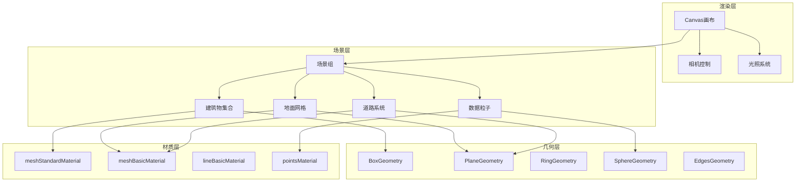
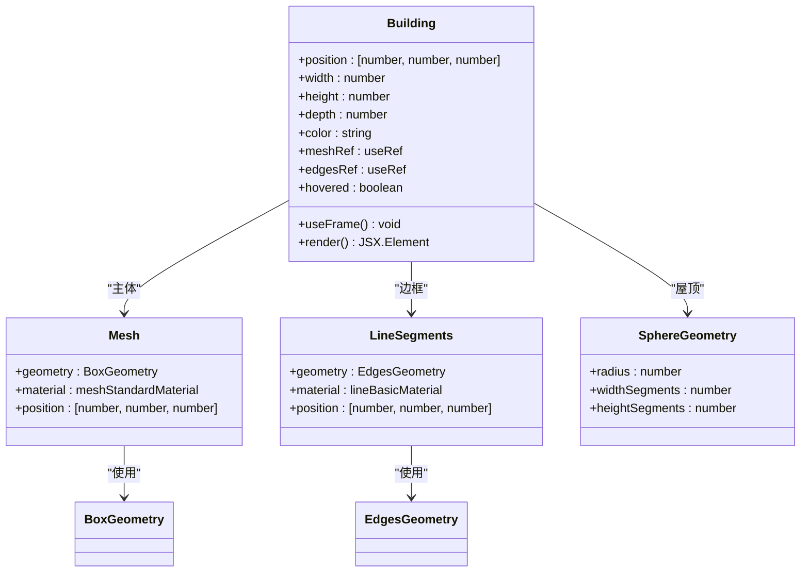
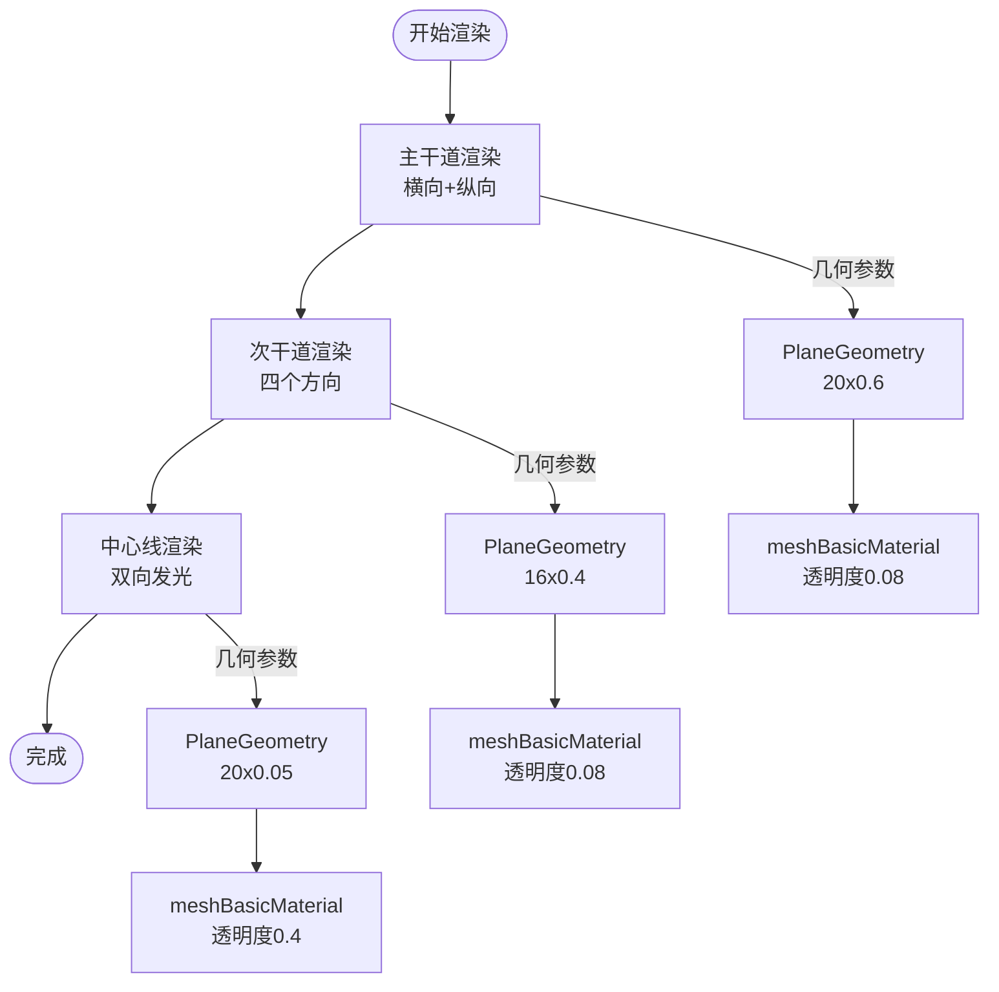
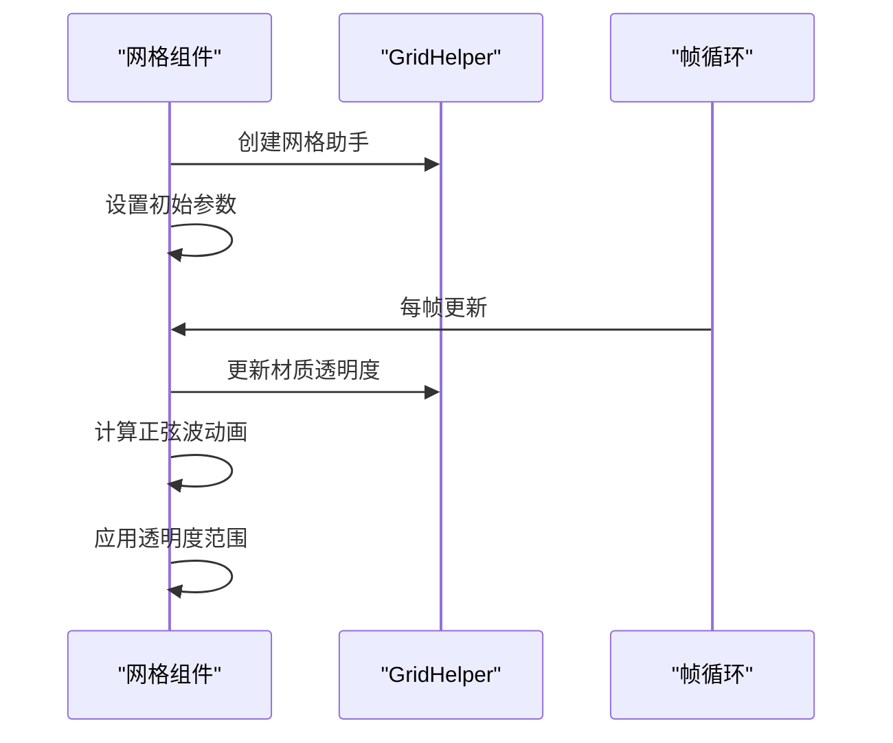
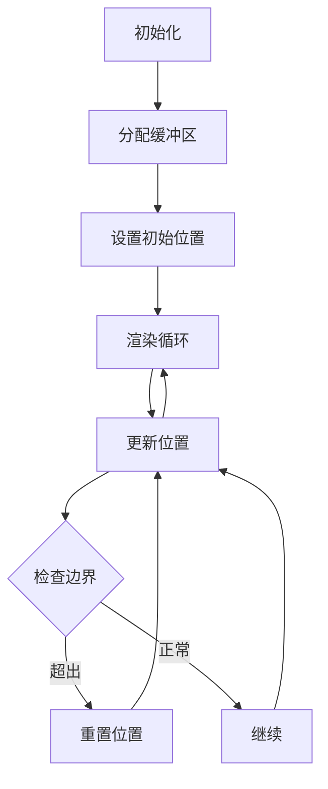

# CityScene场景生成

<cite>
**本文档引用的文件**
- [CityScene.tsx](file://src/components/3d/CityScene.tsx)
- [CityModel.tsx](file://src/components/3d/CityModel.tsx)
- [Building.tsx](file://src/components/3d/Building.tsx)
- [Roads.tsx](file://src/components/3d/Roads.tsx)
- [GroundGrid.tsx](file://src/components/3d/GroundGrid.tsx)
- [DataParticles.tsx](file://src/components/3d/DataParticles.tsx)
- [App.tsx](file://src/App.tsx)
- [package.json](file://package.json)
- [App.css](file://src/App.css)
- [index.html](file://index.html)
</cite>

## 目录
1. [简介](#简介)
2. [项目结构](#项目结构)
3. [核心组件](#核心组件)
4. [架构概览](#架构概览)
5. [详细组件分析](#详细组件分析)
6. [依赖关系分析](#依赖关系分析)
7. [性能考虑](#性能考虑)
8. [故障排除指南](#故障排除指南)
9. [结论](#结论)
10. [附录](#附录)

## 简介

CityScene是一个基于React Three Fiber构建的3D城市场景生成组件，专为数据分析仪表板设计。该系统通过程序化生成城市布局，包括建筑物、道路、地面网格和数据粒子效果，为实时数据可视化提供沉浸式的三维环境。

该场景系统采用模块化架构，每个场景元素都是独立的React组件，通过组合形成完整的城市景观。系统支持交互式控制、动态效果和可扩展的场景结构。

## 项目结构

项目采用功能驱动的组织方式，3D场景组件位于`src/components/3d/`目录下，与UI组件分离，便于维护和扩展。

```mermaid
graph TB
subgraph "3D场景组件"
CityModel[CityModel.tsx]
CityScene[CityScene.tsx]
Building[Building.tsx]
Roads[Roads.tsx]
GroundGrid[GroundGrid.tsx]
DataParticles[DataParticles.tsx]
end
subgraph "应用层"
App[App.tsx]
Layout[布局组件]
end
subgraph "依赖库"
ReactThreeFiber[@react-three/fiber]
Drei[@react-three/drei]
ThreeJS[three.js]
end
App --> CityModel
CityModel --> CityScene
CityScene --> Building
CityScene --> Roads
CityScene --> GroundGrid
CityScene --> DataParticles
CityModel --> ReactThreeFiber
CityModel --> Drei
Building --> ThreeJS
Roads --> ThreeJS
GroundGrid --> ThreeJS
DataParticles --> ThreeJS
```

**图表来源**
- [CityModel.tsx:1-50](file://src/components/3d/CityModel.tsx#L1-L50)
- [CityScene.tsx:1-56](file://src/components/3d/CityScene.tsx#L1-L56)
- [package.json:12-26](file://package.json#L12-L26)

**章节来源**
- [CityModel.tsx:1-50](file://src/components/3d/CityModel.tsx#L1-L50)
- [CityScene.tsx:1-56](file://src/components/3d/CityScene.tsx#L1-L56)
- [package.json:12-26](file://package.json#L12-L26)

## 核心组件

### 场景容器组件

CityModel作为场景的根容器，负责设置3D画布、光照系统和相机控制。它使用React Three Fiber的Canvas组件创建WebGL上下文，并配置抗锯齿和透明背景。

### 场景主体组件

CityScene是场景的核心容器，组织所有场景元素的层次结构。它定义了建筑物的程序化布局数据，确保场景元素按照正确的顺序渲染。

### 几何体构建系统

系统通过Three.js的几何体原语构建场景：BoxGeometry用于建筑物，PlaneGeometry用于道路和平面，RingGeometry用于地面装饰，SphereGeometry用于屋顶细节。

**章节来源**
- [CityModel.tsx:6-47](file://src/components/3d/CityModel.tsx#L6-L47)
- [CityScene.tsx:40-53](file://src/components/3d/CityScene.tsx#L40-L53)

## 架构概览

CityScene采用分层架构设计，从底层的几何体构建到顶层的场景组合，每个层次都有明确的职责分工。



**图表来源**
- [CityModel.tsx:9-29](file://src/components/3d/CityModel.tsx#L9-L29)
- [CityScene.tsx:44-50](file://src/components/3d/CityScene.tsx#L44-L50)
- [Building.tsx:35-42](file://src/components/3d/Building.tsx#L35-L42)

## 详细组件分析

### 建筑物组件 (Building)

建筑物组件是场景中最复杂的元素，实现了多层次的视觉效果：

#### 几何体结构
- **主体结构**：使用BoxGeometry创建立方体建筑
- **边缘线框**：通过EdgesGeometry生成建筑轮廓线
- **屋顶细节**：添加小球体作为屋顶发光点
- **窗户效果**：动态生成水平线条模拟窗户照明

#### 材质系统
- **主体材质**：meshStandardMaterial支持物理光照
- **边缘材质**：lineBasicMaterial实现发光边框
- **透明度控制**：支持悬停时的透明度变化
- **发光效果**：emissive属性创造夜景效果

#### 动态效果
- **脉冲动画**：边缘线框随时间产生呼吸效果
- **悬停交互**：鼠标悬停时改变颜色和透明度
- **周期性闪烁**：基于位置的相位差实现同步闪烁



**图表来源**
- [Building.tsx:13-63](file://src/components/3d/Building.tsx#L13-L63)

**章节来源**
- [Building.tsx:13-66](file://src/components/3d/Building.tsx#L13-L66)

### 道路系统 (Roads)

道路系统采用层次化设计，创建了一个完整的交通网络：

#### 几何结构
- **主干道**：横向和纵向两条主要道路
- **次干道**：围绕中心区域的次要道路
- **中心线**：发光的车道分隔线

#### 材质特性
- **透明度控制**：使用低透明度创造半透明效果
- **发光属性**：通过透明度和颜色创造夜间发光效果
- **层次管理**：精确控制渲染深度避免z-fighting



**图表来源**
- [Roads.tsx:6-41](file://src/components/3d/Roads.tsx#L6-L41)

**章节来源**
- [Roads.tsx:3-47](file://src/components/3d/Roads.tsx#L3-L47)

### 地面网格系统 (GroundGrid)

地面网格系统提供了精确的地面参考框架：

#### 多层次地面结构
- **基础平面**：深色背景平面提供视觉深度
- **网格系统**：蓝色网格线指示坐标轴
- **中心装饰**：同心圆环创造视觉焦点

#### 动态效果
- **呼吸动画**：网格透明度的周期性变化
- **层次管理**：精确的Y轴偏移避免渲染冲突



**图表来源**
- [GroundGrid.tsx:5-13](file://src/components/3d/GroundGrid.tsx#L5-L13)

**章节来源**
- [GroundGrid.tsx:5-46](file://src/components/3d/GroundGrid.tsx#L5-L46)

### 数据粒子系统 (DataParticles)

数据粒子系统实现了高效的粒子渲染：

#### 性能优化
- **静态分配**：预分配固定数量的粒子
- **缓冲区管理**：使用Float32Array优化内存
- **批量更新**：每帧批量更新所有粒子位置

#### 动画逻辑
- **双轴运动**：粒子在X轴和Z轴间随机切换
- **循环边界**：超出边界自动重置位置
- **速度控制**：不同粒子具有不同的移动速度



**图表来源**
- [DataParticles.tsx:10-51](file://src/components/3d/DataParticles.tsx#L10-L51)

**章节来源**
- [DataParticles.tsx:7-76](file://src/components/3d/DataParticles.tsx#L7-L76)

## 依赖关系分析

系统依赖于现代WebGL生态系统，采用模块化设计确保清晰的依赖关系：

```mermaid
graph LR
subgraph "应用层"
App[App.tsx]
CityModel[CityModel.tsx]
end
subgraph "3D渲染层"
Canvas[Canvas]
Controls[OrbitControls]
Lighting[光源系统]
end
subgraph "几何体层"
BoxGeom[BoxGeometry]
PlaneGeom[PlaneGeometry]
RingGeom[RingGeometry]
SphereGeom[SphereGeometry]
EdgeGeom[EdgesGeometry]
end
subgraph "材质层"
StandardMat[meshStandardMaterial]
BasicMat[meshBasicMaterial]
LineMat[lineBasicMaterial]
PointMat[pointsMaterial]
end
subgraph "外部依赖"
React[React 19.2.6]
Fiber[@react-three/fiber 9.6.1]
Drei[@react-three/drei 10.7.7]
Three[three.js 0.184.0]
end
App --> CityModel
CityModel --> Canvas
Canvas --> Controls
Canvas --> Lighting
CityModel --> BoxGeom
CityModel --> PlaneGeom
CityModel --> RingGeom
CityModel --> SphereGeom
CityModel --> EdgeGeom
BoxGeom --> StandardMat
PlaneGeom --> BasicMat
RingGeom --> BasicMat
SphereGeom --> BasicMat
EdgeGeom --> LineMat
CityModel -.-> React
CityModel -.-> Fiber
CityModel -.-> Drei
CityModel -.-> Three
```

**图表来源**
- [package.json:12-26](file://package.json#L12-L26)
- [CityModel.tsx:1-50](file://src/components/3d/CityModel.tsx#L1-L50)

**章节来源**
- [package.json:12-26](file://package.json#L12-L26)

## 性能考虑

### 渲染优化策略

#### 几何体优化
- **共享几何体**：相同尺寸的建筑物共享几何体实例
- **简化细节**：使用基本几何体而非复杂模型
- **批量渲染**：将相似材质的元素合并渲染批次

#### 材质优化
- **材质复用**：相同属性的材质共享实例
- **透明度管理**：合理使用透明度避免不必要的混合排序
- **光照计算**：使用简单的光照模型减少计算开销

#### 动画优化
- **帧率控制**：使用useFrame钩子确保动画与渲染同步
- **条件更新**：只在需要时更新几何体属性
- **内存管理**：及时清理不再使用的几何体和材质

### 内存管理方案

#### 对象池模式
- **几何体缓存**：常用几何体实例缓存
- **材质复用**：材质对象复用避免频繁创建
- **纹理管理**：纹理资源统一管理

#### 生命周期管理
- **组件卸载**：确保组件卸载时释放资源
- **引用清理**：及时清理ref引用避免内存泄漏
- **事件监听**：移除不需要的事件监听器

### 扩展性考虑

#### 模块化设计
- **独立组件**：每个场景元素都是独立的可复用组件
- **接口标准化**：统一的props接口便于扩展
- **配置驱动**：通过配置数据驱动场景生成

#### 性能监控
- **帧率监控**：集成性能监控工具
- **内存使用**：跟踪内存使用情况
- **渲染统计**：收集渲染性能指标

## 故障排除指南

### 常见问题及解决方案

#### 渲染异常
- **问题**：场景元素重叠或显示异常
- **原因**：Y轴偏移不足导致的z-fighting
- **解决**：调整地面和建筑物的Y轴偏移量

#### 性能问题
- **问题**：帧率下降或卡顿
- **原因**：过多的几何体或材质实例
- **解决**：启用几何体和材质复用

#### 交互问题
- **问题**：鼠标交互不响应
- **原因**：透明度影响拾取检测
- **解决**：调整透明度阈值或使用辅助几何体

### 调试技巧

#### 开发工具
- **React DevTools**：检查组件树和状态
- **Three.js DevTools**：调试3D场景
- **浏览器性能面板**：监控渲染性能

#### 日志记录
- **组件生命周期**：记录组件挂载和卸载
- **渲染统计**：记录帧率和几何体数量
- **内存使用**：监控内存分配和回收

**章节来源**
- [CityScene.tsx:44-50](file://src/components/3d/CityScene.tsx#L44-L50)
- [Building.tsx:18-23](file://src/components/3d/Building.tsx#L18-L23)

## 结论

CityScene场景生成组件展现了现代WebGL应用的最佳实践。通过模块化设计、性能优化和可扩展架构，该系统为数据分析仪表板提供了沉浸式的三维可视化环境。

系统的主要优势包括：
- **模块化架构**：清晰的组件分离便于维护和扩展
- **性能优化**：合理的几何体和材质管理确保流畅渲染
- **交互体验**：丰富的动态效果提升用户体验
- **可扩展性**：标准化的接口支持场景内容的灵活扩展

未来可以进一步优化的方向包括实现LOD系统、添加更高级的光照效果、集成更复杂的地形系统等。

## 附录

### 场景元素组织方式

场景元素按照以下层次组织：
1. **基础层**：地面网格和基础平面
2. **基础设施层**：道路和交通标识
3. **建筑层**：各种类型的建筑物
4. **特效层**：数据粒子和发光效果

### 渲染顺序规则

渲染遵循深度优先原则：
- 地面网格（最底层）
- 道路系统
- 建筑物主体
- 边缘线框
- 屋顶细节
- 数据粒子（最上层）

### 自定义扩展指南

#### 添加新场景元素
1. 创建新的React组件
2. 定义几何体和材质
3. 实现必要的动画逻辑
4. 在CityScene中注册组件

#### 修改现有元素
1. 分析当前组件的职责
2. 保持接口兼容性
3. 优化性能表现
4. 测试交互效果

#### 性能监控集成
1. 集成性能监控工具
2. 设置性能基准线
3. 定期评估渲染效率
4. 优化瓶颈环节