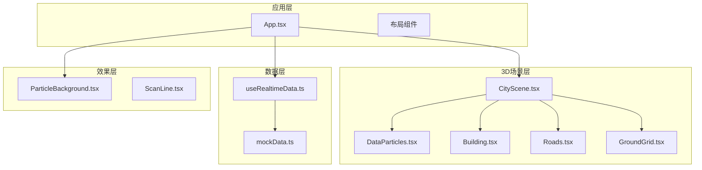
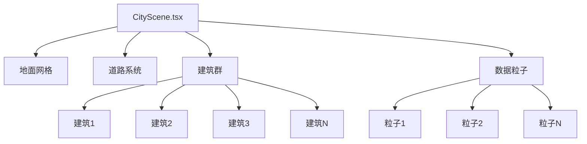
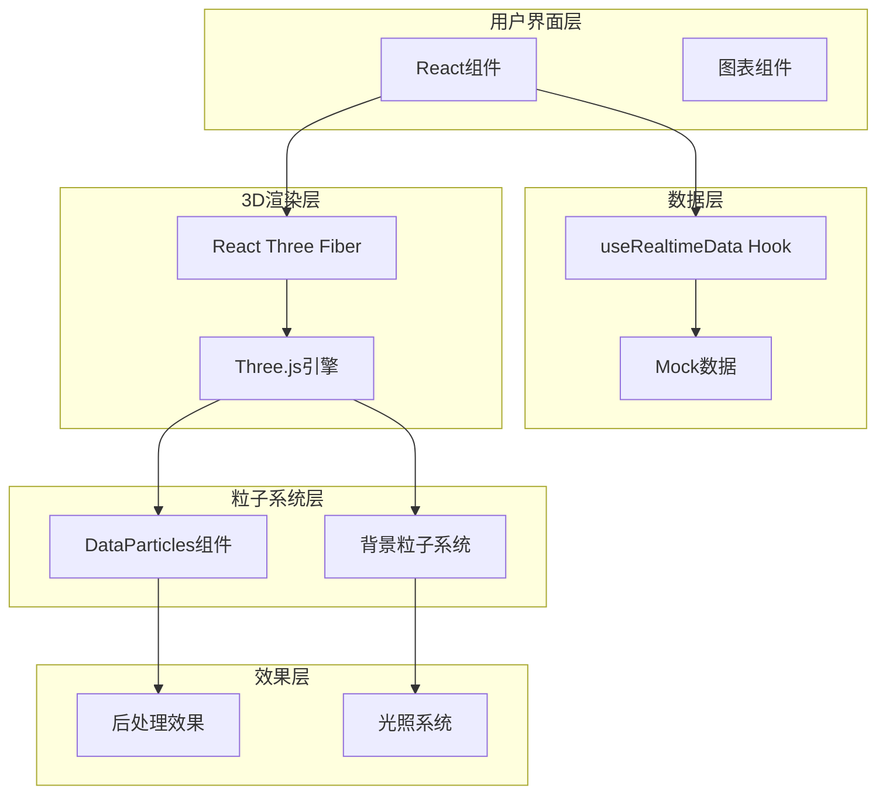
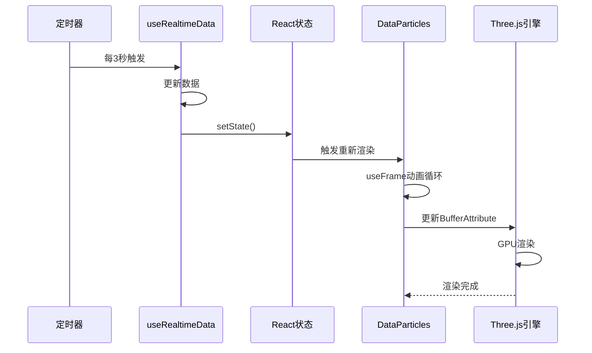
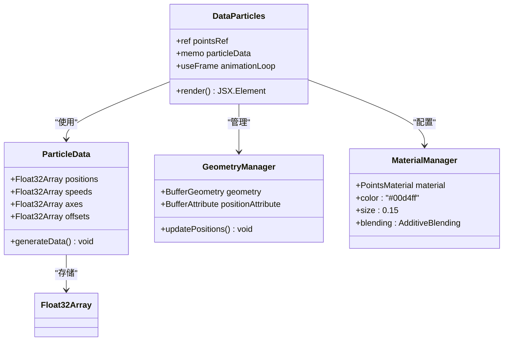
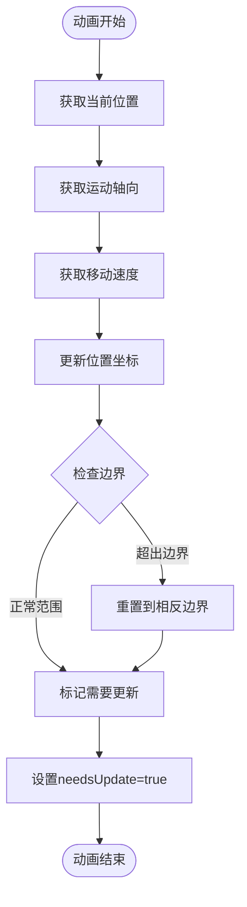
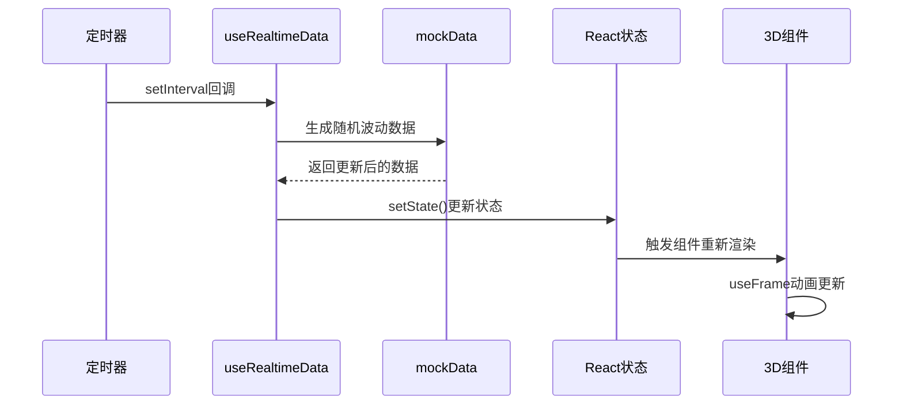
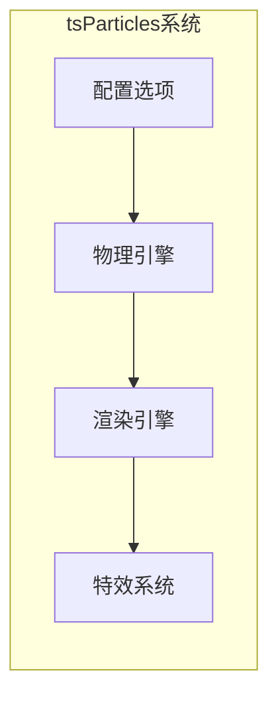
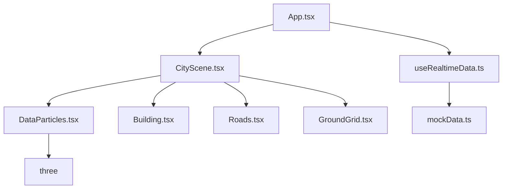
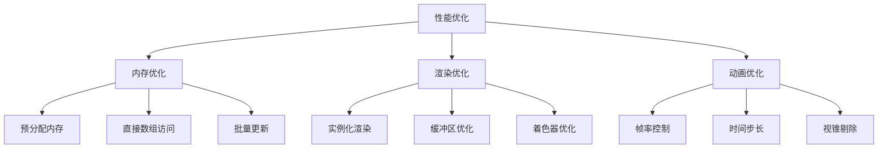

# DataParticles数据粒子系统

<cite>
**本文档引用的文件**
- [DataParticles.tsx](file://src/components/3d/DataParticles.tsx)
- [CityScene.tsx](file://src/components/3d/CityScene.tsx)
- [useRealtimeData.ts](file://src/hooks/useRealtimeData.ts)
- [mockData.ts](file://src/data/mockData.ts)
- [Building.tsx](file://src/components/3d/Building.tsx)
- [Roads.tsx](file://src/components/3d/Roads.tsx)
- [GroundGrid.tsx](file://src/components/3d/GroundGrid.tsx)
- [ParticleBackground.tsx](file://src/components/effects/ParticleBackground.tsx)
- [App.tsx](file://src/App.tsx)
- [package.json](file://package.json)
</cite>

## 目录
1. [简介](#简介)
2. [项目结构](#项目结构)
3. [核心组件](#核心组件)
4. [架构概览](#架构概览)
5. [详细组件分析](#详细组件分析)
6. [依赖关系分析](#依赖关系分析)
7. [性能考虑](#性能考虑)
8. [故障排除指南](#故障排除指南)
9. [结论](#结论)

## 简介

DataParticles数据粒子系统是一个基于React Three Fiber构建的3D数据可视化粒子系统。该系统通过实时数据驱动的粒子动画，为智慧城市监控平台提供动态的数据可视化效果。系统采用两种不同的粒子渲染技术：基于Three.js Points的自定义粒子系统和基于tsParticles的背景粒子系统，实现了从数据驱动到视觉效果的多层次展示。

该系统的核心特点包括：
- 实时数据绑定和动态更新机制
- 高效的批量渲染技术
- 动态内存管理和性能优化
- 可扩展的粒子效果自定义能力
- 与整体城市监控系统的无缝集成

## 项目结构

整个项目采用模块化的3D组件架构，主要分为以下几个层次：



**图表来源**
- [App.tsx:43-125](file://src/App.tsx#L43-L125)
- [CityScene.tsx:40-53](file://src/components/3d/CityScene.tsx#L40-L53)

**章节来源**
- [package.json:12-26](file://package.json#L12-L26)
- [App.tsx:1-128](file://src/App.tsx#L1-L128)

## 核心组件

### DataParticles主组件

DataParticles是系统的核心3D粒子组件，负责创建和管理80个数据驱动的粒子对象。该组件采用了高效的内存管理和实时更新机制。

#### 关键特性

1. **内存优化的粒子数据结构**
   - 使用Float32Array存储位置、速度、轴向和偏移数据
   - 每个粒子占用固定内存空间，避免JavaScript对象开销
   - 数据预分配，减少运行时内存分配

2. **实时动画循环**
   - 使用useFrame钩子实现每帧更新
   - 直接操作BufferAttribute数组，避免React状态更新
   - 支持X轴和Z轴双向运动

3. **几何体生成**
   - 动态创建BufferGeometry和BufferAttribute
   - 支持位置属性的直接修改
   - 实现粒子的边界检测和重置

**章节来源**
- [DataParticles.tsx:5-76](file://src/components/3d/DataParticles.tsx#L5-L76)

### 城市场景集成

CityScene作为3D场景的容器，集成了所有3D组件，包括DataParticles粒子系统。

#### 场景组织结构



**图表来源**
- [CityScene.tsx:40-53](file://src/components/3d/CityScene.tsx#L40-L53)

**章节来源**
- [CityScene.tsx:1-56](file://src/components/3d/CityScene.tsx#L1-L56)

## 架构概览

DataParticles系统采用分层架构设计，确保了良好的可维护性和扩展性。



**图表来源**
- [App.tsx:43-125](file://src/App.tsx#L43-L125)
- [useRealtimeData.ts:15-72](file://src/hooks/useRealtimeData.ts#L15-L72)

### 数据流架构

系统采用单向数据流设计，确保数据的一致性和可预测性：



**图表来源**
- [useRealtimeData.ts:66-69](file://src/hooks/useRealtimeData.ts#L66-L69)
- [DataParticles.tsx:38-51](file://src/components/3d/DataParticles.tsx#L38-L51)

## 详细组件分析

### DataParticles组件深度解析

#### 内存管理策略

DataParticles采用了高效的内存管理模式，避免了常见的JavaScript性能陷阱：



**图表来源**
- [DataParticles.tsx:7-76](file://src/components/3d/DataParticles.tsx#L7-L76)

#### 粒子动画算法

粒子的动画逻辑基于简单的物理模型，实现了自然的运动效果：



**图表来源**
- [DataParticles.tsx:38-51](file://src/components/3d/DataParticles.tsx#L38-L51)

**章节来源**
- [DataParticles.tsx:10-51](file://src/components/3d/DataParticles.tsx#L10-L51)

### 实时数据绑定机制

#### 数据更新流程

系统通过自定义Hook实现了高效的数据更新机制：



**图表来源**
- [useRealtimeData.ts:23-64](file://src/hooks/useRealtimeData.ts#L23-L64)

#### 数据波动算法

数据波动采用正态分布随机数生成，确保数据变化的自然性：

**章节来源**
- [useRealtimeData.ts:11-13](file://src/hooks/useRealtimeData.ts#L11-L13)
- [useRealtimeData.ts:23-64](file://src/hooks/useRealtimeData.ts#L23-L64)

### 背景粒子系统对比

虽然DataParticles是本系统的核心，但项目还包含了基于tsParticles的背景粒子系统，提供了不同的实现思路：

#### 背景粒子特性



**图表来源**
- [ParticleBackground.tsx:15-68](file://src/components/effects/ParticleBackground.tsx#L15-L68)

**章节来源**
- [ParticleBackground.tsx:1-72](file://src/components/effects/ParticleBackground.tsx#L1-L72)

## 依赖关系分析

### 核心依赖关系

系统依赖于多个关键库，每个都有其特定的作用：

```mermaid
graph TB
subgraph "渲染引擎"
ThreeJS[three ^0.184.0]
R3F[@react-three/fiber ^9.6.1]
Drei[@react-three/drei ^10.7.7]
end
subgraph "数据可视化"
ECharts[echarts ^6.1.0]
EChartsReact[echarts-for-react ^3.0.6]
end
subgraph "粒子系统"
TSParticles[@tsparticles/engine ^4.0.5]
TSParticlesReact[@tsparticles/react ^4.0.5]
TSParticlesSlim[@tsparticles/slim ^4.0.5]
end
subgraph "UI框架"
React[react ^19.2.6]
FramerMotion[framer-motion ^12.39.0]
TailwindCSS[tailwindcss ^4.3.0]
end
ThreeJS --> R3F
R3F --> Drei
TSParticles --> TSParticlesReact
TSParticlesReact --> TSParticlesSlim
```

**图表来源**
- [package.json:12-26](file://package.json#L12-L26)

### 组件间依赖关系



**图表来源**
- [App.tsx:43-93](file://src/App.tsx#L43-L93)
- [CityScene.tsx:3-6](file://src/components/3d/CityScene.tsx#L3-L6)

**章节来源**
- [package.json:12-26](file://package.json#L12-L26)

## 性能考虑

### 内存管理优化

DataParticles系统在内存管理方面采用了多项优化策略：

1. **预分配内存缓冲区**
   - 使用Float32Array预分配固定大小的内存块
   - 避免运行时频繁的内存分配和垃圾回收
   - 每个粒子使用固定数量的浮点数存储

2. **直接数组操作**
   - 直接修改BufferAttribute的底层数组
   - 避免React状态更新带来的额外开销
   - 通过needsUpdate标志通知Three.js更新

3. **批量更新策略**
   - 每帧只进行一次位置更新
   - 合并多个粒子的状态更新
   - 减少GPU状态切换次数

### 渲染性能优化



### 批量渲染技术

系统采用了多种批量渲染技术来提高渲染效率：

1. **单一几何体共享**
   - 所有粒子共享同一个BufferGeometry实例
   - 减少几何体创建和销毁的开销
   - 降低GPU状态切换频率

2. **统一材质管理**
   - 使用相同的PointsMaterial材质
   - 避免材质切换导致的渲染批次分离
   - 优化GPU渲染管线

3. **批量属性更新**
   - 每帧只更新一次位置属性
   - 通过needsUpdate标志批量通知更新
   - 减少WebGL状态同步开销

**章节来源**
- [DataParticles.tsx:38-51](file://src/components/3d/DataParticles.tsx#L38-L51)

## 故障排除指南

### 常见问题及解决方案

#### 粒子不显示问题

**症状**: 粒子在场景中不可见

**可能原因**:
1. BufferAttribute未正确设置needsUpdate标志
2. 材质属性配置错误
3. 几何体参数不正确

**解决方案**:
- 确保在动画循环中设置`pos.needsUpdate = true`
- 检查材质的透明度和混合模式设置
- 验证几何体的顶点数量和属性配置

#### 性能问题

**症状**: 帧率下降或动画卡顿

**可能原因**:
1. 粒子数量过多
2. 频繁的状态更新
3. 不必要的DOM操作

**解决方案**:
- 调整粒子数量到合理范围
- 优化动画循环中的计算逻辑
- 避免在渲染循环中进行昂贵的操作

#### 数据更新异常

**症状**: 粒子位置不随数据变化而更新

**可能原因**:
1. useFrame钩子未正确注册
2. 数据状态未正确传递
3. 内存缓冲区未正确更新

**解决方案**:
- 确保useFrame在组件挂载时正确初始化
- 检查数据流向和状态更新逻辑
- 验证BufferAttribute的直接访问权限

**章节来源**
- [DataParticles.tsx:38-51](file://src/components/3d/DataParticles.tsx#L38-L51)
- [useRealtimeData.ts:66-69](file://src/hooks/useRealtimeData.ts#L66-L69)

## 结论

DataParticles数据粒子系统展现了现代Web 3D应用的最佳实践，通过精心设计的架构和优化策略，实现了高性能的数据可视化效果。系统的主要优势包括：

1. **高效的内存管理**: 通过Float32Array和直接数组操作，避免了JavaScript对象的性能开销
2. **流畅的动画体验**: 基于useFrame的动画循环确保了稳定的帧率
3. **可扩展的设计**: 模块化的组件架构便于功能扩展和维护
4. **实时数据集成**: 与整体监控系统的无缝集成提供了完整的数据可视化解决方案

该系统为类似的数据可视化项目提供了宝贵的参考，特别是在处理大量实时数据和保持高性能渲染方面的经验。通过进一步的优化和扩展，可以支持更大规模的粒子系统和更复杂的数据可视化需求。