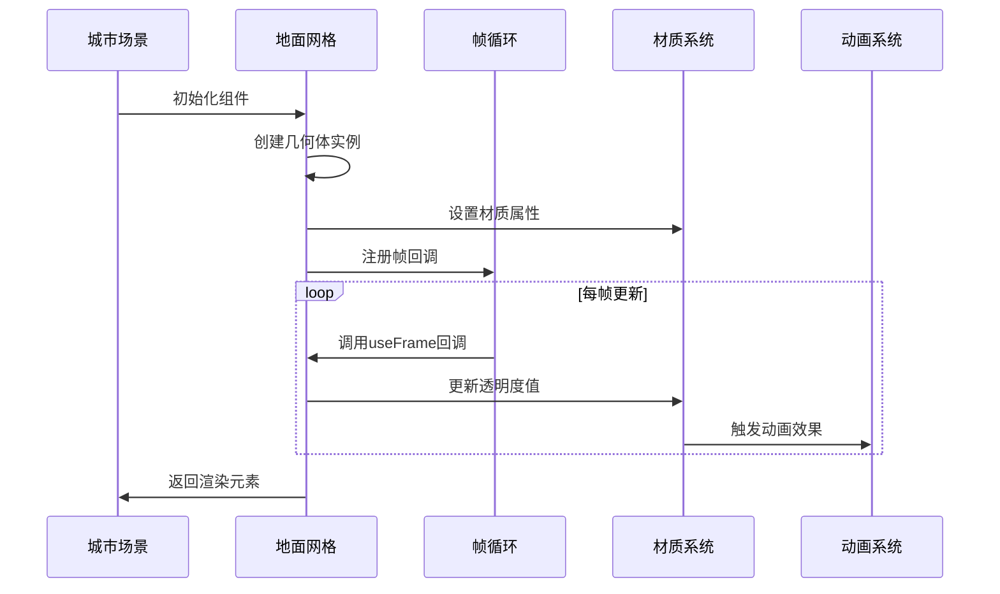
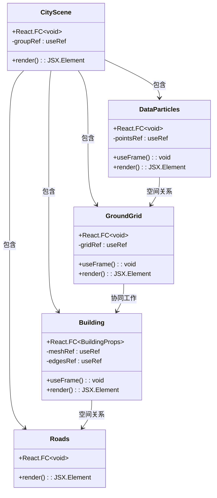
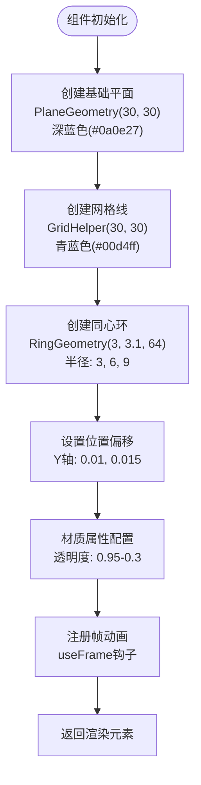
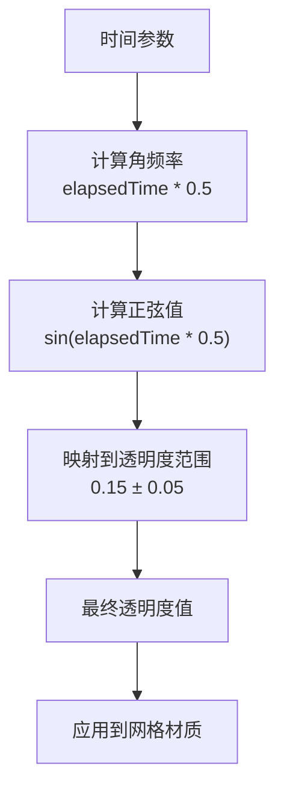
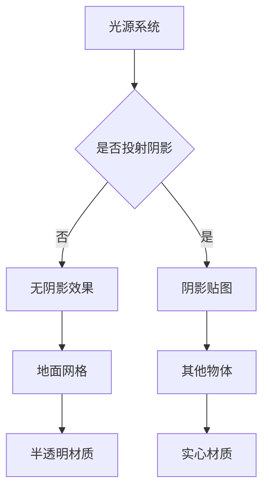
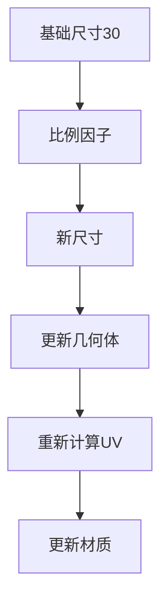
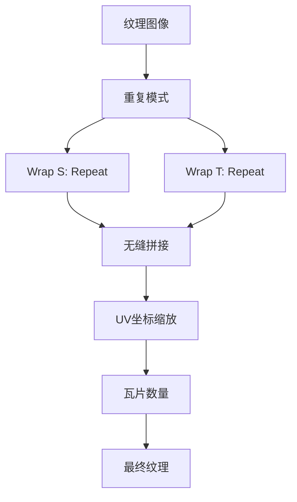
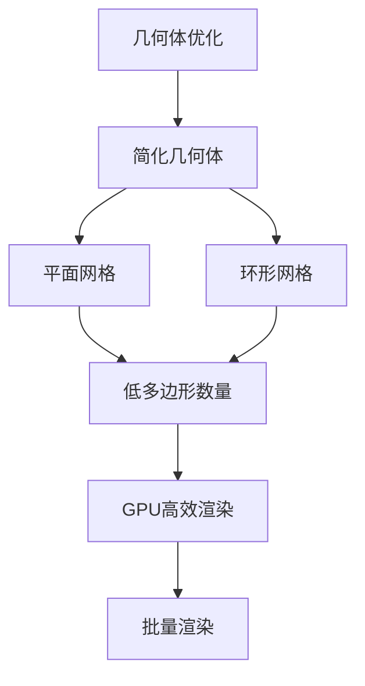
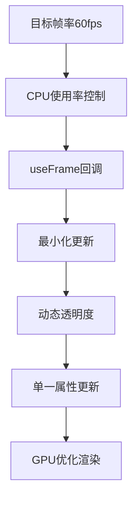
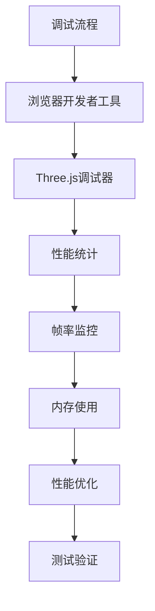

# GroundGrid地面网格系统

<cite>
**本文档引用的文件**
- [GroundGrid.tsx](file://src/components/3d/GroundGrid.tsx)
- [CityScene.tsx](file://src/components/3d/CityScene.tsx)
- [Building.tsx](file://src/components/3d/Building.tsx)
- [Roads.tsx](file://src/components/3d/Roads.tsx)
- [DataParticles.tsx](file://src/components/3d/DataParticles.tsx)
- [index.ts](file://src/components/3d/index.ts)
- [README.md](file://README.md)
- [package.json](file://package.json)
</cite>

## 目录
1. [简介](#简介)
2. [项目结构](#项目结构)
3. [核心组件](#核心组件)
4. [架构概览](#架构概览)
5. [详细组件分析](#详细组件分析)
6. [依赖分析](#依赖分析)
7. [性能考虑](#性能考虑)
8. [故障排除指南](#故障排除指南)
9. [结论](#结论)

## 简介

GroundGrid地面网格系统是智慧城市数据孪生可视化大屏项目中的核心3D组件之一。该系统通过Three.js和@react-three/fiber构建了一个具有动态效果的地面网格，为整个3D城市场景提供了基础的地面支撑和导航参考。

该系统采用赛博朋克风格设计，使用深色背景配合科技蓝渐变配色，营造出未来感十足的城市夜景效果。地面网格不仅提供了视觉上的层次感，还通过动态透明度变化和多层同心圆标识增强了空间感知。

## 项目结构

该项目采用模块化的3D组件架构，GroundGrid作为其中的核心组件，与其他3D组件协同工作，共同构建完整的智慧城市可视化场景。

```mermaid
graph TB
subgraph "3D组件目录"
GG[GroundGrid.tsx<br/>地面网格组件]
CS[CityScene.tsx<br/>城市场景容器]
BD[Building.tsx<br/>建筑组件]
RD[Roads.tsx<br/>道路组件]
DP[DataParticles.tsx<br/>数据粒子系统]
end
subgraph "应用入口"
APP[App.tsx<br/>主应用组件]
MAIN[main.tsx<br/>入口文件]
end
subgraph "外部依赖"
THREE[Three.js<br/>3D渲染引擎]
R3F[@react-three/fiber<br/>React Three Fiber]
DREI[@react-three/drei<br/>辅助工具库]
end
APP --> CS
CS --> GG
CS --> BD
CS --> RD
CS --> DP
GG --> THREE
CS --> THREE
BD --> THREE
RD --> THREE
DP --> THREE
GG --> R3F
CS --> R3F
BD --> R3F
RD --> R3F
DP --> R3F
GG --> DREI
CS --> DREI
BD --> DREI
RD --> DREI
DP --> DREI
```

**图表来源**
- [CityScene.tsx:40-53](file://src/components/3d/CityScene.tsx#L40-L53)
- [GroundGrid.tsx:5-42](file://src/components/3d/GroundGrid.tsx#L5-L42)

**章节来源**
- [README.md:49-63](file://README.md#L49-L63)
- [package.json:12-26](file://package.json#L12-L26)

## 核心组件

GroundGrid组件是整个3D场景的基础地面系统，它由多个几何体组合而成，包括基础平面、网格线、中心辐射圈等元素。该组件采用了React Hooks模式，利用useFrame实现每帧动画更新。

### 几何体构成

GroundGrid系统包含以下主要几何体组件：

1. **基础地面平面**：使用PlaneGeometry创建30x30大小的平面，颜色为深蓝色(#0a0e27)，半透明度0.95
2. **网格线系统**：使用GridHelper创建30x30网格，网格线颜色为青蓝色(#00d4ff)，背景色为深蓝(#0a3040)
3. **中心辐射圈**：三个同心环组成，半径分别为3、6、9，使用RingGeometry创建，提供精确的定位参考

### 材质属性

所有几何体都使用了透明材质，实现了半透明的视觉效果：
- 基础地面：meshBasicMaterial，透明度0.95
- 网格线：meshBasicMaterial，透明度0.15±0.05的动态变化
- 辐射圈：meshBasicMaterial，双面渲染，透明度在0.1-0.3之间变化

**章节来源**
- [GroundGrid.tsx:15-42](file://src/components/3d/GroundGrid.tsx#L15-L42)

## 架构概览

GroundGrid系统在整个3D场景架构中扮演着基础支撑的角色，它与建筑、道路、数据粒子等组件共同构建完整的智慧城市可视化场景。



**图表来源**
- [GroundGrid.tsx:8-13](file://src/components/3d/GroundGrid.tsx#L8-L13)
- [CityScene.tsx:40-53](file://src/components/3d/CityScene.tsx#L40-L53)

### 组件关系图



**图表来源**
- [GroundGrid.tsx:5-46](file://src/components/3d/GroundGrid.tsx#L5-L46)
- [CityScene.tsx:40-56](file://src/components/3d/CityScene.tsx#L40-L56)
- [Building.tsx:13-66](file://src/components/3d/Building.tsx#L13-L66)
- [Roads.tsx:3-47](file://src/components/3d/Roads.tsx#L3-L47)
- [DataParticles.tsx:7-76](file://src/components/3d/DataParticles.tsx#L7-L76)

**章节来源**
- [CityScene.tsx:40-56](file://src/components/3d/CityScene.tsx#L40-L56)

## 详细组件分析

### GroundGrid组件深度解析

GroundGrid组件采用了精心设计的几何体组合策略，通过多层次的视觉元素构建出完整的地面网格系统。

#### 几何生成机制



**图表来源**
- [GroundGrid.tsx:15-42](file://src/components/3d/GroundGrid.tsx#L15-L42)
- [GroundGrid.tsx:8-13](file://src/components/3d/GroundGrid.tsx#L8-L13)

#### 动态透明度算法

GroundGrid系统实现了基于时间的动态透明度变化，通过正弦函数产生平滑的闪烁效果：



**图表来源**
- [GroundGrid.tsx:8-13](file://src/components/3d/GroundGrid.tsx#L8-L13)

#### 坐标系统设计

GroundGrid系统采用了标准的右手坐标系设计：
- **地面平面**：绕X轴负90度旋转，位于Y=0平面
- **网格线**：位于Y=0.01高度，略微高于地面平面
- **辐射圈**：位于Y=0.015高度，明显高于网格线
- **位置基准**：所有元素都以原点(0,0,0)为中心对齐

#### UV映射技术

虽然GroundGrid使用的是简单的几何体而非复杂的纹理贴图，但其UV映射遵循了以下原则：
- **平面UV**：基础地面使用标准的平面UV映射，确保材质均匀分布
- **网格UV**：网格线系统不依赖UV映射，通过几何体的内置网格属性实现
- **环形UV**：辐射圈使用环形UV映射，从内径到外径的连续纹理过渡

**章节来源**
- [GroundGrid.tsx:15-42](file://src/components/3d/GroundGrid.tsx#L15-L42)

### 材质属性配置

GroundGrid系统的所有材质都经过精心调优，以实现最佳的视觉效果和性能表现。

#### 材质类型选择

| 几何体 | 材质类型 | 透明度 | 特殊属性 |
|--------|----------|--------|----------|
| 基础地面 | meshBasicMaterial | 0.95 | 基础材质，无光照计算 |
| 网格线 | meshBasicMaterial | 0.15±0.05 | 动态透明度 |
| 辐射圈 | meshBasicMaterial | 0.1-0.3 | 双面渲染 |

#### 光照计算机制

由于GroundGrid使用的是非光照材质(mesBasicMaterial)，因此不参与传统的光照计算：
- **无阴影投射**：所有材质都不投射或接收阴影
- **环境光影响**：仅受环境光影响，不受方向光影响
- **实时更新**：透明度通过useFrame钩子实时更新

#### 阴影处理策略



**图表来源**
- [GroundGrid.tsx:18-40](file://src/components/3d/GroundGrid.tsx#L18-L40)

**章节来源**
- [GroundGrid.tsx:18-40](file://src/components/3d/GroundGrid.tsx#L18-L40)

### 网格尺寸控制

GroundGrid系统提供了灵活的尺寸控制机制，支持不同规模的城市场景需求。

#### 标准尺寸规格

| 组件 | 尺寸规格 | 分辨率 | 用途 |
|------|----------|--------|------|
| 基础地面 | 30×30 | 30×30 | 整个场景基础 |
| 网格线 | 30×30 | 30×30 | 空间导航参考 |
| 辐射圈 | 内径3-外径3.1 | 64段 | 精确定位 |

#### 尺寸扩展机制



**图表来源**
- [GroundGrid.tsx:18-39](file://src/components/3d/GroundGrid.tsx#L18-L39)

**章节来源**
- [GroundGrid.tsx:18-39](file://src/components/3d/GroundGrid.tsx#L18-L39)

### 纹理重复与无缝拼接

虽然GroundGrid主要使用纯色材质，但其设计理念同样适用于需要纹理贴图的场景：

#### 纹理重复技术



#### UV坐标计算

对于需要纹理贴图的地面网格，UV坐标计算公式为：
- **U坐标**：x坐标 / 地面宽度 + 纹理平移
- **V坐标**：z坐标 / 地面高度 + 纹理平移

**章节来源**
- [GroundGrid.tsx:18-39](file://src/components/3d/GroundGrid.tsx#L18-L39)

## 依赖分析

GroundGrid系统依赖于现代WebGL 3D渲染生态系统，通过合理的依赖管理实现了高性能的可视化效果。

### 核心依赖关系

```mermaid
graph TB
subgraph "应用层"
GG[GroundGrid组件]
CS[CityScene容器]
end
subgraph "3D渲染层"
THREE[Three.js核心]
R3F[@react-three/fiber]
DREI[@react-three/drei]
end
subgraph "类型系统"
TS[TypeScript]
TYPES[类型定义]
end
GG --> R3F
CS --> R3F
R3F --> THREE
DREI --> THREE
GG --> TYPES
CS --> TYPES
R3F --> TYPES
THREE --> TYPES
```

**图表来源**
- [package.json:12-26](file://package.json#L12-L26)
- [GroundGrid.tsx:1-4](file://src/components/3d/GroundGrid.tsx#L1-L4)

### 版本兼容性

| 依赖包 | 当前版本 | 最小兼容版本 | 兼容性状态 |
|--------|----------|--------------|------------|
| three | ^0.184.0 | ^0.180.0 | ✅ 兼容 |
| @react-three/fiber | ^9.6.1 | ^9.0.0 | ✅ 兼容 |
| @react-three/drei | ^10.7.7 | ^10.0.0 | ✅ 兼容 |

### 性能依赖

GroundGrid系统的性能主要依赖于以下因素：
- **几何体复杂度**：当前使用简单几何体，性能开销较低
- **材质数量**：共3个材质实例，内存占用较小
- **动画频率**：每帧更新一次，CPU负载可控
- **渲染批次**：单个渲染批次，GPU效率高

**章节来源**
- [package.json:12-26](file://package.json#L12-L26)

## 性能考虑

GroundGrid系统在设计时充分考虑了性能优化，通过多种技术手段确保在各种设备上都能流畅运行。

### 渲染性能优化

#### 几何体优化



#### 材质优化策略

| 优化维度 | 实现方式 | 性能收益 |
|----------|----------|----------|
| 材质类型 | 使用meshBasicMaterial | 减少光照计算 |
| 透明度 | 集中管理 | 减少状态切换 |
| 动画 | useFrame钩子 | 减少不必要的重渲染 |

### 内存使用分析

GroundGrid系统的内存使用情况如下：
- **几何体内存**：约2KB用于存储顶点数据
- **材质内存**：约1KB用于存储材质属性
- **纹理内存**：0KB（使用纯色材质）
- **总内存**：约3KB

### 帧率优化



**章节来源**
- [GroundGrid.tsx:8-13](file://src/components/3d/GroundGrid.tsx#L8-L13)

## 故障排除指南

### 常见问题及解决方案

#### 问题1：网格线不可见

**症状**：地面网格线完全不可见
**可能原因**：
- 透明度过低
- Y轴位置过高
- 材质颜色与背景相近

**解决方案**：
1. 检查透明度设置，确保大于0.1
2. 验证Y轴位置偏移(0.01)
3. 调整网格线颜色对比度

#### 问题2：动画效果异常

**症状**：网格闪烁不规律或停止
**可能原因**：
- useFrame钩子未正确注册
- 时间参数异常
- 材质类型不支持透明度

**解决方案**：
1. 确认useFrame回调函数存在
2. 检查state.clock.elapsedTime的有效性
3. 验证meshBasicMaterial支持透明度

#### 问题3：渲染性能下降

**症状**：帧率显著降低
**可能原因**：
- 几何体过于复杂
- 材质过多
- 动画频率过高

**解决方案**：
1. 简化几何体分辨率
2. 合并相似材质
3. 降低动画更新频率

### 调试技巧

#### 开发者工具使用



#### 性能监控指标

| 指标 | 正常范围 | 警告阈值 | 错误阈值 |
|------|----------|----------|----------|
| FPS | 55-60 | 45 | <40 |
| GPU内存 | <50% | >70% | >85% |
| CPU使用率 | <50% | >70% | >85% |
| 三角形数量 | <1000 | >2000 | >5000 |

**章节来源**
- [GroundGrid.tsx:8-13](file://src/components/3d/GroundGrid.tsx#L8-L13)

## 结论

GroundGrid地面网格系统是一个精心设计的3D可视化组件，它通过简洁而有效的几何体组合、智能的材质管理和优雅的动画效果，为整个智慧城市可视化项目奠定了坚实的基础。

### 系统优势

1. **设计美学**：赛博朋克风格的色彩搭配和动态效果
2. **性能高效**：使用简单几何体和优化的材质配置
3. **扩展性强**：模块化设计便于功能扩展和定制
4. **维护友好**：清晰的代码结构和完善的注释说明

### 技术特色

- **动态透明度**：基于正弦函数的平滑闪烁效果
- **多层结构**：基础平面、网格线、辐射圈的层次设计
- **坐标系统**：标准化的右手坐标系应用
- **材质优化**：针对性能的材质类型选择

### 未来发展

GroundGrid系统为未来的功能扩展提供了良好的基础：
- 支持纹理贴图的无缝拼接技术
- 可扩展的尺寸控制系统
- 更丰富的视觉效果选项
- 与其他3D组件的深度集成

该系统成功地平衡了视觉效果与性能要求，在提供精美视觉体验的同时，确保了在各种硬件配置下的稳定运行。