# Roads道路网络系统

<cite>
**本文档引用的文件**
- [Roads.tsx](file://src/components/3d/Roads.tsx)
- [CityScene.tsx](file://src/components/3d/CityScene.tsx)
- [CityModel.tsx](file://src/components/3d/CityModel.tsx)
- [GroundGrid.tsx](file://src/components/3d/GroundGrid.tsx)
- [Building.tsx](file://src/components/3d/Building.tsx)
- [DataParticles.tsx](file://src/components/3d/DataParticles.tsx)
- [App.tsx](file://src/App.tsx)
- [README.md](file://README.md)
- [global.css](file://src/styles/global.css)
- [mockData.ts](file://src/data/mockData.ts)
- [package.json](file://package.json)
</cite>

## 目录
1. [简介](#简介)
2. [项目结构](#项目结构)
3. [核心组件](#核心组件)
4. [架构概览](#架构概览)
5. [详细组件分析](#详细组件分析)
6. [依赖关系分析](#依赖关系分析)
7. [性能考虑](#性能考虑)
8. [故障排除指南](#故障排除指南)
9. [结论](#结论)

## 简介

Roads道路网络系统是智慧城市数据孪生可视化平台的核心3D组件之一，负责生成和渲染城市道路网络。该系统采用Three.js和@react-three/fiber构建，实现了程序化的道路几何体生成、动态材质系统和智能连接逻辑。系统支持主干道、次干道的多层次道路网络，以及道路中心线的发光效果，为整个城市3D场景提供了基础设施支撑。

该系统具有以下特点：
- 程序化道路几何体生成算法
- 动态材质和透明度控制
- 智能道路连接逻辑
- 实时动画效果
- 可扩展的道路样式系统

## 项目结构

智慧城市数据孪生平台采用模块化架构设计，Roads系统作为3D组件的重要组成部分，与其他UI组件协同工作。

```mermaid
graph TB
subgraph "应用层"
App[App.tsx]
Layout[布局组件]
Charts[数据图表]
end
subgraph "3D渲染层"
CityModel[CityModel.tsx]
CityScene[CityScene.tsx]
Roads[Roads.tsx]
Building[Building.tsx]
GroundGrid[GroundGrid.tsx]
Particles[DataParticles.tsx]
end
subgraph "依赖库"
React[React 18]
ThreeJS[Three.js 0.184]
Fiber[@react-three/fiber]
Drei[@react-three/drei]
end
App --> CityModel
CityModel --> CityScene
CityScene --> Roads
CityScene --> Building
CityScene --> GroundGrid
CityScene --> Particles
CityModel --> React
CityModel --> ThreeJS
CityModel --> Fiber
CityModel --> Drei
```

**图表来源**
- [App.tsx:43-93](file://src/App.tsx#L43-L93)
- [CityModel.tsx:6-30](file://src/components/3d/CityModel.tsx#L6-L30)

**章节来源**
- [README.md:49-71](file://README.md#L49-L71)
- [package.json:12-26](file://package.json#L12-L26)

## 核心组件

Roads道路网络系统由多个相互协作的组件构成，每个组件都有特定的功能和职责。

### 主要组件架构

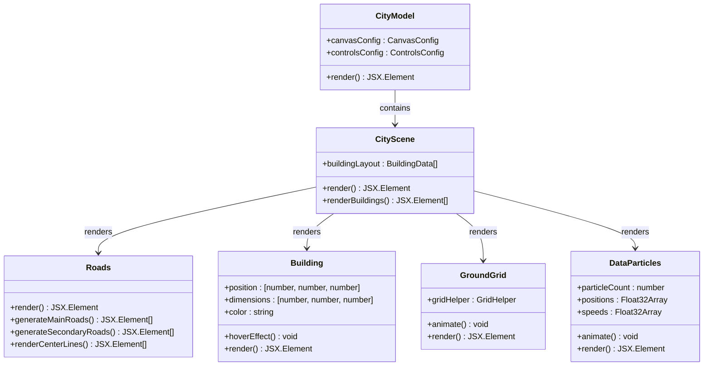

**图表来源**
- [Roads.tsx:3-47](file://src/components/3d/Roads.tsx#L3-L47)
- [CityScene.tsx:40-53](file://src/components/3d/CityScene.tsx#L40-L53)
- [CityModel.tsx:6-47](file://src/components/3d/CityModel.tsx#L6-L47)

### 组件职责分配

| 组件名称 | 主要职责 | 关键功能 |
|---------|---------|---------|
| Roads | 道路几何体生成 | 主干道、次干道、中心线发光效果 |
| CityScene | 场景组织 | 建筑布局管理、场景组合 |
| CityModel | 3D渲染容器 | Canvas配置、光照设置、控制器 |
| GroundGrid | 地面网格系统 | 基础地面、网格线、辐射圈 |
| Building | 建筑渲染 | 程序化建筑、发光效果、交互响应 |
| DataParticles | 数据粒子系统 | 流动粒子效果、动画控制 |

**章节来源**
- [Roads.tsx:1-47](file://src/components/3d/Roads.tsx#L1-L47)
- [CityScene.tsx:8-38](file://src/components/3d/CityScene.tsx#L8-L38)
- [CityModel.tsx:9-29](file://src/components/3d/CityModel.tsx#L9-L29)

## 架构概览

Roads系统采用分层架构设计，从底层的几何体生成到上层的场景集成，形成了完整的道路网络渲染体系。

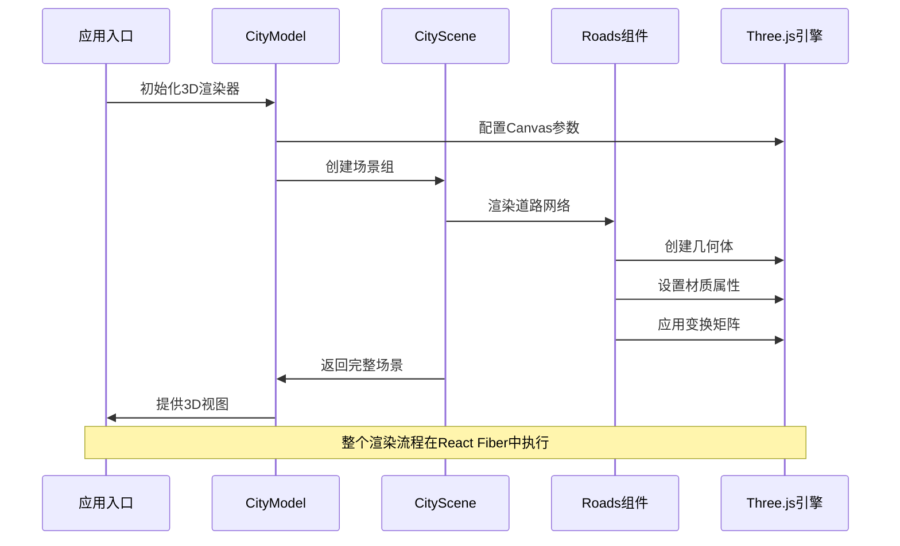

**图表来源**
- [App.tsx:43-93](file://src/App.tsx#L43-L93)
- [CityModel.tsx:9-29](file://src/components/3d/CityModel.tsx#L9-L29)
- [CityScene.tsx:40-53](file://src/components/3d/CityScene.tsx#L40-L53)

### 数据流架构

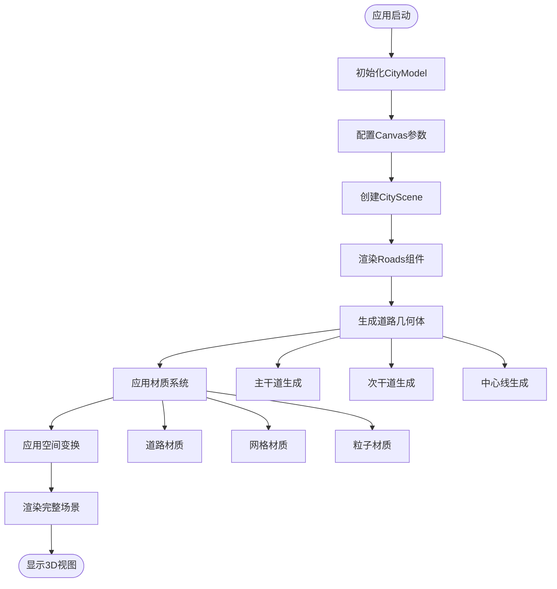

**图表来源**
- [Roads.tsx:7-41](file://src/components/3d/Roads.tsx#L7-L41)
- [CityScene.tsx:40-53](file://src/components/3d/CityScene.tsx#L40-L53)

## 详细组件分析

### Roads组件深度解析

Roads组件是道路网络系统的核心，负责生成和渲染城市道路网络的所有几何体。

#### 几何体生成算法

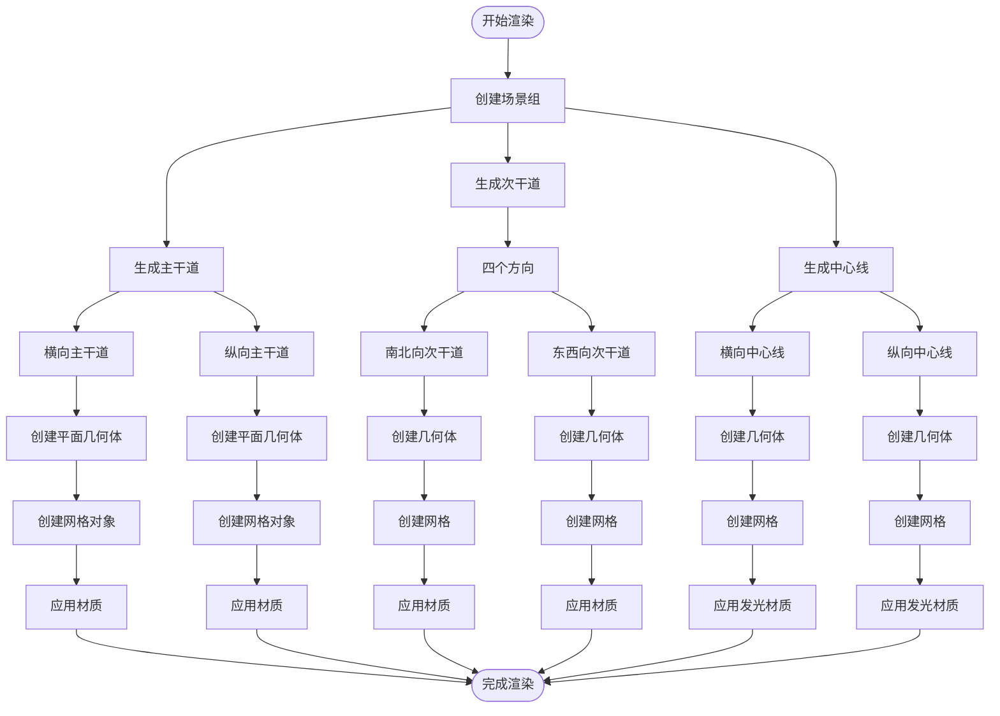

**图表来源**
- [Roads.tsx:6-41](file://src/components/3d/Roads.tsx#L6-L41)

#### 材质系统设计

Roads组件采用了统一的材质系统，通过不同的颜色和透明度实现层次化的视觉效果：

| 材质类型 | 颜色值 | 透明度 | 几何尺寸 | 用途 |
|---------|-------|--------|---------|------|
| 主干道路面 | `#00d4ff` | 0.08 | 20×0.6 | 主要交通干道 |
| 次干道路面 | `#00d4ff` | 0.08 | 16×0.4 | 辅助交通道路 |
| 中心线 | `#00d4ff` | 0.4 | 20×0.05 | 道路线条标识 |

#### 智能连接算法

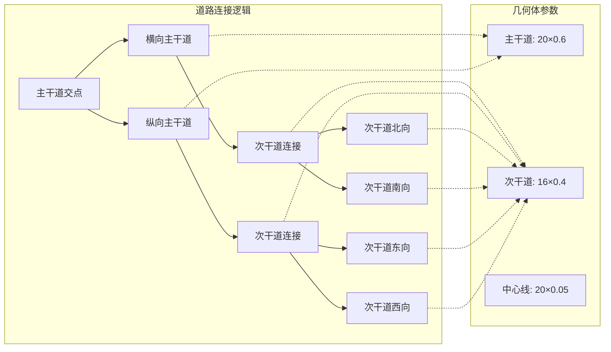

**图表来源**
- [Roads.tsx:6-32](file://src/components/3d/Roads.tsx#L6-L32)

**章节来源**
- [Roads.tsx:3-47](file://src/components/3d/Roads.tsx#L3-L47)

### CityScene场景组织

CityScene组件负责协调所有3D元素的渲染顺序和空间关系。

#### 场景布局算法

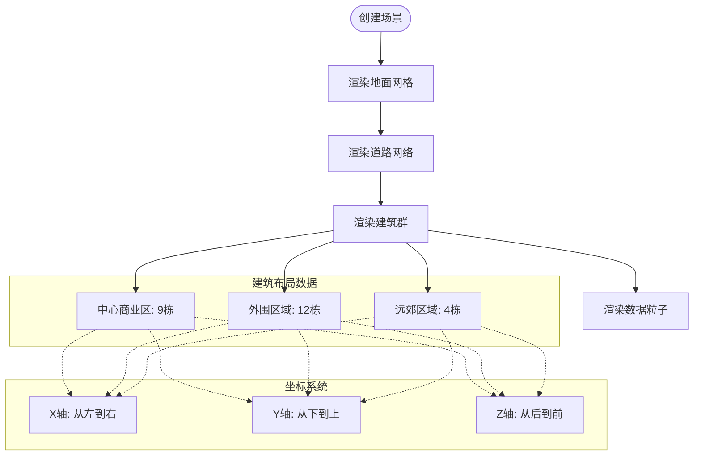

**图表来源**
- [CityScene.tsx:8-38](file://src/components/3d/CityScene.tsx#L8-L38)
- [CityScene.tsx:40-53](file://src/components/3d/CityScene.tsx#L40-L53)

**章节来源**
- [CityScene.tsx:8-38](file://src/components/3d/CityScene.tsx#L8-L38)
- [CityScene.tsx:40-53](file://src/components/3d/CityScene.tsx#L40-L53)

### CityModel渲染容器

CityModel组件提供了完整的3D渲染环境配置。

#### 光照系统设计

```mermaid
graph TB
subgraph "光源配置"
Ambient[Ambient Light<br/>强度: 0.3<br/>颜色: 白色]
Directional[Directional Light<br/>位置: [10, 20, 10]<br/>强度: 0.5<br/>颜色: #00d4ff]
Point[Point Light<br/>位置: [-10, 15, -10]<br/>强度: 0.3<br/>颜色: #7b2ff7]
end
subgraph "渲染效果"
Fog[Fog<br/>颜色: #0a0e27<br/>距离: 25-55]
Stars[Stars<br/>数量: 2000<br/>半径: 100<br/>深度: 50]
end
Ambient --> Fog
Directional --> Fog
Point --> Fog
Ambient --> Stars
Directional --> Stars
Point --> Stars
```

**图表来源**
- [CityModel.tsx:15-28](file://src/components/3d/CityModel.tsx#L15-L28)

**章节来源**
- [CityModel.tsx:6-47](file://src/components/3d/CityModel.tsx#L6-L47)

### GroundGrid地面系统

GroundGrid组件提供了基础地面和网格辅助线系统。

#### 动画效果实现

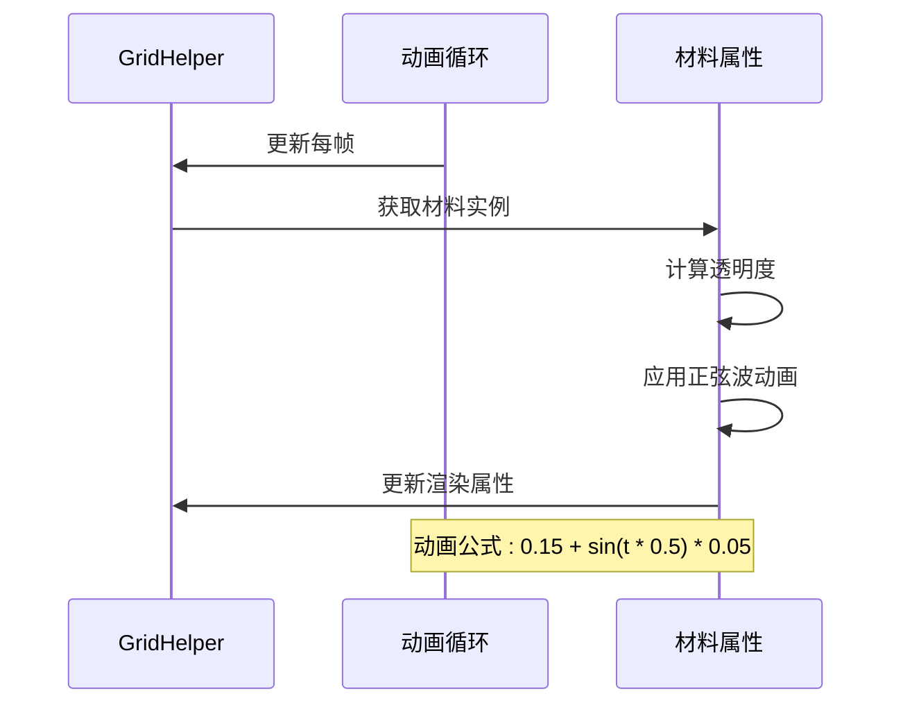

**图表来源**
- [GroundGrid.tsx:8-13](file://src/components/3d/GroundGrid.tsx#L8-L13)

**章节来源**
- [GroundGrid.tsx:5-46](file://src/components/3d/GroundGrid.tsx#L5-L46)

### Building建筑组件

Building组件展示了程序化建筑的复杂渲染技术。

#### 发光效果算法

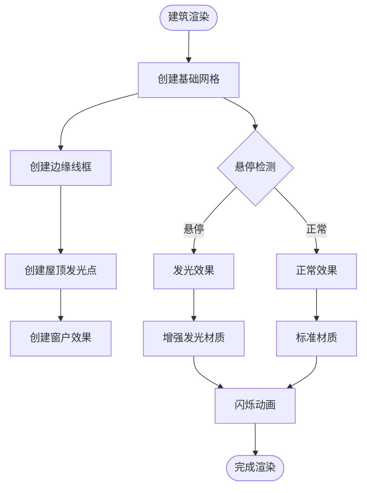

**图表来源**
- [Building.tsx:18-23](file://src/components/3d/Building.tsx#L18-L23)

**章节来源**
- [Building.tsx:13-66](file://src/components/3d/Building.tsx#L13-L66)

### DataParticles粒子系统

DataParticles组件实现了动态数据流动效果。

#### 粒子运动算法

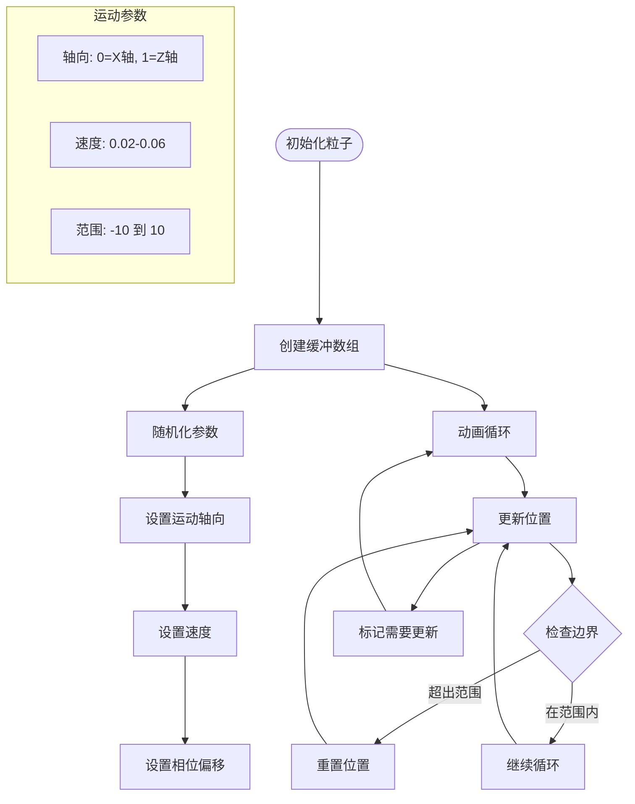

**图表来源**
- [DataParticles.tsx:10-36](file://src/components/3d/DataParticles.tsx#L10-L36)
- [DataParticles.tsx:38-51](file://src/components/3d/DataParticles.tsx#L38-L51)

**章节来源**
- [DataParticles.tsx:7-76](file://src/components/3d/DataParticles.tsx#L7-L76)

## 依赖关系分析

Roads系统依赖于现代WebGL技术和React生态系统的多个关键库。

### 核心依赖关系

```mermaid
graph TB
subgraph "应用层"
App[App.tsx]
Layout[布局组件]
Charts[数据图表]
end
subgraph "3D渲染层"
CityModel[CityModel.tsx]
CityScene[CityScene.tsx]
Roads[Roads.tsx]
Building[Building.tsx]
GroundGrid[GroundGrid.tsx]
Particles[DataParticles.tsx]
end
subgraph "第三方库"
React[React 18]
Fiber[@react-three/fiber]
ThreeJS[Three.js 0.184]
Drei[@react-three/drei]
Framer[Framer Motion]
Tailwind[Tailwind CSS]
end
App --> CityModel
CityModel --> React
CityModel --> Fiber
CityModel --> ThreeJS
CityModel --> Drei
CityScene --> Roads
CityScene --> Building
CityScene --> GroundGrid
CityScene --> Particles
App --> Framer
App --> Tailwind
```

**图表来源**
- [package.json:12-26](file://package.json#L12-L26)
- [App.tsx:1-16](file://src/App.tsx#L1-L16)

### 版本兼容性

| 依赖包 | 当前版本 | 最小兼容版本 | 用途 |
|-------|---------|-------------|------|
| react | ^19.2.6 | ^18.0.0 | 用户界面框架 |
| three | ^0.184.0 | ^0.170.0 | WebGL渲染引擎 |
| @react-three/fiber | ^9.6.1 | ^8.0.0 | React-Three.js绑定 |
| @react-three/drei | ^10.7.7 | ^9.0.0 | Three.js工具集 |
| framer-motion | ^12.39.0 | ^10.0.0 | 动画系统 |

**章节来源**
- [package.json:12-26](file://package.json#L12-L26)

## 性能考虑

Roads系统在设计时充分考虑了性能优化，特别是在大规模道路渲染场景下的表现。

### 渲染性能优化策略

#### 几何体优化

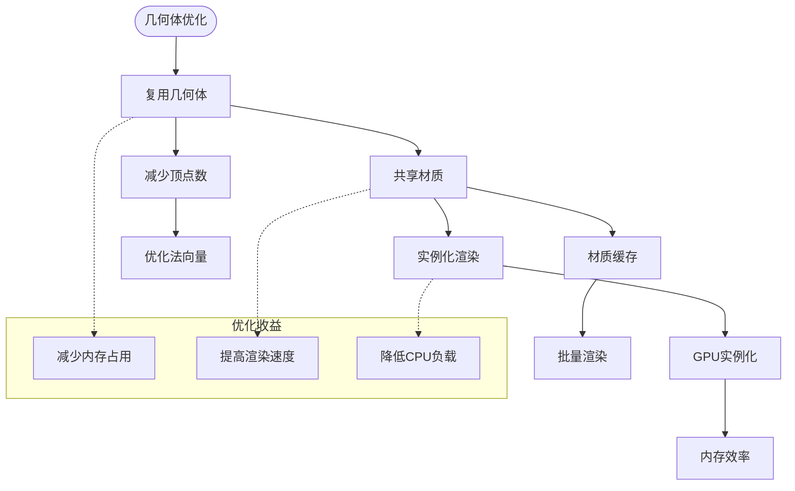

#### 动画性能优化

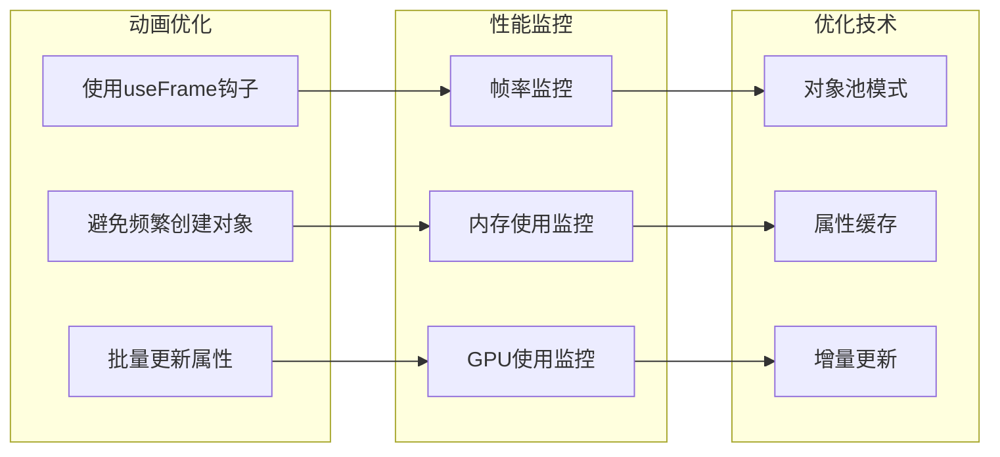

### 内存管理策略

| 优化技术 | 实现方式 | 性能收益 |
|---------|---------|---------|
| 几何体复用 | 使用相同的PlaneGeometry实例 | 减少内存分配 |
| 材质共享 | 复用相同的Material实例 | 降低GPU状态切换 |
| 对象池 | 缓存和重用临时对象 | 减少垃圾回收压力 |
| 增量更新 | 只更新变化的属性 | 提高渲染效率 |

**章节来源**
- [Roads.tsx:7-41](file://src/components/3d/Roads.tsx#L7-L41)
- [GroundGrid.tsx:8-13](file://src/components/3d/GroundGrid.tsx#L8-L13)
- [DataParticles.tsx:38-51](file://src/components/3d/DataParticles.tsx#L38-L51)

## 故障排除指南

### 常见问题及解决方案

#### 道路渲染问题

| 问题描述 | 可能原因 | 解决方案 |
|---------|---------|---------|
| 道路不显示 | 几何体参数错误 | 检查planeGeometry参数 |
| 颜色异常 | 材质颜色设置问题 | 验证颜色值格式 |
| 透明度异常 | 透明度设置错误 | 检查透明度范围(0-1) |
| 位置偏移 | 位置变换错误 | 验证position参数 |

#### 性能问题诊断

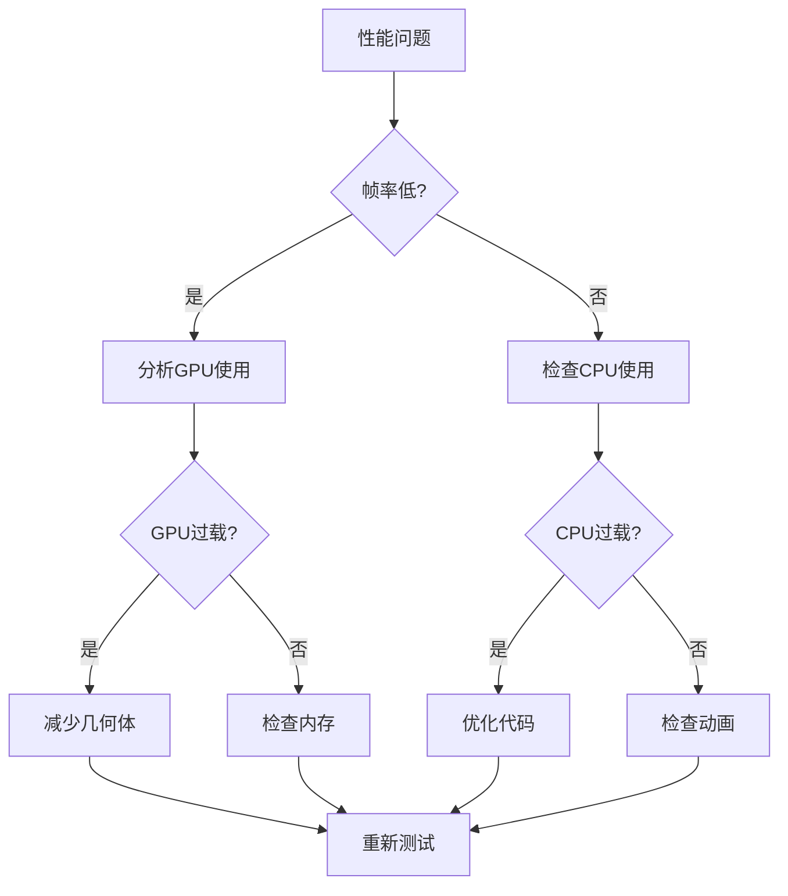

#### 调试工具使用

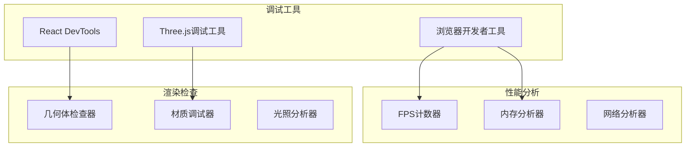

**章节来源**
- [Roads.tsx:1-47](file://src/components/3d/Roads.tsx#L1-L47)
- [CityModel.tsx:20-27](file://src/components/3d/CityModel.tsx#L20-L27)

## 结论

Roads道路网络系统展现了现代WebGL技术在智慧城市可视化中的强大能力。通过精心设计的程序化生成算法、智能的连接逻辑和高效的材质系统，该系统成功地为整个城市3D场景提供了坚实的基础设施。

### 系统优势总结

1. **程序化生成**: 通过数学算法生成道路网络，具有高度的可扩展性和一致性
2. **智能连接**: 自动化的道路连接算法确保了合理的拓扑结构
3. **动态效果**: 实时动画和发光效果增强了视觉体验
4. **性能优化**: 多层次的优化策略确保了流畅的渲染性能
5. **模块化设计**: 清晰的组件分离便于维护和扩展

### 技术创新点

- **层次化道路系统**: 主干道与次干道的分级设计
- **智能材质系统**: 统一的颜色和透明度控制
- **动态连接算法**: 自适应的道路连接逻辑
- **优化渲染管线**: 多种性能优化技术的综合应用

### 未来发展建议

1. **可配置化**: 增加道路参数的动态配置接口
2. **扩展性**: 支持更多类型的交通设施
3. **交互性**: 添加用户交互和编辑功能
4. **数据驱动**: 集成实时交通数据驱动的动态效果

该系统为智慧城市数据可视化提供了一个优秀的技术范例，其设计理念和实现方法值得在类似项目中借鉴和应用。