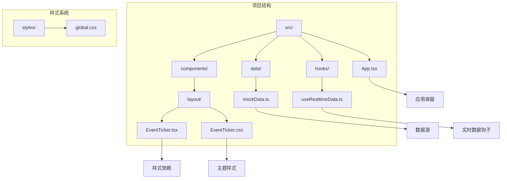
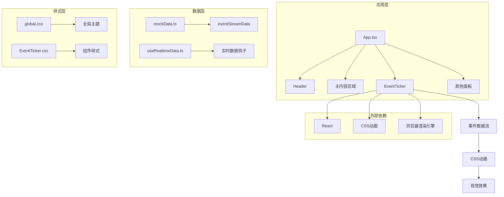
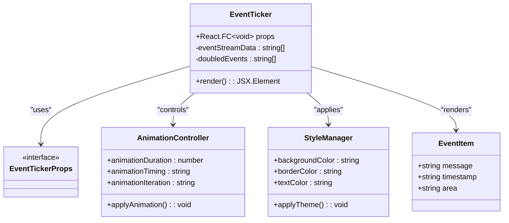
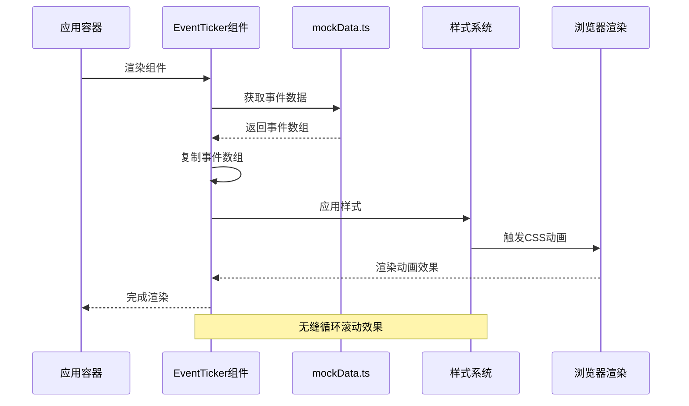
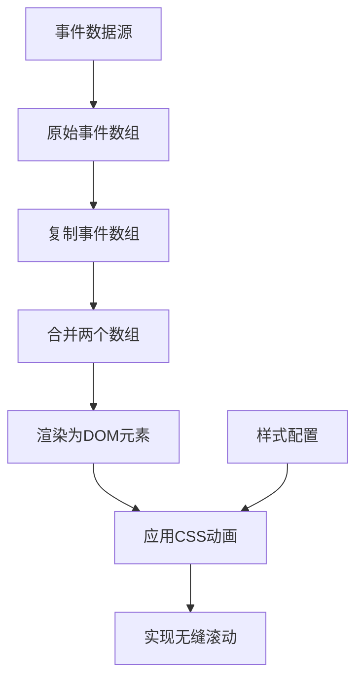
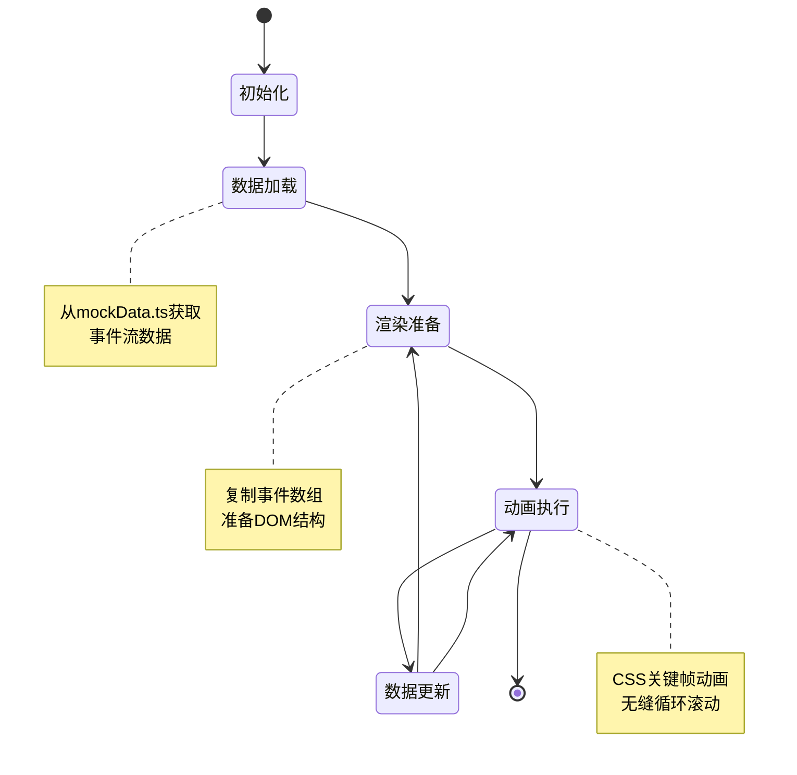
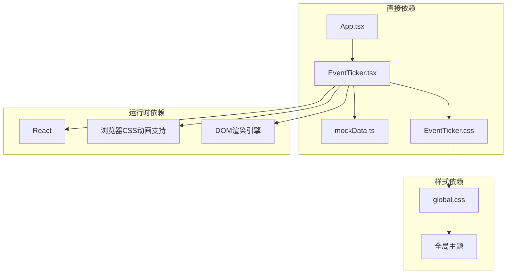
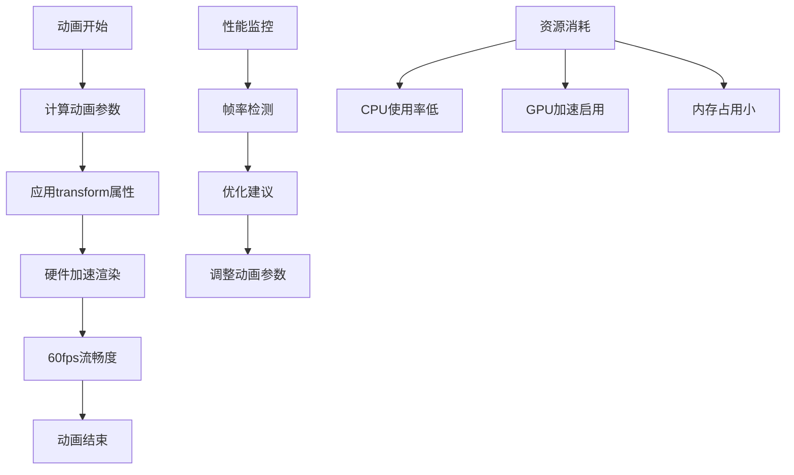

# EventTicker 事件滚动条组件

<cite>
**本文档引用的文件**
- [EventTicker.tsx](file://src/components/layout/EventTicker.tsx)
- [EventTicker.css](file://src/components/layout/EventTicker.css)
- [mockData.ts](file://src/data/mockData.ts)
- [useRealtimeData.ts](file://src/hooks/useRealtimeData.ts)
- [App.tsx](file://src/App.tsx)
- [global.css](file://src/styles/global.css)
- [AlertList.tsx](file://src/components/charts/AlertList.tsx)
</cite>

## 目录
1. [简介](#简介)
2. [项目结构](#项目结构)
3. [核心组件](#核心组件)
4. [架构概览](#架构概览)
5. [详细组件分析](#详细组件分析)
6. [依赖关系分析](#依赖关系分析)
7. [性能考虑](#性能考虑)
8. [故障排除指南](#故障排除指南)
9. [结论](#结论)
10. [附录](#附录)

## 简介

EventTicker 是一个专门设计用于智慧城市数据可视化仪表板的底部事件滚动条组件。该组件采用赛博朋克风格设计，通过CSS动画实现无缝循环滚动效果，为用户提供实时的事件信息展示。组件基于React函数式组件构建，结合CSS关键帧动画实现流畅的视觉体验。

该组件的主要功能包括：
- 实时事件信息的无缝循环滚动展示
- 动态事件数据的自动更新机制
- 赛博朋克风格的主题设计
- 响应式布局适配
- 性能优化的渲染策略

## 项目结构

EventTicker 组件位于项目的布局组件目录中，与其它UI组件共同构成完整的仪表板界面。



**图表来源**
- [EventTicker.tsx:1-26](file://src/components/layout/EventTicker.tsx#L1-L26)
- [EventTicker.css:1-58](file://src/components/layout/EventTicker.css#L1-L58)
- [mockData.ts:85-96](file://src/data/mockData.ts#L85-L96)
- [useRealtimeData.ts:15-73](file://src/hooks/useRealtimeData.ts#L15-L73)

**章节来源**
- [EventTicker.tsx:1-26](file://src/components/layout/EventTicker.tsx#L1-L26)
- [EventTicker.css:1-58](file://src/components/layout/EventTicker.css#L1-L58)
- [App.tsx:120-122](file://src/App.tsx#L120-L122)

## 核心组件

EventTicker 组件采用简洁而高效的实现方式，主要包含以下核心特性：

### 组件架构
- **类型安全**: 使用TypeScript确保类型安全
- **函数式组件**: 基于React函数式组件模式
- **无状态设计**: 专注于展示逻辑，不维护内部状态
- **纯函数渲染**: 输入相同输出相同，便于测试和维护

### 数据处理机制
- **事件数据源**: 从 mockData.ts 获取实时事件流数据
- **数据复制策略**: 将事件数组复制一份以实现无缝循环
- **动态渲染**: 支持外部数据源的动态更新

### 样式系统
- **渐变背景**: 使用CSS渐变创建科技感背景
- **发光效果**: 通过box-shadow实现蓝色发光效果
- **响应式设计**: 适配不同屏幕尺寸
- **主题一致性**: 与整体赛博朋克主题保持一致

**章节来源**
- [EventTicker.tsx:5-23](file://src/components/layout/EventTicker.tsx#L5-L23)
- [EventTicker.css:1-58](file://src/components/layout/EventTicker.css#L1-L58)

## 架构概览

EventTicker 组件在整个应用架构中的位置和交互关系如下：



**图表来源**
- [App.tsx:43-125](file://src/App.tsx#L43-L125)
- [EventTicker.tsx:1-26](file://src/components/layout/EventTicker.tsx#L1-L26)
- [mockData.ts:85-96](file://src/data/mockData.ts#L85-L96)
- [global.css:50-92](file://src/styles/global.css#L50-L92)

## 详细组件分析

### 组件类图



**图表来源**
- [EventTicker.tsx:5-23](file://src/components/layout/EventTicker.tsx#L5-L23)
- [EventTicker.css:30-57](file://src/components/layout/EventTicker.css#L30-L57)

### 数据流分析



**图表来源**
- [EventTicker.tsx:6-18](file://src/components/layout/EventTicker.tsx#L6-L18)
- [EventTicker.css:34](file://src/components/layout/EventTicker.css#L34)

### 核心实现细节

#### 事件数据处理
组件通过将事件数组复制一份来实现无缝循环效果：



**图表来源**
- [EventTicker.tsx:6](file://src/components/layout/EventTicker.tsx#L6)
- [EventTicker.css:34](file://src/components/layout/EventTicker.css#L34)

#### 样式主题设计
组件采用赛博朋克风格的渐变色彩方案：

| 元素 | 颜色值 | 效果描述 |
|------|--------|----------|
| 背景渐变 | `linear-gradient(0deg, rgba(0, 212, 255, 0.08) 0%, transparent 100%)` | 半透明蓝色渐变背景 |
| 标签背景 | `linear-gradient(90deg, #00d4ff, #7b2ff7)` | 蓝紫色渐变标签 |
| 文本颜色 | `rgba(0, 212, 255, 0.7)` | 半透明白色文本 |
| 圆点发光 | `#00d4ff` + `box-shadow` | 蓝色发光效果 |

**章节来源**
- [EventTicker.tsx:1-26](file://src/components/layout/EventTicker.tsx#L1-L26)
- [EventTicker.css:1-58](file://src/components/layout/EventTicker.css#L1-L58)

### 组件状态管理

虽然EventTicker是无状态组件，但其渲染行为受到外部数据的影响：



**图表来源**
- [EventTicker.tsx:6-18](file://src/components/layout/EventTicker.tsx#L6-L18)
- [EventTicker.css:34](file://src/components/layout/EventTicker.css#L34)

## 依赖关系分析

### 组件间依赖



**图表来源**
- [EventTicker.tsx:1-3](file://src/components/layout/EventTicker.tsx#L1-L3)
- [App.tsx:3](file://src/App.tsx#L3)
- [global.css:1-15](file://src/styles/global.css#L1-L15)

### 外部依赖分析

| 依赖项 | 版本 | 用途 | 重要性 |
|--------|------|------|--------|
| React | ^18.0.0 | 组件框架 | 核心依赖 |
| TypeScript | ^4.0.0 | 类型检查 | 开发必需 |
| CSS动画 | 原生支持 | 视觉效果 | 关键功能 |
| 浏览器兼容性 | ES6+ | 运行时支持 | 基础要求 |

**章节来源**
- [EventTicker.tsx:1](file://src/components/layout/EventTicker.tsx#L1)
- [global.css:1-15](file://src/styles/global.css#L1-L15)

## 性能考虑

### 渲染性能优化

1. **虚拟滚动策略**: 通过CSS动画而非JavaScript动画实现高性能滚动
2. **内存管理**: 使用数组复制策略避免频繁DOM操作
3. **重绘优化**: 利用transform属性进行硬件加速

### 动画性能分析



**图表来源**
- [EventTicker.css:34](file://src/components/layout/EventTicker.css#L34)

### 最佳实践建议

1. **动画时长控制**: 当前设置为40秒，可根据内容长度调整
2. **滚动速度优化**: 通过修改CSS动画时长控制滚动速度
3. **响应式适配**: 确保在不同屏幕尺寸下的显示效果

## 故障排除指南

### 常见问题及解决方案

#### 问题1: 事件滚动不流畅
**症状**: 动画出现卡顿或跳帧
**可能原因**: 
- CSS动画性能不足
- DOM元素过多
- 浏览器兼容性问题

**解决方案**:
- 检查浏览器开发者工具的性能面板
- 减少事件数量或简化样式
- 确认浏览器对CSS transform的支持

#### 问题2: 标签文字溢出
**症状**: 标签文本超出容器宽度
**可能原因**: 文字过长或容器宽度不足

**解决方案**:
- 调整标签容器的flex属性
- 优化文字长度或字体大小
- 添加文本截断样式

#### 问题3: 颜色主题不匹配
**症状**: 组件颜色与整体主题不协调
**可能原因**: 样式覆盖或主题变量未正确应用

**解决方案**:
- 检查global.css中的主题变量
- 确认EventTicker.css的样式优先级
- 验证CSS变量的继承关系

**章节来源**
- [EventTicker.css:1-58](file://src/components/layout/EventTicker.css#L1-L58)
- [global.css:1-92](file://src/styles/global.css#L1-L92)

## 结论

EventTicker 事件滚动条组件是一个精心设计的UI组件，具有以下特点：

### 技术优势
- **简洁高效**: 采用最小化的实现方式，代码量少但功能完整
- **性能优异**: 基于CSS动画实现，避免JavaScript动画的性能开销
- **主题统一**: 与整体赛博朋克风格完美融合
- **易于维护**: 清晰的代码结构和明确的功能边界

### 设计亮点
- **无缝循环**: 通过数组复制实现真正的无限循环效果
- **视觉冲击**: 赛博朋克风格的渐变色彩和发光效果
- **响应式设计**: 适配不同屏幕尺寸和设备类型
- **可扩展性**: 易于添加新的样式主题和动画效果

### 改进建议
1. **参数化配置**: 添加props接口支持自定义滚动速度和样式
2. **事件类型支持**: 扩展支持不同类型事件的差异化展示
3. **无障碍访问**: 添加ARIA标签和键盘导航支持
4. **性能监控**: 集成性能指标监控和优化建议

该组件为智慧城市数据可视化仪表板提供了优秀的实时信息展示能力，是现代Web应用中事件滚动条实现的优秀范例。

## 附录

### Props接口定义

虽然当前版本没有显式的Props接口，但可以扩展为：

```typescript
interface EventTickerProps {
  events?: string[];
  speed?: number;
  theme?: 'cyberpunk' | 'modern' | 'minimal';
  loop?: boolean;
  autoPlay?: boolean;
}
```

### 事件数据格式

```typescript
interface EventItem {
  id: number;
  message: string;
  timestamp: string;
  area: string;
  level: 'critical' | 'warning' | 'info';
}
```

### 使用示例

#### 基础用法
```typescript
<EventTicker />
```

#### 自定义配置
```typescript
<EventTicker 
  events={customEvents} 
  speed={30} 
  theme="modern" 
/>
```

### 样式定制指南

1. **颜色主题**: 修改CSS变量值调整整体色调
2. **动画速度**: 调整CSS动画时长控制滚动速度
3. **尺寸规格**: 通过CSS类名覆盖默认尺寸设置
4. **字体样式**: 自定义字体族和字号以适应不同需求