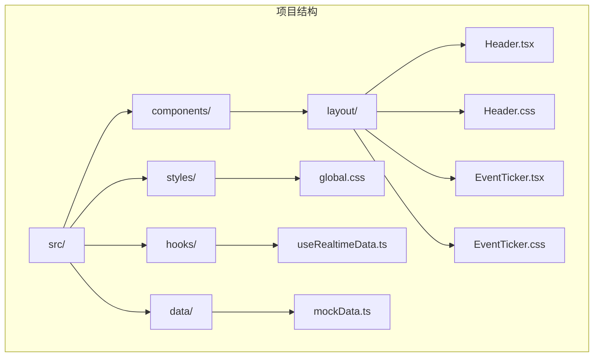
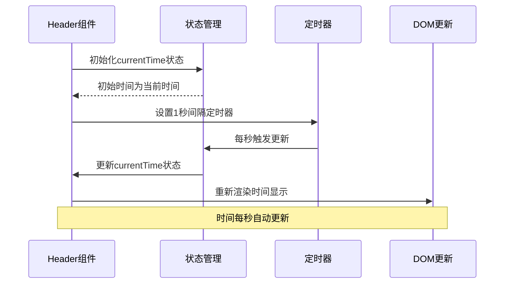
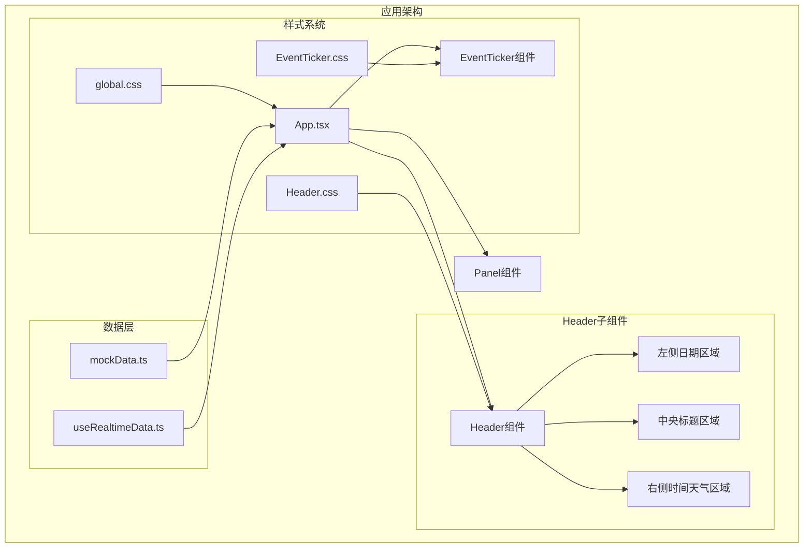
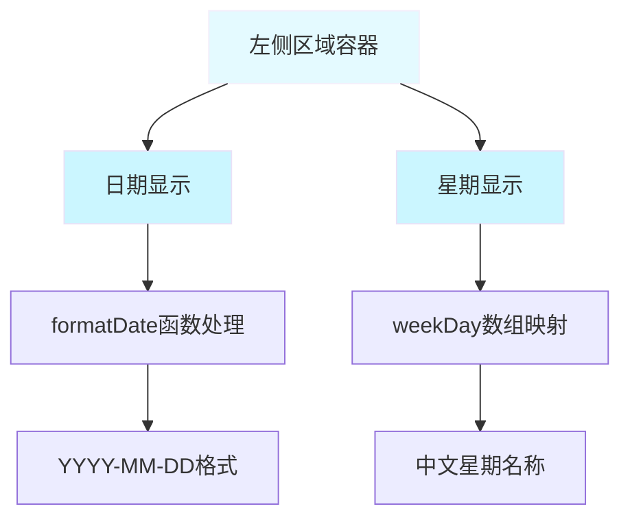
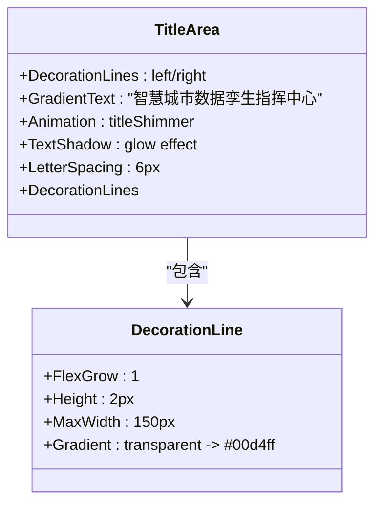
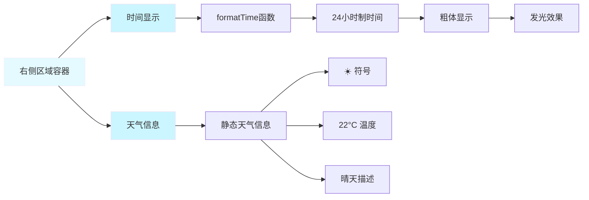
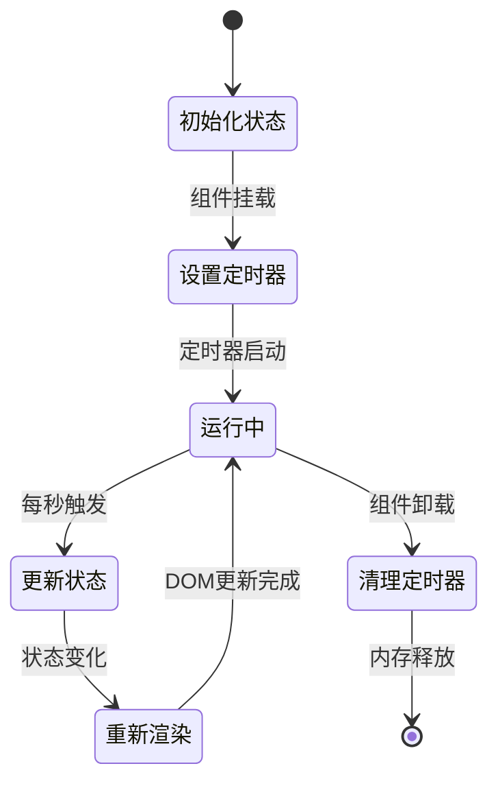
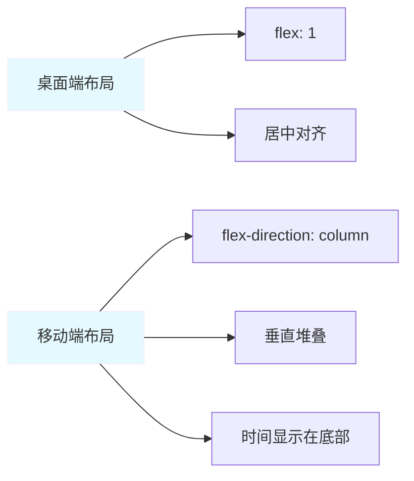
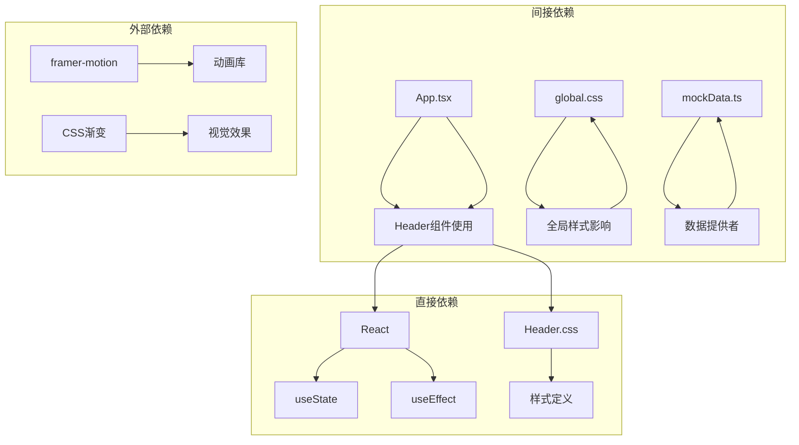
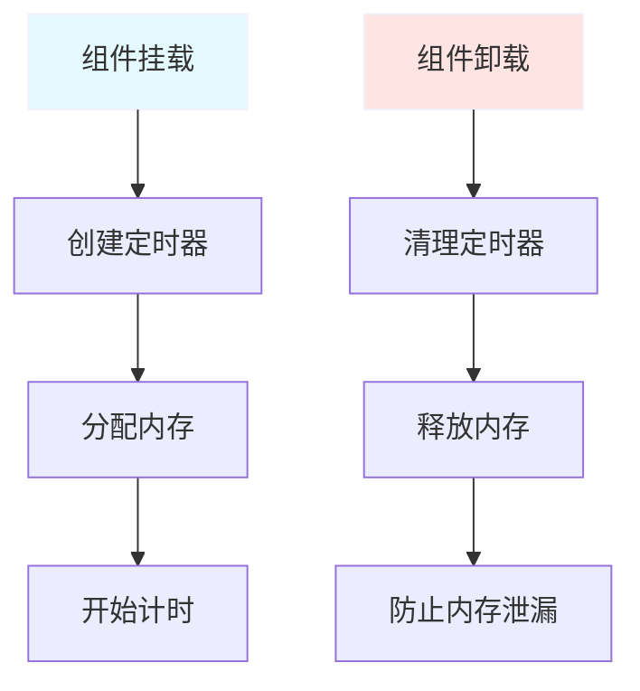

# Header 头部组件

<cite>
**本文档引用的文件**
- [Header.tsx](file://src/components/layout/Header.tsx)
- [Header.css](file://src/components/layout/Header.css)
- [App.tsx](file://src/App.tsx)
- [global.css](file://src/styles/global.css)
- [useRealtimeData.ts](file://src/hooks/useRealtimeData.ts)
- [EventTicker.tsx](file://src/components/layout/EventTicker.tsx)
- [EventTicker.css](file://src/components/layout/EventTicker.css)
- [mockData.ts](file://src/data/mockData.ts)
</cite>

## 目录
1. [简介](#简介)
2. [项目结构](#项目结构)
3. [核心组件](#核心组件)
4. [架构概览](#架构概览)
5. [详细组件分析](#详细组件分析)
6. [依赖关系分析](#依赖关系分析)
7. [性能考虑](#性能考虑)
8. [故障排除指南](#故障排除指南)
9. [结论](#结论)
10. [附录](#附录)

## 简介

Header 头部组件是智慧城市数据孪生指挥中心仪表板的核心界面元素，负责显示实时时间、日期信息以及中央标题区域。该组件采用现代化的赛博朋克主题设计，结合了React Hooks的状态管理机制和CSS动画效果，为用户提供沉浸式的数字孪生体验。

组件的主要功能包括：
- 实时时间显示（每秒更新）
- 日期格式化显示
- 中央标题区域的渐变发光效果
- 右侧天气信息展示
- 响应式布局适配不同屏幕尺寸
- 赛博朋克主题的视觉设计

## 项目结构

Header 组件位于项目的布局组件目录中，与其它UI组件协同工作，共同构建完整的仪表板界面。



**图表来源**
- [Header.tsx:1-45](file://src/components/layout/Header.tsx#L1-L45)
- [Header.css:1-80](file://src/components/layout/Header.css#L1-L80)
- [global.css:1-92](file://src/styles/global.css#L1-L92)

**章节来源**
- [Header.tsx:1-45](file://src/components/layout/Header.tsx#L1-L45)
- [Header.css:1-80](file://src/components/layout/Header.css#L1-L80)
- [global.css:1-92](file://src/styles/global.css#L1-L92)

## 核心组件

Header 组件是一个无状态的函数组件，主要负责UI渲染和简单的状态管理。组件通过React Hooks实现了以下核心功能：

### 状态管理机制

组件使用 `useState` 和 `useEffect` 实现时间的实时更新：



**图表来源**
- [Header.tsx:5-10](file://src/components/layout/Header.tsx#L5-L10)

### 数据格式化函数

组件提供了两个专门的数据格式化函数：

1. **日期格式化函数** (`formatDate`)
   - 将日期转换为 `YYYY-MM-DD` 格式
   - 使用 `padStart` 方法确保两位数显示

2. **时间格式化函数** (`formatTime`)
   - 使用 `toLocaleTimeString` 实现本地化时间显示
   - 设置 `hour12: false` 实现24小时制显示

**章节来源**
- [Header.tsx:12-21](file://src/components/layout/Header.tsx#L12-L21)

## 架构概览

Header 组件在整个仪表板架构中扮演着关键角色，与App组件紧密协作，共同构建完整的用户界面。



**图表来源**
- [App.tsx:1-128](file://src/App.tsx#L1-L128)
- [Header.tsx:1-45](file://src/components/layout/Header.tsx#L1-L45)
- [global.css:1-92](file://src/styles/global.css#L1-L92)

## 详细组件分析

### 组件结构分析

Header 组件采用Flexbox布局，实现了三个主要区域的精确控制：

#### 左侧日期显示区域



**图表来源**
- [Header.tsx:27-30](file://src/components/layout/Header.tsx#L27-L30)

#### 中央标题区域

中央标题区域是整个Header的视觉焦点，采用了复杂的渐变和动画效果：



**图表来源**
- [Header.tsx:31-35](file://src/components/layout/Header.tsx#L31-L35)
- [Header.css:40-60](file://src/components/layout/Header.css#L40-L60)

#### 右侧时间天气信息区域



**图表来源**
- [Header.tsx:36-39](file://src/components/layout/Header.tsx#L36-L39)
- [Header.css:23-38](file://src/components/layout/Header.css#L23-L38)

### Props接口定义

虽然当前Header组件没有接收任何Props，但其设计支持未来的扩展：

```typescript
interface HeaderProps {
  /**
   * 自定义标题文本
   * @default "智慧城市数据孪生指挥中心"
   */
  title?: string;
  
  /**
   * 自定义时间格式化函数
   * @default 内置formatTime函数
   */
  timeFormatter?: (date: Date) => string;
  
  /**
   * 自定义日期格式化函数
   * @default 内置formatDate函数
   */
  dateFormatter?: (date: Date) => string;
  
  /**
   * 是否显示天气信息
   * @default true
   */
  showWeather?: boolean;
  
  /**
   * 自定义样式类名
   */
  className?: string;
}
```

### 状态管理机制

Header 组件的状态管理基于React Hooks，实现了高效的时间更新机制：



**图表来源**
- [Header.tsx:7-10](file://src/components/layout/Header.tsx#L7-L10)

### CSS样式设计

Header 组件采用了完整的赛博朋克主题设计，包含以下关键样式特性：

#### 赛博朋克主题色彩系统

| 颜色值 | 使用场景 | 效果描述 |
|--------|----------|----------|
| `rgba(0, 212, 255, 0.1)` | 背景渐变 | 轻微的蓝色透明背景 |
| `rgba(0, 212, 255, 0.2)` | 边框 | 半透明蓝色边框 |
| `#00d4ff` | 主要文字 | 荧光蓝色主色调 |
| `rgba(0, 212, 255, 0.8)` | 次要文字 | 低透明度蓝色文字 |
| `#7b2ff7` | 渐变辅助色 | 紫色辅助色 |

#### 动画效果系统

1. **标题渐变动画** (`titleShimmer`)
   - 3秒无限循环
   - 从左到右的渐变移动
   - 创建流动的视觉效果

2. **时间发光效果**
   - `text-shadow: 0 0 10px rgba(0, 212, 255, 0.5)`
   - 突出时间显示的科技感

### 响应式布局实现

Header 组件实现了完整的响应式设计，能够适应不同屏幕尺寸：



**图表来源**
- [Header.css:1-9](file://src/components/layout/Header.css#L1-L9)
- [Header.css:40-46](file://src/components/layout/Header.css#L40-L46)

## 依赖关系分析

Header 组件的依赖关系相对简单，主要依赖于React核心功能和自身的样式文件。



**图表来源**
- [Header.tsx:1-2](file://src/components/layout/Header.tsx#L1-L2)
- [App.tsx:1-16](file://src/App.tsx#L1-L16)

### 组件耦合度分析

Header 组件具有较低的耦合度，主要体现在：

1. **内部状态管理**：完全自包含的状态逻辑
2. **样式独立性**：CSS文件独立，不依赖外部组件
3. **数据格式化**：本地化的数据处理函数
4. **无外部Props**：不需要外部传入的配置参数

**章节来源**
- [Header.tsx:1-45](file://src/components/layout/Header.tsx#L1-L45)
- [App.tsx:56-59](file://src/App.tsx#L56-L59)

## 性能考虑

Header 组件在性能方面表现出色，主要得益于以下设计特点：

### 时间更新优化

1. **精确的定时器管理**
   - 使用 `setInterval` 实现1秒精度的时间更新
   - 在组件卸载时正确清理定时器，防止内存泄漏

2. **最小化重渲染**
   - 仅在时间变化时触发重渲染
   - 使用 `useEffect` 的清理函数确保资源回收

### 样式性能优化

1. **硬件加速**
   - 使用 `transform` 属性进行动画
   - 避免触发布局重排的属性修改

2. **渐变渲染**
   - CSS渐变由GPU加速处理
   - 减少JavaScript计算开销

### 内存管理



**图表来源**
- [Header.tsx:7-10](file://src/components/layout/Header.tsx#L7-L10)

## 故障排除指南

### 常见问题及解决方案

#### 时间不更新问题

**症状**：时间显示保持不变
**可能原因**：
- 定时器未正确设置
- 组件未正确卸载
- 浏览器后台标签页限制

**解决方法**：
1. 检查 `useEffect` 的清理函数是否正确执行
2. 确认组件的生命周期管理
3. 在浏览器开发者工具中检查定时器状态

#### 样式显示异常

**症状**：Header样式不正确或显示错误
**可能原因**：
- CSS文件加载失败
- 样式类名冲突
- 全局样式覆盖

**解决方法**：
1. 检查CSS文件路径是否正确
2. 确认样式优先级设置
3. 验证全局样式的兼容性

#### 响应式布局问题

**症状**：在小屏幕上显示异常
**可能原因**：
- Flexbox属性设置不当
- 媒体查询缺失
- 容器宽度限制

**解决方法**：
1. 检查容器的 `min-width` 设置
2. 添加适当的媒体查询
3. 调整 `gap` 属性的响应式行为

**章节来源**
- [Header.tsx:7-10](file://src/components/layout/Header.tsx#L7-L10)
- [Header.css:1-80](file://src/components/layout/Header.css#L1-L80)

## 结论

Header 头部组件是一个设计精良、功能完整的UI组件，成功地将现代React开发最佳实践与赛博朋克主题美学相结合。组件具有以下突出特点：

### 技术优势

1. **简洁高效的实现**：使用最少的代码实现了复杂的功能
2. **良好的性能表现**：优化的时间更新机制和内存管理
3. **强大的样式系统**：完整的赛博朋克主题设计
4. **优秀的用户体验**：流畅的动画效果和响应式布局

### 设计亮点

1. **视觉层次清晰**：通过颜色和动画营造科技感
2. **信息架构合理**：三个区域各司其职，信息层次分明
3. **交互反馈及时**：时间每秒更新，提供实时反馈
4. **品牌识别度高**：独特的渐变和发光效果

### 扩展潜力

Header 组件为未来的功能扩展预留了充足的空间，包括：
- 可配置的标题内容
- 自定义的时间格式化
- 动态天气数据集成
- 更丰富的动画效果

该组件为整个智慧城市数据孪生指挥中心提供了坚实的基础，是现代前端开发的优秀范例。

## 附录

### 使用示例

#### 基本使用

```typescript
// 在App组件中使用
import Header from './components/layout/Header';

function App() {
  return (
    <div className="dashboard-layout">
      <div className="dashboard-header-area">
        <Header />
      </div>
      {/* 其他组件 */}
    </div>
  );
}
```

#### 样式覆盖方法

由于Header组件使用了局部CSS文件，可以通过以下方式实现样式覆盖：

1. **全局样式覆盖**
```css
/* 在global.css中添加更具体的选择器 */
.dashboard-header .header-time {
  font-size: 20px !important;
}
```

2. **内联样式**
```typescript
<div className="dashboard-header-area">
  <Header style={{ height: '80px' }} />
</div>
```

3. **CSS模块**
```css
/* Header.module.css */
.customHeader {
  height: 80px;
}
```

### 配置选项

虽然当前版本的Header组件不支持外部配置，但可以轻松扩展以支持以下选项：

```typescript
interface HeaderConfig {
  showWeather?: boolean;
  timeFormat?: '12h' | '24h';
  dateFormat?: 'YYYY-MM-DD' | 'MM/DD/YYYY';
  themeColor?: string;
  animationSpeed?: number;
}
```

### 最佳实践建议

1. **性能监控**：定期检查定时器的内存使用情况
2. **样式维护**：保持CSS文件的模块化和组织性
3. **可访问性**：确保颜色对比度符合WCAG标准
4. **国际化**：考虑多语言环境下的文本显示