# Panel 侧边面板组件

<cite>
**本文档引用的文件**
- [Panel.tsx](file://src/components/layout/Panel.tsx)
- [Panel.css](file://src/components/layout/Panel.css)
- [App.tsx](file://src/App.tsx)
- [App.css](file://src/App.css)
- [Header.tsx](file://src/components/layout/Header.tsx)
- [Header.css](file://src/components/layout/Header.css)
- [TrafficChart.tsx](file://src/components/charts/TrafficChart.tsx)
- [AlertList.tsx](file://src/components/charts/AlertList.tsx)
</cite>

## 目录
1. [简介](#简介)
2. [项目结构](#项目结构)
3. [核心组件](#核心组件)
4. [架构概览](#架构概览)
5. [详细组件分析](#详细组件分析)
6. [依赖关系分析](#依赖关系分析)
7. [性能考虑](#性能考虑)
8. [故障排除指南](#故障排除指南)
9. [结论](#结论)
10. [附录](#附录)

## 简介

Panel 侧边面板组件是智慧城市数据孪生指挥中心仪表板的核心UI组件之一，专门用于在左右两侧展示各种监控和统计数据。该组件采用现代化的设计理念，结合了科幻风格的视觉效果和实用的功能特性，为用户提供清晰、直观的信息展示界面。

组件的主要特点包括：
- 响应式布局设计，支持左右两侧灵活布局
- 现代化的视觉样式，采用渐变色彩和毛玻璃效果
- 动态内容渲染机制，支持多种图表和数据展示
- 完整的动画集成，与Framer Motion无缝协作
- 主题适配能力，支持深色科技风格的主题切换

## 项目结构

Panel 组件位于项目的布局组件目录中，与应用的整体架构紧密集成：

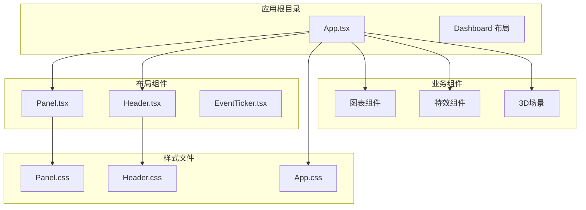

**图表来源**
- [App.tsx:43-125](file://src/App.tsx#L43-L125)
- [Panel.tsx:1-29](file://src/components/layout/Panel.tsx#L1-L29)

**章节来源**
- [App.tsx:1-128](file://src/App.tsx#L1-L128)
- [Panel.tsx:1-30](file://src/components/layout/Panel.tsx#L1-L30)

## 核心组件

### Panel 组件接口定义

Panel 组件采用TypeScript接口定义，提供了简洁而强大的API：

```typescript
interface PanelProps {
  title: string;           // 面板标题文本
  children: React.ReactNode; // 面板内容区域
  className?: string;      // 自定义CSS类名
}
```

组件的核心渲染逻辑遵循以下结构：
- 容器层：`.panel-container` - 主要的面板容器，包含所有子元素
- 标题层：`.panel-header` - 包含装饰线条、标题文本和角标
- 内容层：`.panel-content` - 动态内容渲染区域
- 角标装饰：四个 `.panel-corner` 元素，提供视觉装饰效果

**章节来源**
- [Panel.tsx:4-8](file://src/components/layout/Panel.tsx#L4-L8)
- [Panel.tsx:10-27](file://src/components/layout/Panel.tsx#L10-L27)

### 样式系统架构

Panel 组件采用模块化的CSS架构，每个元素都有独立的样式定义：

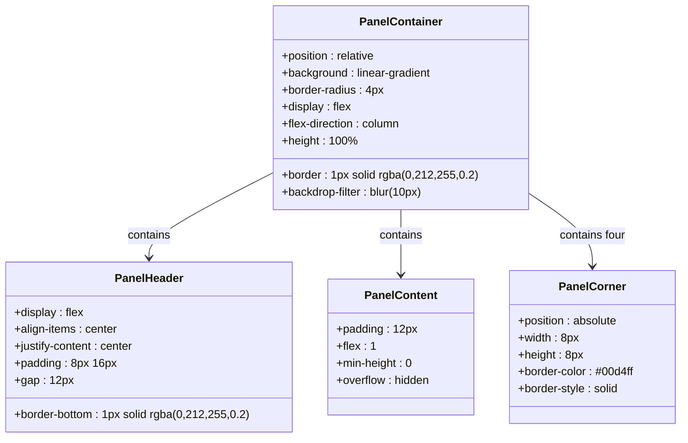

**图表来源**
- [Panel.css:1-84](file://src/components/layout/Panel.css#L1-L84)

**章节来源**
- [Panel.css:1-85](file://src/components/layout/Panel.css#L1-L85)

## 架构概览

Panel 组件在整个仪表板架构中扮演着关键角色，与多个系统组件协同工作：

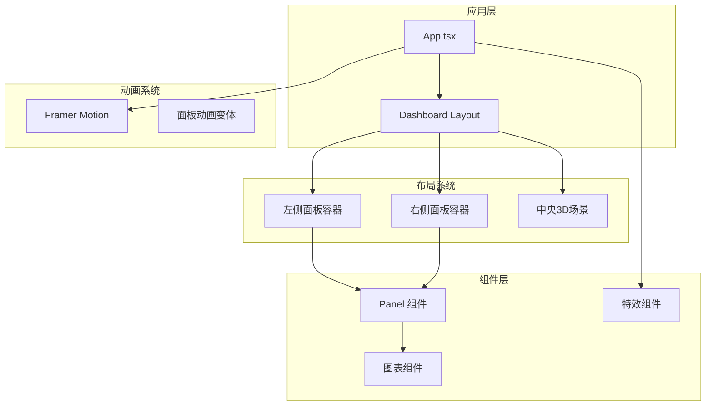

**图表来源**
- [App.tsx:43-125](file://src/App.tsx#L43-L125)
- [Panel.tsx:10-27](file://src/components/layout/Panel.tsx#L10-L27)

### 动画集成机制

Panel 组件与Framer Motion深度集成，实现了流畅的入场动画效果：

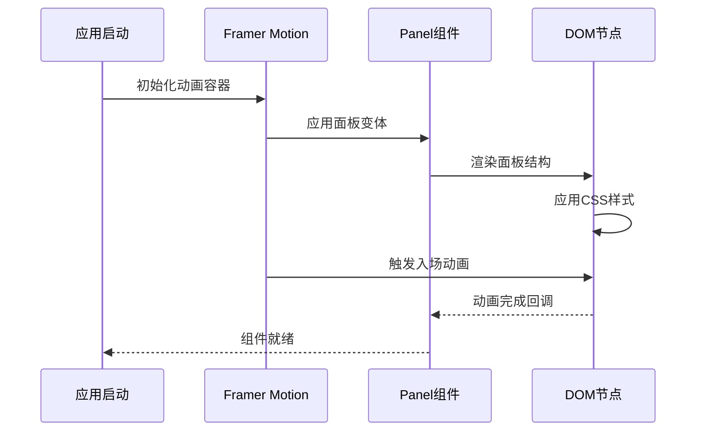

**图表来源**
- [App.tsx:18-41](file://src/App.tsx#L18-L41)
- [App.tsx:62-83](file://src/App.tsx#L62-L83)

**章节来源**
- [App.tsx:18-41](file://src/App.tsx#L18-L41)
- [App.tsx:62-117](file://src/App.tsx#L62-L117)

## 详细组件分析

### 组件结构分析

Panel 组件采用了经典的三段式布局设计：

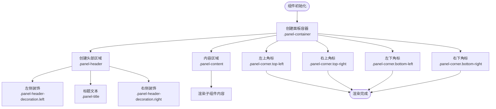

**图表来源**
- [Panel.tsx:10-27](file://src/components/layout/Panel.tsx#L10-L27)

#### 标题装饰系统

标题区域采用了独特的装饰线条设计，通过CSS渐变实现视觉层次：

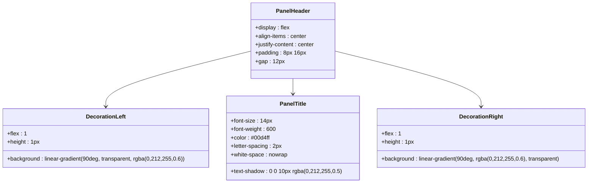

**图表来源**
- [Panel.css:14-45](file://src/components/layout/Panel.css#L14-L45)

**章节来源**
- [Panel.tsx:13-17](file://src/components/layout/Panel.tsx#L13-L17)
- [Panel.css:14-45](file://src/components/layout/Panel.css#L14-L45)

### 内容渲染机制

Panel 组件的内容渲染采用React的children模式，支持任意类型的子组件：

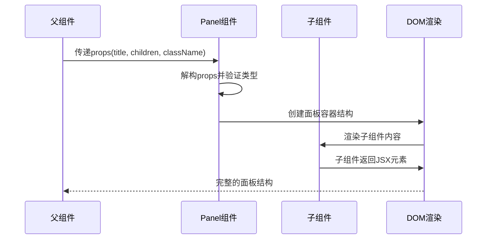

**图表来源**
- [Panel.tsx:10-20](file://src/components/layout/Panel.tsx#L10-L20)

#### 动态内容适配

Panel 组件能够自动适配不同类型的子组件，通过Flexbox布局实现内容区域的自适应：

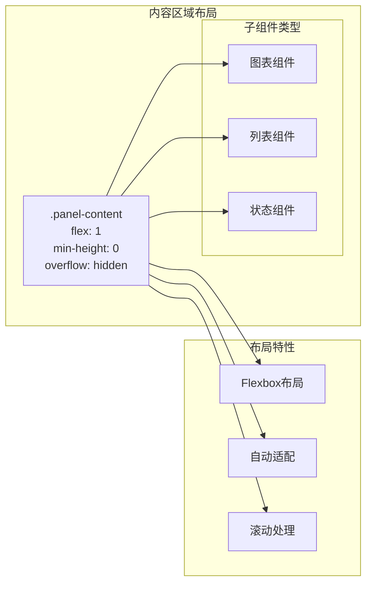

**图表来源**
- [Panel.css:47-52](file://src/components/layout/Panel.css#L47-L52)
- [App.css:33-39](file://src/App.css#L33-L39)

**章节来源**
- [Panel.tsx:18-19](file://src/components/layout/Panel.tsx#L18-L19)
- [Panel.css:47-52](file://src/components/layout/Panel.css#L47-L52)
- [App.css:33-39](file://src/App.css#L33-L39)

### 角标装饰系统

Panel 组件的四个角标提供了精致的视觉装饰效果：

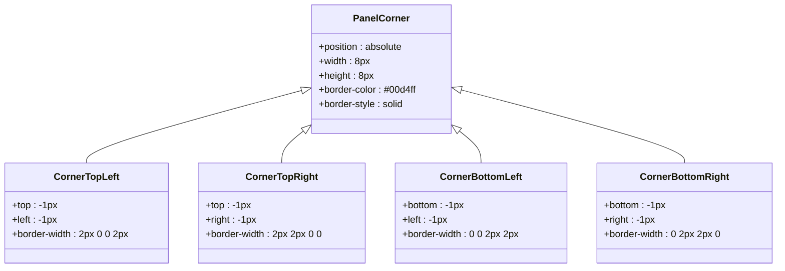

**图表来源**
- [Panel.css:54-84](file://src/components/layout/Panel.css#L54-L84)

**章节来源**
- [Panel.tsx:21-24](file://src/components/layout/Panel.tsx#L21-L24)
- [Panel.css:54-84](file://src/components/layout/Panel.css#L54-L84)

## 依赖关系分析

Panel 组件的依赖关系相对简单，主要依赖于React和自身的样式文件：

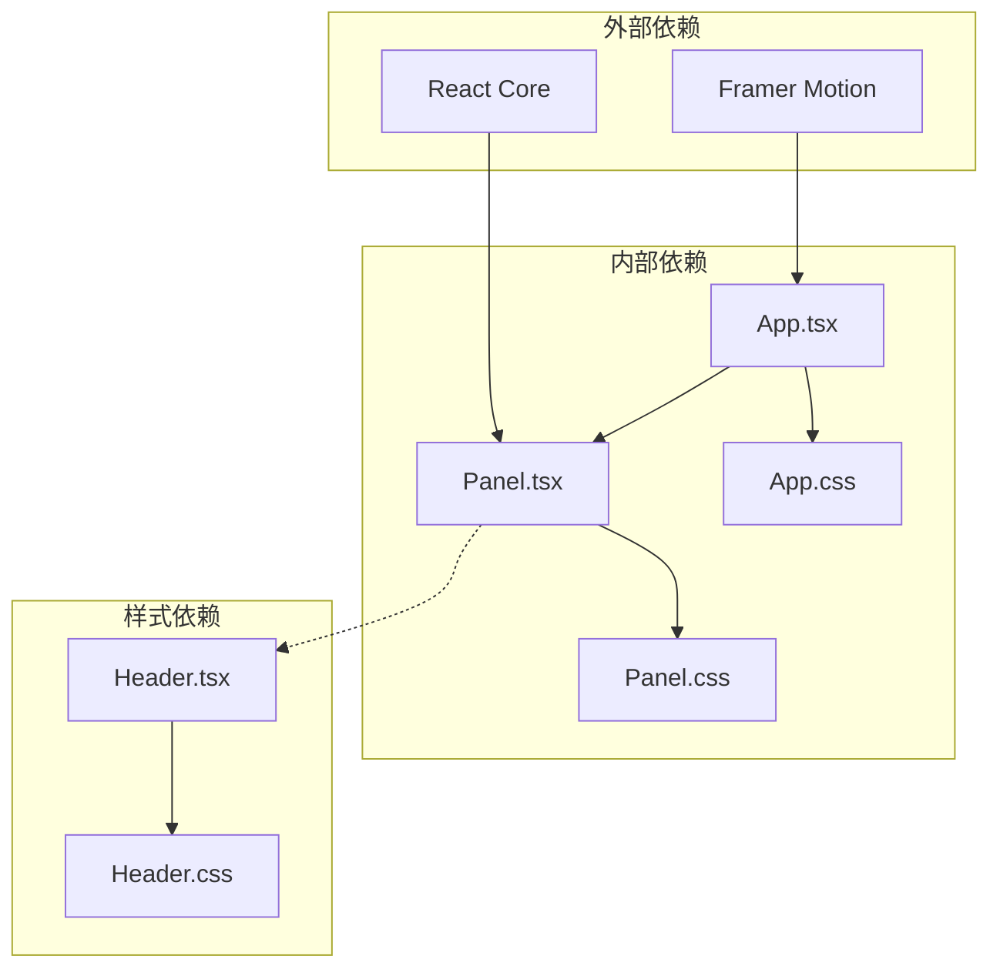

**图表来源**
- [Panel.tsx:1](file://src/components/layout/Panel.tsx#L1)
- [App.tsx:1](file://src/App.tsx#L1)

### 组件间交互流程

Panel 组件在应用中的交互流程如下：

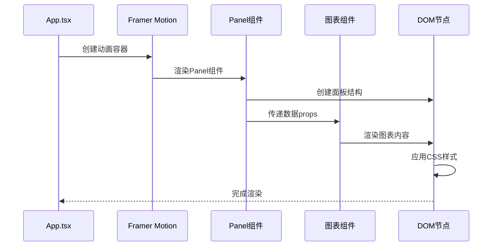

**图表来源**
- [App.tsx:68-82](file://src/App.tsx#L68-L82)
- [Panel.tsx:10-27](file://src/components/layout/Panel.tsx#L10-L27)

**章节来源**
- [App.tsx:61-117](file://src/App.tsx#L61-L117)
- [Panel.tsx:1-29](file://src/components/layout/Panel.tsx#L1-L29)

## 性能考虑

Panel 组件在设计时充分考虑了性能优化：

### 样式性能优化

- 使用CSS渐变而非图片，减少HTTP请求
- 启用backdrop-filter模糊效果，但需注意性能影响
- 采用Flexbox布局，避免复杂的JavaScript计算
- 最小化重绘和重排操作

### 渲染性能优化

- 子组件按需渲染，避免不必要的重新渲染
- 使用React.memo优化重复渲染
- 合理的CSS选择器，避免深层嵌套
- 适当的z-index管理，减少层叠复杂度

### 动画性能优化

- Framer Motion的硬件加速支持
- 合理的动画持续时间和缓动函数
- 避免在动画过程中进行昂贵的操作

## 故障排除指南

### 常见问题及解决方案

#### 面板高度不正确

**问题描述**：面板内容区域无法正确填充可用空间

**解决方案**：
1. 确保父容器设置了正确的高度
2. 检查CSS中关于flex和min-height的设置
3. 验证App.css中的样式规则是否正确应用

**章节来源**
- [App.css:25-39](file://src/App.css#L25-L39)

#### 样式显示异常

**问题描述**：面板样式不符合预期或出现错位

**解决方案**：
1. 检查Panel.css文件中的样式定义
2. 验证CSS类名的正确性
3. 确认样式文件的导入顺序

**章节来源**
- [Panel.css:1-85](file://src/components/layout/Panel.css#L1-L85)

#### 动画问题

**问题描述**：面板入场动画不生效或异常

**解决方案**：
1. 检查Framer Motion的版本兼容性
2. 验证动画变体的配置
3. 确认motion.div的正确使用

**章节来源**
- [App.tsx:18-41](file://src/App.tsx#L18-L41)

## 结论

Panel 侧边面板组件是一个设计精良、功能完善的UI组件，成功地将现代设计理念与实际业务需求相结合。组件具有以下优势：

1. **设计优雅**：采用科幻风格的视觉设计，符合智慧城市主题
2. **结构清晰**：三段式布局设计，层次分明
3. **扩展性强**：支持任意类型的子组件，适应不同的数据展示需求
4. **性能优秀**：经过优化的渲染和样式系统
5. **集成良好**：与Framer Motion等现代前端技术无缝集成

该组件为整个仪表板系统提供了坚实的基础，是构建复杂数据可视化界面的理想选择。

## 附录

### 使用示例

#### 基本使用

```typescript
<Panel title="面板标题">
  <YourContentComponent />
</Panel>
```

#### 高级配置

```typescript
<Panel 
  title="高级面板" 
  className="custom-panel"
>
  <div className="content-wrapper">
    <YourContentComponent />
  </div>
</Panel>
```

### 自定义样式指南

#### 主题定制

可以通过修改Panel.css中的颜色变量来自定义主题：

```css
.panel-container {
  background: linear-gradient(135deg, var(--primary-color, rgba(10, 14, 39, 0.9)) 0%, var(--secondary-color, rgba(15, 23, 60, 0.85)) 100%);
  border: 1px solid var(--accent-color, rgba(0, 212, 255, 0.2));
}
```

#### 响应式设计

Panel 组件天然支持响应式布局，可通过媒体查询进一步优化：

```css
@media (max-width: 768px) {
  .panel-container {
    margin: 8px;
    border-radius: 2px;
  }
  
  .panel-title {
    font-size: 12px;
    letter-spacing: 1px;
  }
}
```

### 最佳实践

1. **保持内容简洁**：避免在面板中放置过多复杂元素
2. **合理使用动画**：适度的动画效果可以提升用户体验
3. **关注性能**：大型图表组件应考虑懒加载策略
4. **主题一致性**：确保面板样式与整体设计语言一致