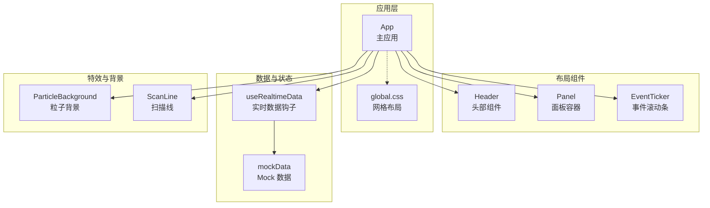
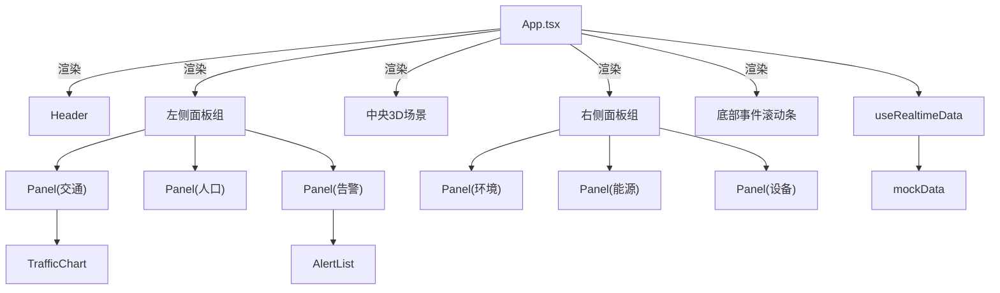
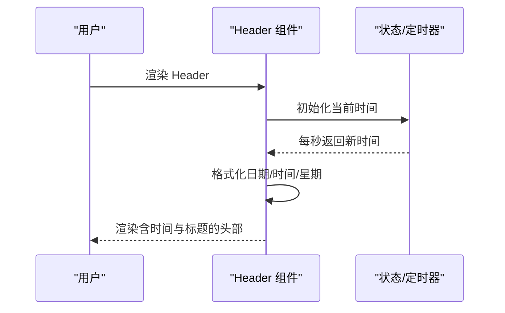
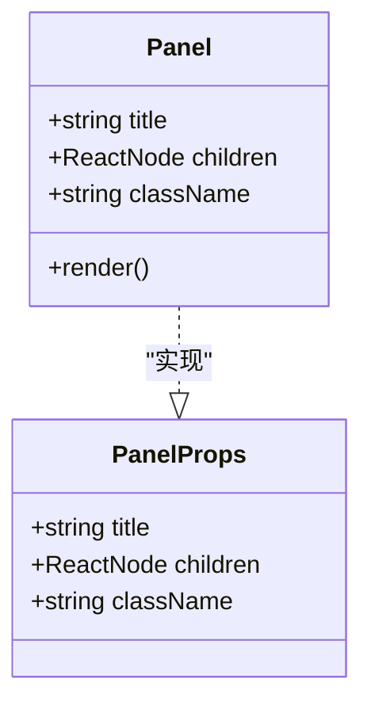
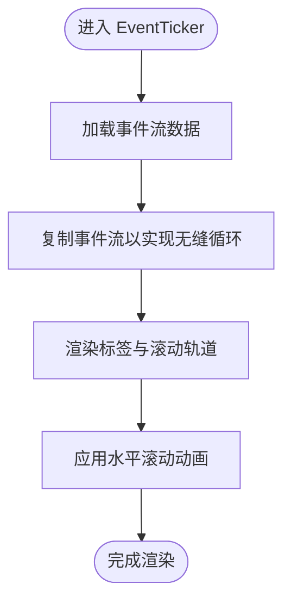
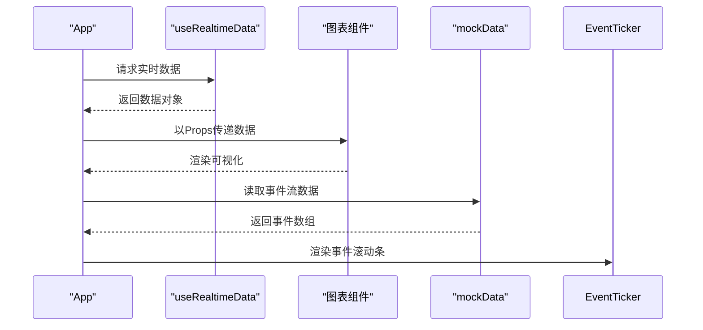
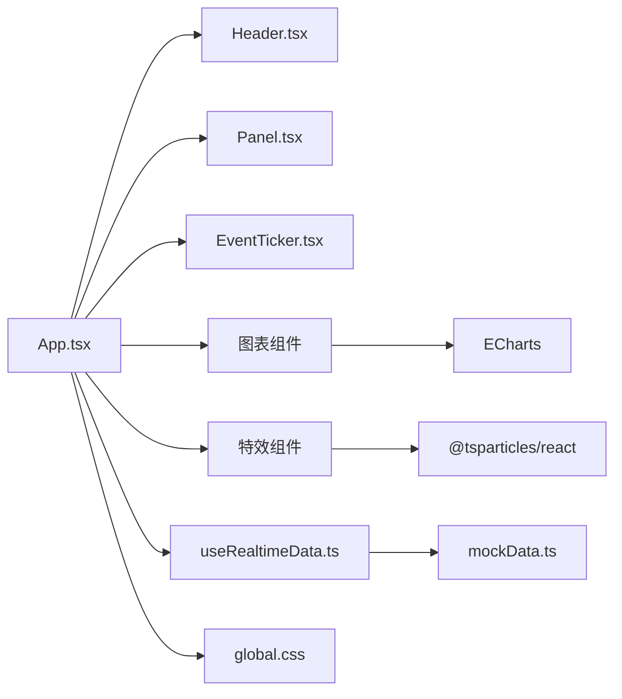

# 布局组件系统

<cite>
**本文引用的文件**
- [src/components/layout/Header.tsx](file://src/components/layout/Header.tsx)
- [src/components/layout/Header.css](file://src/components/layout/Header.css)
- [src/components/layout/Panel.tsx](file://src/components/layout/Panel.tsx)
- [src/components/layout/Panel.css](file://src/components/layout/Panel.css)
- [src/components/layout/EventTicker.tsx](file://src/components/layout/EventTicker.tsx)
- [src/components/layout/EventTicker.css](file://src/components/layout/EventTicker.css)
- [src/App.tsx](file://src/App.tsx)
- [src/styles/global.css](file://src/styles/global.css)
- [src/hooks/useRealtimeData.ts](file://src/hooks/useRealtimeData.ts)
- [src/data/mockData.ts](file://src/data/mockData.ts)
- [src/components/charts/TrafficChart.tsx](file://src/components/charts/TrafficChart.tsx)
- [src/components/charts/AlertList.tsx](file://src/components/charts/AlertList.tsx)
- [src/components/effects/ParticleBackground.tsx](file://src/components/effects/ParticleBackground.tsx)
- [src/components/effects/ScanLine.tsx](file://src/components/effects/ScanLine.tsx)
</cite>

## 目录
1. [简介](#简介)
2. [项目结构](#项目结构)
3. [核心组件](#核心组件)
4. [架构总览](#架构总览)
5. [详细组件分析](#详细组件分析)
6. [依赖关系分析](#依赖关系分析)
7. [性能考量](#性能考量)
8. [故障排查指南](#故障排查指南)
9. [结论](#结论)
10. [附录](#附录)

## 简介
本文件系统性地解析布局组件系统，覆盖以下关键组件与能力：
- Header 头部组件：时间显示、天气信息占位、标题展示与装饰线
- Panel 左右侧面板：布局容器、标题头、内容区与装饰角标
- EventTicker 底部事件滚动条：事件流信息的无缝循环滚动展示
- 响应式网格布局：基于 CSS Grid 的三列两行布局（左/中/右、上/下）
- 数据流与状态管理：实时数据钩子、Mock 数据与组件间 Props 传递
- 样式设计与视觉风格：赛博朋克主题、渐变、发光与动画

## 项目结构
布局组件位于 src/components/layout 下，配合全局样式 src/styles/global.css 使用 CSS Grid 构建仪表盘骨架。主应用 App.tsx 将 Header、左右侧 Panel、中央 3D 场景与底部 EventTicker 组合为完整的仪表盘界面。

图示来源
- [src/App.tsx:43-125](file://src/App.tsx#L43-L125)
- [src/styles/global.css:49-92](file://src/styles/global.css#L49-L92)
- [src/hooks/useRealtimeData.ts:15-72](file://src/hooks/useRealtimeData.ts#L15-L72)
- [src/data/mockData.ts:85-96](file://src/data/mockData.ts#L85-L96)
- [src/components/effects/ParticleBackground.tsx:6-71](file://src/components/effects/ParticleBackground.tsx#L6-L71)
- [src/components/effects/ScanLine.tsx:4-8](file://src/components/effects/ScanLine.tsx#L4-L8)

章节来源
- [src/App.tsx:43-125](file://src/App.tsx#L43-L125)
- [src/styles/global.css:49-92](file://src/styles/global.css#L49-L92)

## 核心组件
- Header：左侧日期与星期、中间标题与装饰线、右侧时间与天气占位
- Panel：带装饰线与四个角标的面板容器，支持自定义标题与内容
- EventTicker：标签+轨道+内容区，事件流以动画无缝滚动

章节来源
- [src/components/layout/Header.tsx:4-45](file://src/components/layout/Header.tsx#L4-L45)
- [src/components/layout/Panel.tsx:10-29](file://src/components/layout/Panel.tsx#L10-L29)
- [src/components/layout/EventTicker.tsx:5-25](file://src/components/layout/EventTicker.tsx#L5-L25)

## 架构总览
整体采用“网格布局 + 组件化”的架构：
- 网格布局：通过 CSS Grid 定义 header/footer/center/left/right 区域，形成稳定的三列两行结构
- 组件分层：Header/Panel/EventTicker 作为布局基础层，图表与3D场景作为内容层
- 数据驱动：App 通过 useRealtimeData 获取实时数据，以 Props 方式注入到 Panel 内的图表组件

图示来源
- [src/App.tsx:43-125](file://src/App.tsx#L43-L125)
- [src/hooks/useRealtimeData.ts:15-72](file://src/hooks/useRealtimeData.ts#L15-L72)
- [src/data/mockData.ts:1-96](file://src/data/mockData.ts#L1-96)
- [src/components/charts/TrafficChart.tsx:14-117](file://src/components/charts/TrafficChart.tsx#L14-L117)
- [src/components/charts/AlertList.tsx:22-65](file://src/components/charts/AlertList.tsx#L22-L65)

## 详细组件分析

### Header 头部组件
- 功能要点
  - 时间显示：每秒更新当前时间，格式化为本地时间字符串
  - 日期与星期：年-月-日格式与中文星期映射
  - 标题展示：中间标题使用渐变文字与发光动画
  - 天气信息：右侧天气占位，便于后续接入真实天气数据
- Props 接口
  - 无外部 Props，内部通过状态管理时间
- 状态管理
  - 使用 useState 初始化时间，useEffect 每秒更新一次
- 样式设计
  - 采用线性渐变背景与边框，强调蓝紫色科技感
  - 时间文本使用等宽数字与发光阴影增强可读性
  - 标题使用多色渐变与动画，营造流动感
- 响应式与布局
  - Flex 布局三段式，左右两侧固定宽度，中间自适应填充
- 使用示例
  - 在 App.tsx 的头部区域直接引入即可生效
- 自定义配置
  - 可在 Header.css 中调整颜色、字号、动画参数
  - 可在 Header.tsx 中扩展天气数据获取逻辑

图示来源
- [src/components/layout/Header.tsx:4-45](file://src/components/layout/Header.tsx#L4-L45)
- [src/components/layout/Header.css:1-80](file://src/components/layout/Header.css#L1-L80)

章节来源
- [src/components/layout/Header.tsx:4-45](file://src/components/layout/Header.tsx#L4-L45)
- [src/components/layout/Header.css:1-80](file://src/components/layout/Header.css#L1-L80)

### Panel 左右侧面板
- 功能要点
  - 标题头：左右装饰线与居中标题，突出模块边界
  - 内容区：支持任意子节点，适配图表或列表
  - 角标装饰：四个角标模拟机箱质感，增强科技氛围
- Props 接口
  - title: 字符串，面板标题
  - children: ReactNode，面板内容
  - className?: 字符串，额外类名扩展
- 状态管理
  - 无内部状态，纯展示型组件
- 样式设计
  - 半透明背景与模糊滤镜，强调层次感
  - 边框与渐变装饰线，统一视觉语言
  - 角标使用细线描边，避免喧宾夺主
- 响应式与布局
  - Flex 列向布局，内容区自适应剩余空间
  - 通过父级网格与 flex 分配左右侧高度占比
- 使用示例
  - 在 App.tsx 的左/右侧区域包裹 Panel，并传入标题与图表组件
- 自定义配置
  - 可通过 className 注入额外样式
  - 可在 Panel.css 中调整尺寸、颜色与装饰细节

图示来源
- [src/components/layout/Panel.tsx:4-8](file://src/components/layout/Panel.tsx#L4-L8)
- [src/components/layout/Panel.tsx:10-29](file://src/components/layout/Panel.tsx#L10-L29)

章节来源
- [src/components/layout/Panel.tsx:4-29](file://src/components/layout/Panel.tsx#L4-L29)
- [src/components/layout/Panel.css:1-85](file://src/components/layout/Panel.css#L1-L85)

### EventTicker 底部事件滚动条
- 功能要点
  - 实时动态标签：醒目的渐变背景与字形
  - 事件流轨道：内容复制一份以实现无缝循环滚动
  - 事件项：带发光圆点与消息文本，逐条滚动
- Props 接口
  - 无外部 Props，内部消费 mockData 中的事件流
- 状态管理
  - 无内部状态，依赖外部数据源
- 样式设计
  - 轨道使用相对定位与隐藏溢出，内容区水平动画平移
  - 事件项间距与字体大小适配滚动节奏
- 响应式与布局
  - 固定高度与自适应宽度，贴合底部区域
- 使用示例
  - 在 App.tsx 的底部区域引入即可
- 自定义配置
  - 可在 EventTicker.css 中调整动画速度、间距与颜色
  - 可在 EventTicker.tsx 中替换事件数据源

图示来源
- [src/components/layout/EventTicker.tsx:5-25](file://src/components/layout/EventTicker.tsx#L5-L25)
- [src/components/layout/EventTicker.css:1-58](file://src/components/layout/EventTicker.css#L1-L58)
- [src/data/mockData.ts:85-96](file://src/data/mockData.ts#L85-L96)

章节来源
- [src/components/layout/EventTicker.tsx:5-25](file://src/components/layout/EventTicker.tsx#L5-L25)
- [src/components/layout/EventTicker.css:1-58](file://src/components/layout/EventTicker.css#L1-L58)

### 数据流与组件间传递
- 数据来源
  - useRealtimeData 提供交通、人口、环境、能源、设备、告警等数据
  - mockData 提供静态示例数据与事件流
- 传递路径
  - App 从 useRealtimeData 获取数据对象
  - 将数据以 Props 形式注入到 Panel 内的图表组件
  - EventTicker 从 mockData 读取事件流进行展示
- 示例路径
  - App.tsx 中将 traffic 注入 TrafficChart
  - App.tsx 中将 alerts 注入 AlertList

图示来源
- [src/App.tsx:43-125](file://src/App.tsx#L43-L125)
- [src/hooks/useRealtimeData.ts:15-72](file://src/hooks/useRealtimeData.ts#L15-L72)
- [src/data/mockData.ts:1-96](file://src/data/mockData.ts#L1-L96)

章节来源
- [src/App.tsx:43-125](file://src/App.tsx#L43-L125)
- [src/hooks/useRealtimeData.ts:15-72](file://src/hooks/useRealtimeData.ts#L15-L72)
- [src/data/mockData.ts:1-96](file://src/data/mockData.ts#L1-L96)

## 依赖关系分析
- 组件耦合
  - Header/Panel/EventTicker 为低耦合展示组件，主要依赖自身样式
  - App 作为编排者，负责数据注入与布局组织
- 外部依赖
  - 图表组件依赖 ECharts（TrafficChart）
  - 效果组件依赖 @tsparticles/react（ParticleBackground）
- 数据依赖
  - useRealtimeData 依赖 mockData 提供初始数据与事件流
- 样式依赖
  - global.css 提供网格布局基座，各组件样式独立但共享主题色

图示来源
- [src/App.tsx:43-125](file://src/App.tsx#L43-L125)
- [src/hooks/useRealtimeData.ts:15-72](file://src/hooks/useRealtimeData.ts#L15-L72)
- [src/data/mockData.ts:1-96](file://src/data/mockData.ts#L1-96)
- [src/styles/global.css:49-92](file://src/styles/global.css#L49-L92)
- [src/components/charts/TrafficChart.tsx:14-117](file://src/components/charts/TrafficChart.tsx#L14-L117)
- [src/components/effects/ParticleBackground.tsx:6-71](file://src/components/effects/ParticleBackground.tsx#L6-L71)

章节来源
- [src/App.tsx:43-125](file://src/App.tsx#L43-L125)
- [src/hooks/useRealtimeData.ts:15-72](file://src/hooks/useRealtimeData.ts#L15-L72)
- [src/data/mockData.ts:1-96](file://src/data/mockData.ts#L1-L96)
- [src/styles/global.css:49-92](file://src/styles/global.css#L49-L92)

## 性能考量
- 时间更新频率：Header 每秒更新一次时间，建议保持该粒度以平衡流畅度与性能
- 动画与滚动：EventTicker 使用 CSS 动画实现无缝滚动，避免 JavaScript 循环滚动带来的卡顿
- 图表渲染：TrafficChart 使用 ECharts 并监听容器尺寸变化，确保在面板切换时正确重绘
- 实时数据：useRealtimeData 以固定间隔更新数据，建议根据设备性能调整间隔
- 背景特效：ParticleBackground 使用轻量粒子库，注意在低端设备上的帧率表现

## 故障排查指南
- 时间不刷新
  - 检查 Header 组件的定时器是否正常挂载与清理
  - 确认浏览器标签页处于激活状态，避免节流影响
- 事件滚动条不滚动
  - 检查事件数据是否正确加载（mockData 是否存在）
  - 确认轨道容器的 overflow 与动画属性是否生效
- 面板内容溢出
  - 检查 Panel 的 panel-content 是否设置 min-height 与 overflow
  - 确认父级网格与 flex 分配是否合理
- 图表不显示或空白
  - 检查图表容器的尺寸是否正确，是否存在 ResizeObserver 与销毁逻辑
  - 确认 ECharts 初始化与 setOption 的调用时机
- 实时数据不更新
  - 检查 useRealtimeData 的定时器是否被清理
  - 确认 interval 参数是否合理

章节来源
- [src/components/layout/Header.tsx:7-10](file://src/components/layout/Header.tsx#L7-L10)
- [src/components/layout/EventTicker.tsx:6](file://src/components/layout/EventTicker.tsx#L6)
- [src/components/layout/Panel.css:47-52](file://src/components/layout/Panel.css#L47-L52)
- [src/components/charts/TrafficChart.tsx:18-30](file://src/components/charts/TrafficChart.tsx#L18-L30)
- [src/hooks/useRealtimeData.ts:66-69](file://src/hooks/useRealtimeData.ts#L66-L69)

## 结论
布局组件系统以简洁的展示组件为核心，结合 CSS Grid 实现稳定而富有科技感的仪表盘布局。Header、Panel、EventTicker 各司其职，配合 useRealtimeData 与 mockData 形成清晰的数据流。通过 Props 与样式定制，可在不破坏整体风格的前提下灵活扩展功能与外观。

## 附录
- 使用示例（路径指引）
  - 引入 Header：在 App.tsx 的头部区域添加 Header 组件
  - 引入 Panel：在左右侧区域包裹 Panel，并传入标题与图表组件
  - 引入 EventTicker：在 App.tsx 的底部区域添加 EventTicker 组件
- 自定义配置（路径指引）
  - 修改 Header 样式：编辑 Header.css
  - 修改 Panel 样式：编辑 Panel.css
  - 修改 EventTicker 样式：编辑 EventTicker.css
  - 替换事件数据：修改 mockData.ts 中的事件流数组
  - 调整实时数据更新频率：修改 useRealtimeData 的 interval 参数