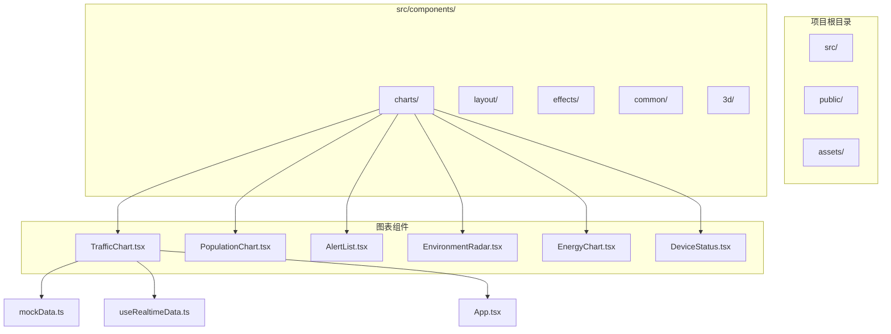
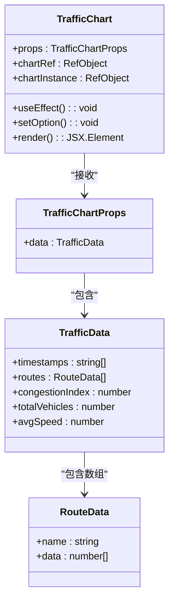
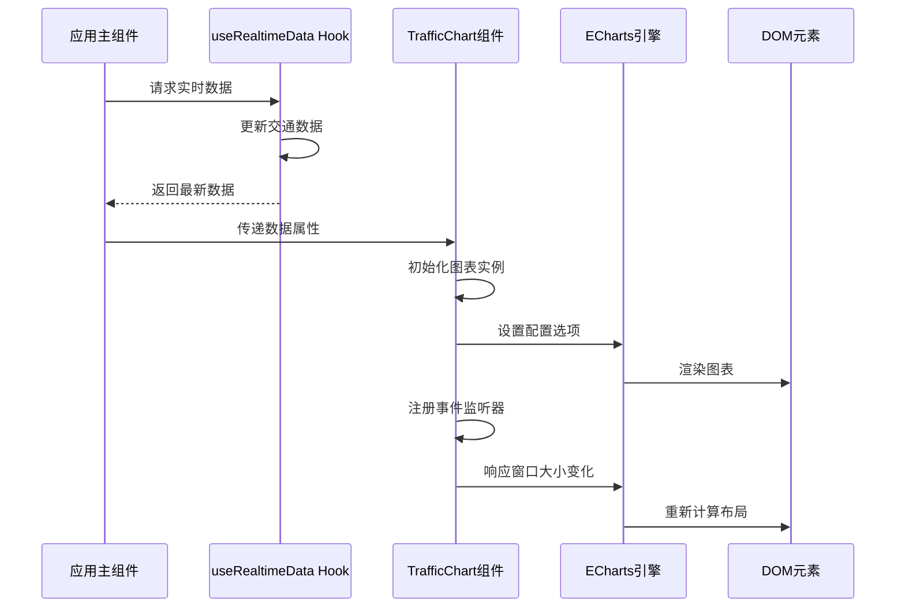
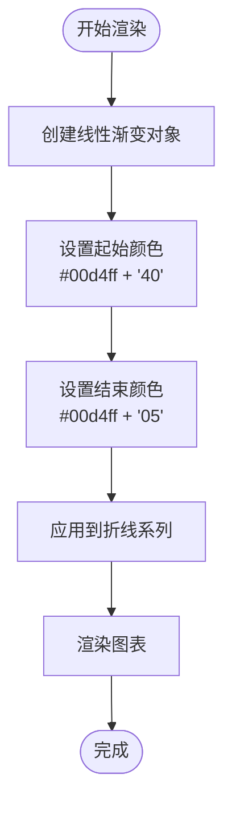
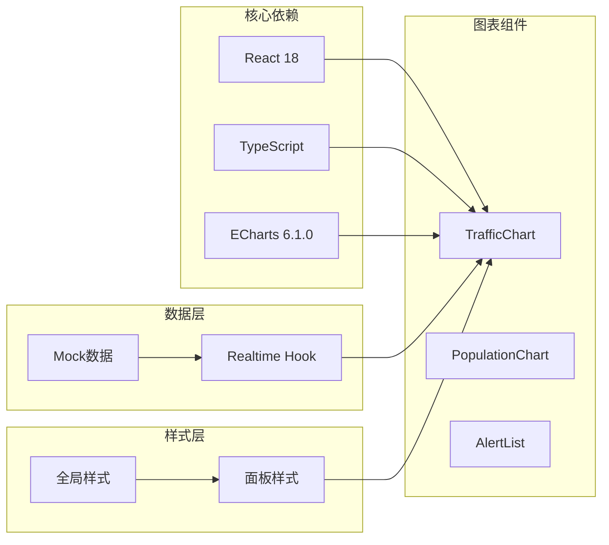

# 交通流量监控图

<cite>
**本文档引用的文件**
- [TrafficChart.tsx](file://src/components/charts/TrafficChart.tsx)
- [mockData.ts](file://src/data/mockData.ts)
- [useRealtimeData.ts](file://src/hooks/useRealtimeData.ts)
- [App.tsx](file://src/App.tsx)
- [index.ts](file://src/components/charts/index.ts)
- [Panel.css](file://src/components/layout/Panel.css)
- [global.css](file://src/styles/global.css)
- [package.json](file://package.json)
- [README.md](file://README.md)
</cite>

## 目录
1. [简介](#简介)
2. [项目结构](#项目结构)
3. [核心组件](#核心组件)
4. [架构概览](#架构概览)
5. [详细组件分析](#详细组件分析)
6. [依赖分析](#依赖分析)
7. [性能考虑](#性能考虑)
8. [故障排除指南](#故障排除指南)
9. [结论](#结论)
10. [附录](#附录)

## 简介

交通流量监控图是智慧城市数据孪生大屏中的核心可视化组件，基于ECharts 5构建，用于实时展示城市主要道路的交通流量变化趋势。该组件采用赛博朋克风格设计，结合渐变色彩和发光效果，为用户提供直观的交通状况洞察。

本组件支持实时数据更新、响应式布局和多种交互功能，能够有效帮助交通管理部门监控和分析城市交通流量状况。

## 项目结构

该项目采用模块化架构设计，交通流量监控图位于图表组件目录中，与其它可视化组件协同工作。

**图表来源**
- [TrafficChart.tsx:1-117](file://src/components/charts/TrafficChart.tsx#L1-L117)
- [mockData.ts:1-96](file://src/data/mockData.ts#L1-L96)
- [useRealtimeData.ts:1-73](file://src/hooks/useRealtimeData.ts#L1-L73)

**章节来源**
- [README.md:49-63](file://README.md#L49-L63)
- [package.json:12-26](file://package.json#L12-L26)

## 核心组件

### TrafficChart 组件架构

TrafficChart 是一个基于React和TypeScript的高性能图表组件，采用ECharts作为底层渲染引擎。组件通过自定义Hook管理实时数据，并提供完整的生命周期管理和资源清理机制。

**图表来源**
- [TrafficChart.tsx:4-12](file://src/components/charts/TrafficChart.tsx#L4-L12)
- [TrafficChart.tsx:14-117](file://src/components/charts/TrafficChart.tsx#L14-L117)

### 数据结构设计

组件的核心数据结构采用扁平化设计，确保高效的数据处理和渲染性能：

| 字段名 | 类型 | 描述 | 单位 |
|--------|------|------|------|
| timestamps | string[] | 时间戳数组，格式为"HH:00" | 小时 |
| routes | RouteData[] | 路线数据数组 | 多条路线 |
| congestionIndex | number | 交通拥堵指数 | 无量纲 |
| totalVehicles | number | 总车辆数 | 辆 |
| avgSpeed | number | 平均车速 | km/h |

**章节来源**
- [TrafficChart.tsx:5-11](file://src/components/charts/TrafficChart.tsx#L5-L11)
- [mockData.ts:2-12](file://src/data/mockData.ts#L2-L12)

## 架构概览

交通流量监控图采用分层架构设计，从数据获取到最终渲染形成完整的技术栈链路。

**图表来源**
- [App.tsx:43-72](file://src/App.tsx#L43-L72)
- [useRealtimeData.ts:15-72](file://src/hooks/useRealtimeData.ts#L15-L72)
- [TrafficChart.tsx:18-30](file://src/components/charts/TrafficChart.tsx#L18-L30)

## 详细组件分析

### ECharts配置详解

TrafficChart组件使用了丰富的ECharts配置选项来实现专业的数据可视化效果。

#### 图表容器配置

组件采用Flexbox布局，将图表分为三个主要区域：
- 顶部指标面板：显示拥堵指数、车辆总数、平均车速
- 中部折线图区域：展示各路线的流量趋势
- 底部响应式布局：自适应不同屏幕尺寸

#### 坐标轴配置

坐标轴采用现代化设计，具有以下特点：

**X轴配置**：
- 类别轴类型，数据来自timestamps数组
- 采用淡蓝色渐变边框，透明度0.2
- 轴标签颜色为浅蓝色，透明度0.4
- 每隔3个刻度显示一次标签，避免拥挤

**Y轴配置**：
- 数值轴类型，自动计算范围
- 隐藏轴线，保持简洁外观
- 分割线采用淡蓝色渐变，透明度0.06

#### 图例配置

图例位于图表顶部，采用垂直排列：
- 动态生成图例项，对应每个路线名称
- 文本颜色采用半透明浅蓝色
- 图例项高度设置为2像素，呈现细线样式

#### 提示框配置

提示框采用深色主题设计：
- 背景色为深蓝色半透明(#0a0e27)
- 边框采用科技蓝渐变
- 文本颜色为浅灰色(#e0e6ff)
- 字体大小11px，确保清晰可读

### 渐变填充效果实现

组件使用ECharts的LinearGradient功能实现优雅的渐变填充效果：

**图表来源**
- [TrafficChart.tsx:77-82](file://src/components/charts/TrafficChart.tsx#L77-L82)

### 实时更新策略

组件采用双层实时更新机制：

#### 数据层更新
- 使用useRealtimeData Hook每3秒更新一次数据
- 交通数据采用随机波动算法，模拟真实场景
- 支持自定义更新间隔参数

#### 视图层更新
- ECharts实例检测到数据变化时自动重绘
- 使用smooth曲线算法实现流畅的动画效果
- 动画持续时间800毫秒，提供良好的用户体验

**章节来源**
- [useRealtimeData.ts:15-72](file://src/hooks/useRealtimeData.ts#L15-L72)
- [TrafficChart.tsx:32-87](file://src/components/charts/TrafficChart.tsx#L32-L87)

### 响应式布局与自适应缩放

组件实现了完整的响应式设计：

#### ResizeObserver监听
- 使用ResizeObserver API监听容器尺寸变化
- 自动调用chart.resize()方法重新计算布局
- 支持浏览器窗口大小调整和移动端横竖屏切换

#### 网格布局优化
- 左右内边距分别为8%和4%，确保标签可见性
- 上下内边距分别为18%和12%，合理分配空间
- 自适应不同屏幕分辨率的显示需求

### 交互功能扩展

组件支持多种交互方式：

#### 缩放和平移
- 支持鼠标滚轮缩放
- 支持拖拽平移视图
- 自动限制缩放范围，防止过度放大

#### 数据筛选
- 图例点击可隐藏/显示特定路线
- 支持多选操作，灵活控制显示内容
- 实时更新图表布局，保持最佳视觉效果

## 依赖分析

### 外部依赖关系

项目采用现代化技术栈，各组件间依赖关系清晰：

**图表来源**
- [package.json:12-26](file://package.json#L12-L26)
- [TrafficChart.tsx:1-3](file://src/components/charts/TrafficChart.tsx#L1-L3)

### 内部模块依赖

组件间的依赖关系简洁明了：

| 模块 | 依赖模块 | 用途 |
|------|----------|------|
| TrafficChart | mockData.ts | 获取初始数据 |
| TrafficChart | useRealtimeData.ts | 订阅实时数据更新 |
| App.tsx | TrafficChart | 展示图表组件 |
| TrafficChart | Panel.css | 应用面板样式 |

**章节来源**
- [index.ts:1-7](file://src/components/charts/index.ts#L1-L7)
- [App.tsx:6-13](file://src/App.tsx#L6-L13)

## 性能考虑

### 渲染性能优化

组件在设计时充分考虑了性能因素：

#### ECharts优化
- 使用Canvas渲染器，提高绘制性能
- 启用动画缓存，减少重复计算
- 智能重绘机制，仅更新变化部分

#### 内存管理
- 组件卸载时自动释放ECharts实例
- 清理ResizeObserver监听器
- 避免内存泄漏，确保长时间运行稳定性

#### 数据处理优化
- 使用不可变数据更新模式
- 避免不必要的重渲染
- 优化数据转换和格式化过程

### 响应式性能

组件的响应式设计在性能和用户体验之间取得平衡：

#### 事件处理优化
- 使用节流和防抖技术
- 减少频繁的DOM操作
- 智能布局计算，避免过度重排

#### 资源加载优化
- 按需加载ECharts库
- 延迟初始化图表实例
- 合理的资源缓存策略

## 故障排除指南

### 常见问题及解决方案

#### 图表不显示或空白
**可能原因**：
- 容器元素未正确渲染
- ECharts实例初始化失败
- 数据格式不正确

**解决步骤**：
1. 检查容器元素的CSS样式
2. 确认ECharts库正确加载
3. 验证数据结构完整性

#### 数据更新异常
**可能原因**：
- Realtime Hook未正确订阅
- 数据格式发生变化
- 内存泄漏导致性能下降

**解决步骤**：
1. 检查useRealtimeData Hook的返回值
2. 验证数据格式与接口定义一致
3. 监控内存使用情况

#### 响应式问题
**可能原因**：
- ResizeObserver不支持
- 样式冲突影响布局
- 屏幕尺寸过小

**解决步骤**：
1. 检查浏览器兼容性
2. 排查CSS样式冲突
3. 测试不同屏幕尺寸表现

### 调试技巧

#### 开发者工具使用
- 利用React DevTools检查组件状态
- 使用浏览器开发者工具监控ECharts实例
- 检查网络请求和资源加载情况

#### 日志记录
- 在关键函数中添加日志输出
- 监控数据更新频率和性能指标
- 记录错误信息和异常堆栈

**章节来源**
- [TrafficChart.tsx:26-29](file://src/components/charts/TrafficChart.tsx#L26-L29)
- [useRealtimeData.ts:66-69](file://src/hooks/useRealtimeData.ts#L66-L69)

## 结论

交通流量监控图是一个设计精良、功能完备的可视化组件，成功地将复杂的数据转化为直观的图表展示。组件采用了现代前端技术栈，结合ECharts的强大功能，为用户提供了优秀的交互体验。

### 主要优势

1. **技术架构先进**：基于React 18和TypeScript，确保代码质量和可维护性
2. **视觉效果出色**：采用赛博朋克风格设计，符合智慧城市主题
3. **性能优化到位**：合理的内存管理和渲染优化策略
4. **扩展性强**：模块化设计便于功能扩展和定制

### 应用价值

该组件为智慧城市建设提供了重要的数据可视化基础，能够有效支持交通管理决策和城市规划工作。其实时更新能力和响应式设计确保了在各种使用场景下的稳定表现。

## 附录

### 配置选项参考

#### ECharts核心配置
- **tooltip**: 提示框配置，支持自定义样式和触发方式
- **legend**: 图例配置，支持动态数据绑定
- **grid**: 网格布局，精确控制图表区域
- **xAxis/yAxis**: 坐标轴配置，支持多种类型和样式

#### 样式定制选项
- **colors**: 颜色主题配置，支持渐变色
- **animation**: 动画效果配置，可调节持续时间和缓动函数
- **responsive**: 响应式配置，支持自适应布局

### 最佳实践建议

#### 代码组织
- 保持组件职责单一，便于测试和维护
- 使用TypeScript接口定义数据结构
- 合理使用React Hooks管理状态

#### 性能优化
- 避免不必要的重渲染，使用React.memo
- 优化数据处理逻辑，减少计算开销
- 合理使用虚拟化技术处理大量数据

#### 用户体验
- 提供加载状态和错误处理
- 支持键盘导航和辅助功能
- 确保移动端的良好显示效果