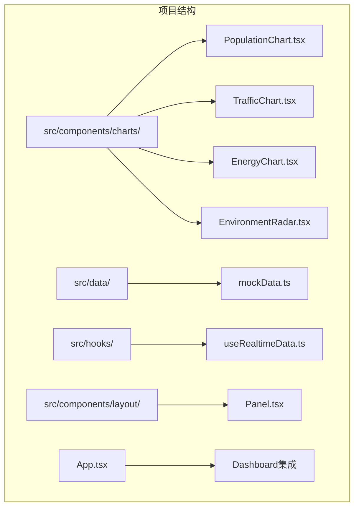
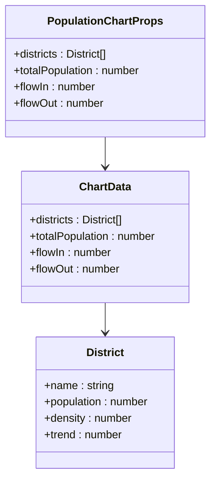
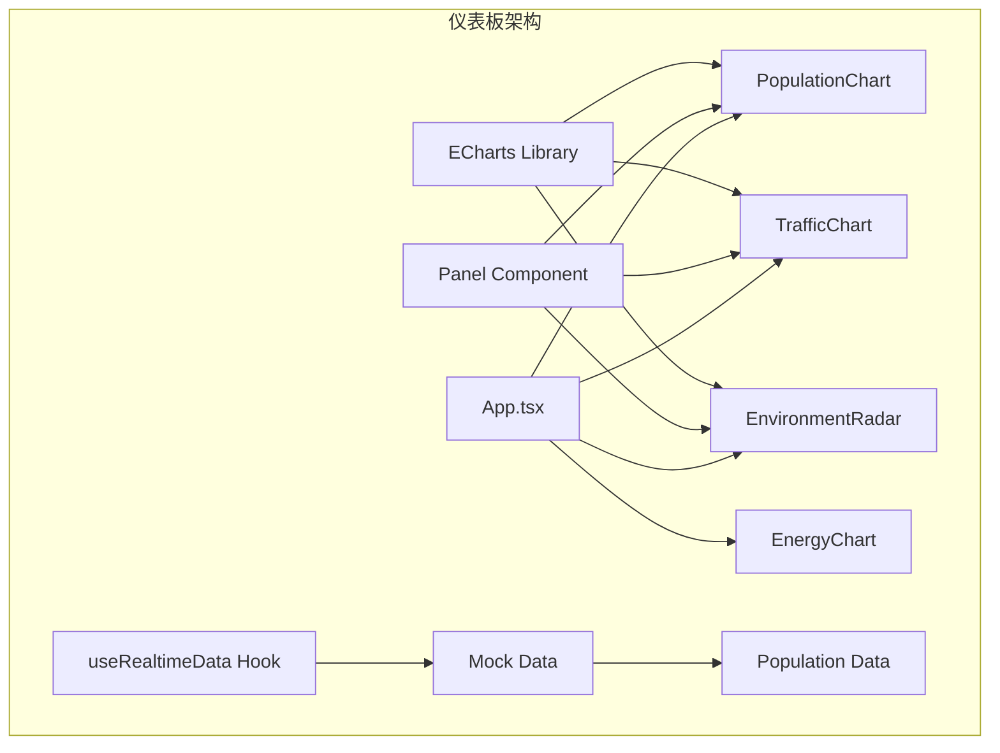
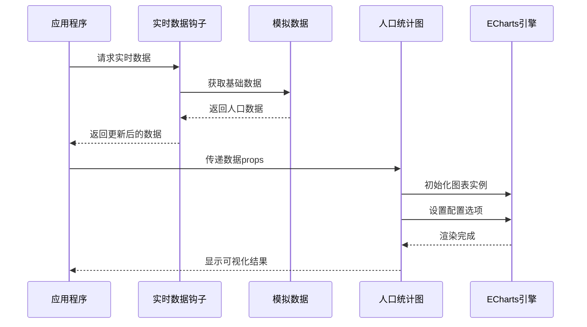
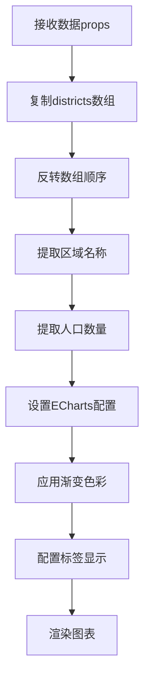
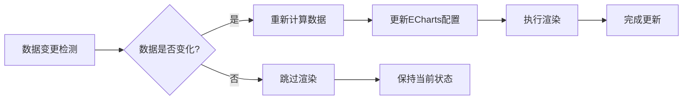
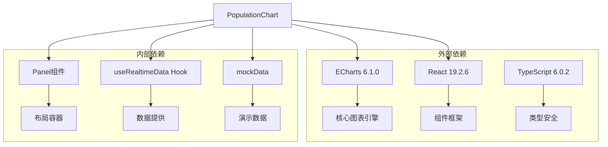
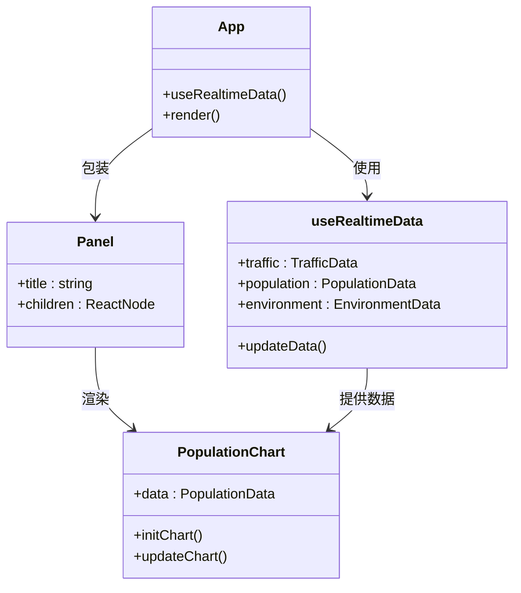

# 人口分布统计图

<cite>
**本文档引用的文件**
- [PopulationChart.tsx](file://src/components/charts/PopulationChart.tsx)
- [mockData.ts](file://src/data/mockData.ts)
- [useRealtimeData.ts](file://src/hooks/useRealtimeData.ts)
- [index.ts](file://src/components/charts/index.ts)
- [App.tsx](file://src/App.tsx)
- [Panel.tsx](file://src/components/layout/Panel.tsx)
- [global.css](file://src/styles/global.css)
- [package.json](file://package.json)
</cite>

## 目录
1. [简介](#简介)
2. [项目结构](#项目结构)
3. [核心组件](#核心组件)
4. [架构概览](#架构概览)
5. [详细组件分析](#详细组件分析)
6. [依赖关系分析](#依赖关系分析)
7. [性能考虑](#性能考虑)
8. [故障排除指南](#故障排除指南)
9. [结论](#结论)
10. [附录](#附录)

## 简介

人口分布统计图（PopulationChart）是智慧城市数据分析仪表板中的关键可视化组件，专门用于展示城市各行政区的人口分布情况。该组件采用ECharts技术栈，结合赛博朋克风格的UI设计，为用户提供直观、实时的人口统计数据可视化体验。

该组件不仅展示了静态的人口数据，还集成了实时数据更新机制，能够动态反映城市人口的变化趋势。通过渐变色彩、阴影效果和响应式布局，为用户提供了现代化的数据可视化界面。

## 项目结构

人口分布统计图组件位于项目的图表组件目录中，与其它可视化组件共同构成了完整的数据分析仪表板生态系统。

**图表来源**
- [PopulationChart.tsx:1-97](file://src/components/charts/PopulationChart.tsx#L1-L97)
- [mockData.ts:1-96](file://src/data/mockData.ts#L1-L96)
- [useRealtimeData.ts:1-73](file://src/hooks/useRealtimeData.ts#L1-L73)

**章节来源**
- [PopulationChart.tsx:1-97](file://src/components/charts/PopulationChart.tsx#L1-L97)
- [App.tsx:1-128](file://src/App.tsx#L1-L128)

## 核心组件

### 组件架构设计

PopulationChart组件采用了React函数式组件的设计模式，结合ECharts的JavaScript API实现数据可视化。组件的核心设计理念包括：

- **数据驱动**：完全基于传入的数据props进行渲染
- **响应式设计**：自动适配容器尺寸变化
- **实时更新**：支持动态数据更新和重新渲染
- **样式统一**：遵循整体仪表板的赛博朋克视觉风格

### 数据接口规范

组件接收标准化的数据结构，确保了数据的一致性和可维护性：

**图表来源**
- [PopulationChart.tsx:4-11](file://src/components/charts/PopulationChart.tsx#L4-L11)

**章节来源**
- [PopulationChart.tsx:4-11](file://src/components/charts/PopulationChart.tsx#L4-L11)
- [mockData.ts:14-27](file://src/data/mockData.ts#L14-L27)

## 架构概览

### 整体系统架构

人口分布统计图在智慧城市仪表板中扮演着重要角色，与其他组件协同工作形成完整的数据可视化生态系统。

**图表来源**
- [App.tsx:6-15](file://src/App.tsx#L6-L15)
- [useRealtimeData.ts:15-72](file://src/hooks/useRealtimeData.ts#L15-L72)

### 数据流向图

**图表来源**
- [App.tsx:44-76](file://src/App.tsx#L44-L76)
- [useRealtimeData.ts:15-72](file://src/hooks/useRealtimeData.ts#L15-L72)

## 详细组件分析

### PopulationChart组件实现

#### 核心功能模块

组件实现了以下核心功能：

1. **图表初始化**：使用ECharts初始化图表实例
2. **数据绑定**：将传入的人口数据绑定到图表
3. **样式配置**：应用赛博朋克风格的视觉效果
4. **响应式适配**：监听容器尺寸变化自动调整

#### 数据处理逻辑

**图表来源**
- [PopulationChart.tsx:28-73](file://src/components/charts/PopulationChart.tsx#L28-L73)

#### ECharts配置详解

组件使用了丰富的ECharts配置选项来实现专业的数据可视化效果：

**工具提示配置**：
- 触发方式：轴触发
- 指针类型：阴影
- 背景色：深蓝透明背景
- 边框色：青蓝色半透明边框

**网格布局配置**：
- 左边距：20%
- 右边距：12%
- 上边距：8%
- 下边距：8%

**坐标轴配置**：
- X轴：数值轴，无轴线，浅色刻度标签
- Y轴：分类轴，显示区域名称，渐变轴线

**系列配置**：
- 类型：柱状图
- 宽度：50%
- 圆角：右侧圆角
- 渐变色彩：从青蓝色到青绿色

**章节来源**
- [PopulationChart.tsx:32-72](file://src/components/charts/PopulationChart.tsx#L32-L72)

### 数据格式要求

#### 输入数据结构

组件期望接收特定格式的数据对象：

| 字段名 | 类型 | 描述 | 示例值 |
|--------|------|------|--------|
| districts | District[] | 行政区数组 | - |
| totalPopulation | number | 总人口数 | 1280.5 |
| flowIn | number | 人口流入量 | 12580 |
| flowOut | number | 人口流出量 | 9870 |

#### District接口定义

| 属性名 | 类型 | 描述 | 单位 |
|--------|------|------|------|
| name | string | 区域名称 | 文本 |
| population | number | 人口数量 | 万人 |
| density | number | 人口密度 | 人/平方公里 |
| trend | number | 人口趋势 | 百分比 |

#### 输出数据格式

组件会自动处理数据格式转换，确保与ECharts兼容：

- 区域名称：字符串数组
- 人口数量：数值数组
- 标签格式：'{c}万'

**章节来源**
- [PopulationChart.tsx:5-10](file://src/components/charts/PopulationChart.tsx#L5-L10)
- [mockData.ts:14-27](file://src/data/mockData.ts#L14-L27)

### 图表样式定制

#### 赛博朋克视觉风格

组件采用了独特的赛博朋克风格设计：

**色彩方案**：
- 主色调：青蓝色 (#00d4ff)
- 渐变色：从青蓝色到青绿色
- 背景色：深蓝透明背景
- 文字色：浅蓝灰色 (#e0e6ff)

**字体设计**：
- 标题字体：16px，粗体
- 标签字体：10px，半透明
- 刻度字体：9px，浅色

**边框效果**：
- 圆角矩形：4px半径
- 阴影效果：右侧渐变阴影
- 边框线条：青蓝色渐变

#### 动态数据展示

组件提供了三个关键指标的实时展示：

1. **总人口**：显示城市总人口数量
2. **人口流入**：显示人口净流入量（绿色上箭头）
3. **人口流出**：显示人口净流出量（红色下箭头）

**章节来源**
- [PopulationChart.tsx:75-93](file://src/components/charts/PopulationChart.tsx#L75-L93)

### 性能优化策略

#### 内存管理

组件实现了完善的内存管理机制：

- **实例销毁**：组件卸载时自动清理ECharts实例
- **观察者断开**：ResizeObserver在组件卸载时断开连接
- **事件监听器清理**：防止内存泄漏

#### 渲染优化

**图表来源**
- [PopulationChart.tsx:28-73](file://src/components/charts/PopulationChart.tsx#L28-L73)

#### 响应式设计

组件支持动态尺寸调整：

- **ResizeObserver**：监听容器尺寸变化
- **自动重绘**：尺寸变化时自动调整图表大小
- **比例保持**：保持图表纵横比不变

**章节来源**
- [PopulationChart.tsx:17-26](file://src/components/charts/PopulationChart.tsx#L17-L26)

## 依赖关系分析

### 外部依赖

组件依赖于多个外部库来实现其功能：

**图表来源**
- [package.json:12-26](file://package.json#L12-L26)
- [index.ts:1-7](file://src/components/charts/index.ts#L1-L7)

### 内部组件依赖

组件之间的依赖关系清晰明确：

**图表来源**
- [App.tsx:44-76](file://src/App.tsx#L44-L76)
- [Panel.tsx:10-27](file://src/components/layout/Panel.tsx#L10-L27)

**章节来源**
- [package.json:12-26](file://package.json#L12-L26)
- [index.ts:1-7](file://src/components/charts/index.ts#L1-L7)

## 性能考虑

### 渲染性能优化

组件在设计时充分考虑了性能因素：

**最小化重渲染**：
- 使用React.memo避免不必要的组件重渲染
- 仅在数据props变化时更新图表
- 合理的数据结构设计减少计算开销

**内存使用优化**：
- 及时清理ECharts实例和事件监听器
- 避免创建不必要的DOM元素
- 合理使用渐变和阴影效果

### 数据处理优化

**数据预处理**：
- 在组件内部进行必要的数据转换
- 避免在渲染过程中进行复杂计算
- 使用稳定的排序和过滤操作

**图表更新策略**：
- 使用setOption而非重新初始化
- 批量更新配置选项
- 避免频繁的图表重建

## 故障排除指南

### 常见问题及解决方案

#### 图表不显示

**可能原因**：
- 容器元素未正确设置尺寸
- ECharts实例初始化失败
- 数据格式不正确

**解决方法**：
1. 确保父容器具有明确的高度和宽度
2. 检查ECharts库是否正确加载
3. 验证数据结构符合接口定义

#### 数据更新不生效

**可能原因**：
- props引用未发生变化
- ECharts实例未正确更新
- 数据格式转换错误

**解决方法**：
1. 确保传入新的数据对象引用
2. 调用chartInstance.current.setOption()
3. 检查数据转换逻辑

#### 性能问题

**可能原因**：
- 频繁的图表重建
- 大量的DOM操作
- 内存泄漏

**解决方法**：
1. 使用ResizeObserver监听尺寸变化
2. 及时清理事件监听器和定时器
3. 避免在渲染过程中进行复杂计算

**章节来源**
- [PopulationChart.tsx:17-26](file://src/components/charts/PopulationChart.tsx#L17-L26)
- [PopulationChart.tsx:28-73](file://src/components/charts/PopulationChart.tsx#L28-L73)

## 结论

人口分布统计图组件是一个设计精良、功能完整的数据可视化解决方案。它成功地将复杂的人口统计数据转化为直观的视觉信息，为智慧城市管理提供了重要的决策支持工具。

组件的主要优势包括：

1. **专业性**：采用ECharts专业图表库，提供高质量的可视化效果
2. **实时性**：集成实时数据更新机制，反映最新的城市人口变化
3. **美观性**：独特的赛博朋克风格设计，符合现代仪表板的视觉需求
4. **可维护性**：清晰的代码结构和标准化的数据接口
5. **性能优化**：完善的内存管理和渲染优化策略

该组件为整个智慧城市数据分析平台奠定了坚实的基础，为后续的功能扩展和功能增强提供了良好的技术支撑。

## 附录

### 实际应用场景

#### 城市管理决策支持

人口分布统计图可以为城市管理者提供以下决策支持：

- **资源配置**：根据人口分布优化公共服务设施布局
- **发展规划**：识别人口增长区域，制定相应的城市规划
- **政策制定**：基于人口流动趋势制定相关政策

#### 实时监控与预警

组件支持实时数据更新，可以用于：

- **人口监测**：实时跟踪城市人口变化趋势
- **异常检测**：快速发现人口异常波动
- **应急响应**：为突发事件提供数据支持

### 代码示例路径

#### 基本使用示例

[PopulationChart组件基本用法:13-97](file://src/components/charts/PopulationChart.tsx#L13-L97)

#### 数据提供示例

[实时数据钩子使用:15-72](file://src/hooks/useRealtimeData.ts#L15-L72)

#### 集成示例

[仪表板集成方式:74-76](file://src/App.tsx#L74-L76)

### 配置参数参考

#### ECharts配置参数

| 参数名 | 类型 | 默认值 | 描述 |
|--------|------|--------|------|
| tooltip.trigger | string | 'axis' | 工具提示触发方式 |
| grid.left | string | '20%' | 网格左边距 |
| grid.right | string | '12%' | 网格右边距 |
| xAxis.type | string | 'value' | X轴类型 |
| yAxis.type | string | 'category' | Y轴类型 |
| series.type | string | 'bar' | 图表类型 |
| label.position | string | 'right' | 标签位置 |

**章节来源**
- [PopulationChart.tsx:32-72](file://src/components/charts/PopulationChart.tsx#L32-L72)