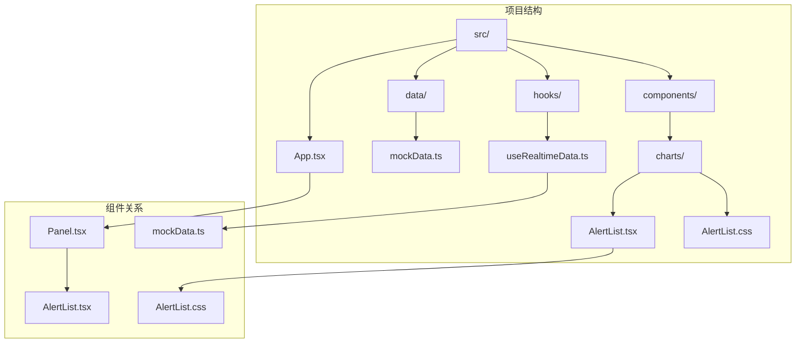
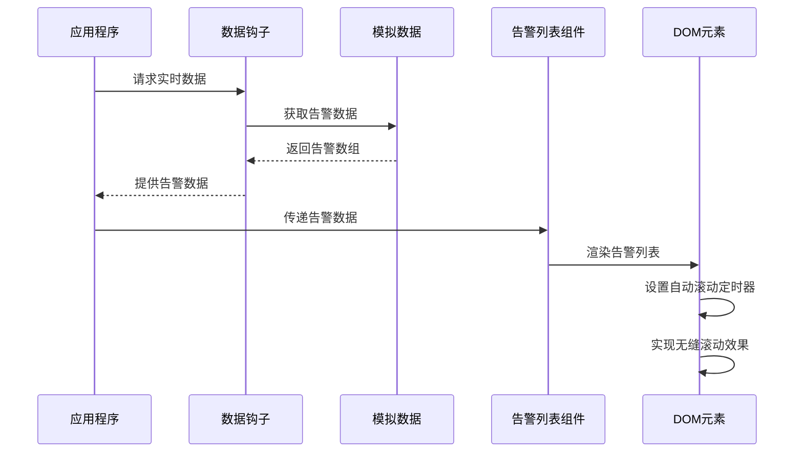
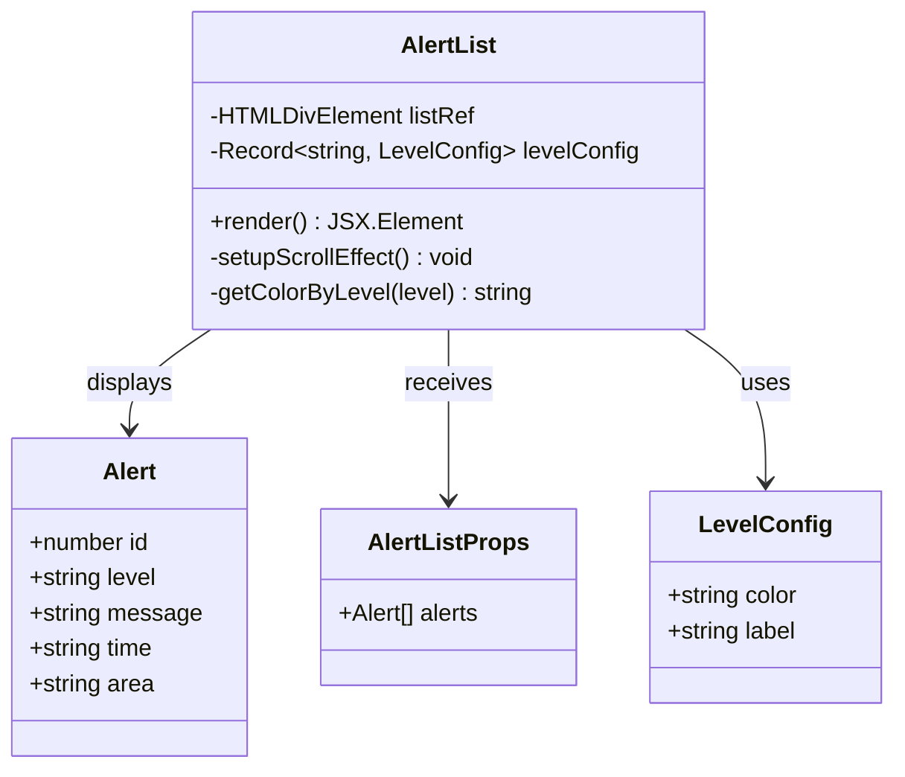
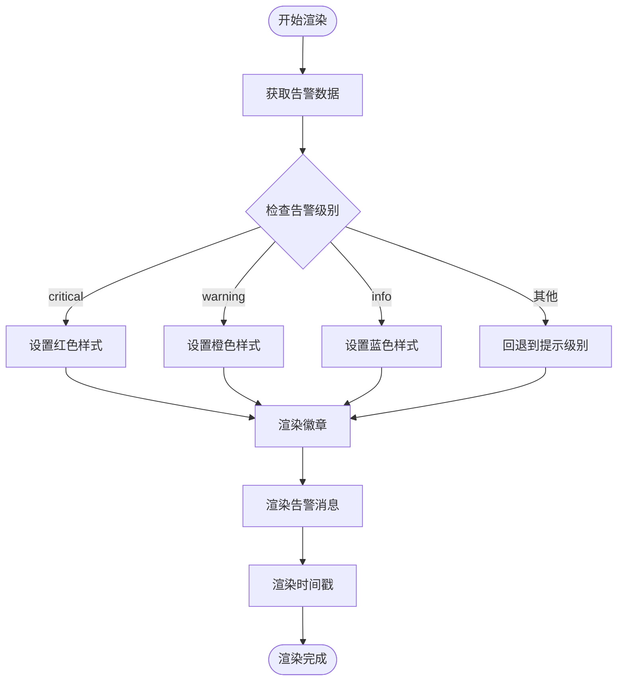
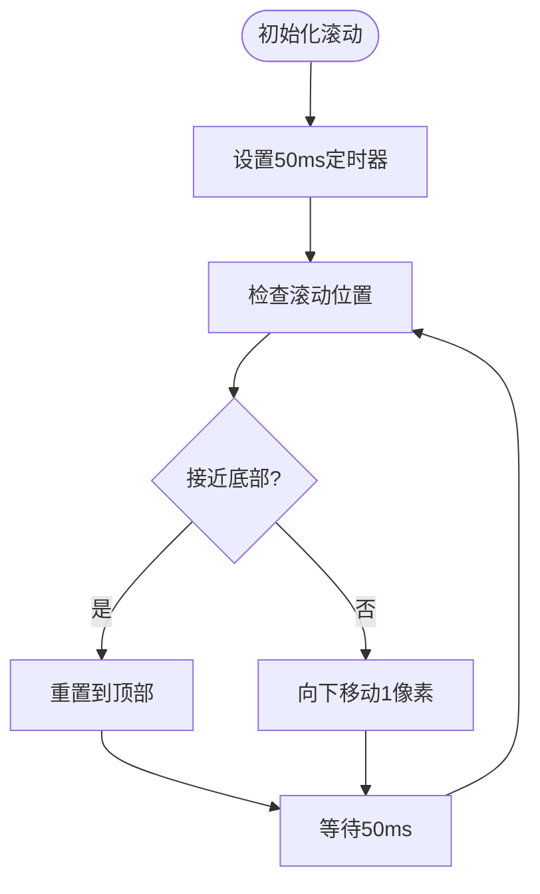
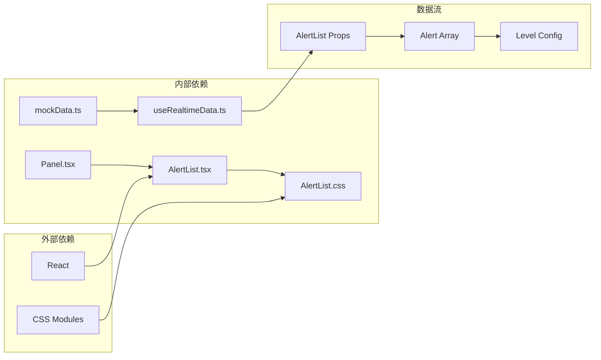

# 告警信息列表

<cite>
**本文档引用的文件**
- [AlertList.tsx](file://src/components/charts/AlertList.tsx)
- [AlertList.css](file://src/components/charts/AlertList.css)
- [mockData.ts](file://src/data/mockData.ts)
- [useRealtimeData.ts](file://src/hooks/useRealtimeData.ts)
- [App.tsx](file://src/App.tsx)
- [Panel.tsx](file://src/components/layout/Panel.tsx)
- [Panel.css](file://src/components/layout/Panel.css)
- [global.css](file://src/styles/global.css)
</cite>

## 目录
1. [简介](#简介)
2. [项目结构](#项目结构)
3. [核心组件](#核心组件)
4. [架构概览](#架构概览)
5. [详细组件分析](#详细组件分析)
6. [依赖关系分析](#依赖关系分析)
7. [性能考虑](#性能考虑)
8. [故障排除指南](#故障排除指南)
9. [结论](#结论)
10. [附录](#附录)

## 简介

告警信息列表（AlertList）是智慧城市监控仪表板中的关键组件，负责实时展示城市运行过程中的各类告警信息。该组件采用赛博朋克风格设计，通过颜色编码系统直观地传达告警的严重程度，并实现了自动滚动的视觉效果来突出实时性。

AlertList组件集成了完整的告警管理系统，包括告警级别的分类、实时数据的展示、历史告警的管理以及用户交互功能。该组件在整体仪表板中占据重要位置，为城市管理提供了重要的实时监控能力。

## 项目结构

AlertList组件位于项目的图表组件目录中，与其它可视化组件共同构成了完整的仪表板界面。



**图表来源**
- [AlertList.tsx:1-65](file://src/components/charts/AlertList.tsx#L1-L65)
- [mockData.ts:71-83](file://src/data/mockData.ts#L71-L83)
- [useRealtimeData.ts:15-72](file://src/hooks/useRealtimeData.ts#L15-L72)

**章节来源**
- [AlertList.tsx:1-65](file://src/components/charts/AlertList.tsx#L1-L65)
- [App.tsx:69-82](file://src/App.tsx#L69-L82)

## 核心组件

AlertList组件的核心功能围绕以下几个方面构建：

### 数据结构定义

组件定义了标准的告警数据接口，确保数据的一致性和类型安全：

```typescript
interface Alert {
  id: number;
  level: string;
  message: string;
  time: string;
  area: string;
}
```

### 告警级别配置

系统支持三种告警级别，每种级别都有对应的颜色编码和中文标签：
- **严重级别**：红色 (#ff4757)，用于最紧急的告警
- **警告级别**：橙色 (#ffa502)，用于需要关注的告警  
- **提示级别**：蓝色 (#00d4ff)，用于一般性信息

### 实时滚动机制

组件实现了独特的双倍数据渲染技术，通过复制告警数组来创建无缝滚动效果：

```javascript
const doubledAlerts = [...alerts, ...alerts];
```

**章节来源**
- [AlertList.tsx:4-20](file://src/components/charts/AlertList.tsx#L4-L20)
- [AlertList.tsx:16-20](file://src/components/charts/AlertList.tsx#L16-L20)
- [AlertList.tsx:40-41](file://src/components/charts/AlertList.tsx#L40-L41)

## 架构概览

AlertList组件在整个系统架构中扮演着数据展示层的角色，连接了数据获取层和用户界面层。



**图表来源**
- [App.tsx:44](file://src/App.tsx#L44)
- [useRealtimeData.ts:21](file://src/hooks/useRealtimeData.ts#L21)
- [AlertList.tsx:22-38](file://src/components/charts/AlertList.tsx#L22-L38)

## 详细组件分析

### 组件类图



**图表来源**
- [AlertList.tsx:4-14](file://src/components/charts/AlertList.tsx#L4-L14)
- [AlertList.tsx:16-20](file://src/components/charts/AlertList.tsx#L16-L20)
- [AlertList.tsx:22-62](file://src/components/charts/AlertList.tsx#L22-L62)

### 告警级别处理流程



**图表来源**
- [AlertList.tsx:44-58](file://src/components/charts/AlertList.tsx#L44-L58)
- [AlertList.tsx:45](file://src/components/charts/AlertList.tsx#L45)

### 实时滚动算法

AlertList组件实现了独特的滚动机制来增强用户体验：



**图表来源**
- [AlertList.tsx:25-38](file://src/components/charts/AlertList.tsx#L25-L38)

**章节来源**
- [AlertList.tsx:22-62](file://src/components/charts/AlertList.tsx#L22-L62)

### 样式系统分析

AlertList组件采用了完整的CSS样式体系，包括：

#### 颜色编码系统
- **背景色**：使用半透明的蓝色背景 (#00d4ff) 来创建发光效果
- **边框色**：渐变的蓝色边框增强视觉层次
- **文本色**：不同透明度的白色文本确保可读性

#### 响应式布局
- **Flexbox布局**：使用弹性布局实现内容的自适应排列
- **间距控制**：8px的间距确保视觉平衡
- **溢出处理**：隐藏滚动条保持界面整洁

**章节来源**
- [AlertList.css:11-47](file://src/components/charts/AlertList.css#L11-L47)

## 依赖关系分析

AlertList组件的依赖关系相对简单但功能完整：



**图表来源**
- [AlertList.tsx:1](file://src/components/charts/AlertList.tsx#L1)
- [AlertList.tsx:2](file://src/components/charts/AlertList.tsx#L2)
- [App.tsx:9](file://src/App.tsx#L9)

**章节来源**
- [App.tsx:44](file://src/App.tsx#L44)
- [useRealtimeData.ts:15-72](file://src/hooks/useRealtimeData.ts#L15-L72)

## 性能考虑

### 渲染优化策略

1. **虚拟滚动实现**：通过双倍数据渲染避免了复杂的DOM操作
2. **最小化重绘**：只在必要时更新滚动位置
3. **内存管理**：及时清理定时器防止内存泄漏

### 动画性能

组件使用纯CSS和原生JavaScript实现滚动效果，避免了第三方动画库的依赖，确保了良好的性能表现。

### 内存泄漏防护

组件在卸载时会自动清理定时器，防止长时间运行导致的内存泄漏问题。

**章节来源**
- [AlertList.tsx:37](file://src/components/charts/AlertList.tsx#L37)

## 故障排除指南

### 常见问题及解决方案

#### 滚动效果不工作
- **症状**：告警列表无法自动滚动
- **原因**：DOM元素引用为空或定时器被意外清理
- **解决**：检查listRef的初始化和组件的卸载逻辑

#### 颜色显示异常
- **症状**：告警级别颜色显示不正确
- **原因**：levelConfig配置错误或告警级别值不在预定义范围内
- **解决**：验证告警数据的level字段值

#### 性能问题
- **症状**：页面响应缓慢或卡顿
- **原因**：大量告警数据导致频繁重绘
- **解决**：考虑实现分页加载或限制显示数量

**章节来源**
- [AlertList.tsx:22-38](file://src/components/charts/AlertList.tsx#L22-L38)

## 结论

AlertList组件是一个设计精良的实时告警展示系统，它成功地将复杂的城市运行数据转化为直观易懂的视觉信息。组件通过合理的数据结构设计、优雅的视觉呈现和高效的性能优化，为智慧城市监控提供了可靠的技术支撑。

该组件的主要优势包括：
- **直观的颜色编码系统**：通过不同的颜色快速传达告警严重程度
- **流畅的用户体验**：自动滚动效果增强了实时性感知
- **简洁的架构设计**：清晰的代码结构便于维护和扩展
- **良好的性能表现**：优化的渲染策略确保了流畅的用户体验

## 附录

### 使用示例

AlertList组件可以在任何需要展示实时告警信息的场景中使用：

```typescript
// 基本用法
<AlertList alerts={alertData} />

// 在面板中使用
<Panel title="实时告警">
  <AlertList alerts={alerts} />
</Panel>
```

### 集成指南

要将AlertList集成到现有项目中：

1. **安装依赖**：确保React版本兼容
2. **导入组件**：从'./components/charts/AlertList'导入
3. **准备数据**：确保传入的数据符合Alert接口定义
4. **样式集成**：导入AlertList.css文件
5. **配置面板**：将其嵌入到Panel组件中

### 扩展建议

1. **添加交互功能**：实现告警确认、查看详情等用户操作
2. **优化性能**：对于大量数据场景，考虑实现虚拟滚动
3. **增强样式**：支持更多自定义主题和样式选项
4. **国际化支持**：添加多语言支持以适应不同地区需求