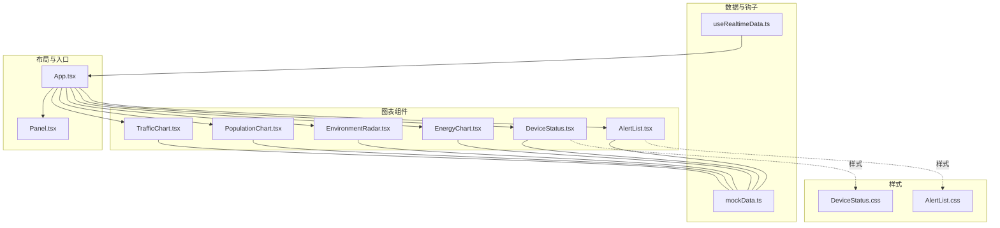
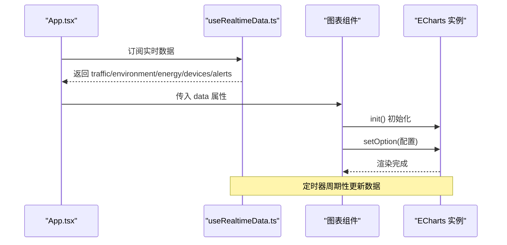
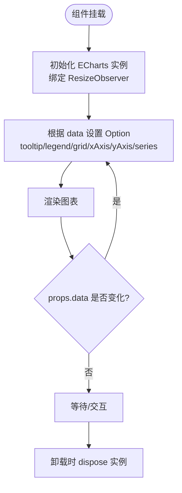
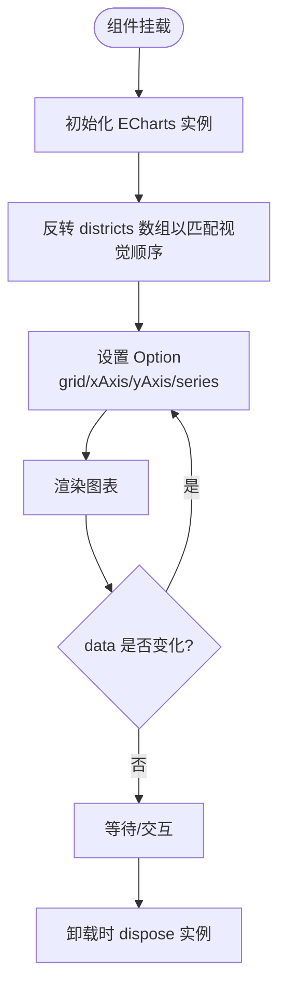
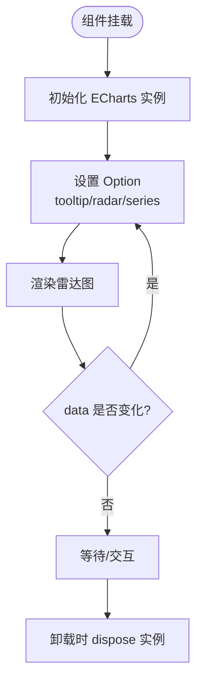
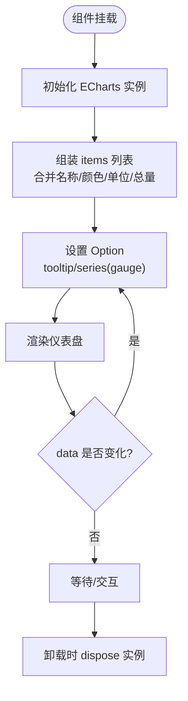
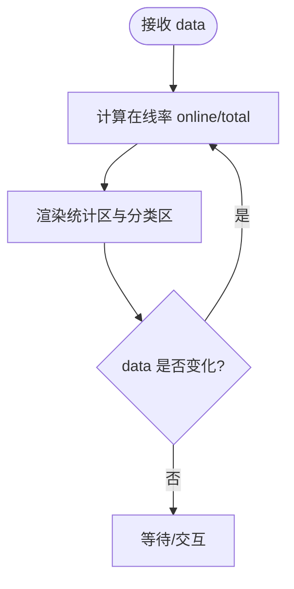
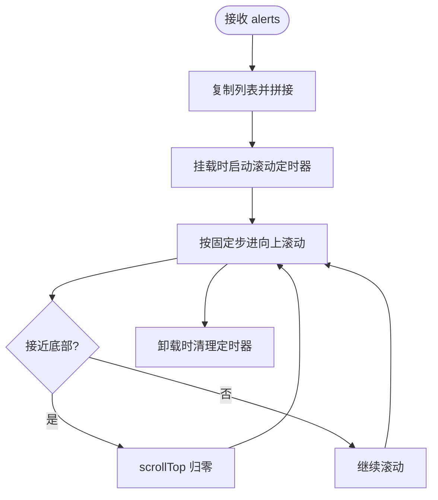
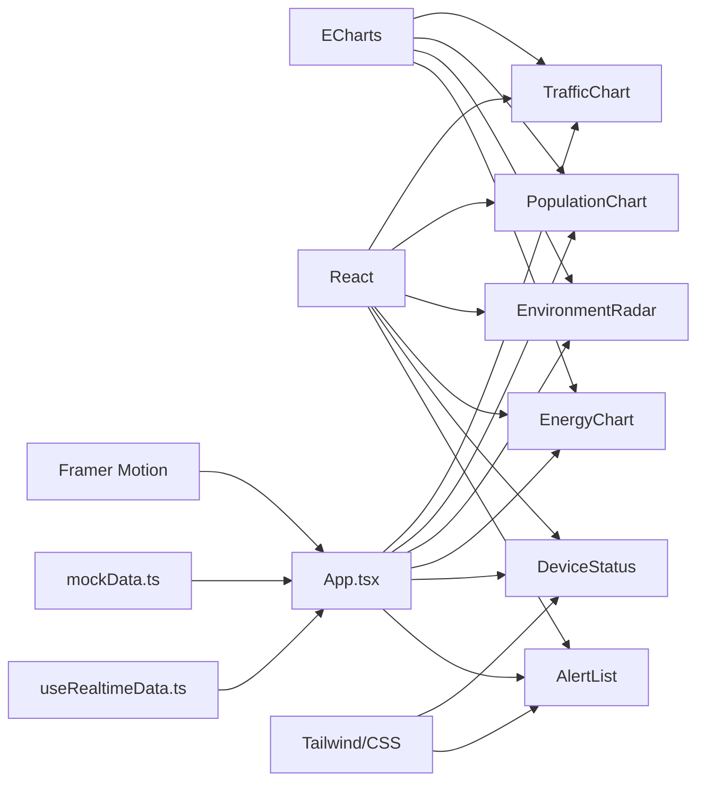

# 数据可视化组件

<cite>
**本文引用的文件**
- [TrafficChart.tsx](file://src/components/charts/TrafficChart.tsx)
- [PopulationChart.tsx](file://src/components/charts/PopulationChart.tsx)
- [EnvironmentRadar.tsx](file://src/components/charts/EnvironmentRadar.tsx)
- [EnergyChart.tsx](file://src/components/charts/EnergyChart.tsx)
- [DeviceStatus.tsx](file://src/components/charts/DeviceStatus.tsx)
- [AlertList.tsx](file://src/components/charts/AlertList.tsx)
- [DeviceStatus.css](file://src/components/charts/DeviceStatus.css)
- [AlertList.css](file://src/components/charts/AlertList.css)
- [mockData.ts](file://src/data/mockData.ts)
- [useRealtimeData.ts](file://src/hooks/useRealtimeData.ts)
- [App.tsx](file://src/App.tsx)
- [Panel.tsx](file://src/components/layout/Panel.tsx)
- [package.json](file://package.json)
- [README.md](file://README.md)
</cite>

## 目录
1. [简介](#简介)
2. [项目结构](#项目结构)
3. [核心组件](#核心组件)
4. [架构总览](#架构总览)
5. [详细组件分析](#详细组件分析)
6. [依赖关系分析](#依赖关系分析)
7. [性能考虑](#性能考虑)
8. [故障排查指南](#故障排查指南)
9. [结论](#结论)
10. [附录](#附录)

## 简介
本文件为智慧城市数据可视化仪表板中的图表与展示组件的综合文档，覆盖以下组件：TrafficChart（交通流量图）、PopulationChart（人口分布图）、EnvironmentRadar（环境雷达图）、EnergyChart（能源消耗图）、DeviceStatus（设备状态面板）与 AlertList（告警列表）。文档从设计理念、实现细节、ECharts 配置要点、数据绑定与实时更新策略、交互与样式定制、到性能优化与故障排查进行系统化说明，帮助开发者快速理解与扩展。

## 项目结构
图表组件集中于 src/components/charts 目录，采用按功能分层组织：每个图表组件独立封装 ECharts 初始化、配置与销毁；配套的 CSS 文件用于样式与动画；数据通过 mockData.ts 提供示例，useRealtimeData.ts 提供实时数据钩子；App.tsx 将组件组合到布局中。

**图表来源**
- [App.tsx:43-125](file://src/App.tsx#L43-L125)
- [Panel.tsx:10-27](file://src/components/layout/Panel.tsx#L10-L27)
- [TrafficChart.tsx:14-117](file://src/components/charts/TrafficChart.tsx#L14-L117)
- [PopulationChart.tsx:13-97](file://src/components/charts/PopulationChart.tsx#L13-L97)
- [EnvironmentRadar.tsx:14-108](file://src/components/charts/EnvironmentRadar.tsx#L14-L108)
- [EnergyChart.tsx:20-103](file://src/components/charts/EnergyChart.tsx#L20-L103)
- [DeviceStatus.tsx:14-63](file://src/components/charts/DeviceStatus.tsx#L14-L63)
- [AlertList.tsx:22-65](file://src/components/charts/AlertList.tsx#L22-L65)
- [mockData.ts:1-96](file://src/data/mockData.ts#L1-L96)
- [useRealtimeData.ts:15-72](file://src/hooks/useRealtimeData.ts#L15-L72)
- [DeviceStatus.css:1-80](file://src/components/charts/DeviceStatus.css#L1-L80)
- [AlertList.css:1-48](file://src/components/charts/AlertList.css#L1-L48)

**章节来源**
- [README.md:49-71](file://README.md#L49-L71)
- [package.json:12-26](file://package.json#L12-L26)

## 核心组件
- TrafficChart：基于折线图展示多路线的小时级流量趋势，包含拥堵指数、车辆总数、平均速度等关键指标。
- PopulationChart：基于横向柱状图展示各行政区人口数量，标注总量、流入/流出趋势。
- EnvironmentRadar：基于雷达图展示空气质量与环境指标，同时显示 AQI、温度、湿度、风向等数值。
- EnergyChart：基于仪表盘（gauge）展示电力、水、气、太阳能的当前用量与占比。
- DeviceStatus：以卡片形式展示设备总数、在线率、告警数及分类统计，含进度条与渐变色。
- AlertList：垂直滚动的告警列表，支持级别颜色与无缝循环滚动。

**章节来源**
- [TrafficChart.tsx:4-12](file://src/components/charts/TrafficChart.tsx#L4-L12)
- [PopulationChart.tsx:4-11](file://src/components/charts/PopulationChart.tsx#L4-L11)
- [EnvironmentRadar.tsx:4-12](file://src/components/charts/EnvironmentRadar.tsx#L4-L12)
- [EnergyChart.tsx:11-18](file://src/components/charts/EnergyChart.tsx#L11-L18)
- [DeviceStatus.tsx:4-12](file://src/components/charts/DeviceStatus.tsx#L4-L12)
- [AlertList.tsx:12-14](file://src/components/charts/AlertList.tsx#L12-L14)

## 架构总览
图表组件统一采用 React + ECharts 的组合：组件在挂载时初始化实例，使用 ResizeObserver 监听容器尺寸变化并自适应；通过 useEffect 依据 props.data 设置 ECharts 配置；卸载时释放实例与观察器。实时数据由 useRealtimeData 提供，定时更新 traffic、environment、energy、devices 等数据源，驱动图表联动更新。

**图表来源**
- [App.tsx:44-44](file://src/App.tsx#L44-L44)
- [useRealtimeData.ts:15-72](file://src/hooks/useRealtimeData.ts#L15-L72)
- [TrafficChart.tsx:18-30](file://src/components/charts/TrafficChart.tsx#L18-L30)
- [EnergyChart.tsx:24-33](file://src/components/charts/EnergyChart.tsx#L24-L33)

## 详细组件分析

### TrafficChart 交通流量图
- 设计理念：以折线图呈现多路线的小时级流量趋势，上方叠加关键指标（拥堵指数、车辆总数、平均速度），形成“趋势+指标”的双层信息密度。
- 数据绑定：接收 data.timestamps、data.routes、data.congestionIndex、data.totalVehicles、data.avgSpeed；routes 为数组，每项包含名称与数值序列。
- ECharts 配置要点：
  - tooltip 触发类型为轴，样式采用深色背景与科技蓝边框。
  - legend 显示各路线名称，位置靠上，条目细小。
  - grid 提供内边距，保证指标区与图表区不重叠。
  - xAxis 为时间刻度，yAxis 为数值轴；series 为多条平滑曲线，带半透明渐变面积填充。
  - 开启动画，入场时长 800ms。
- 实时更新策略：当 data 变化时重新 setOption，保持渲染一致性。
- 交互与样式：支持鼠标悬停高亮、响应式 resize；指标区使用发光阴影增强可读性。

**图表来源**
- [TrafficChart.tsx:18-87](file://src/components/charts/TrafficChart.tsx#L18-L87)

**章节来源**
- [TrafficChart.tsx:4-12](file://src/components/charts/TrafficChart.tsx#L4-L12)
- [TrafficChart.tsx:18-30](file://src/components/charts/TrafficChart.tsx#L18-L30)
- [TrafficChart.tsx:32-87](file://src/components/charts/TrafficChart.tsx#L32-L87)

### PopulationChart 人口分布图
- 设计理念：横向柱状图直观展示各行政区人口规模，右侧标注“万人”单位，配合总人口与流入/流出趋势，形成静态与动态的对比。
- 数据绑定：接收 data.districts（含 name、population、density、trend）、data.totalPopulation、data.flowIn、data.flowOut。
- ECharts 配置要点：
  - xAxis 为数值轴，yAxis 为类别轴（行政区名）。
  - series 为单组柱状图，使用从左到右的线性渐变填充，右侧显示标签并格式化为“万人”。
  - grid 左右留白，确保标签可见。
- 实时更新策略：当 data 变化时重新 setOption。
- 交互与样式：悬停显示阴影指针，标签颜色与主题一致。

**图表来源**
- [PopulationChart.tsx:17-73](file://src/components/charts/PopulationChart.tsx#L17-L73)

**章节来源**
- [PopulationChart.tsx:4-11](file://src/components/charts/PopulationChart.tsx#L4-L11)
- [PopulationChart.tsx:28-73](file://src/components/charts/PopulationChart.tsx#L28-L73)

### EnvironmentRadar 环境雷达图
- 设计理念：雷达图用于多指标综合评估，结合 AQI、温度、湿度、风向等关键值，形成“多维健康画像”。
- 数据绑定：接收 data.indicators（指标名、当前值、最大值）、data.aqi、data.temperature、data.humidity、data.windDirection。
- ECharts 配置要点：
  - radar 组件配置多个指标与分隔线、分隔区、轴线样式，形成网格化雷达。
  - series 类型为 radar，使用渐变面与细线勾勒轮廓，点位为小圆点。
  - 上方指标区显示 AQI 状态（阈值颜色变化）与其它环境参数。
- 实时更新策略：当 data 变化时重新 setOption。
- 交互与样式：tooltip 与雷达网格统一风格，标签与分割线颜色协调。

**图表来源**
- [EnvironmentRadar.tsx:18-78](file://src/components/charts/EnvironmentRadar.tsx#L18-L78)

**章节来源**
- [EnvironmentRadar.tsx:4-12](file://src/components/charts/EnvironmentRadar.tsx#L4-L12)
- [EnvironmentRadar.tsx:29-78](file://src/components/charts/EnvironmentRadar.tsx#L29-L78)

### EnergyChart 能源消耗图
- 设计理念：四块仪表盘并排展示电力、水、气、太阳能的当前用量与占比，直观反映能耗结构与实时水平。
- 数据绑定：接收 data.electricity、data.water、data.gas、data.solar，每项包含 current、total、unit、trend。
- ECharts 配置要点：
  - series 为四个 gauge，分别设置中心位置、半径、角度范围、最小/最大值、进度条样式、标题与数值样式。
  - tooltip 使用自定义 formatter，展示名称、当前用量与占比。
  - 仪表盘颜色与用途对应，数值动画开启。
- 实时更新策略：当 data 变化时重新 setOption。
- 交互与样式：指针隐藏，进度条圆头，标题与数值清晰可读。

**图表来源**
- [EnergyChart.tsx:24-97](file://src/components/charts/EnergyChart.tsx#L24-L97)

**章节来源**
- [EnergyChart.tsx:11-18](file://src/components/charts/EnergyChart.tsx#L11-L18)
- [EnergyChart.tsx:35-97](file://src/components/charts/EnergyChart.tsx#L35-L97)

### DeviceStatus 设备状态面板
- 设计理念：以卡片形式聚合设备总体状态与分类统计，通过进度条颜色梯度直观反映在线率健康度。
- 数据绑定：接收 data.total、data.online、data.offline、data.warning、data.categories（含 name、total、online、icon）。
- 样式与交互：
  - 顶部三列统计：设备总数、在线率、告警数，数值带有发光阴影。
  - 分类区域逐项展示图标、名称、在线/总数，进度条宽度随在线率变化，颜色根据阈值切换。
  - CSS 使用毛玻璃与发光边角，间距与字体大小统一。
- 实时更新策略：由父组件传入最新 data，组件内部计算在线率并渲染。

**图表来源**
- [DeviceStatus.tsx:14-63](file://src/components/charts/DeviceStatus.tsx#L14-L63)
- [DeviceStatus.css:1-80](file://src/components/charts/DeviceStatus.css#L1-L80)

**章节来源**
- [DeviceStatus.tsx:4-12](file://src/components/charts/DeviceStatus.tsx#L4-L12)
- [DeviceStatus.tsx:14-63](file://src/components/charts/DeviceStatus.tsx#L14-L63)
- [DeviceStatus.css:1-80](file://src/components/charts/DeviceStatus.css#L1-L80)

### AlertList 告警列表
- 设计理念：垂直滚动的告警列表，支持严重、警告、提示三个级别，采用无缝循环滚动与悬停高亮，便于在大屏上持续展示事件流。
- 数据绑定：接收 alerts 数组，每项包含 id、level、message、time、area。
- 实时更新策略：
  - 组件内部使用 setInterval 控制滚动速度，到达底部时重置到顶部，实现无缝循环。
  - 将原始列表复制一份拼接，避免滚动中断感。
- 交互与样式：
  - 级别映射颜色与标签，徽章带半透明白色描边。
  - 消息文本省略溢出，时间使用等宽数字，hover 时背景浅显变化。

**图表来源**
- [AlertList.tsx:22-65](file://src/components/charts/AlertList.tsx#L22-L65)
- [AlertList.css:1-48](file://src/components/charts/AlertList.css#L1-L48)

**章节来源**
- [AlertList.tsx:12-14](file://src/components/charts/AlertList.tsx#L12-L14)
- [AlertList.tsx:22-65](file://src/components/charts/AlertList.tsx#L22-L65)
- [AlertList.css:1-48](file://src/components/charts/AlertList.css#L1-L48)

## 依赖关系分析
- 图表组件依赖 ECharts（通过 echarts 包）进行渲染；React 用于组件化与生命周期管理；Framer Motion 用于面板入场动画；Tailwind CSS 与自定义 CSS 提供样式体系。
- 数据来源：mockData.ts 提供初始示例数据；useRealtimeData.ts 提供定时随机波动的实时数据；App.tsx 将数据注入各组件。

**图表来源**
- [package.json:12-26](file://package.json#L12-L26)
- [App.tsx:43-125](file://src/App.tsx#L43-L125)
- [useRealtimeData.ts:15-72](file://src/hooks/useRealtimeData.ts#L15-L72)
- [mockData.ts:1-96](file://src/data/mockData.ts#L1-L96)

**章节来源**
- [package.json:12-26](file://package.json#L12-L26)
- [App.tsx:43-125](file://src/App.tsx#L43-L125)

## 性能考虑
- 实例生命周期管理：组件挂载时初始化实例，卸载时 dispose，避免内存泄漏；使用 ResizeObserver 监听容器尺寸变化，减少手动 resize 调用。
- 数据更新策略：仅在 props.data 变化时 setOption，避免不必要的重绘；对复杂 series（如雷达、仪表盘）尽量复用配置对象，减少对象创建开销。
- 渲染优化：TrafficChart 使用平滑曲线与渐变面积，建议在大数据量时关闭动画或降低动画时长；PopulationChart 的标签格式化为字符串，避免额外计算。
- 滚动列表：AlertList 的无缝滚动通过定时器控制，建议根据屏幕高度与刷新频率调整步进与间隔，避免高频重排。
- 3D 与粒子：中央 3D 城市模型与粒子背景会占用较多 GPU/CPU，建议在低端设备上降低粒子数量与模型细节。

[本节为通用性能建议，无需特定文件引用]

## 故障排查指南
- 图表不显示或空白：
  - 检查容器是否具有明确宽高；组件内部使用 ResizeObserver 自适应，但父容器需有尺寸。
  - 确认 ECharts 实例已正确初始化且未被提前 dispose。
- 图表尺寸错乱：
  - 确保容器尺寸变化后触发 resize；必要时手动调用实例 resize 方法。
- 数据不更新：
  - 确认父组件传入的 data 引用已变化（React 比较引用）；useRealtimeData 默认 3 秒更新一次，检查定时器是否被清理。
- 滚动列表卡顿：
  - 减少列表长度或提高滚动步进间隔；避免在滚动过程中频繁添加/删除节点。
- 样式异常：
  - 检查 CSS 文件是否正确引入；确认主题色与透明度设置符合预期。

**章节来源**
- [TrafficChart.tsx:18-30](file://src/components/charts/TrafficChart.tsx#L18-L30)
- [AlertList.tsx:25-38](file://src/components/charts/AlertList.tsx#L25-L38)
- [DeviceStatus.css:1-80](file://src/components/charts/DeviceStatus.css#L1-L80)
- [AlertList.css:1-48](file://src/components/charts/AlertList.css#L1-L48)

## 结论
本项目通过 React+ECharts 的组合，构建了面向智慧城市场景的数据可视化组件体系。图表组件在数据绑定、实时更新、交互样式与性能优化方面均具备良好实践：TrafficChart 关注趋势与指标，PopulationChart 强调对比与单位，EnvironmentRadar 提供多维评估，EnergyChart 展示结构与占比，DeviceStatus 体现总体与分类，AlertList 保障事件流连续性。建议在实际部署中结合硬件能力调整动画与粒子效果，并针对不同业务场景定制 ECharts 配置与样式主题。

[本节为总结性内容，无需特定文件引用]

## 附录
- 数据结构参考：
  - 交通：包含时间戳数组、多路线数据、拥堵指数、总车数、平均速度。
  - 人口：包含行政区数组（名称、人口、密度、趋势）、总人口、流入、流出。
  - 环境：包含指标数组（名称、当前值、最大值）、AQI、温度、湿度、风向。
  - 能源：包含电力、水、气、太阳能四项，每项含当前值、总量、单位、趋势。
  - 设备：包含总数、在线、离线、告警、分类数组（名称、总数、在线、图标）。
  - 告警：包含告警数组（id、级别、消息、时间、区域）。
- 实时数据钩子：useRealtimeData 提供定时更新逻辑，默认 3 秒一次，支持自定义间隔。

**章节来源**
- [mockData.ts:1-96](file://src/data/mockData.ts#L1-L96)
- [useRealtimeData.ts:15-72](file://src/hooks/useRealtimeData.ts#L15-L72)