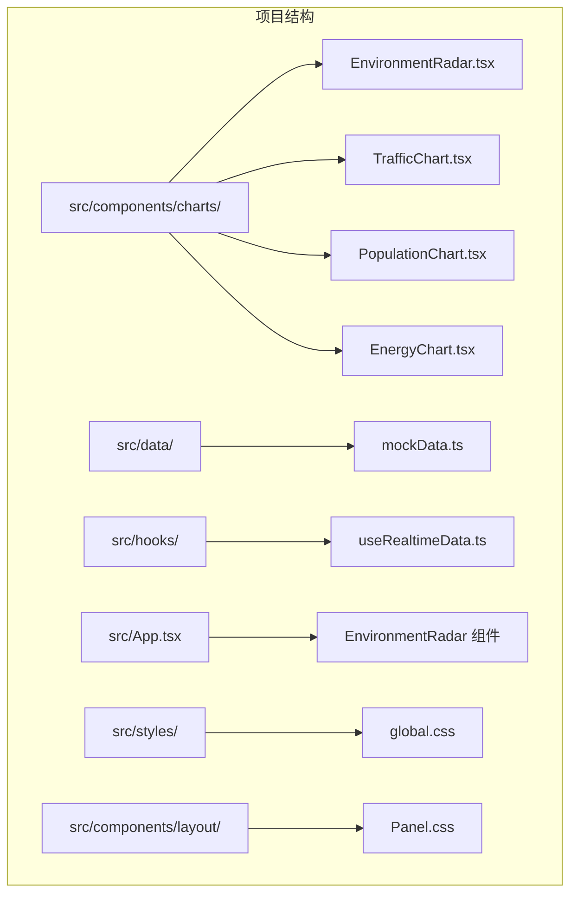
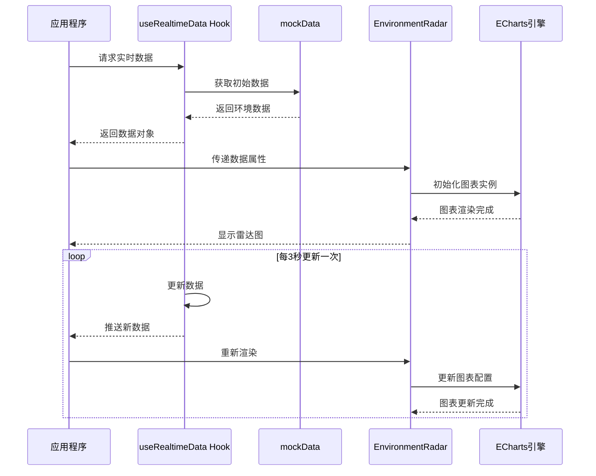
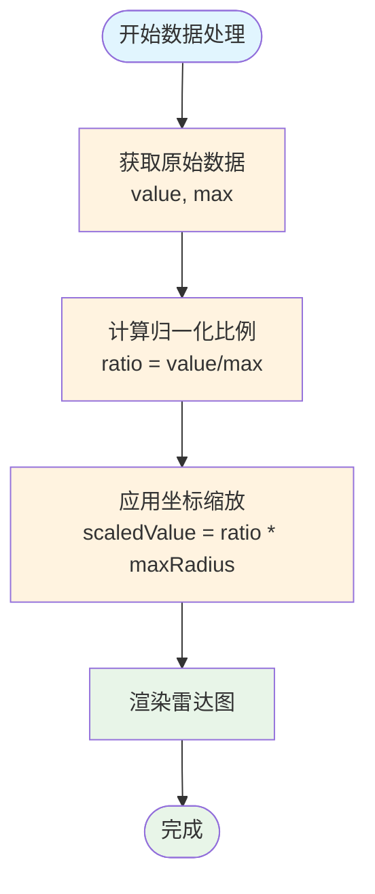
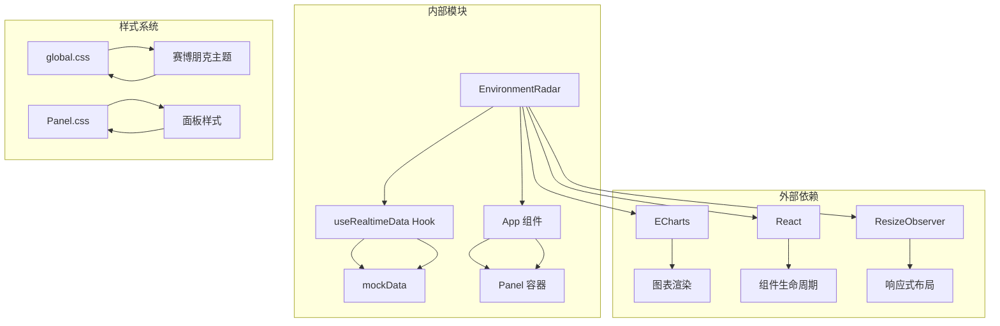
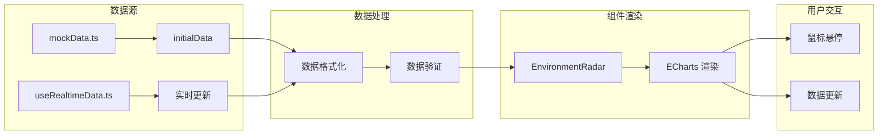

# 环境监测雷达图

<cite>
**本文档引用的文件**
- [EnvironmentRadar.tsx](file://src/components/charts/EnvironmentRadar.tsx)
- [mockData.ts](file://src/data/mockData.ts)
- [useRealtimeData.ts](file://src/hooks/useRealtimeData.ts)
- [index.ts](file://src/components/charts/index.ts)
- [App.tsx](file://src/App.tsx)
- [global.css](file://src/styles/global.css)
- [Panel.css](file://src/components/layout/Panel.css)
</cite>

## 目录
1. [简介](#简介)
2. [项目结构](#项目结构)
3. [核心组件](#核心组件)
4. [架构概览](#架构概览)
5. [详细组件分析](#详细组件分析)
6. [依赖关系分析](#依赖关系分析)
7. [性能考虑](#性能考虑)
8. [故障排除指南](#故障排除指南)
9. [结论](#结论)
10. [附录](#附录)

## 简介

环境监测雷达图是一个基于 ECharts 的可视化组件，专门用于展示多指标环境数据的综合分析。该组件通过雷达图的形式直观地呈现空气质量、温度、湿度、PM2.5 等多个环境监测指标，为城市环境管理提供实时的数据可视化支持。

该组件采用赛博朋克风格的设计，结合渐变色彩和发光效果，营造出科技感十足的视觉体验。组件支持实时数据更新、响应式布局和丰富的交互功能。

## 项目结构

环境监测雷达图位于项目的图表组件目录中，与其它图表组件共同构成完整的数据分析可视化系统。



**图表来源**
- [EnvironmentRadar.tsx:1-108](file://src/components/charts/EnvironmentRadar.tsx#L1-L108)
- [mockData.ts:29-47](file://src/data/mockData.ts#L29-L47)
- [useRealtimeData.ts:15-72](file://src/hooks/useRealtimeData.ts#L15-L72)

**章节来源**
- [EnvironmentRadar.tsx:1-108](file://src/components/charts/EnvironmentRadar.tsx#L1-L108)
- [mockData.ts:29-47](file://src/data/mockData.ts#L29-L47)

## 核心组件

### EnvironmentRadar 组件

EnvironmentRadar 是一个 React 函数组件，负责渲染环境监测数据的雷达图。组件的核心特性包括：

- **多指标数据展示**：支持 PM2.5、PM10、噪音、温度、湿度、CO 等多个环境指标
- **实时数据更新**：通过 ECharts 实现动态数据刷新
- **响应式设计**：自动适配容器尺寸变化
- **赛博朋克风格**：采用蓝色渐变和发光效果的主题设计

### 数据结构设计

组件接收的数据结构包含以下关键字段：

| 字段名 | 类型 | 描述 | 示例值 |
|--------|------|------|--------|
| indicators | 数组 | 环境指标数组 | [{name: "PM2.5", value: 35, max: 150}, ...] |
| aqi | number | 空气质量指数 | 72 |
| temperature | number | 温度值 | 22.5 |
| humidity | number | 湿度百分比 | 65 |
| windDirection | string | 风向描述 | "东南风" |

**章节来源**
- [EnvironmentRadar.tsx:4-12](file://src/components/charts/EnvironmentRadar.tsx#L4-L12)
- [mockData.ts:39-46](file://src/data/mockData.ts#L39-L46)

## 架构概览

环境监测雷达图的架构采用分层设计，从数据获取到可视化展示形成完整的数据流。



**图表来源**
- [App.tsx:44](file://src/App.tsx#L44)
- [useRealtimeData.ts:15-72](file://src/hooks/useRealtimeData.ts#L15-L72)
- [EnvironmentRadar.tsx:18-27](file://src/components/charts/EnvironmentRadar.tsx#L18-L27)

## 详细组件分析

### 雷达图配置详解

EnvironmentRadar 组件使用 ECharts 的雷达图配置，实现了高度定制化的可视化效果。

#### 雷达图配置参数

| 配置项 | 参数 | 说明 | 默认值 |
|--------|------|------|--------|
| shape | polygon | 图形类型 | polygon |
| splitNumber | 4 | 分割线数量 | 4 |
| axisName.color | rgba(224, 230, 255, 0.6) | 轴标签颜色 | - |
| splitLine.lineStyle.color | rgba(0, 212, 255, 0.1) | 分割线颜色 | - |
| splitArea.areaStyle.color | ['rgba(0, 212, 255, 0.02)', 'rgba(0, 212, 255, 0.04)'] | 区域背景色 | - |
| axisLine.lineStyle.color | rgba(0, 212, 255, 0.15) | 轴线颜色 | - |

#### 数据归一化处理

组件通过 `indicators` 数组中的 `max` 值实现数据归一化，确保不同量级的指标可以在同一坐标系中进行比较。



**图表来源**
- [EnvironmentRadar.tsx:39-42](file://src/components/charts/EnvironmentRadar.tsx#L39-L42)
- [mockData.ts:40-45](file://src/data/mockData.ts#L40-L45)

### 颜色编码系统

组件采用分级颜色编码系统来直观显示环境质量状况：

| 指标 | 颜色 | 状态 | 阈值 |
|------|------|------|------|
| AQI | 绿色(#00ff88) | 优 | ≤ 100 |
| AQI | 红色(#ff4757) | 轻度污染 | > 100 |
| 温度 | 蓝色(#00d4ff) | 正常范围 | 一般范围 |
| 湿度 | 蓝色(#00d4ff) | 正常范围 | 一般范围 |
| 风向 | 蓝色(#00d4ff) | 文本显示 | - |

### 交互功能实现

组件具备以下交互功能：

1. **实时数据更新**：每3秒自动更新一次数据
2. **响应式布局**：自动适配容器尺寸变化
3. **鼠标悬停提示**：显示详细的数值信息
4. **渐变填充效果**：雷达区域采用透明渐变填充

**章节来源**
- [EnvironmentRadar.tsx:33-77](file://src/components/charts/EnvironmentRadar.tsx#L33-L77)
- [useRealtimeData.ts:15-72](file://src/hooks/useRealtimeData.ts#L15-L72)

## 依赖关系分析

### 组件依赖图



**图表来源**
- [EnvironmentRadar.tsx:1-2](file://src/components/charts/EnvironmentRadar.tsx#L1-L2)
- [useRealtimeData.ts:15-72](file://src/hooks/useRealtimeData.ts#L15-L72)
- [App.tsx:104](file://src/App.tsx#L104)

### 数据流依赖

组件的数据流遵循单向数据绑定原则，确保数据的一致性和可预测性。



**图表来源**
- [mockData.ts:29-47](file://src/data/mockData.ts#L29-L47)
- [useRealtimeData.ts:23-64](file://src/hooks/useRealtimeData.ts#L23-L64)
- [EnvironmentRadar.tsx:29-78](file://src/components/charts/EnvironmentRadar.tsx#L29-L78)

**章节来源**
- [index.ts:4](file://src/components/charts/index.ts#L4)
- [App.tsx:104](file://src/App.tsx#L104)

## 性能考虑

### 内存管理

组件实现了完善的内存清理机制：

1. **图表实例销毁**：在组件卸载时自动释放 ECharts 实例
2. **ResizeObserver 清理**：监听器在组件卸载时自动断开连接
3. **定时器管理**：确保数据更新定时器正确清理

### 渲染优化

1. **条件渲染**：只有在图表容器存在时才初始化图表实例
2. **依赖追踪**：只在数据变化时重新设置 ECharts 配置
3. **响应式设计**：利用 ResizeObserver 自动调整图表大小

### 数据更新策略

组件采用节流更新策略，避免频繁的数据更新影响性能：

- **更新间隔**：默认3秒更新一次
- **批量更新**：所有环境数据同时更新
- **数据验证**：更新前进行数据有效性检查

## 故障排除指南

### 常见问题及解决方案

#### 图表不显示

**症状**：雷达图空白或显示异常
**可能原因**：
1. 图表容器未正确初始化
2. ECharts 依赖未正确加载
3. 数据格式不正确

**解决方法**：
1. 检查 `chartRef` 是否正确绑定到 DOM 元素
2. 确认 ECharts 库已正确安装和导入
3. 验证 `indicators` 数组格式是否符合要求

#### 数据更新异常

**症状**：环境数据不更新或更新错误
**可能原因**：
1. useRealtimeData Hook 未正确工作
2. 数据更新逻辑有误
3. 定时器未正确清理

**解决方法**：
1. 检查 useRealtimeData Hook 的返回值
2. 验证数据更新函数的逻辑
3. 确认组件卸载时定时器已清理

#### 样式显示问题

**症状**：组件样式异常或主题不匹配
**可能原因**：
1. 全局样式未正确加载
2. 组件样式冲突
3. 响应式样式未生效

**解决方法**：
1. 检查 global.css 是否正确引入
2. 验证 Panel.css 的样式优先级
3. 确认媒体查询是否正确匹配

**章节来源**
- [EnvironmentRadar.tsx:18-27](file://src/components/charts/EnvironmentRadar.tsx#L18-L27)
- [useRealtimeData.ts:66-69](file://src/hooks/useRealtimeData.ts#L66-L69)

## 结论

环境监测雷达图是一个功能完整、设计精良的可视化组件，成功实现了多指标环境数据的综合展示。组件具有以下优势：

1. **技术实现优秀**：采用现代 React 技术栈和 ECharts 图表库
2. **用户体验良好**：赛博朋克风格设计，视觉效果突出
3. **性能表现稳定**：完善的内存管理和响应式设计
4. **扩展性强**：模块化设计便于功能扩展和定制

该组件为城市环境监测提供了直观、实时的数据可视化解决方案，是智慧城市数据分析平台的重要组成部分。

## 附录

### 使用示例

#### 基础使用

```typescript
// 在组件中使用 EnvironmentRadar
<Panel title="环境监测">
  <EnvironmentRadar data={environmentData} />
</Panel>
```

#### 自定义配置

```typescript
// 修改雷达图配置
const customConfig = {
  radar: {
    indicator: [
      { name: 'PM2.5', max: 150 },
      { name: 'PM10', max: 200 },
      { name: '噪音', max: 100 },
      { name: '温度', max: 45 },
      { name: '湿度', max: 100 },
      { name: 'CO', max: 4 },
    ],
    splitNumber: 5,
    axisName: { color: '#00d4ff' },
  },
};
```

### 最佳实践

1. **数据标准化**：确保所有指标都有合理的最大值设定
2. **性能优化**：合理设置数据更新频率，避免过度渲染
3. **样式一致性**：保持与其他图表组件的视觉风格一致
4. **可访问性**：提供足够的对比度和清晰的标签
5. **响应式设计**：确保在不同屏幕尺寸下都能正常显示

### 开发建议

1. **模块化设计**：保持组件的独立性和可复用性
2. **错误处理**：添加适当的错误边界和降级方案
3. **文档完善**：为组件提供详细的使用文档和 API 说明
4. **测试覆盖**：编写单元测试和集成测试确保代码质量
5. **性能监控**：建立性能监控机制及时发现和解决问题