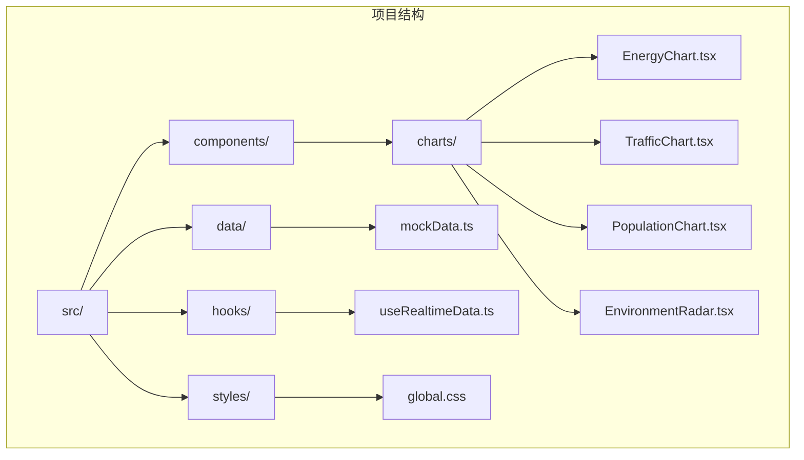
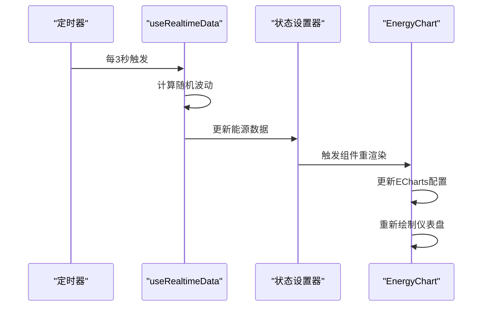
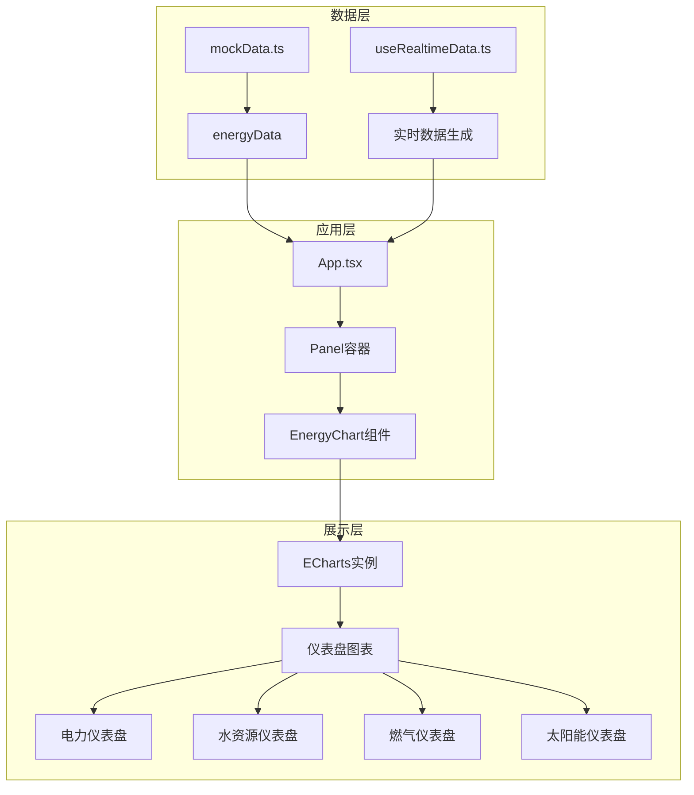
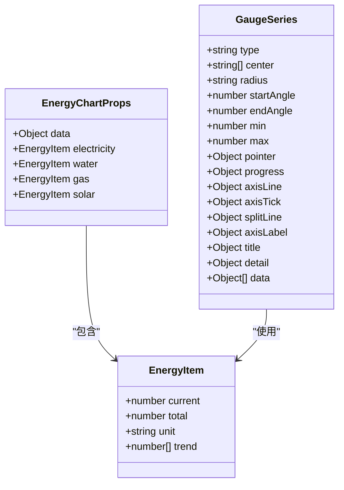
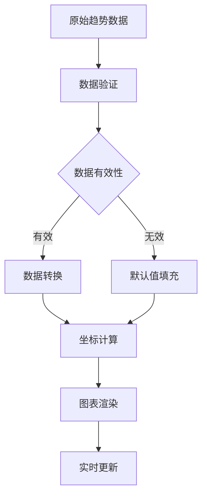
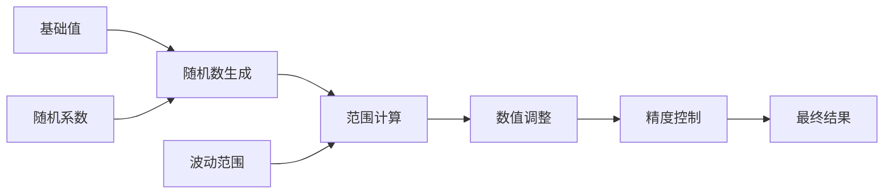
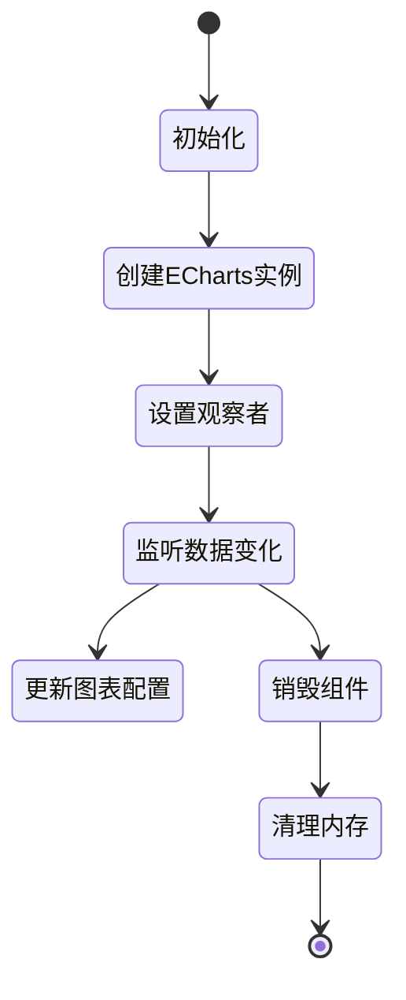
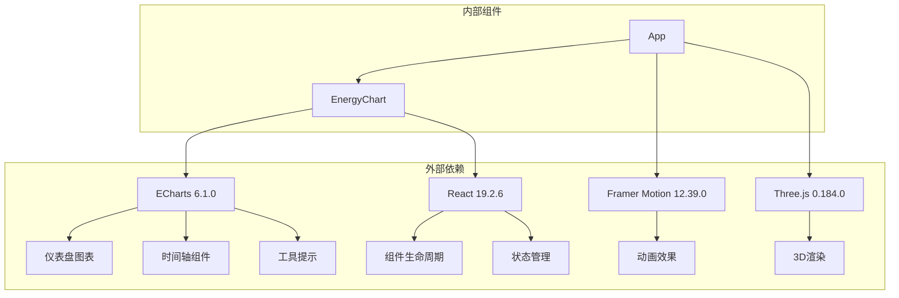
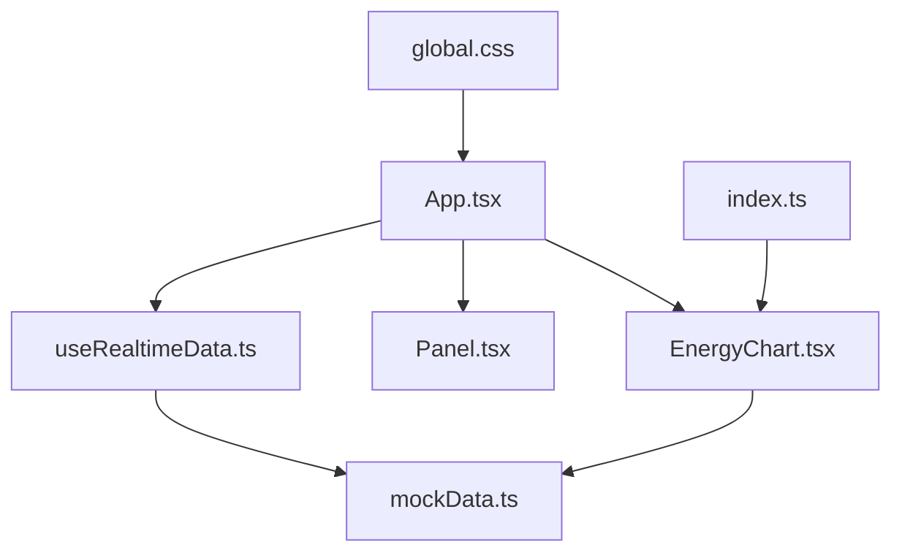
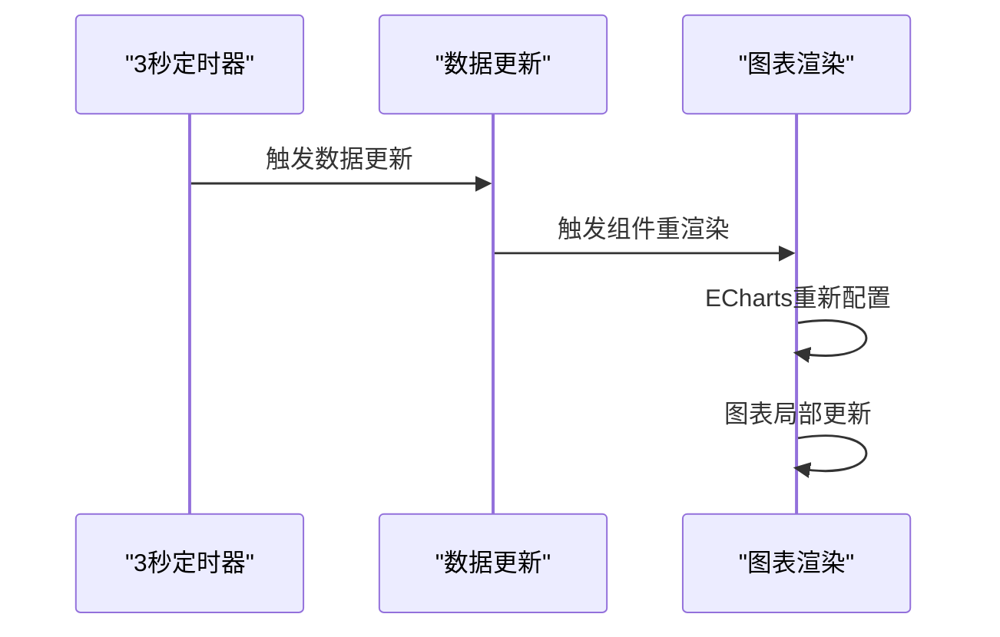

# 能源消耗监控图

<cite>
**本文档引用的文件**
- [EnergyChart.tsx](file://src/components/charts/EnergyChart.tsx)
- [mockData.ts](file://src/data/mockData.ts)
- [useRealtimeData.ts](file://src/hooks/useRealtimeData.ts)
- [App.tsx](file://src/App.tsx)
- [index.ts](file://src/components/charts/index.ts)
- [Panel.tsx](file://src/components/layout/Panel.tsx)
- [global.css](file://src/styles/global.css)
- [package.json](file://package.json)
- [README.md](file://README.md)
</cite>

## 目录
1. [简介](#简介)
2. [项目结构](#项目结构)
3. [核心组件](#核心组件)
4. [架构概览](#架构概览)
5. [详细组件分析](#详细组件分析)
6. [依赖关系分析](#依赖关系分析)
7. [性能考虑](#性能考虑)
8. [故障排除指南](#故障排除指南)
9. [结论](#结论)

## 简介

能源消耗监控图是智慧城市数据孪生可视化大屏中的关键组件，用于实时展示电力、水资源、燃气和太阳能等能源类型的消耗情况。该组件采用ECharts仪表盘技术，通过四个独立的仪表盘图表展示各能源类型的当前使用量、总容量和占比情况，为城市管理提供直观的能源消耗监控视图。

本组件实现了完整的实时数据更新机制，支持动态调整图表配置，并提供了丰富的样式定制选项，能够满足智慧城市管理场景下的各种展示需求。

## 项目结构

该项目采用模块化的组件架构，能源图表组件位于图表组件目录中，与交通、人口、环境等其他监控图表组件并列组织。

**图表来源**
- [EnergyChart.tsx:1-103](file://src/components/charts/EnergyChart.tsx#L1-L103)
- [mockData.ts:1-96](file://src/data/mockData.ts#L1-L96)
- [useRealtimeData.ts:1-73](file://src/hooks/useRealtimeData.ts#L1-L73)

**章节来源**
- [README.md:49-63](file://README.md#L49-L63)
- [package.json:12-26](file://package.json#L12-L26)

## 核心组件

### 能源图表数据结构

能源图表组件采用统一的数据接口，支持四种主要能源类型的监控：

| 能源类型 | 默认颜色 | 单位标识 | 最大值 |
|---------|---------|---------|--------|
| 电力 | #00d4ff | MWh | 5000 |
| 水资源 | #00ff88 | 万吨 | 3000 |
| 燃气 | #ffa502 | 万m³ | 1500 |
| 太阳能 | #7b2ff7 | MWh | 800 |

每个能源项包含以下核心属性：
- `current`: 当前使用量
- `total`: 总容量或限额
- `unit`: 使用单位
- `trend`: 时间序列趋势数据

**章节来源**
- [EnergyChart.tsx:4-18](file://src/components/charts/EnergyChart.tsx#L4-L18)
- [mockData.ts:49-55](file://src/data/mockData.ts#L49-L55)

### 实时数据更新机制

组件通过自定义Hook实现数据的实时更新，采用随机波动算法模拟真实数据变化：

**图表来源**
- [useRealtimeData.ts:15-73](file://src/hooks/useRealtimeData.ts#L15-L73)
- [EnergyChart.tsx:24-97](file://src/components/charts/EnergyChart.tsx#L24-L97)

**章节来源**
- [useRealtimeData.ts:23-64](file://src/hooks/useRealtimeData.ts#L23-L64)
- [App.tsx:44-44](file://src/App.tsx#L44-L44)

## 架构概览

整个能源监控系统的架构采用分层设计，从数据获取到最终展示形成完整的数据流。

**图表来源**
- [App.tsx:108-110](file://src/App.tsx#L108-L110)
- [EnergyChart.tsx:20-33](file://src/components/charts/EnergyChart.tsx#L20-L33)

**章节来源**
- [App.tsx:43-125](file://src/App.tsx#L43-L125)
- [EnergyChart.tsx:1-103](file://src/components/charts/EnergyChart.tsx#L1-L103)

## 详细组件分析

### EnergyChart 组件实现

#### 类型定义与接口

组件定义了清晰的类型系统来确保数据结构的一致性：

**图表来源**
- [EnergyChart.tsx:4-18](file://src/components/charts/EnergyChart.tsx#L4-L18)
- [EnergyChart.tsx:56-95](file://src/components/charts/EnergyChart.tsx#L56-L95)

#### 图表配置参数

组件使用ECharts的仪表盘配置实现，每个能源类型都有独立的配置：

| 参数名称 | 电力 | 水资源 | 燃气 | 太阳能 |
|---------|------|--------|------|--------|
| 颜色 | #00d4ff | #00ff88 | #ffa502 | #7b2ff7 |
| 中心位置 | [25%, 35%] | [75%, 35%] | [25%, 75%] | [75%, 75%] |
| 半径 | 30% | 30% | 30% | 30% |
| 起始角度 | 220° | 220° | 220° | 220° |
| 结束角度 | -40° | -40° | -40° | -40° |
| 最小值 | 0 | 0 | 0 | 0 |
| 最大值 | 5000 | 3000 | 1500 | 800 |

**章节来源**
- [EnergyChart.tsx:38-95](file://src/components/charts/EnergyChart.tsx#L38-L95)

#### 时间序列数据处理

组件支持时间序列趋势数据的可视化，每个能源项都包含6个时间点的趋势数据：

**图表来源**
- [mockData.ts:49-55](file://src/data/mockData.ts#L49-L55)
- [EnergyChart.tsx:8-8](file://src/components/charts/EnergyChart.tsx#L8-L8)

**章节来源**
- [mockData.ts:49-55](file://src/data/mockData.ts#L49-L55)

### 实时更新机制

#### 数据波动算法

组件采用随机波动算法模拟真实数据变化，确保数据的动态性和真实性：

**图表来源**
- [useRealtimeData.ts:11-13](file://src/hooks/useRealtimeData.ts#L11-L13)
- [useRealtimeData.ts:43-57](file://src/hooks/useRealtimeData.ts#L43-L57)

#### 内存管理与生命周期

组件实现了完善的内存管理和生命周期控制：

**图表来源**
- [EnergyChart.tsx:24-33](file://src/components/charts/EnergyChart.tsx#L24-L33)
- [EnergyChart.tsx:99-100](file://src/components/charts/EnergyChart.tsx#L99-L100)

**章节来源**
- [EnergyChart.tsx:24-33](file://src/components/charts/EnergyChart.tsx#L24-L33)
- [EnergyChart.tsx:99-100](file://src/components/charts/EnergyChart.tsx#L99-L100)

## 依赖关系分析

### 外部依赖

项目使用ECharts作为主要的图表渲染引擎，支持丰富的可视化效果：

**图表来源**
- [package.json:12-26](file://package.json#L12-L26)
- [EnergyChart.tsx:1-2](file://src/components/charts/EnergyChart.tsx#L1-L2)

**章节来源**
- [package.json:12-26](file://package.json#L12-L26)

### 内部模块依赖

组件间的依赖关系清晰明确，遵循单一职责原则：

**图表来源**
- [App.tsx:6-15](file://src/App.tsx#L6-L15)
- [EnergyChart.tsx:1-2](file://src/components/charts/EnergyChart.tsx#L1-L2)
- [index.ts:1-7](file://src/components/charts/index.ts#L1-L7)

**章节来源**
- [App.tsx:6-15](file://src/App.tsx#L6-L15)
- [index.ts:1-7](file://src/components/charts/index.ts#L1-L7)

## 性能考虑

### 图表渲染优化

组件采用了多项性能优化策略：

1. **懒加载初始化**: ECharts实例仅在首次渲染时创建
2. **ResizeObserver监听**: 自动响应容器尺寸变化
3. **内存泄漏防护**: 组件卸载时自动清理资源

### 数据更新策略

实时数据更新采用节流机制避免频繁重渲染：

**图表来源**
- [useRealtimeData.ts:66-70](file://src/hooks/useRealtimeData.ts#L66-L70)
- [EnergyChart.tsx:35-97](file://src/components/charts/EnergyChart.tsx#L35-L97)

### 样式定制建议

组件支持灵活的样式定制，可通过以下方式调整：

1. **颜色方案**: 修改仪表盘颜色配置
2. **尺寸比例**: 调整半径和中心位置
3. **动画效果**: 自定义过渡动画参数
4. **字体样式**: 统一修改全局字体配置

## 故障排除指南

### 常见问题及解决方案

| 问题类型 | 症状描述 | 解决方案 |
|---------|---------|---------|
| 图表不显示 | 仪表盘空白或无响应 | 检查容器尺寸和ECharts初始化 |
| 数据不更新 | 实时数据停止刷新 | 验证定时器是否正常运行 |
| 内存泄漏 | 页面卡顿或内存增长 | 确认组件卸载时的清理逻辑 |
| 颜色异常 | 仪表盘颜色不正确 | 检查CSS变量和颜色配置 |

### 调试技巧

1. **开发者工具**: 使用浏览器开发者工具检查ECharts实例
2. **日志输出**: 在关键节点添加console.log调试信息
3. **数据验证**: 确保传入的数据格式符合预期
4. **性能监控**: 使用性能面板监控图表渲染性能

**章节来源**
- [EnergyChart.tsx:24-33](file://src/components/charts/EnergyChart.tsx#L24-L33)
- [EnergyChart.tsx:99-100](file://src/components/charts/EnergyChart.tsx#L99-L100)

## 结论

能源消耗监控图组件是一个功能完整、性能优化的可视化解决方案。它成功地将复杂的能源数据转化为直观易懂的仪表盘图表，为智慧城市管理提供了强有力的技术支撑。

组件的主要优势包括：
- **实时性强**: 通过自定义Hook实现3秒间隔的实时数据更新
- **扩展性好**: 支持多种能源类型的灵活配置
- **性能优化**: 采用多项技术手段确保图表渲染效率
- **样式丰富**: 提供完整的样式定制能力

该组件不仅满足了当前的展示需求，还为未来的功能扩展奠定了良好的基础。通过合理的架构设计和代码组织，使得组件易于维护和进一步开发。