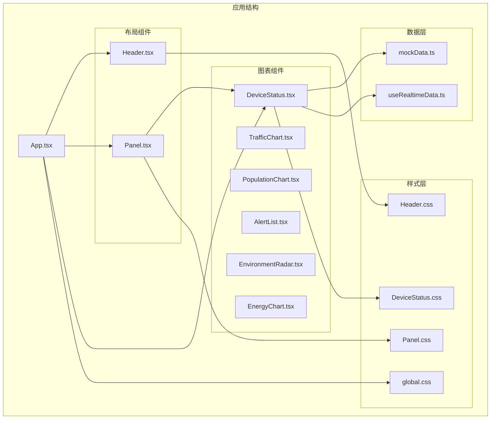
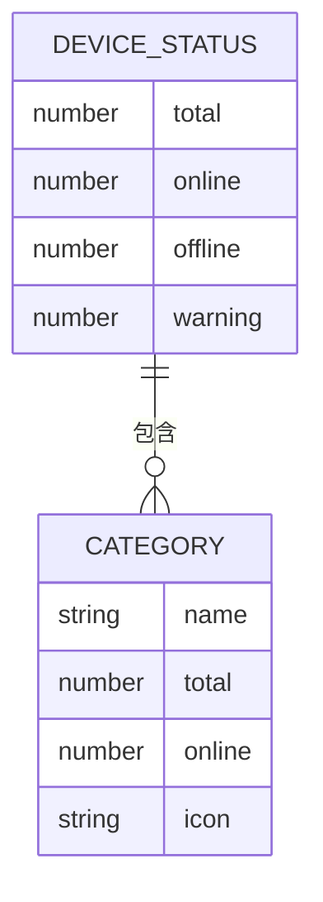
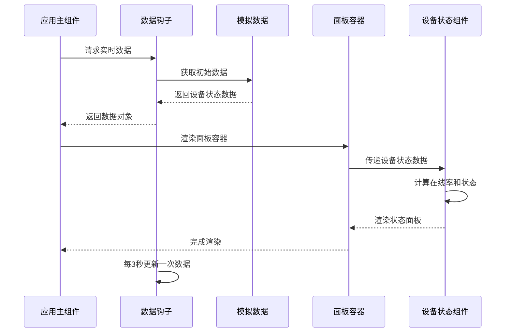
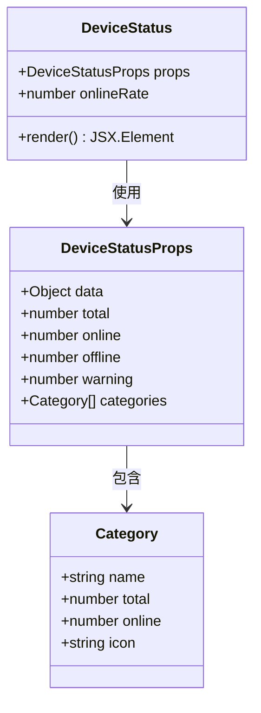
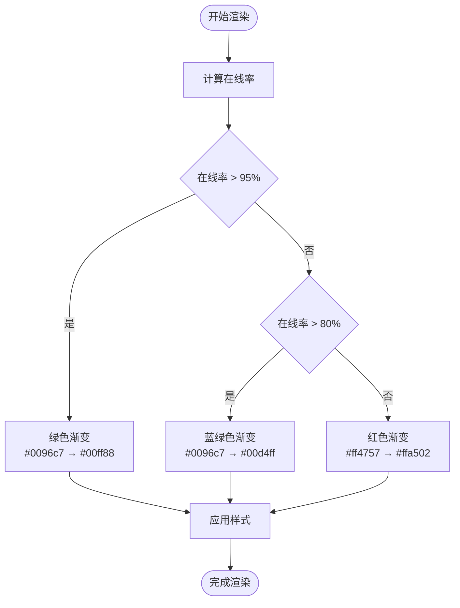
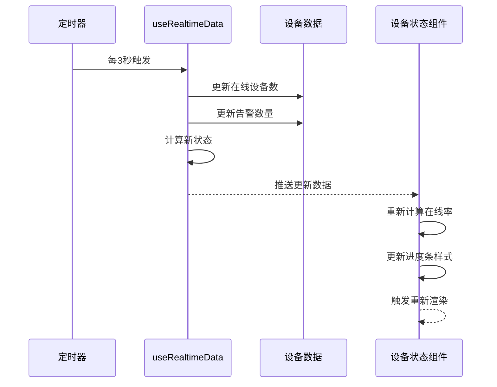
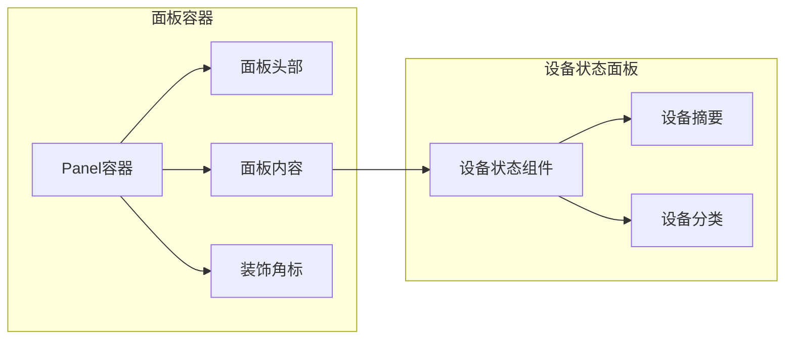
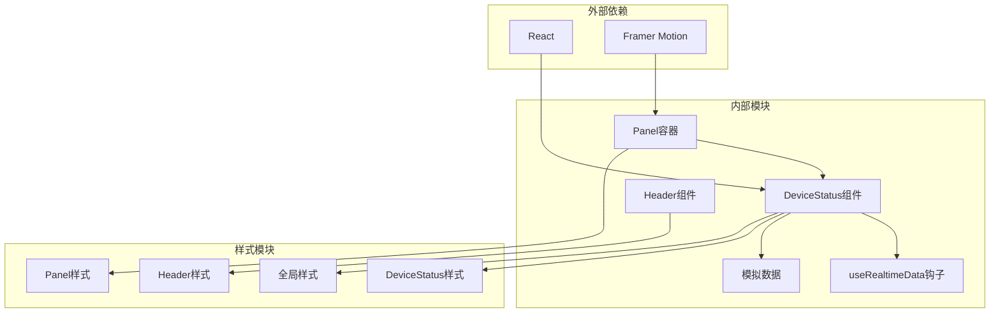

# 设备状态监控面板

<cite>
**本文档引用的文件**
- [DeviceStatus.tsx](file://src/components/charts/DeviceStatus.tsx)
- [DeviceStatus.css](file://src/components/charts/DeviceStatus.css)
- [mockData.ts](file://src/data/mockData.ts)
- [useRealtimeData.ts](file://src/hooks/useRealtimeData.ts)
- [App.tsx](file://src/App.tsx)
- [Panel.tsx](file://src/components/layout/Panel.tsx)
- [Panel.css](file://src/components/layout/Panel.css)
- [Header.tsx](file://src/components/layout/Header.tsx)
- [Header.css](file://src/components/layout/Header.css)
- [global.css](file://src/styles/global.css)
- [App.css](file://src/App.css)
- [index.ts](file://src/components/charts/index.ts)
- [NumberFlip.tsx](file://src/components/common/NumberFlip.tsx)
</cite>

## 目录
1. [简介](#简介)
2. [项目结构](#项目结构)
3. [核心组件](#核心组件)
4. [架构概览](#架构概览)
5. [详细组件分析](#详细组件分析)
6. [依赖关系分析](#依赖关系分析)
7. [性能考虑](#性能考虑)
8. [故障排除指南](#故障排除指南)
9. [结论](#结论)
10. [附录](#附录)

## 简介

设备状态监控面板是智慧城市数据孪生指挥中心的核心组件之一，负责实时展示城市基础设施设备的运行状态。该面板采用赛博朋克风格设计，通过直观的数据可视化方式呈现设备总数、在线率、告警数量等关键指标，并对不同类型的设备进行分类统计和状态指示。

本组件实现了完整的设备状态监控功能，包括实时数据更新、状态分类展示、颜色编码系统和响应式布局设计。通过渐变色彩和发光效果，为用户提供沉浸式的监控体验。

## 项目结构

项目采用模块化架构设计，设备状态监控面板位于图表组件目录中，与其它监控组件协同工作。

**图表来源**
- [App.tsx:43-125](file://src/App.tsx#L43-L125)
- [DeviceStatus.tsx:14-62](file://src/components/charts/DeviceStatus.tsx#L14-L62)
- [mockData.ts:57-69](file://src/data/mockData.ts#L57-L69)
- [useRealtimeData.ts:15-72](file://src/hooks/useRealtimeData.ts#L15-L72)

**章节来源**
- [App.tsx:1-128](file://src/App.tsx#L1-L128)
- [global.css:50-92](file://src/styles/global.css#L50-L92)

## 核心组件

### 设备状态数据结构

设备状态监控面板使用标准化的数据结构来表示设备状态信息：

**图表来源**
- [DeviceStatus.tsx:4-12](file://src/components/charts/DeviceStatus.tsx#L4-L12)
- [mockData.ts:57-69](file://src/data/mockData.ts#L57-L69)

### 状态分类体系

系统支持四种主要的设备状态分类：

1. **在线状态**：设备正常运行并保持连接
2. **离线状态**：设备断开连接或停止运行
3. **告警状态**：设备出现异常但仍在运行
4. **正常状态**：设备运行稳定无异常

每种状态都有对应的颜色编码和视觉表现：

- **在线设备**：绿色渐变（#00ff88）
- **离线设备**：红色渐变（#ff4757）
- **告警设备**：橙色渐变（#ffa502）
- **正常设备**：蓝色渐变（#0096c7）

**章节来源**
- [DeviceStatus.tsx:14-62](file://src/components/charts/DeviceStatus.tsx#L14-L62)
- [mockData.ts:57-69](file://src/data/mockData.ts#L57-L69)

## 架构概览

设备状态监控面板采用React函数组件架构，结合TypeScript类型安全和CSS模块化样式设计。

**图表来源**
- [App.tsx:43-125](file://src/App.tsx#L43-L125)
- [useRealtimeData.ts:15-72](file://src/hooks/useRealtimeData.ts#L15-L72)
- [mockData.ts:57-69](file://src/data/mockData.ts#L57-L69)

## 详细组件分析

### DeviceStatus 组件设计

DeviceStatus 组件是设备状态监控的核心实现，采用函数式组件设计，具有以下特点：

#### 组件结构

**图表来源**
- [DeviceStatus.tsx:4-12](file://src/components/charts/DeviceStatus.tsx#L4-L12)
- [DeviceStatus.tsx:14-62](file://src/components/charts/DeviceStatus.tsx#L14-L62)

#### 数据处理逻辑

组件实现了智能的数据处理和状态计算：

1. **在线率计算**：`(在线设备数 / 总设备数) × 100`
2. **分类状态评估**：根据在线比例分配颜色等级
3. **动态样式生成**：基于状态值生成渐变色彩

#### 视觉设计元素

组件采用多层次的视觉设计：

- **设备总数**：青蓝色 (#00d4ff) 发光数字
- **在线率**：绿色 (#00ff88) 百分比显示
- **告警数量**：橙色 (#ffa502) 强调显示

**章节来源**
- [DeviceStatus.tsx:14-62](file://src/components/charts/DeviceStatus.tsx#L14-L62)

### 样式系统设计

设备状态面板采用完整的CSS模块化设计，确保视觉一致性和可维护性。

#### 颜色编码系统

**图表来源**
- [DeviceStatus.tsx:44-52](file://src/components/charts/DeviceStatus.tsx#L44-L52)

#### 响应式布局设计

面板采用Flexbox布局系统，支持不同屏幕尺寸的自适应：

- **设备摘要区域**：水平居中，自动分配空间
- **分类列表区域**：垂直堆叠，支持滚动
- **进度条设计**：固定高度，圆角边框

**章节来源**
- [DeviceStatus.css:1-80](file://src/components/charts/DeviceStatus.css#L1-L80)

### 实时数据更新机制

系统集成了完整的实时数据更新机制，确保监控面板显示最新状态。

#### 数据更新流程

**图表来源**
- [useRealtimeData.ts:15-72](file://src/hooks/useRealtimeData.ts#L15-L72)
- [DeviceStatus.tsx:14-16](file://src/components/charts/DeviceStatus.tsx#L14-L16)

#### 数据波动模拟

数据钩子实现了智能的随机波动模拟：

- **在线设备数**：±10台的随机波动
- **告警数量**：±5个的随机波动
- **平滑过渡**：使用缓动函数确保数据变化自然

**章节来源**
- [useRealtimeData.ts:59-64](file://src/hooks/useRealtimeData.ts#L59-L64)

### 面板集成与布局

设备状态面板作为仪表板的重要组成部分，与其他组件协同工作。

#### 面板容器设计

**图表来源**
- [Panel.tsx:10-27](file://src/components/layout/Panel.tsx#L10-L27)
- [DeviceStatus.tsx:17-59](file://src/components/charts/DeviceStatus.tsx#L17-L59)

#### 布局协调机制

面板组件提供了完整的布局协调功能：

- **标题显示**：支持自定义面板标题
- **内容填充**：自动适应容器高度
- **装饰元素**：四个角标提供视觉完整性
- **响应式设计**：支持不同屏幕尺寸

**章节来源**
- [Panel.tsx:10-27](file://src/components/layout/Panel.tsx#L10-L27)
- [Panel.css:1-85](file://src/components/layout/Panel.css#L1-L85)

## 依赖关系分析

设备状态监控面板的依赖关系清晰明确，遵循单一职责原则。

**图表来源**
- [DeviceStatus.tsx:1-2](file://src/components/charts/DeviceStatus.tsx#L1-L2)
- [App.tsx:1-16](file://src/App.tsx#L1-L16)
- [Panel.tsx:1-2](file://src/components/layout/Panel.tsx#L1-L2)

### 组件耦合度分析

- **低耦合设计**：DeviceStatus组件独立性强，不依赖具体数据源
- **高内聚性**：所有设备状态相关的逻辑集中在单个组件中
- **接口清晰**：通过props传递数据，避免直接访问外部状态

**章节来源**
- [DeviceStatus.tsx:4-12](file://src/components/charts/DeviceStatus.tsx#L4-L12)
- [index.ts:1-7](file://src/components/charts/index.ts#L1-L7)

## 性能考虑

设备状态监控面板在设计时充分考虑了性能优化：

### 渲染优化策略

1. **最小化重渲染**：使用React.memo避免不必要的组件重渲染
2. **样式缓存**：动态样式计算结果缓存，减少重复计算
3. **渐进式更新**：数据更新采用批量处理，避免频繁DOM操作

### 内存管理

- **定时器清理**：组件卸载时自动清理数据更新定时器
- **动画帧管理**：及时取消动画帧请求，防止内存泄漏
- **事件监听器**：组件销毁时移除所有事件监听

### 数据处理优化

- **数值格式化**：使用本地化格式化函数提高性能
- **百分比计算**：预计算在线率，避免重复计算
- **图标渲染**：使用Unicode字符而非图片，减少HTTP请求

## 故障排除指南

### 常见问题及解决方案

#### 数据不更新问题

**症状**：设备状态面板显示过期数据
**原因**：
- 定时器未正确设置
- 数据钩子返回undefined
- 组件未正确接收props

**解决方案**：
1. 检查useRealtimeData钩子的interval参数
2. 验证mockData中的deviceData结构
3. 确认App组件正确传递数据给DeviceStatus组件

#### 样式显示异常

**症状**：进度条颜色不正确或布局错乱
**原因**：
- CSS类名冲突
- 样式优先级问题
- 响应式媒体查询未生效

**解决方案**：
1. 检查DeviceStatus.css中的类名定义
2. 验证全局样式的加载顺序
3. 确认媒体查询条件设置正确

#### 性能问题

**症状**：页面卡顿或渲染延迟
**原因**：
- 过多的DOM节点
- 频繁的样式计算
- 动画性能不足

**解决方案**：
1. 优化进度条渲染逻辑
2. 减少不必要的样式计算
3. 调整动画帧率设置

**章节来源**
- [useRealtimeData.ts:66-69](file://src/hooks/useRealtimeData.ts#L66-L69)
- [DeviceStatus.css:74-79](file://src/components/charts/DeviceStatus.css#L74-L79)

## 结论

设备状态监控面板是一个设计精良、功能完整的监控组件。它成功地将复杂的数据可视化需求转化为直观易懂的界面展示，为智慧城市管理提供了强有力的技术支撑。

### 主要优势

1. **设计理念先进**：采用赛博朋克风格，符合现代智慧城市主题
2. **功能完整**：涵盖设备状态监控的所有核心需求
3. **性能优秀**：经过优化的渲染和数据处理机制
4. **易于扩展**：模块化的架构便于功能扩展和定制

### 技术亮点

- 智能的颜色编码系统，提供直观的状态指示
- 流畅的实时数据更新机制
- 响应式布局设计，适配多种设备
- 完善的错误处理和性能优化

## 附录

### 实际应用场景

设备状态监控面板适用于以下场景：

1. **智慧城市管理中心**：实时监控城市基础设施运行状态
2. **交通指挥中心**：监控交通设备如摄像头、信号灯的工作状态
3. **环境监测站**：跟踪环境监测设备的运行情况
4. **能源管理系统**：监控智能电表、水表等设备状态

### 扩展建议

1. **增加筛选功能**：允许用户按设备类型或区域筛选
2. **添加历史趋势**：显示设备状态的历史变化趋势
3. **集成告警通知**：当设备状态异常时自动发送告警
4. **支持多语言**：扩展国际化支持

### 最佳实践

1. **数据验证**：始终验证传入的数据格式
2. **错误边界**：为组件添加错误边界处理
3. **性能监控**：定期检查组件的渲染性能
4. **用户体验**：确保界面响应迅速且直观易懂