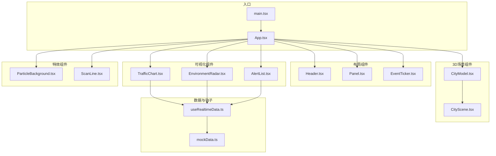
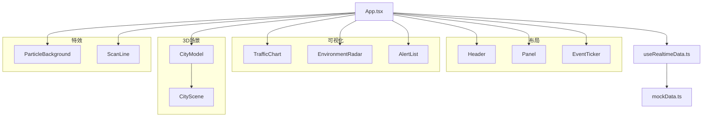
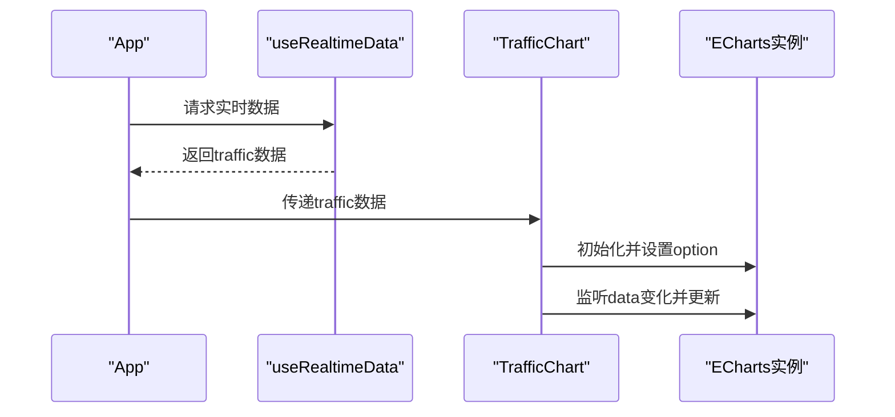
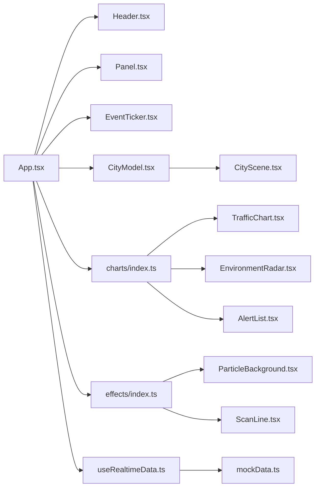
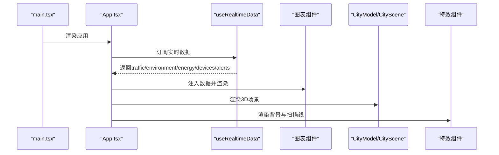

# 核心组件系统

<cite>
**本文引用的文件**
- [src/App.tsx](file://src/App.tsx)
- [src/main.tsx](file://src/main.tsx)
- [src/components/layout/Header.tsx](file://src/components/layout/Header.tsx)
- [src/components/layout/Panel.tsx](file://src/components/layout/Panel.tsx)
- [src/components/layout/EventTicker.tsx](file://src/components/layout/EventTicker.tsx)
- [src/components/3d/CityModel.tsx](file://src/components/3d/CityModel.tsx)
- [src/components/3d/CityScene.tsx](file://src/components/3d/CityScene.tsx)
- [src/components/3d/index.ts](file://src/components/3d/index.ts)
- [src/components/charts/TrafficChart.tsx](file://src/components/charts/TrafficChart.tsx)
- [src/components/charts/AlertList.tsx](file://src/components/charts/AlertList.tsx)
- [src/components/charts/EnvironmentRadar.tsx](file://src/components/charts/EnvironmentRadar.tsx)
- [src/components/charts/index.ts](file://src/components/charts/index.ts)
- [src/components/effects/ParticleBackground.tsx](file://src/components/effects/ParticleBackground.tsx)
- [src/components/effects/ScanLine.tsx](file://src/components/effects/ScanLine.tsx)
- [src/components/effects/index.ts](file://src/components/effects/index.ts)
- [src/hooks/useRealtimeData.ts](file://src/hooks/useRealtimeData.ts)
- [src/data/mockData.ts](file://src/data/mockData.ts)
</cite>

## 目录
1. [引言](#引言)
2. [项目结构](#项目结构)
3. [核心组件](#核心组件)
4. [架构总览](#架构总览)
5. [详细组件分析](#详细组件分析)
6. [依赖分析](#依赖分析)
7. [性能考虑](#性能考虑)
8. [故障排查指南](#故障排查指南)
9. [结论](#结论)
10. [附录](#附录)

## 引言
本文件面向智慧城市数据孪生大屏的核心组件系统，系统以 React + TypeScript 构建，结合 Three.js 与 ECharts 实现 3D 场景与数据可视化，配合粒子背景与扫描线等特效增强沉浸感。组件体系分为四大类：布局组件、数据可视化组件、3D 场景组件、特效组件。本文将从设计理念、功能职责、API 接口、配置选项、使用方法、组件协作、数据传递与事件处理等方面进行深入解析，并提供可扩展指南。

## 项目结构
项目采用按功能域分层的组织方式：
- 组件层：layout（布局）、charts（图表）、3d（3D 场景）、effects（特效）
- 数据与钩子：data（模拟数据）、hooks（实时数据钩子）
- 入口与应用：main.tsx、App.tsx

图示来源
- [src/main.tsx:1-11](file://src/main.tsx#L1-L11)
- [src/App.tsx:1-128](file://src/App.tsx#L1-L128)
- [src/components/3d/CityModel.tsx:1-50](file://src/components/3d/CityModel.tsx#L1-L50)
- [src/components/3d/CityScene.tsx:1-56](file://src/components/3d/CityScene.tsx#L1-L56)
- [src/components/charts/TrafficChart.tsx:1-117](file://src/components/charts/TrafficChart.tsx#L1-L117)
- [src/components/charts/EnvironmentRadar.tsx:1-108](file://src/components/charts/EnvironmentRadar.tsx#L1-L108)
- [src/components/charts/AlertList.tsx:1-65](file://src/components/charts/AlertList.tsx#L1-L65)
- [src/components/effects/ParticleBackground.tsx:1-72](file://src/components/effects/ParticleBackground.tsx#L1-L72)
- [src/components/effects/ScanLine.tsx:1-9](file://src/components/effects/ScanLine.tsx#L1-L9)
- [src/hooks/useRealtimeData.ts:1-73](file://src/hooks/useRealtimeData.ts#L1-L73)
- [src/data/mockData.ts:1-96](file://src/data/mockData.ts#L1-L96)

章节来源
- [src/main.tsx:1-11](file://src/main.tsx#L1-L11)
- [src/App.tsx:1-128](file://src/App.tsx#L1-L128)

## 核心组件
本节概述四大组件类别及其在整体中的角色与职责。

- 布局组件
  - Header：顶部标题栏，显示日期、时间、天气等信息，具备定时更新。
  - Panel：面板容器，统一标题装饰与边角样式，承载子内容。
  - EventTicker：底部滚动事件流，循环展示实时动态消息。
- 数据可视化组件
  - TrafficChart：基于 ECharts 的折线图，展示多路线车流量趋势与关键指标。
  - EnvironmentRadar：基于 ECharts 的雷达图，展示环境指标与综合指数。
  - AlertList：列表滚动告警，支持不同级别颜色与自动滚动。
- 3D 场景组件
  - CityModel：3D 画布容器，集成相机、光源、控件与雾化效果。
  - CityScene：城市场景组合，包含地面网格、道路、建筑与数据粒子。
- 特效组件
  - ParticleBackground：基于 @tsparticles 的粒子背景，带连线与透明度动画。
  - ScanLine：屏幕扫描线，用于营造科技感视觉效果。

章节来源
- [src/components/layout/Header.tsx:1-45](file://src/components/layout/Header.tsx#L1-L45)
- [src/components/layout/Panel.tsx:1-30](file://src/components/layout/Panel.tsx#L1-L30)
- [src/components/layout/EventTicker.tsx:1-26](file://src/components/layout/EventTicker.tsx#L1-L26)
- [src/components/charts/TrafficChart.tsx:1-117](file://src/components/charts/TrafficChart.tsx#L1-L117)
- [src/components/charts/EnvironmentRadar.tsx:1-108](file://src/components/charts/EnvironmentRadar.tsx#L1-L108)
- [src/components/charts/AlertList.tsx:1-65](file://src/components/charts/AlertList.tsx#L1-L65)
- [src/components/3d/CityModel.tsx:1-50](file://src/components/3d/CityModel.tsx#L1-L50)
- [src/components/3d/CityScene.tsx:1-56](file://src/components/3d/CityScene.tsx#L1-L56)
- [src/components/effects/ParticleBackground.tsx:1-72](file://src/components/effects/ParticleBackground.tsx#L1-L72)
- [src/components/effects/ScanLine.tsx:1-9](file://src/components/effects/ScanLine.tsx#L1-L9)

## 架构总览
应用通过 App 组合布局、3D 场景与可视化组件；数据由 useRealtimeData 提供，图表组件接收数据并渲染；3D 场景通过 Three.js 渲染城市模型；特效组件作为全局装饰层叠加在画布之上。

图示来源
- [src/App.tsx:1-128](file://src/App.tsx#L1-L128)
- [src/hooks/useRealtimeData.ts:1-73](file://src/hooks/useRealtimeData.ts#L1-L73)
- [src/data/mockData.ts:1-96](file://src/data/mockData.ts#L1-L96)
- [src/components/3d/CityModel.tsx:1-50](file://src/components/3d/CityModel.tsx#L1-L50)
- [src/components/3d/CityScene.tsx:1-56](file://src/components/3d/CityScene.tsx#L1-L56)
- [src/components/effects/ParticleBackground.tsx:1-72](file://src/components/effects/ParticleBackground.tsx#L1-L72)
- [src/components/effects/ScanLine.tsx:1-9](file://src/components/effects/ScanLine.tsx#L1-L9)

## 详细组件分析

### 布局组件

#### Header 组件
- 功能职责
  - 显示当前日期、星期、时间与天气信息。
  - 使用定时器每秒更新时间，确保界面实时性。
- API 接口
  - 无外部 props，内部维护本地状态 currentTime。
- 配置选项
  - 无外部配置项。
- 使用方法
  - 直接在布局中引入，无需传参。
- 事件处理
  - 在组件挂载时启动定时器，在卸载时清理。

章节来源
- [src/components/layout/Header.tsx:1-45](file://src/components/layout/Header.tsx#L1-L45)

#### Panel 组件
- 功能职责
  - 提供统一的面板容器，包含标题栏与装饰角标。
  - 支持自定义 className 扩展样式。
- API 接口
  - 属性：title（标题字符串）、children（子节点）、className（可选）。
- 配置选项
  - 无额外配置，样式通过 CSS 类名控制。
- 使用方法
  - 包裹任意可视化组件，如 TrafficChart、EnvironmentRadar 等。
- 事件处理
  - 无交互逻辑。

章节来源
- [src/components/layout/Panel.tsx:1-30](file://src/components/layout/Panel.tsx#L1-L30)

#### EventTicker 组件
- 功能职责
  - 底部滚动事件流，循环展示实时动态消息。
  - 通过复制数组实现无缝循环滚动。
- API 接口
  - 无外部 props。
- 配置选项
  - 事件数据来源于 mockData 中的 eventStreamData。
- 使用方法
  - 在布局底部引入，无需传参。
- 事件处理
  - 内部通过定时器控制滚动速度。

章节来源
- [src/components/layout/EventTicker.tsx:1-26](file://src/components/layout/EventTicker.tsx#L1-L26)
- [src/data/mockData.ts:85-96](file://src/data/mockData.ts#L85-L96)

### 数据可视化组件

#### TrafficChart 组件
- 功能职责
  - 展示多路线车流量折线趋势，同时显示拥堵指数、车辆总数、平均车速等关键指标。
- API 接口
  - 属性：data（包含 timestamps、routes、congestionIndex、totalVehicles、avgSpeed）。
- 配置选项
  - ECharts 主题色、渐变填充、平滑曲线、响应式尺寸。
- 使用方法
  - 通过 useRealtimeData 获取 traffic 数据后传入。
- 数据传递机制
  - App 将 traffic 传递给 TrafficChart；TrafficChart 初始化 ECharts 并监听 data 变化更新。
- 事件处理
  - ResizeObserver 监听容器尺寸变化，自动调整图表大小。

图示来源
- [src/App.tsx:44](file://src/App.tsx#L44)
- [src/hooks/useRealtimeData.ts:15-72](file://src/hooks/useRealtimeData.ts#L15-L72)
- [src/components/charts/TrafficChart.tsx:14-87](file://src/components/charts/TrafficChart.tsx#L14-L87)

章节来源
- [src/components/charts/TrafficChart.tsx:1-117](file://src/components/charts/TrafficChart.tsx#L1-L117)
- [src/hooks/useRealtimeData.ts:15-72](file://src/hooks/useRealtimeData.ts#L15-L72)

#### EnvironmentRadar 组件
- 功能职责
  - 雷达图展示多项环境指标，同时显示 AQI、温度、湿度、风向等关键值。
- API 接口
  - 属性：data（包含 indicators、aqi、temperature、humidity、windDirection）。
- 配置选项
  - 雷达图形状、分割数、渐变填充、线条与点样式。
- 使用方法
  - 通过 useRealtimeData 获取 environment 数据后传入。
- 数据传递机制
  - App -> useRealtimeData -> EnvironmentRadar。
- 事件处理
  - ResizeObserver 自适应容器尺寸。

章节来源
- [src/components/charts/EnvironmentRadar.tsx:1-108](file://src/components/charts/EnvironmentRadar.tsx#L1-L108)
- [src/hooks/useRealtimeData.ts:18-41](file://src/hooks/useRealtimeData.ts#L18-L41)

#### AlertList 组件
- 功能职责
  - 列表滚动告警，支持严重、警告、提示三种级别，自动循环滚动。
- API 接口
  - 属性：alerts（包含 id、level、message、time、area）。
- 配置选项
  - 不同级别的颜色与标签映射。
- 使用方法
  - 通过 useRealtimeData 获取 alerts 后传入。
- 事件处理
  - 定时器每 50ms 滚动一次，到达底部则重置到顶部。

章节来源
- [src/components/charts/AlertList.tsx:1-65](file://src/components/charts/AlertList.tsx#L1-L65)
- [src/hooks/useRealtimeData.ts:20-63](file://src/hooks/useRealtimeData.ts#L20-L63)

### 3D 场景组件

#### CityModel 组件
- 功能职责
  - 3D 画布容器，配置相机、光源、星空背景、雾化效果与自动旋转的轨道控制器。
- API 接口
  - 无外部 props。
- 配置选项
  - 相机位置、FOV、抗锯齿、透明背景；光源类型与强度；雾化参数；控制器范围与速度。
- 使用方法
  - 在 App 中直接渲染，内部加载 CityScene。
- 事件处理
  - 通过 Suspense 加载子场景，避免阻塞主线程。

章节来源
- [src/components/3d/CityModel.tsx:1-50](file://src/components/3d/CityModel.tsx#L1-L50)

#### CityScene 组件
- 功能职责
  - 组合城市场景元素：地面网格、道路、建筑与数据粒子。
- API 接口
  - 无外部 props。
- 配置选项
  - 建筑布局（位置、宽高深、颜色）为程序化生成。
- 使用方法
  - 作为 CityModel 的子组件被渲染。
- 事件处理
  - 无交互逻辑，纯渲染。

章节来源
- [src/components/3d/CityScene.tsx:1-56](file://src/components/3d/CityScene.tsx#L1-L56)

### 特效组件

#### ParticleBackground 组件
- 功能职责
  - 全屏粒子背景，带连接线与透明度动画，增强科技氛围。
- API 接口
  - 无外部 props。
- 配置选项
  - 粒子颜色、链接距离与透明度、移动速度、数量密度、形状与尺寸范围。
- 使用方法
  - 在 App 中作为背景层渲染。
- 事件处理
  - 初始化 @tsparticles 后渲染，生命周期内保持运行。

章节来源
- [src/components/effects/ParticleBackground.tsx:1-72](file://src/components/effects/ParticleBackground.tsx#L1-L72)

#### ScanLine 组件
- 功能职责
  - 屏幕扫描线，用于营造科技感视觉效果。
- API 接口
  - 无外部 props。
- 配置选项
  - 无额外配置，样式通过 CSS 控制。
- 使用方法
  - 在 App 中作为覆盖层渲染。
- 事件处理
  - 无交互逻辑。

章节来源
- [src/components/effects/ScanLine.tsx:1-9](file://src/components/effects/ScanLine.tsx#L1-L9)

### 数据与钩子

#### useRealtimeData 钩子
- 功能职责
  - 提供交通、环境、能源、设备、告警等实时数据，按设定间隔随机波动更新。
- API 接口
  - 参数：interval（毫秒，默认 3000）。
  - 返回：traffic、population、environment、energy、devices、alerts。
- 配置选项
  - 随机波动范围与精度控制。
- 使用方法
  - 在 App 中调用，将返回的数据分别注入到对应组件。
- 事件处理
  - 使用 setInterval 定期更新，组件卸载时清理定时器。

章节来源
- [src/hooks/useRealtimeData.ts:1-73](file://src/hooks/useRealtimeData.ts#L1-L73)
- [src/data/mockData.ts:1-96](file://src/data/mockData.ts#L1-L96)

## 依赖分析
- 组件耦合
  - App 对所有组件存在直接依赖，是控制流与数据流的中枢。
  - CityModel 依赖 CityScene，形成父子渲染关系。
  - 图表组件依赖 useRealtimeData 提供的数据。
- 外部依赖
  - @react-three/fiber、@react-three/drei：3D 渲染与控件。
  - three：Three.js 核心库。
  - echarts：数据可视化。
  - @tsparticles/react、@tsparticles/slim：粒子系统。
  - framer-motion：面板入场动画。
- 潜在循环依赖
  - 当前结构无循环依赖，组件间为单向依赖。

图示来源
- [src/App.tsx:1-128](file://src/App.tsx#L1-L128)
- [src/components/3d/index.ts:1-2](file://src/components/3d/index.ts#L1-L2)
- [src/components/charts/index.ts:1-7](file://src/components/charts/index.ts#L1-L7)
- [src/components/effects/index.ts:1-3](file://src/components/effects/index.ts#L1-L3)
- [src/hooks/useRealtimeData.ts:1-73](file://src/hooks/useRealtimeData.ts#L1-L73)
- [src/data/mockData.ts:1-96](file://src/data/mockData.ts#L1-L96)

章节来源
- [src/App.tsx:1-128](file://src/App.tsx#L1-L128)
- [src/components/3d/index.ts:1-2](file://src/components/3d/index.ts#L1-L2)
- [src/components/charts/index.ts:1-7](file://src/components/charts/index.ts#L1-L7)
- [src/components/effects/index.ts:1-3](file://src/components/effects/index.ts#L1-L3)
- [src/hooks/useRealtimeData.ts:1-73](file://src/hooks/useRealtimeData.ts#L1-L73)
- [src/data/mockData.ts:1-96](file://src/data/mockData.ts#L1-L96)

## 性能考虑
- 3D 场景
  - 使用 Suspense 延迟加载复杂场景，避免阻塞首屏渲染。
  - 合理设置相机参数与控件范围，减少不必要的视角计算。
- 图表组件
  - 使用 ResizeObserver 监听容器尺寸变化，避免频繁强制重排。
  - ECharts 初始化一次，后续仅更新 option，降低开销。
- 实时数据
  - useRealtimeData 通过固定间隔更新，避免高频重渲染。
  - 建议对图表数据进行采样或降维，减少 DOM 更新频率。
- 粒子系统
  - 控制粒子数量与动画帧率，避免过度消耗 GPU/CPU。
- 动画
  - 使用 Framer Motion 的预设动画，减少自定义动画逻辑带来的性能损耗。

## 故障排查指南
- 图表不显示或空白
  - 检查容器是否可见且有尺寸；确认初始化时容器存在。
  - 确认数据结构与 ECharts option 一致。
- 3D 场景卡顿
  - 减少粒子数量或关闭连线；检查控件范围与相机参数。
  - 确保 Suspense 正常工作，避免同步阻塞。
- 实时数据不更新
  - 检查 useRealtimeData 的 interval 与定时器是否正常。
  - 确认组件是否订阅了正确的数据字段。
- 粒子背景闪烁
  - 检查全屏与透明背景配置；确认 z-index 与指针事件设置。
- 扫描线不生效
  - 检查 CSS 类名与样式是否正确加载。

章节来源
- [src/components/charts/TrafficChart.tsx:18-30](file://src/components/charts/TrafficChart.tsx#L18-L30)
- [src/components/3d/CityModel.tsx:14-29](file://src/components/3d/CityModel.tsx#L14-L29)
- [src/hooks/useRealtimeData.ts:66-69](file://src/hooks/useRealtimeData.ts#L66-L69)
- [src/components/effects/ParticleBackground.tsx:16-67](file://src/components/effects/ParticleBackground.tsx#L16-L67)
- [src/components/effects/ScanLine.tsx:4-6](file://src/components/effects/ScanLine.tsx#L4-L6)

## 结论
该核心组件系统以清晰的分层与职责划分实现了智慧城市数据孪生大屏的可视化需求。布局组件提供统一的界面框架，数据可视化组件负责多维度指标展示，3D 场景组件构建沉浸式城市模型，特效组件增强科技氛围。通过 useRealtimeData 钩子与 mockData，系统实现了近实时的数据驱动展示。建议在生产环境中进一步优化图表与 3D 场景的渲染性能，并完善错误边界与日志监控，以提升稳定性与可观测性。

## 附录

### 组件协作流程（端到端）

图示来源
- [src/main.tsx:1-11](file://src/main.tsx#L1-L11)
- [src/App.tsx:43-125](file://src/App.tsx#L43-L125)
- [src/hooks/useRealtimeData.ts:15-72](file://src/hooks/useRealtimeData.ts#L15-L72)