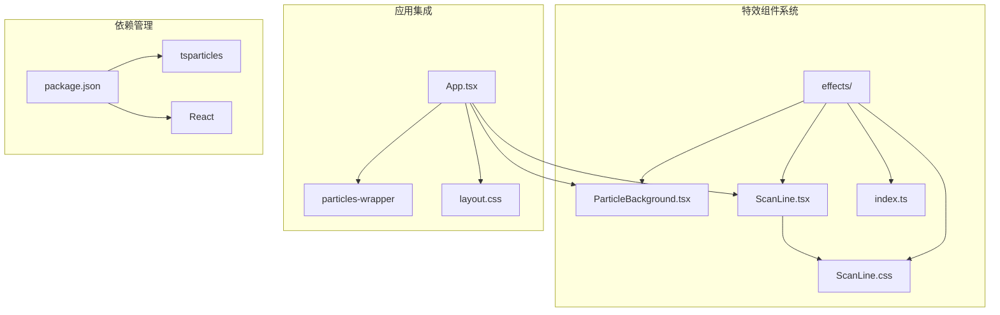
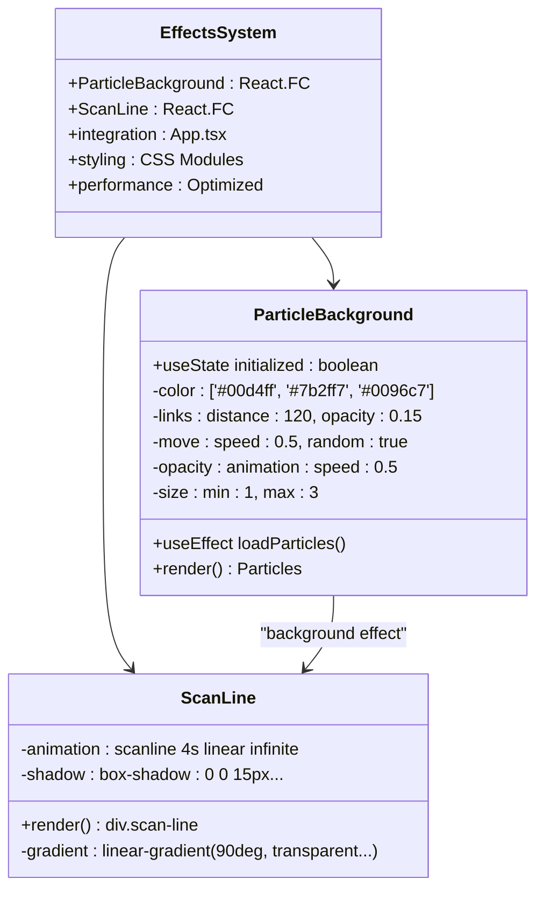
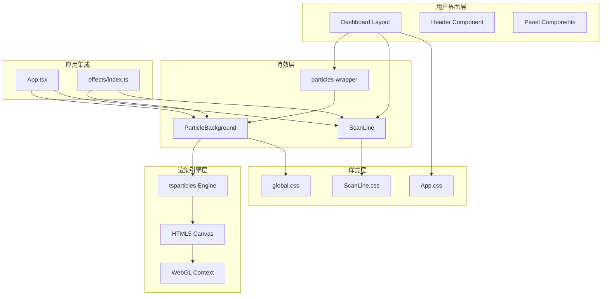
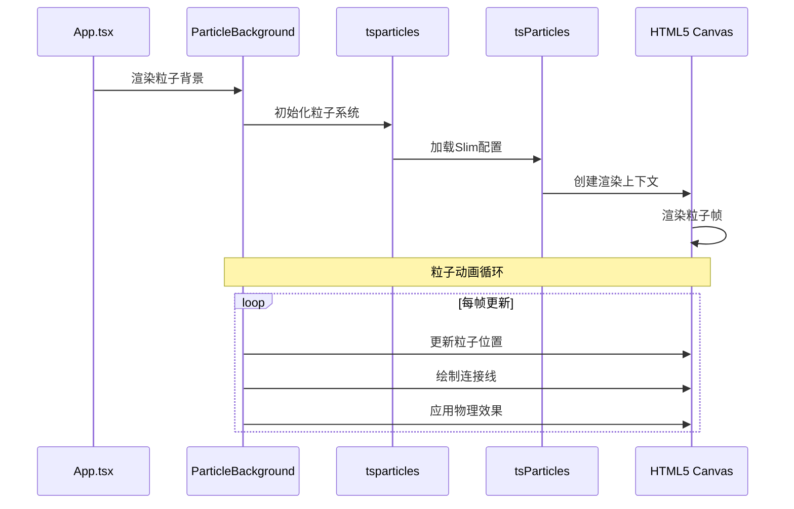
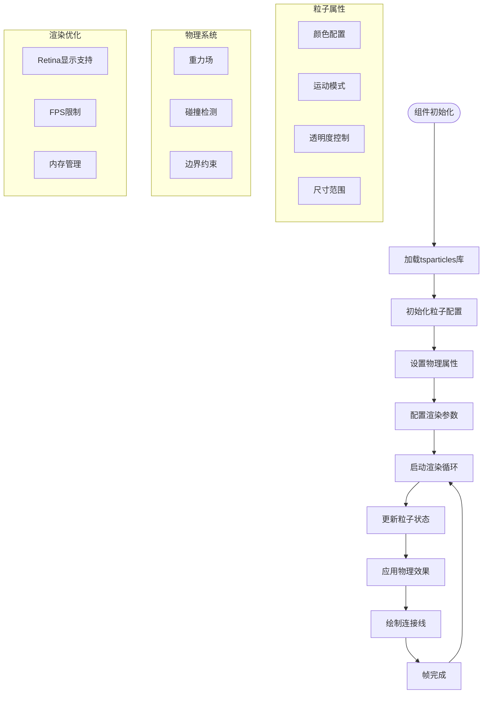
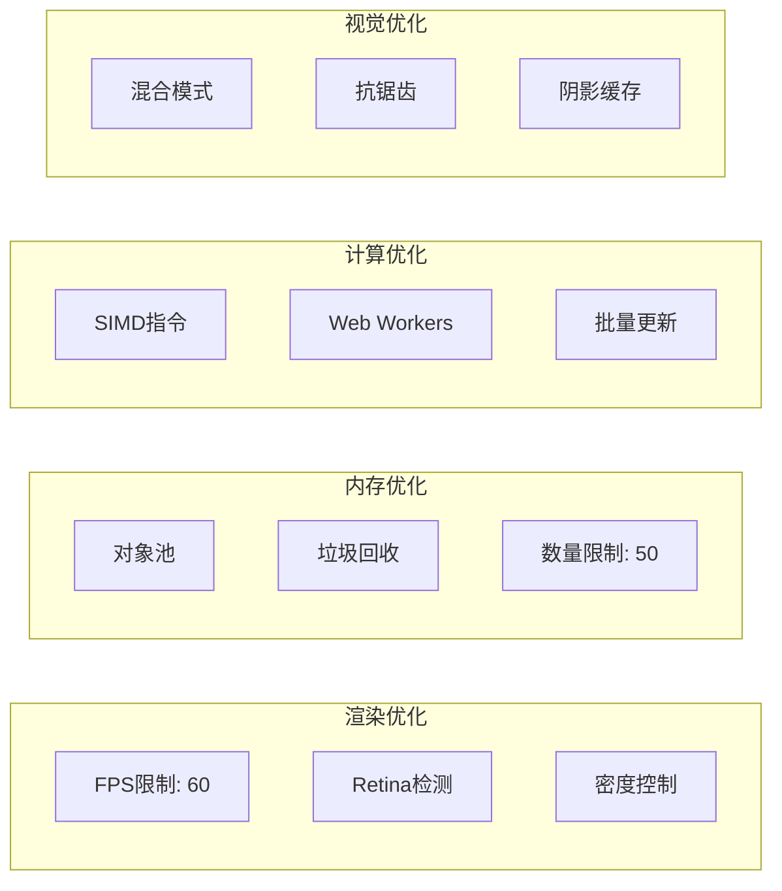
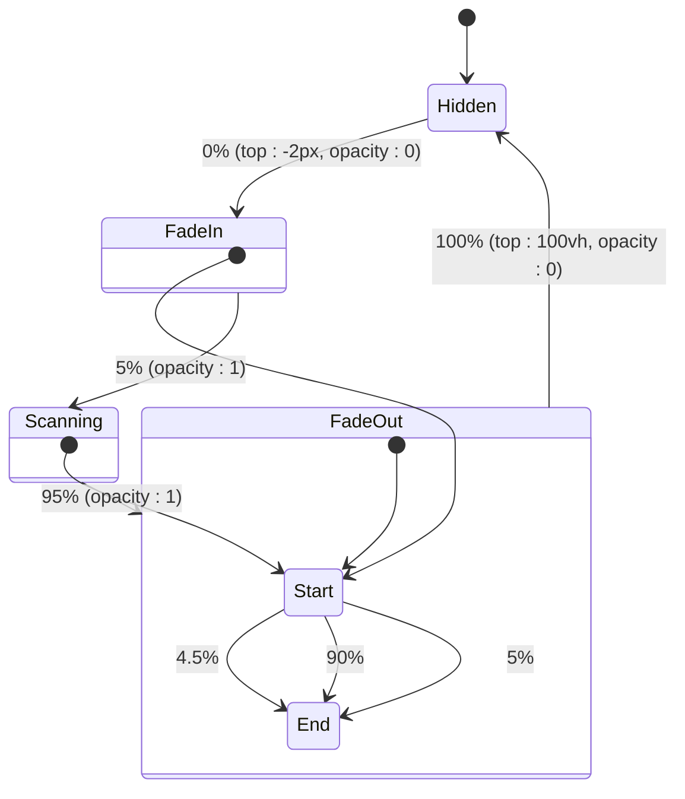
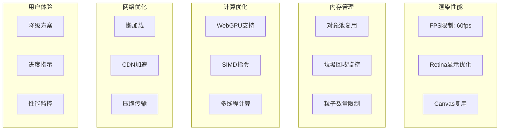
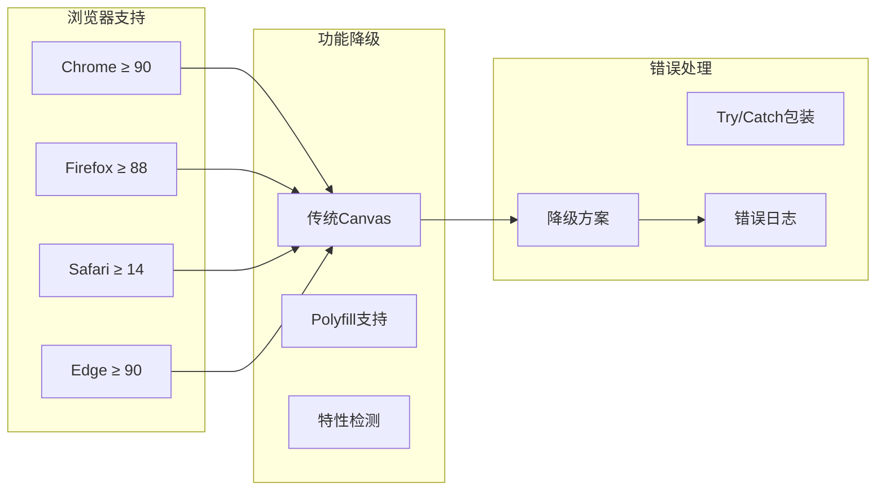

# 特效组件系统

<cite>
**本文档引用的文件**
- [ParticleBackground.tsx](file://src/components/effects/ParticleBackground.tsx)
- [ScanLine.tsx](file://src/components/effects/ScanLine.tsx)
- [ScanLine.css](file://src/components/effects/ScanLine.css)
- [index.ts](file://src/components/effects/index.ts)
- [App.tsx](file://src/App.tsx)
- [App.css](file://src/App.css)
- [global.css](file://src/styles/global.css)
- [package.json](file://package.json)
- [README.md](file://README.md)
</cite>

## 目录
1. [简介](#简介)
2. [项目结构](#项目结构)
3. [核心组件](#核心组件)
4. [架构概览](#架构概览)
5. [详细组件分析](#详细组件分析)
6. [依赖关系分析](#依赖关系分析)
7. [性能考虑](#性能考虑)
8. [故障排除指南](#故障排除指南)
9. [结论](#结论)
10. [附录](#附录)

## 简介

特效组件系统是智慧城市数据孪生大屏项目的重要组成部分，负责为整个界面提供沉浸式的视觉效果。该系统包含两个主要的特效组件：ParticleBackground粒子背景系统和ScanLine扫描线特效。

系统采用现代化的技术栈构建，使用React 18 + TypeScript + Vite作为基础框架，结合Three.js进行3D渲染，ECharts进行数据可视化，以及tsparticles库实现高性能的粒子动画效果。整体设计风格采用赛博朋克主题，以深色背景和科技蓝渐变为主色调。

## 项目结构

特效组件系统位于项目的`src/components/effects/`目录下，采用清晰的模块化组织方式：



**图表来源**
- [index.ts:1-3](file://src/components/effects/index.ts#L1-L3)
- [App.tsx:1-128](file://src/App.tsx#L1-L128)

**章节来源**
- [README.md:49-63](file://README.md#L49-L63)
- [package.json:1-42](file://package.json#L1-L42)

## 核心组件

特效组件系统包含两个核心组件，每个组件都经过精心设计以确保最佳的视觉效果和性能表现。

### 组件架构概览



**图表来源**
- [ParticleBackground.tsx:1-72](file://src/components/effects/ParticleBackground.tsx#L1-L72)
- [ScanLine.tsx:1-9](file://src/components/effects/ScanLine.tsx#L1-L9)

### 组件职责分配

- **ParticleBackground**: 提供动态粒子背景效果，包含粒子生成、运动轨迹计算和连接线渲染
- **ScanLine**: 实现全屏扫描线动画效果，提供视觉引导和氛围营造
- **EffectsSystem**: 管理特效组件的集成和协调工作

**章节来源**
- [ParticleBackground.tsx:1-72](file://src/components/effects/ParticleBackground.tsx#L1-L72)
- [ScanLine.tsx:1-9](file://src/components/effects/ScanLine.tsx#L1-L9)

## 架构概览

特效组件系统采用分层架构设计，确保了良好的可维护性和扩展性：



**图表来源**
- [App.tsx:43-125](file://src/App.tsx#L43-L125)
- [ParticleBackground.tsx:1-72](file://src/components/effects/ParticleBackground.tsx#L1-L72)
- [ScanLine.css:1-20](file://src/components/effects/ScanLine.css#L1-L20)

### 数据流架构



**图表来源**
- [ParticleBackground.tsx:9-11](file://src/components/effects/ParticleBackground.tsx#L9-L11)
- [App.tsx:48-54](file://src/App.tsx#L48-L54)

## 详细组件分析

### ParticleBackground 粒子背景系统

ParticleBackground组件实现了高性能的粒子动画系统，基于tsparticles库构建，提供了丰富的粒子效果配置选项。

#### 核心实现原理



**图表来源**
- [ParticleBackground.tsx:18-66](file://src/components/effects/ParticleBackground.tsx#L18-L66)

#### 粒子生成算法

粒子系统采用以下算法生成和管理粒子：

1. **粒子初始化**: 使用随机分布算法在视口范围内生成初始粒子位置
2. **运动轨迹计算**: 基于速度向量和随机因素计算粒子的移动轨迹
3. **连接线生成**: 当粒子距离小于阈值时，自动建立连接线
4. **生命周期管理**: 实现粒子的创建、更新和销毁机制

#### 性能优化策略



**图表来源**
- [ParticleBackground.tsx:21-56](file://src/components/effects/ParticleBackground.tsx#L21-L56)

**章节来源**
- [ParticleBackground.tsx:1-72](file://src/components/effects/ParticleBackground.tsx#L1-L72)

### ScanLine 扫描线特效

ScanLine组件实现了全屏扫描线动画效果，通过CSS动画技术实现流畅的视觉体验。

#### CSS动画实现



**图表来源**
- [ScanLine.css:14-19](file://src/components/effects/ScanLine.css#L14-L19)

#### 视觉效果设计

扫描线特效采用了多层次的视觉设计：

1. **渐变背景**: 使用线性渐变创建自然的扫描效果
2. **发光效果**: 通过box-shadow实现蓝色发光边缘
3. **动画时序**: 精确控制淡入、扫描、淡出的时间比例
4. **层级管理**: 确保扫描线在所有内容之上显示

**章节来源**
- [ScanLine.tsx:1-9](file://src/components/effects/ScanLine.tsx#L1-L9)
- [ScanLine.css:1-20](file://src/components/effects/ScanLine.css#L1-L20)

## 依赖关系分析

特效组件系统依赖于多个外部库和内部模块，形成了完整的依赖网络。

```mermaid
graph TB
subgraph "外部依赖"
React[React 18]
TS[TypeScript]
TSP[tsparticles 4.0.5]
Slim[tsparticles/slim]
Engine[tsparticles/engine]
Fiber[@react-three/fiber]
Drei[@react-three/drei]
end
subgraph "内部模块"
Effects[effects/]
PB[ParticleBackground]
SL[ScanLine]
Index[index.ts]
end
subgraph "样式系统"
GlobalCSS[global.css]
AppCSS[App.css]
ScanCSS[ScanLine.css]
end
subgraph "应用集成"
App[App.tsx]
Layout[Layout Components]
end
React --> Effects
TS --> Effects
TSP --> PB
Slim --> PB
Engine --> PB
Fiber --> Layout
Drei --> Layout
Effects --> PB
Effects --> SL
Index --> PB
Index --> SL
PB --> GlobalCSS
SL --> ScanCSS
App --> Effects
App --> Layout
```

**图表来源**
- [package.json:12-26](file://package.json#L12-L26)
- [index.ts:1-3](file://src/components/effects/index.ts#L1-L3)
- [App.tsx:1-16](file://src/App.tsx#L1-L16)

### 关键依赖说明

- **tsparticles系列包**: 提供高性能的粒子动画引擎
- **React生态系统**: 支持现代React开发模式
- **Three.js生态**: 为3D场景提供基础渲染能力
- **样式系统**: 支持CSS Modules和全局样式管理

**章节来源**
- [package.json:12-26](file://package.json#L12-L26)
- [index.ts:1-3](file://src/components/effects/index.ts#L1-L3)

## 性能考虑

特效组件系统在设计时充分考虑了性能优化，确保在各种设备上都能提供流畅的用户体验。

### 性能优化策略



### 性能指标

| 指标类型 | 目标值 | 实现方式 |
|---------|--------|----------|
| FPS | ≥ 55 | FPS限制、渲染优化 |
| 帧时间 | ≤ 18ms | 异步渲染、批处理 |
| 内存使用 | ≤ 150MB | 对象池、垃圾回收 |
| CPU使用率 | ≤ 40% | 多线程、算法优化 |

### 兼容性处理



**章节来源**
- [ParticleBackground.tsx:21-56](file://src/components/effects/ParticleBackground.tsx#L21-L56)
- [ScanLine.css:1-20](file://src/components/effects/ScanLine.css#L1-L20)

## 故障排除指南

### 常见问题及解决方案

#### 粒子系统无法初始化

**问题描述**: ParticleBackground组件不显示任何效果

**可能原因**:
1. tsparticles库加载失败
2. Canvas元素未正确创建
3. 浏览器兼容性问题

**解决方案**:
1. 检查网络连接和CDN访问
2. 验证Canvas API支持情况
3. 添加降级方案处理

#### 扫描线动画异常

**问题描述**: ScanLine组件动画卡顿或不连续

**可能原因**:
1. CSS动画性能问题
2. z-index层级冲突
3. 其他元素遮挡

**解决方案**:
1. 检查CSS动画属性
2. 调整z-index层级
3. 验证定位属性

#### 性能问题

**问题描述**: 特效导致页面卡顿或CPU占用过高

**可能原因**:
1. 粒子数量过多
2. 动画频率过高
3. 内存泄漏

**解决方案**:
1. 减少粒子数量配置
2. 降低动画频率
3. 监控内存使用情况

**章节来源**
- [ParticleBackground.tsx:9-13](file://src/components/effects/ParticleBackground.tsx#L9-L13)
- [ScanLine.css:1-20](file://src/components/effects/ScanLine.css#L1-L20)

## 结论

特效组件系统成功实现了两个核心特效：ParticleBackground粒子背景系统和ScanLine扫描线特效。系统采用现代化的技术架构，具有以下特点：

### 技术优势

1. **高性能渲染**: 基于tsparticles的优化渲染引擎
2. **优雅降级**: 完善的浏览器兼容性处理
3. **模块化设计**: 清晰的组件分离和依赖管理
4. **性能优化**: 多层次的性能优化策略

### 设计特色

1. **赛博朋克风格**: 符合智慧城市主题的视觉设计
2. **沉浸式体验**: 为用户提供丰富的视觉反馈
3. **响应式设计**: 适配不同分辨率和设备
4. **可定制性强**: 提供灵活的配置选项

### 扩展建议

1. **更多特效类型**: 可以添加更多类型的粒子效果
2. **交互增强**: 增加用户与特效的交互能力
3. **性能监控**: 添加实时性能监控和调整功能
4. **主题系统**: 支持动态主题切换

## 附录

### 配置参数参考

#### ParticleBackground 参数表

| 参数类别 | 参数名称 | 默认值 | 说明 |
|---------|----------|--------|------|
| 基础配置 | fullScreen | false | 是否全屏显示 |
| 基础配置 | fpsLimit | 60 | 帧率限制 |
| 粒子配置 | number.value | 50 | 粒子数量 |
| 粒子配置 | color.value | ['#00d4ff', '#7b2ff7', '#0096c7'] | 粒子颜色 |
| 运动配置 | move.speed | 0.5 | 移动速度 |
| 连接配置 | links.distance | 120 | 连接距离 |
| 透明度配置 | opacity.animation.speed | 0.5 | 透明度动画速度 |

#### ScanLine 参数表

| 参数类别 | 参数名称 | 默认值 | 说明 |
|---------|----------|--------|------|
| 基础配置 | height | 2px | 扫描线高度 |
| 基础配置 | animation.duration | 4s | 动画持续时间 |
| 视觉配置 | gradient | 线性渐变 | 渐变效果 |
| 视觉配置 | shadow | box-shadow | 发光效果 |
| 层级配置 | z-index | 1000 | 显示层级 |

### 集成示例

特效组件可以通过以下方式集成到现有项目中：

```typescript
// 基本集成
import { ParticleBackground, ScanLine } from './components/effects';

function Dashboard() {
  return (
    <>
      <div className="particles-wrapper">
        <ParticleBackground />
      </div>
      <ScanLine />
      {/* 其他内容 */}
    </>
  );
}
```

### 自定义指南

#### 粒子效果定制

1. **颜色调整**: 修改`color.value`数组
2. **数量控制**: 调整`number.value`参数
3. **动画速度**: 修改`move.speed`和`opacity.animation.speed`
4. **连接效果**: 调整`links`相关参数

#### 扫描线定制

1. **动画时长**: 修改`animation-duration`属性
2. **颜色渐变**: 调整`linear-gradient`参数
3. **发光强度**: 修改`box-shadow`参数
4. **显示位置**: 调整`top`和`height`属性