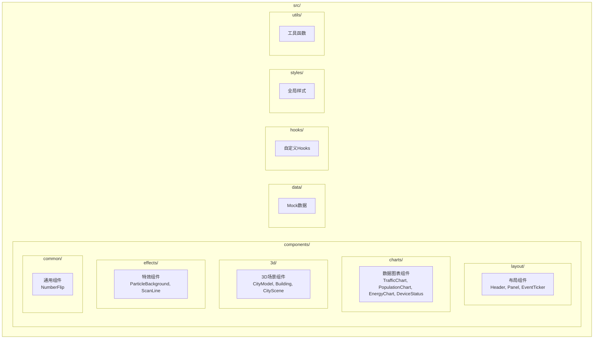
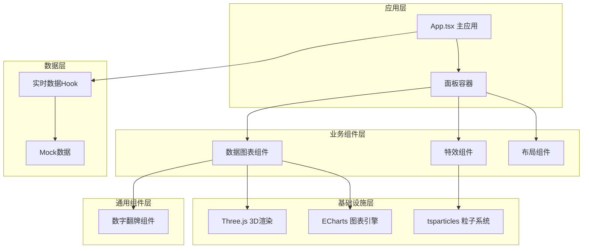
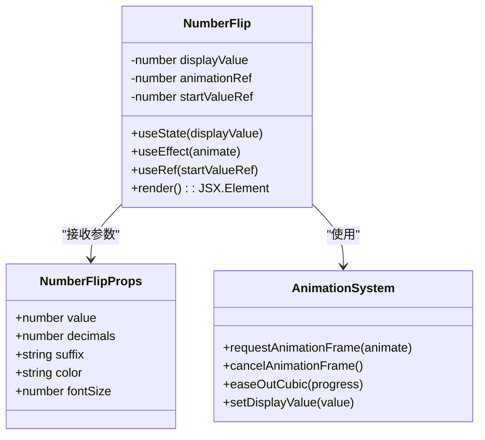
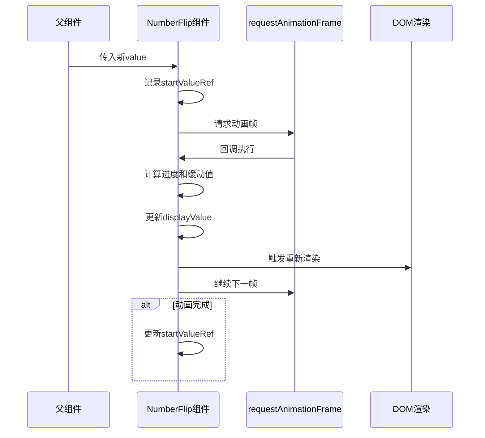
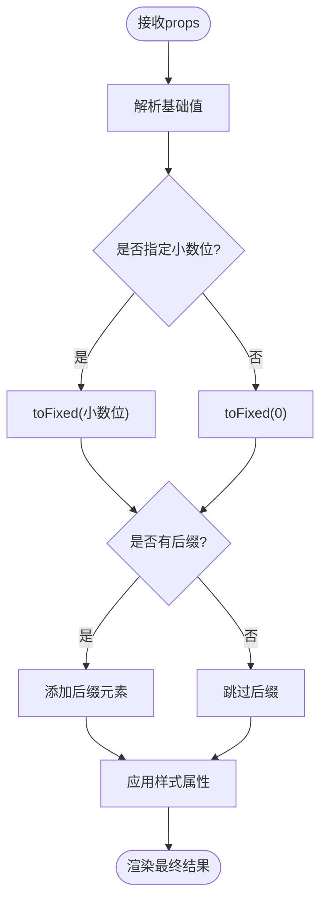
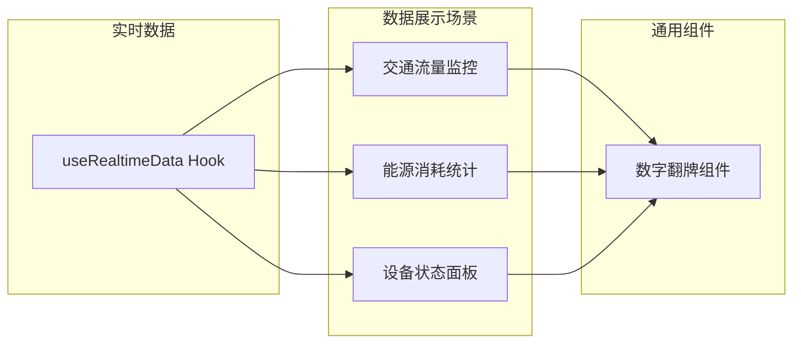

# 通用组件系统

<cite>
**本文档引用的文件**
- [NumberFlip.tsx](file://src/components/common/NumberFlip.tsx)
- [NumberFlip.css](file://src/components/common/NumberFlip.css)
- [index.ts](file://src/components/common/index.ts)
- [useRealtimeData.ts](file://src/hooks/useRealtimeData.ts)
- [mockData.ts](file://src/data/mockData.ts)
- [App.tsx](file://src/App.tsx)
- [README.md](file://README.md)
- [package.json](file://package.json)
</cite>

## 目录
1. [简介](#简介)
2. [项目结构](#项目结构)
3. [核心组件](#核心组件)
4. [架构总览](#架构总览)
5. [详细组件分析](#详细组件分析)
6. [依赖分析](#依赖分析)
7. [性能考虑](#性能考虑)
8. [故障排除指南](#故障排除指南)
9. [结论](#结论)
10. [附录](#附录)

## 简介
本项目是一个基于 React + TypeScript 的智慧城市数据孪生可视化大屏，采用模块化的组件体系设计。项目通过清晰的目录结构和职责分离，实现了从 3D 场景到数据图表再到特效组件的完整技术栈整合。通用组件系统作为项目的基础构件层，为上层业务组件提供了可复用、可定制的核心能力。

项目采用现代化的技术栈：React 18 + TypeScript + Vite 作为基础框架，Three.js + @react-three/fiber + @react-three/drei 构建 3D 场景，ECharts 5 实现数据可视化，Framer Motion 和 CSS 动画提供流畅的过渡效果，tsparticles 实现粒子特效，Tailwind CSS 与自定义 CSS 结合确保界面风格统一。

## 项目结构
项目采用按功能域划分的目录结构，每个功能域包含独立的组件、样式和类型定义：



**图表来源**
- [README.md:51-63](file://README.md#L51-L63)

项目结构体现了高度的模块化设计：
- **按功能域分层**：每个功能域独立维护，降低耦合度
- **组件复用**：common 目录提供跨域通用组件
- **类型安全**：TypeScript 提供完整的类型定义
- **样式隔离**：每个组件拥有独立的样式文件

**章节来源**
- [README.md:49-71](file://README.md#L49-L71)

## 核心组件
通用组件系统的核心是 NumberFlip 数字翻牌组件，它提供了平滑的数值动画效果和灵活的格式化能力。该组件通过 requestAnimationFrame 实现高性能的动画渲染，支持小数位数控制、后缀显示和颜色主题定制。

组件的主要特性包括：
- **平滑动画过渡**：使用三次贝塞尔缓动函数实现自然的数值变化
- **高精度数值处理**：支持任意精度的小数显示和格式化
- **响应式样式系统**：动态颜色和字体大小支持
- **内存安全**：完善的清理机制防止内存泄漏

**章节来源**
- [NumberFlip.tsx:1-61](file://src/components/common/NumberFlip.tsx#L1-L61)
- [NumberFlip.css:1-14](file://src/components/common/NumberFlip.css#L1-L14)

## 架构总览
项目整体架构采用分层设计，从底层的数据层到顶层的应用层形成清晰的依赖关系：



**图表来源**
- [App.tsx:1-128](file://src/App.tsx#L1-L128)
- [useRealtimeData.ts:1-73](file://src/hooks/useRealtimeData.ts#L1-L73)

架构特点：
- **单向数据流**：数据从 Hook 层流向组件层
- **组件解耦**：通用组件不依赖具体业务逻辑
- **渲染分离**：3D、图表、特效各司其职
- **状态集中**：实时数据通过 Hook 统一管理

## 详细组件分析

### NumberFlip 数字翻牌组件深度解析

#### 组件架构设计
NumberFlip 采用函数式组件设计，结合 React Hooks 实现状态管理和副作用处理。组件通过内部状态 `displayValue` 控制动画过程中的中间值，避免直接修改 props 引起的重渲染问题。



**图表来源**
- [NumberFlip.tsx:4-18](file://src/components/common/NumberFlip.tsx#L4-L18)
- [NumberFlip.tsx:19-48](file://src/components/common/NumberFlip.tsx#L19-L48)

#### 动画实现机制
组件使用 requestAnimationFrame 实现高性能动画，通过时间插值计算中间值。动画采用三次贝塞尔缓动函数（easeOutCubic），提供自然的加速-减速效果。



**图表来源**
- [NumberFlip.tsx:23-48](file://src/components/common/NumberFlip.tsx#L23-L48)

#### 数值格式化处理
组件提供灵活的数值格式化选项，支持小数位数控制、后缀显示和颜色主题定制。格式化逻辑在渲染阶段执行，确保性能最优。



**图表来源**
- [NumberFlip.tsx:50-57](file://src/components/common/NumberFlip.tsx#L50-L57)

#### 状态管理与生命周期
组件使用 React Hooks 管理内部状态，通过 useEffect 处理动画生命周期，确保动画资源的正确清理。

**章节来源**
- [NumberFlip.tsx:1-61](file://src/components/common/NumberFlip.tsx#L1-L61)

### Props 接口规范
NumberFlip 组件的 Props 接口设计简洁而功能完备：

| 属性名 | 类型 | 默认值 | 必填 | 描述 |
|--------|------|--------|------|------|
| value | number | - | 是 | 显示的目标数值 |
| decimals | number | 0 | 否 | 小数位数，默认不显示小数 |
| suffix | string | '' | 否 | 数值后缀，如 '万元' |
| color | string | '#00d4ff' | 否 | 数值颜色，支持任意CSS颜色值 |
| fontSize | number | 24 | 否 | 字体大小（px） |

样式定制方法：
- **颜色系统**：通过 color 属性支持任意颜色值
- **字体系统**：通过 fontSize 属性调整字号
- **阴影效果**：自动添加发光阴影增强视觉效果
- **后缀样式**：独立的 .number-suffix 类提供细粒度控制

**章节来源**
- [NumberFlip.tsx:4-10](file://src/components/common/NumberFlip.tsx#L4-L10)
- [NumberFlip.css:8-13](file://src/components/common/NumberFlip.css#L8-L13)

### 在其他组件中的使用示例
虽然当前仓库中没有直接使用 NumberFlip 的示例，但根据项目架构，它可以在以下场景中发挥重要作用：



**图表来源**
- [useRealtimeData.ts:15-72](file://src/hooks/useRealtimeData.ts#L15-L72)

## 依赖分析
项目依赖关系清晰，遵循单一职责原则：

```mermaid
graph TB
subgraph "运行时依赖"
React[react ^19.2.6]
ReactDOM[react-dom ^19.2.6]
ThreeJS[three ^0.184.0]
Fiber[@react-three/fiber ^9.6.1]
Drei[@react-three/drei ^10.7.7]
ECharts[echarts ^6.1.0]
Particles[@tsparticles/* ^4.0.5]
Motion[framer-motion ^12.39.0]
end
subgraph "开发时依赖"
Vite[vite ^8.0.12]
TS[typescript ~6.0.2]
Tailwind[tailwindcss ^4.3.0]
end
subgraph "项目组件"
NumberFlip[NumberFlip组件]
end
NumberFlip --> React
NumberFlip --> ReactDOM
```

**图表来源**
- [package.json:12-26](file://package.json#L12-L26)

依赖特点：
- **核心框架**：React 18 提供现代 Hooks 支持
- **3D渲染**：Three.js 生态系统提供高性能 3D 渲染
- **数据可视化**：ECharts 5 提供丰富的图表类型
- **动画系统**：Framer Motion 实现流畅的过渡动画
- **粒子系统**：tsparticles 提供高性能粒子效果

**章节来源**
- [package.json:1-42](file://package.json#L1-L42)

## 性能考虑
NumberFlip 组件在设计时充分考虑了性能优化：

### 动画性能优化
- **requestAnimationFrame**：使用浏览器原生动画帧 API，确保 60fps 流畅度
- **缓动函数**：三次贝塞尔缓动提供自然的视觉效果
- **内存管理**：动画清理函数防止内存泄漏
- **渲染优化**：仅更新必要的 displayValue 状态

### 数值处理优化
- **精确计算**：使用 Math.pow 实现精确的缓动计算
- **边界处理**：进度值限制在 [0,1] 区间内
- **格式化延迟**：在渲染阶段进行格式化，减少重复计算

### 内存安全
- **引用缓存**：startValueRef 存储起始值，避免闭包陷阱
- **清理机制**：组件卸载时取消动画帧请求
- **状态隔离**：displayValue 独立于 props，避免不必要的重渲染

**章节来源**
- [NumberFlip.tsx:23-48](file://src/components/common/NumberFlip.tsx#L23-L48)

## 故障排除指南
常见问题及解决方案：

### 动画不生效
**症状**：数值直接跳变而非平滑过渡
**原因**：可能被外部样式覆盖或组件未正确挂载
**解决**：检查父组件的样式覆盖，确认组件已正确渲染

### 性能问题
**症状**：大量 NumberFlip 组件同时更新导致卡顿
**原因**：频繁的状态更新
**解决**：使用 React.memo 包装组件，或合并更新批次

### 样式冲突
**症状**：颜色或字体大小不符合预期
**原因**：CSS 优先级问题
**解决**：检查 .number-flip 和 .number-suffix 的样式优先级

**章节来源**
- [NumberFlip.tsx:45-47](file://src/components/common/NumberFlip.tsx#L45-L47)

## 结论
通用组件系统为智慧城市数据可视化平台提供了坚实的基础架构。NumberFlip 数字翻牌组件通过精心设计的动画系统和灵活的格式化能力，为数据展示提供了优雅的视觉效果。项目的模块化设计和清晰的依赖关系，使得组件具有良好的可复用性和可维护性。

通过合理的性能优化和错误处理机制，组件能够在复杂的可视化环境中保持稳定的性能表现。建议在实际项目中结合具体的业务需求，进一步扩展组件的功能和定制能力。

## 附录

### 组件复用最佳实践
1. **单一职责**：每个组件专注于特定功能
2. **Props 设计**：提供足够的定制选项但保持简洁
3. **样式隔离**：使用局部样式避免全局污染
4. **性能监控**：定期评估组件性能影响

### 扩展开发指南
1. **继承现有模式**：参考 NumberFlip 的实现模式
2. **类型安全**：为新组件提供完整的 TypeScript 定义
3. **样式规范**：遵循项目的样式约定
4. **测试覆盖**：为关键组件编写单元测试