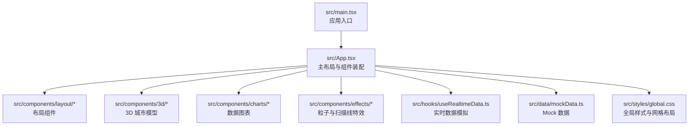
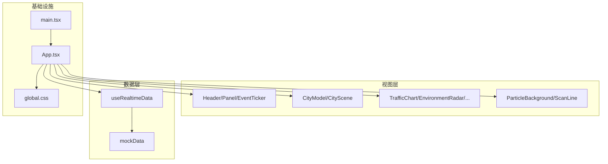
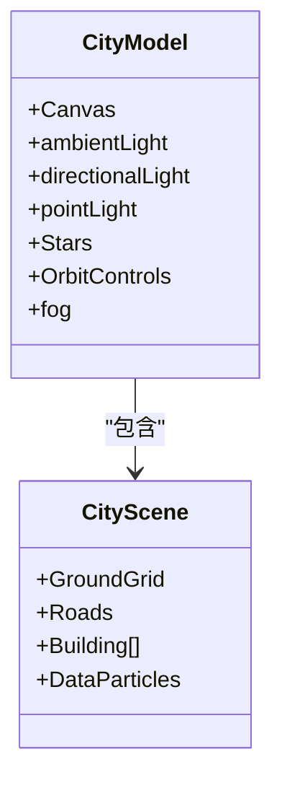
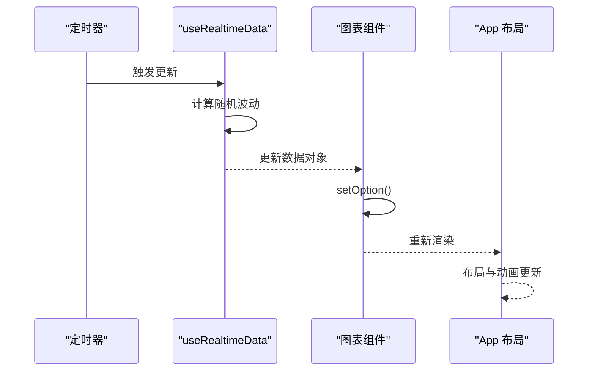
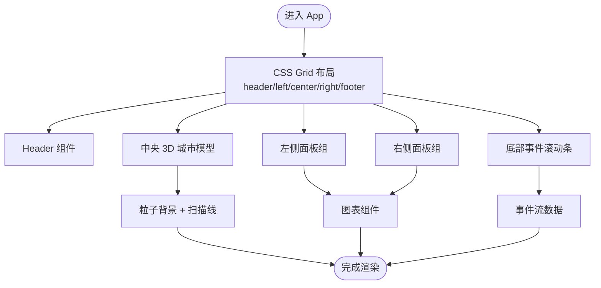
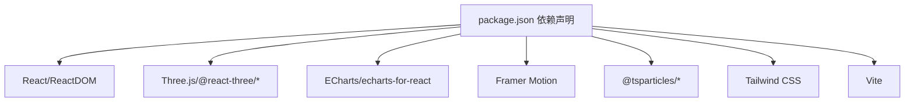

# 项目概述

<cite>
**本文档引用的文件**
- [README.md](file://README.md)
- [package.json](file://package.json)
- [src/App.tsx](file://src/App.tsx)
- [src/main.tsx](file://src/main.tsx)
- [src/styles/global.css](file://src/styles/global.css)
- [src/data/mockData.ts](file://src/data/mockData.ts)
- [src/hooks/useRealtimeData.ts](file://src/hooks/useRealtimeData.ts)
- [src/components/3d/CityModel.tsx](file://src/components/3d/CityModel.tsx)
- [src/components/3d/CityScene.tsx](file://src/components/3d/CityScene.tsx)
- [src/components/charts/TrafficChart.tsx](file://src/components/charts/TrafficChart.tsx)
- [src/components/charts/EnvironmentRadar.tsx](file://src/components/charts/EnvironmentRadar.tsx)
- [src/components/effects/ParticleBackground.tsx](file://src/components/effects/ParticleBackground.tsx)
- [src/components/effects/ScanLine.tsx](file://src/components/effects/ScanLine.tsx)
- [src/components/layout/Header.tsx](file://src/components/layout/Header.tsx)
- [src/components/layout/Panel.tsx](file://src/components/layout/Panel.tsx)
</cite>

## 目录
1. [引言](#引言)
2. [项目结构](#项目结构)
3. [核心组件](#核心组件)
4. [架构总览](#架构总览)
5. [详细组件分析](#详细组件分析)
6. [依赖关系分析](#依赖关系分析)
7. [性能考虑](#性能考虑)
8. [故障排除指南](#故障排除指南)
9. [结论](#结论)
10. [附录](#附录)

## 引言
本项目是一个面向智慧城市的“数据孪生大屏”可视化平台，旨在通过3D城市模型与多维数据图表的融合，构建一个集实时监控、态势感知与指挥调度于一体的可视化指挥中心。项目采用现代化前端技术栈，结合Three.js 的 3D 场景渲染、ECharts 的丰富图表能力、Framer Motion 的流畅动画以及 tsparticles 的粒子特效，形成具有赛博朋克风格的科技感界面。

项目核心目标：
- 提供沉浸式的城市运行态势展示：以3D城市模型承载空间维度，支持交互式视角控制与自动旋转。
- 实时数据驱动的动态可视化：通过自定义 Hook 模拟实时数据更新，驱动图表与面板内容动态变化。
- 多场景数据聚合：交通、人口、环境、能源、设备状态与告警事件等多维数据在同一界面统一呈现。
- 可扩展的系统集成能力：通过模块化组件与清晰的数据接口，便于对接智慧城市各子系统（如交通信号、环境监测、公共设施管理等）。

设计理念：
- 以“数据孪生”为核心：将物理世界的城市映射到虚拟空间，实现虚实联动。
- 以“指挥中心”为导向：强调信息密度与响应速度，确保关键指标一目了然。
- 以“赛博朋克美学”为视觉语言：深色背景、科技蓝与紫色光效、发光边框与毛玻璃质感，营造未来感与科技感。

## 项目结构
项目采用按功能域划分的目录组织方式，核心模块包括布局组件、3D 城市模型、数据图表、特效组件与通用工具。入口文件负责装配所有子组件，全局样式统一主题风格与布局网格。

**图表来源**
- [src/main.tsx:1-11](file://src/main.tsx#L1-L11)
- [src/App.tsx:1-128](file://src/App.tsx#L1-L128)
- [src/styles/global.css:1-92](file://src/styles/global.css#L1-L92)

**章节来源**
- [README.md:49-71](file://README.md#L49-L71)
- [src/main.tsx:1-11](file://src/main.tsx#L1-L11)
- [src/App.tsx:1-128](file://src/App.tsx#L1-L128)
- [src/styles/global.css:50-92](file://src/styles/global.css#L50-L92)

## 核心组件
- 布局与导航
  - Header：显示日期、时间、天气等信息，提供统一的头部装饰。
  - Panel：面板容器，包含标题装饰与四个角标，用于承载各类图表与信息块。
  - EventTicker：底部事件滚动条，用于展示实时事件流。
- 3D 城市模型
  - CityModel：封装 Three.js 场景，提供相机、光源、控件与雾化效果，支持自动旋转与交互缩放。
  - CityScene：城市场景主体，包含地面网格、道路、建筑与数据粒子。
- 数据图表
  - TrafficChart：交通流量折线图，展示多条道路的历史趋势与关键指标。
  - EnvironmentRadar：环境监测雷达图，综合 PM2.5、PM10、噪音、温湿度等指标。
  - 其他图表：PopulationChart、EnergyChart、DeviceStatus、AlertList 等（在 App 组件中装配）。
- 特效组件
  - ParticleBackground：背景星空粒子与连线效果，增强空间层次感。
  - ScanLine：全屏扫描线动画，强化科技感与动态节奏。
- 实时数据
  - useRealtimeData：周期性更新交通、环境、能源与设备状态数据，模拟真实业务场景。

**章节来源**
- [src/components/layout/Header.tsx:1-45](file://src/components/layout/Header.tsx#L1-L45)
- [src/components/layout/Panel.tsx:1-30](file://src/components/layout/Panel.tsx#L1-L30)
- [src/components/3d/CityModel.tsx:1-50](file://src/components/3d/CityModel.tsx#L1-L50)
- [src/components/3d/CityScene.tsx:1-56](file://src/components/3d/CityScene.tsx#L1-L56)
- [src/components/charts/TrafficChart.tsx:1-117](file://src/components/charts/TrafficChart.tsx#L1-L117)
- [src/components/charts/EnvironmentRadar.tsx:1-108](file://src/components/charts/EnvironmentRadar.tsx#L1-L108)
- [src/components/effects/ParticleBackground.tsx:1-72](file://src/components/effects/ParticleBackground.tsx#L1-L72)
- [src/components/effects/ScanLine.tsx:1-9](file://src/components/effects/ScanLine.tsx#L1-L9)
- [src/hooks/useRealtimeData.ts:1-73](file://src/hooks/useRealtimeData.ts#L1-L73)

## 架构总览
系统采用“布局装配 + 组件解耦 + 数据驱动”的分层架构。App 作为顶层容器，负责装配布局、3D 场景与各类图表；useRealtimeData 提供统一的数据源；mockData 提供初始数据与结构定义；全局样式通过 CSS Grid 实现响应式布局。

**图表来源**
- [src/App.tsx:1-128](file://src/App.tsx#L1-L128)
- [src/main.tsx:1-11](file://src/main.tsx#L1-L11)
- [src/styles/global.css:50-92](file://src/styles/global.css#L50-L92)
- [src/hooks/useRealtimeData.ts:1-73](file://src/hooks/useRealtimeData.ts#L1-L73)
- [src/data/mockData.ts:1-96](file://src/data/mockData.ts#L1-L96)

## 详细组件分析

### 3D 城市模型与场景
- CityModel 负责 Three.js 上下文搭建、光源与控件配置、雾化与自动旋转，提供沉浸式视角体验。
- CityScene 聚合地面网格、道路、建筑与数据粒子，构成完整的城市骨架。
- 数据粒子用于在场景中可视化数据流或热点，增强数据与空间的关联。

**图表来源**
- [src/components/3d/CityModel.tsx:1-50](file://src/components/3d/CityModel.tsx#L1-L50)
- [src/components/3d/CityScene.tsx:1-56](file://src/components/3d/CityScene.tsx#L1-L56)

**章节来源**
- [src/components/3d/CityModel.tsx:1-50](file://src/components/3d/CityModel.tsx#L1-L50)
- [src/components/3d/CityScene.tsx:1-56](file://src/components/3d/CityScene.tsx#L1-L56)

### 实时数据流与图表联动
- useRealtimeData 以固定间隔更新交通、环境、能源与设备状态数据，模拟真实业务波动。
- TrafficChart 与 EnvironmentRadar 等图表组件通过 ECharts 初始化与选项配置，实现响应式布局与动画效果。
- App 组件通过布局网格将左侧、中央与右侧区域进行划分，配合入场动画与面板装饰，形成统一的指挥中心界面。

**图表来源**
- [src/hooks/useRealtimeData.ts:15-73](file://src/hooks/useRealtimeData.ts#L15-L73)
- [src/components/charts/TrafficChart.tsx:18-87](file://src/components/charts/TrafficChart.tsx#L18-L87)
- [src/components/charts/EnvironmentRadar.tsx:18-78](file://src/components/charts/EnvironmentRadar.tsx#L18-L78)
- [src/App.tsx:43-125](file://src/App.tsx#L43-L125)

**章节来源**
- [src/hooks/useRealtimeData.ts:1-73](file://src/hooks/useRealtimeData.ts#L1-L73)
- [src/components/charts/TrafficChart.tsx:1-117](file://src/components/charts/TrafficChart.tsx#L1-L117)
- [src/components/charts/EnvironmentRadar.tsx:1-108](file://src/components/charts/EnvironmentRadar.tsx#L1-L108)
- [src/App.tsx:18-125](file://src/App.tsx#L18-L125)

### 布局与视觉风格
- 使用 CSS Grid 将界面划分为头部、左右侧面板、中央 3D 区域与底部事件条，确保在 1920x1080 及以上分辨率下的稳定布局。
- 全局样式采用深色背景与科技蓝/紫配色，结合发光边框与毛玻璃效果，契合赛博朋克主题。
- Framer Motion 为面板提供入场动画，增强用户引导与节奏感。

**图表来源**
- [src/styles/global.css:50-92](file://src/styles/global.css#L50-L92)
- [src/App.tsx:43-125](file://src/App.tsx#L43-L125)
- [src/components/effects/ParticleBackground.tsx:15-68](file://src/components/effects/ParticleBackground.tsx#L15-L68)
- [src/components/effects/ScanLine.tsx:4-6](file://src/components/effects/ScanLine.tsx#L4-L6)

**章节来源**
- [src/styles/global.css:1-92](file://src/styles/global.css#L1-L92)
- [src/App.tsx:43-125](file://src/App.tsx#L43-L125)

## 依赖关系分析
- 技术栈选择理由
  - React + TypeScript + Vite：现代前端开发生态，类型安全与快速热更新。
  - Three.js + @react-three/fiber + @react-three/drei：高效、声明式的 3D 渲染方案，适合复杂场景与交互。
  - ECharts：专业级图表库，支持多种图表类型与高性能渲染。
  - Framer Motion + CSS 动画：自然流畅的过渡与交互动画，降低学习成本。
  - tsparticles：轻量、可配置的粒子系统，适合背景氛围与数据可视化点缀。
  - Tailwind CSS：实用优先的样式工具，快速构建一致的 UI 组件。
- 外部依赖与版本关系
  - React 生态与 Vite 构建链路保持兼容。
  - Three.js 与 @react-three 系列版本需匹配，确保 Fiber 与 Drei 的功能稳定。
  - ECharts 与 echarts-for-react 保持同步，避免渲染冲突。
  - tsparticles 与 @tsparticles/react 保持版本一致，确保初始化流程稳定。

**图表来源**
- [package.json:12-26](file://package.json#L12-L26)
- [package.json:27-40](file://package.json#L27-L40)

**章节来源**
- [package.json:1-42](file://package.json#L1-L42)
- [README.md:5-12](file://README.md#L5-L12)

## 性能考虑
- 3D 场景优化
  - 合理设置相机参数与视野范围，避免过度缩放导致的性能损耗。
  - 控制粒子数量与连线距离，减少 WebGL 渲染负担。
  - 使用抗锯齿与透明背景时注意帧率，必要时降低质量参数。
- 图表性能
  - ECharts 使用 canvas 渲染器，适合大数据量折线图；合理设置动画时长与重绘频率。
  - 对 ResizeObserver 的监听进行清理，避免内存泄漏。
- 数据更新策略
  - useRealtimeData 的更新间隔应根据业务需求与设备性能调整，避免频繁重渲染。
  - 对于高频指标，可采用采样或缓存策略，减少不必要的计算。
- 布局与动画
  - CSS Grid 与 Flex 布局在大屏上表现稳定，注意避免深层嵌套与复杂选择器。
  - Framer Motion 的动画参数需平衡流畅度与性能，避免同时触发大量动画。

## 故障排除指南
- 3D 场景不显示或白屏
  - 检查 Canvas 初始化参数与背景透明度设置是否正确。
  - 确认 OrbitControls 的启用与最大/最小距离限制是否合理。
- 图表无法渲染或尺寸异常
  - 确保图表容器存在且具备宽高，ResizeObserver 是否正确挂载与卸载。
  - setOption 调用时机应在容器可用后执行。
- 粒子系统未生效
  - 确认 loadSlim 初始化完成后再渲染粒子组件。
  - 检查粒子配置中的颜色、链接与移动参数是否合理。
- 实时数据不更新
  - 检查定时器是否被清理，interval 参数是否传入。
  - 确认随机波动函数不会产生非法数值（如 NaN 或 Infinity）。
- 布局错位或元素溢出
  - 检查 CSS Grid 的区域划分与间隙设置。
  - 确认全局样式中滚动条与盒模型设置未影响布局。

**章节来源**
- [src/components/3d/CityModel.tsx:8-30](file://src/components/3d/CityModel.tsx#L8-L30)
- [src/components/charts/TrafficChart.tsx:18-30](file://src/components/charts/TrafficChart.tsx#L18-L30)
- [src/components/effects/ParticleBackground.tsx:9-11](file://src/components/effects/ParticleBackground.tsx#L9-L11)
- [src/hooks/useRealtimeData.ts:66-69](file://src/hooks/useRealtimeData.ts#L66-L69)
- [src/styles/global.css:50-92](file://src/styles/global.css#L50-L92)

## 结论
本项目通过“3D 城市模型 + 多维数据图表 + 特效组件”的组合，构建了一个面向智慧城市运营的可视化指挥中心原型。其模块化设计与清晰的数据流使得系统易于扩展与维护；同时，赛博朋克风格的视觉语言与流畅动画提升了用户体验与信息传达效率。建议后续在真实数据接入、性能压测与跨浏览器兼容性方面进一步完善，以满足实际部署需求。

## 附录
- 快速开始
  - 安装依赖与启动开发服务器，参考项目根目录说明。
- 项目结构与职责
  - components：按功能域拆分的 UI 组件集合。
  - data：Mock 数据与数据结构定义。
  - hooks：自定义 Hook，封装数据逻辑。
  - styles：全局样式与主题变量。
  - utils：工具函数（当前为空，预留扩展）。

**章节来源**
- [README.md:29-71](file://README.md#L29-L71)